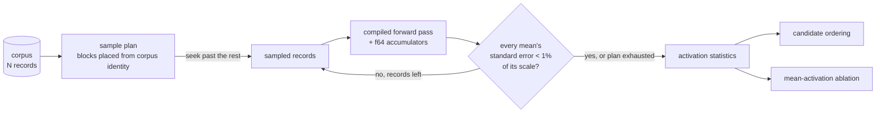
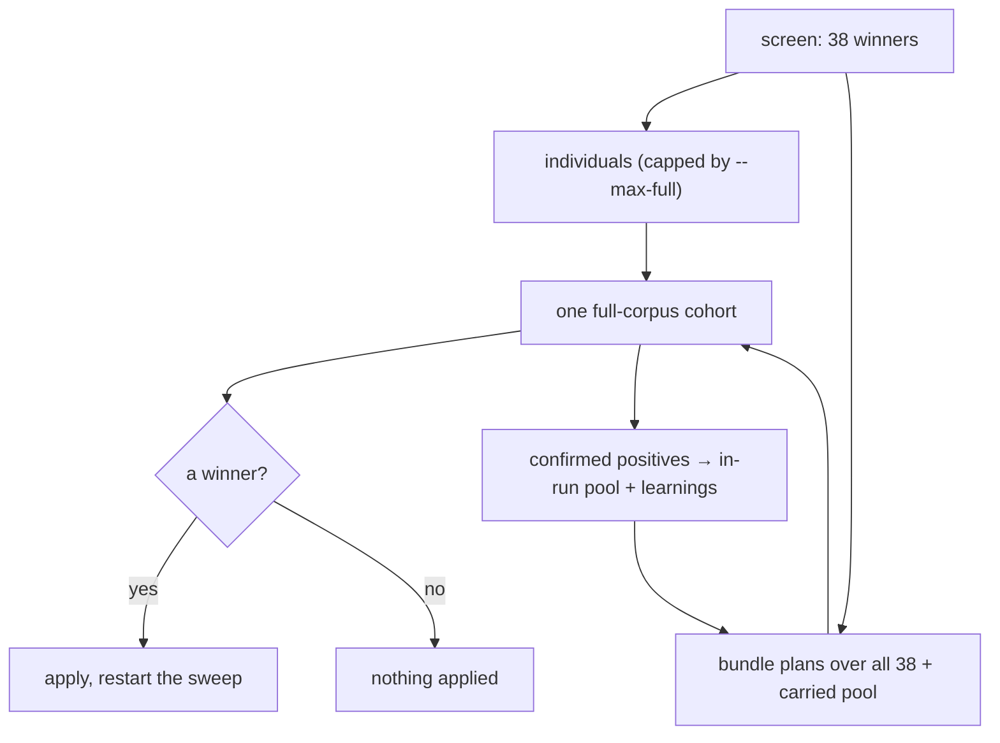
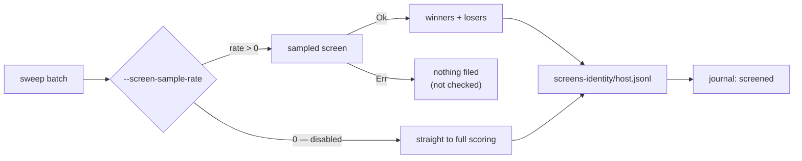
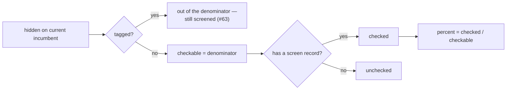
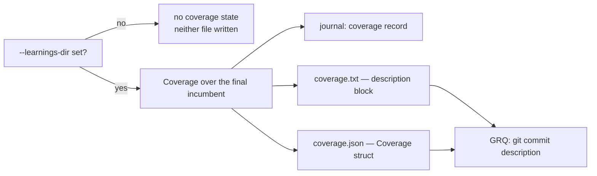
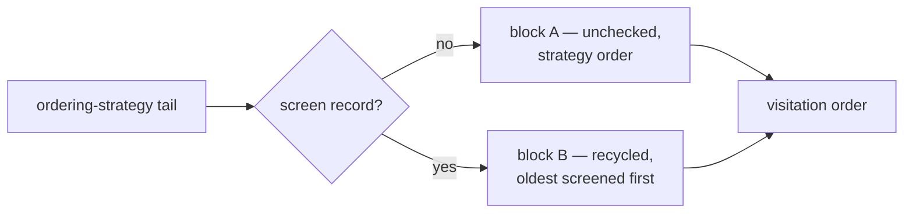
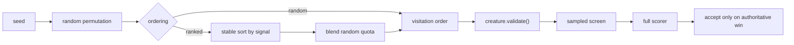

# NEAT-AI-Ockham

[](https://github.com/stSoftwareAU/NEAT-AI/blob/Develop/docs/brand/social-previews/neat-ai-ockham.png)

> **Every neuron must earn its keep — prune freely, trust only the scorer.** 🪒🧠

NEAT-AI-Ockham is an isolated experimental Rust optimiser for already-fit
[NEAT-AI](https://github.com/stSoftwareAU/NEAT-AI) creatures.

It asks a deliberately simple question:

> **Can an already highly evolved creature become fitter by removing structure
> that no longer earns the cost of keeping it?**

Ockham does not replace ordinary NEAT evolution and it does not redesign a
network from scratch. It starts from a known-good creature, removes or simplifies
small pieces of structure, and lets the existing
[NEAT-AI-scorer](https://github.com/stSoftwareAU/NEAT-AI-scorer) decide whether the
result is actually better.

The central hypothesis is cumulative: **many individually tiny, scorer-verified
pruning wins may compound into a material improvement**.

## Current state

Ockham is now an implemented experimental optimiser rather than a project plan.
The current Rust implementation includes:

- immutable loading and validation of a forward-only incumbent;
- authoritative full-corpus baseline scoring through `NEAT-AI-scorer`;
- sampled hidden-neuron activation statistics;
- mean-activation neuron ablation with downstream bias compensation;
- recursive removal/folding of newly redundant structure;
- exact, cost-aware `IDENTITY` neuron collapse;
- seeded random-without-replacement neuron sweeps;
- default batches of 100 candidates screened on a 5% scorer sample;
- full-corpus scoring of every sampled winner plus grouped pruning bundles —
  combination plans built over **every** winner, not one nested prefix chain;
- confirmed-but-unapplied winners remembered and re-bundled: within a run
  through an in-run pool, and across runs through the learnings cache;
- full cohorts sized to the wall clock, with what was dropped reported rather
  than silently trimmed;
- iterative acceptance of even tiny full-scorer local wins;
- a default 45-minute optimisation loop with append-only journalling;
- fresh re-entry comparison against a supplied current global champion;
- `population-candidate.json` only when Ockham wins that frontier comparison;
- a `report` command for cumulative pruning economics;
- GRQ-sampler `score` / `error` / `ockham` tags (🪒 prefix) preserved on write;
- `--max-full` / `--max-accepts` so a cheap prune can be checked in quickly
  (`--max-full` caps individual scoring only — it never shrinks a bundle);
- fleet learnings cache: combined replay of still-present known wins (full
  corpus, not capped by `--max-accepts`), then skip fresh failures; a replay
  accept stops immediately so the prune can check in;
- fleet screen coverage: every candidate a batch actually scores — winners
  **and** losers — leaves a record in `screens-<identity>/<host>.jsonl`, so
  "which neurons have been checked" survives the run;
- a single coverage calculation over the **current** incumbent — `checked X of
  Y hidden (Z%), N cut` — journalled at the end of each run and surfaced by
  `report`, and carried into the `ockham` check-in tag (the GRQ-sampler commit
  subject) in the compact `checked X/Y (Z%)` form whenever a learnings dir is
  configured;
- `coverage.txt` / `coverage.json` beside `best.json`: the multi-line screening
  coverage block GRQ pastes into the sampler commit description, plus the same
  figures machine-readably, extended with what the run screened, confirmed,
  applied and carried forward;
- every hidden neuron is a prune candidate: a GRQ provenance tag records where a
  neuron came from and confers no exemption from the razor (#63);
- named, reproducible candidate orderings with random as the measured control,
  plus the report measures needed to compare their discovery economics;
- normal Rust CI, security and quality gates.

The remaining work is experimental refinement: measure what works on mature
creatures and only then decide whether smarter pruning order or other dirty
tricks improve the rate of discovery. The ordering experiment is now wired for
that measurement — the random sweep is still the default and only benchmark
evidence may change it.

## Application scope

NEAT-AI and its public `NEAT-AI-*` subprojects are intentionally
**application-agnostic**.

They provide general neural-network evolution, inference, scoring and optimisation
techniques. Specific downstream applications belong outside these public
libraries. Keeping that boundary clear makes the public projects useful for many
different problem domains without coupling their design or documentation to one
particular use case.

## How Ockham works

```text
known-good creature
        │
        ├── immutable clone
        ├── full authoritative baseline score
        └── sampled hidden-neuron activation statistics
        │
        ▼
seeded ordering of hidden neurons (random control by default)
        │
        ▼
~100 pruning candidates
        │
        ├── mean-activation bias compensation
        ├── exact deterministic cleanup where possible
        ├── cascading dead-structure removal
        └── NEAT-AI-core creature.validate()
        │
        ▼
NEAT-AI-scorer on ~5% sample
        │
        ▼
every apparent winner
        │
        ├── full-corpus individual candidates
        └── grouped/prefix combinations
        │
        ▼
full-corpus NEAT-AI-scorer vs current Ockham incumbent
        │
        ├── no local improvement → continue sweep
        └── local improvement    → new Ockham incumbent
                                     │
                                     ├── keep even a tiny verified win
                                     ├── rescan activation statistics
                                     └── restart on the new topology
```

At re-entry time, Ockham's best can optionally be compared with the **latest
external/global champion** in a fresh same-call full-corpus scorer comparison.
Only a genuine frontier win is emitted as population-ready.

## Two kinds of winning

Ockham deliberately distinguishes two different things.

### Local Ockham win

A candidate beats the current Ockham incumbent using the authoritative
full-corpus scorer.

That is enough to keep it and continue pruning from it. The improvement may be
very small; small verified wins are the stepping stones Ockham is trying to
accumulate.

### Population win

The final Ockham result beats the latest current global champion when re-entry is
attempted.

Normal evolution and other experiments may move the frontier while Ockham is
running, so beating the creature Ockham started from is not automatically enough
to re-enter the population.

Conceptually:

```text
Ockham cumulative gain = OckhamBest - OckhamOpeningParent
frontier movement       = LatestGlobalChampion - OckhamOpeningParent
population headroom     = OckhamBest - LatestGlobalChampion
```

Positive authoritative population headroom is required for re-entry.

## The Ockham rule

Ockham may **approximate when proposing a candidate**. It must never approximate
when judging one.

Removing a neuron by replacing its behaviour with its measured average activation
is deliberately approximate. Cascading dead-code removal, constant folding and
some `IDENTITY` simplifications can be mathematically exact. Neither distinction
makes a candidate trustworthy by itself.

**The scorer is the authority.**

A second rule matters just as much:

> **A tiny genuine local win is a stepping stone, not a failure.**

## Activation statistics

Before the sweep starts — and again after every accepted win — Ockham measures
each hidden neuron's post-activation mean, variance, mean absolute value and
range. Those numbers feed the [mean-activation ablation](#mean-activation-ablation)
proposal and the statistics-driven [candidate orderings](#candidate-ordering).

They only ever **propose**. Nothing here can accept a cut, so the scan does not
need full-corpus precision: on a 2.3M-record corpus an exhaustive scan spent
about six minutes of a 2700-second budget, while the extra precision it bought
sat far below the score movement the loop is chasing. Ockham therefore samples
the corpus (`--stats-sample-records`, default `100000`):

- the records are taken as evenly-spread contiguous blocks, one per stratum of
  the corpus, so a block is one sequential read and the skipped records cost
  neither IO nor inference;
- each block's position inside its stratum is drawn deterministically from the
  corpus identity, so the sample is reproducible for a given
  `(incumbent, corpus, sample spec)` — and periodic corpora do not alias with a
  fixed sampling phase;
- the scan stops early once every neuron's mean has a standard error under 1% of
  that neuron's own activation scale, so near-constant neurons are settled in
  the minimum sample;
- the workspace cache is keyed by the sample spec as well as the incumbent
  checksum and corpus identity, so a sampled scan can never be served a
  full-corpus cache entry, or the reverse.



`--stats-sample-records 0` restores the exhaustive full-corpus scan.

The sample weakens `min` / `max` most — they are extreme-value statistics — so
the `narrow-range` ordering signal is the noisiest of the four. That is
acceptable: an ordering only decides which neuron is tested sooner, and every
candidate still faces the sampled screen and the full authoritative scorer.

## Mean-activation ablation

For hidden neuron `i`, let its measured mean post-activation be `mean_i`. For each
supported ordinary downstream connection `i -> j` with weight `w_ij`, Ockham
proposes:

```text
bias_j' = bias_j + mean_i * w_ij
```

and removes neuron `i`.

This preserves the removed neuron's **average downstream contribution**, not its
record-by-record behaviour. It is therefore a proposal mechanism, not a proof of
equivalence.

Unsupported aggregate or typed-synapse semantics are skipped rather than guessed.

## Exact cleanup

After a proposed removal, Ockham repeatedly applies safe deterministic cleanup.

A hidden neuron with no outgoing synapses cannot affect an output and is removed.
This can recursively make upstream structure redundant.

A supported hidden neuron with no incoming synapses is constant. Its constant
output can be folded into downstream biases before removing it.

For a suitable `IDENTITY` neuron:

```text
y = bias_y + Σ(x_k * a_k)
```

with downstream weight `b`, Ockham can exactly replace it with:

```text
bias_z += bias_y * b
x_k -> z weight += a_k * b
```

Parallel synapses are merged. Automatic `IDENTITY` collapse is only attractive
when the resulting NEAT growth cost is lower.

Every completed structural candidate must pass NEAT-AI-core
`creature.validate()` before it reaches the scorer.

## Sampling and authoritative promotion

The current defaults are deliberately simple:

```text
candidate batch       100
screen sample rate    0.05
promotion policy      every sampled winner
run budget            2700 seconds
minimum full win      1e-6
```

The incumbent and all candidates in a sampled screen use the same scorer sample
context. Sampling may reject or promote candidates; it can never accept one.

Every sampled winner is full-scored. Ockham also tries grouped removals because
individual pruning effects are not assumed additive.

The highest strict full-corpus improvement becomes the next Ockham incumbent,
even if that improvement is tiny.

### Exploiting every screened winner

A screen that finds 38 winners has already paid for 38 pieces of evidence, and
only one of them can be applied — every candidate in a cohort is scored from the
same incumbent snapshot. The other 37 are the cheapest cuts Ockham will ever
find again, so nothing throws them away:

- **Every winner is full-scored.** `--max-full` caps how many are scored
  *individually*; it never decides which combinations are tried.
- **Combination plans are structurally different, not one nested chain.** The
  generator emits the all-winners plan, two complementary disjoint halves, an
  all-identity and an all-ablation group, then power-of-two prefixes — capped,
  de-duplicated and deterministic. A single ranked chain cannot localise a
  winner that poisons every bundle it joins; two disjoint plans can.
- **A confirmed winner is remembered, not buried.** A cut whose own full-corpus
  delta beat `--min-improvement` but which lost its cohort is recorded with that
  delta, so it is never mistaken for a failure and suppressed fleet-wide. Within
  a run it joins later batches' bundles through an in-run pool; across runs
  replay picks it up from the learnings cache.
- **Replay shrinks before it probes.** When a combined replay plan misses, the
  same cohort carries shrink steps that drop the weakest members first, and only
  then does Ockham fall back to scoring known wins one at a time.
- **The cohort is sized to the wall clock.** A rolling cost estimate from
  observed cohort timings decides how many entries fit in the budget left,
  keeping a reserve to apply and write the win. When entries must be dropped,
  the structurally distinct plans and the strongest individuals are kept, and
  the log and the commit description say what went — a silent cap reads as "we
  tried everything" when we did not. When not even a minimal cohort fits, the
  run stops rather than starting a scorer call that would overrun.



### Screen coverage

A neuron counts as **checked** once it has been proposed into a batch and
scored. With `--learnings-dir` set, every checked candidate leaves one screen
record in `screens-<identity>/<host>.jsonl` — winners and losers alike, and the
same when `--screen-sample-rate 0` sends candidates straight to full scoring.
A batch whose screen call fails files nothing: those candidates were never
checked. Each batch also journals a `screened` record, so coverage is
reconstructable from `experiments.jsonl` alone.

A screen record is a coverage fact, never a prune verdict: only a full-corpus
learnings verdict may accept or reject a cut, and a screens IO fault warns
rather than failing the run.



### How far Ockham has got

`coverage::coverage` turns those records into one answer, computed in exactly
one place so the tag, the commit description and `report` can never disagree:

```text
checked 1204 of 4971 hidden (24.2%), 7 cut, 42 tagged skipped
```

The denominator is the **current** incumbent, minus the tagged neurons:

- a screen record for a uuid no longer on the creature is ignored — it raises
  neither `checked` nor `hidden`;
- duplicate records for one uuid count once;
- tagged (GRQ-provenance) neurons leave the denominator and are reported
  separately. Selection no longer exempts them (#63), so this denominator
  *undercounts* the true one until the coverage child of #63 lands;
- newly evolved neurons start unchecked and therefore *lower* the percentage.
  That is intended: coverage describes the creature in front of us, not a
  score that only ever rises.

With `--learnings-dir` set, the run journals one `coverage` record at the end,
so `report` shows `hidden`, `tagged`, `checkable`, `checked`, `unchecked`, `cut`
and `coveragePercent` across runs. Without a learnings dir there is no coverage
state, and nothing is journalled — absent rather than a misleading 0%.



### The GRQ commit-description contract

The `ockham` tag is one crowded line, so the readable answer to "how many
neurons have been checked, and have they earnt their keep?" belongs in the
commit **description**. Ockham produces that block; GRQ only pastes it.

On the normal completion path, a run with `--learnings-dir` writes two files
into `--output-dir`, beside `best.json`:

| Path | Contents |
|---|---|
| `coverage.txt` | The rendered description block, ready to paste into `git commit`. |
| `coverage.json` | The same figures as the serialised `CoverageReport` struct. |

`coverage.txt` is line-oriented and stable — treat it as a contract:

```text
🪒 Ockham neuron screening coverage
checked:   1204 of 4971 hidden (24.2%)
cut:       7 this run
unchecked: 3767 remaining (~38 runs at 100/run)
skipped:   42 tagged (GRQ provenance, outside the denominator)
winners:   38 screened · 22 confirmed · 1 applied · 21 carried
bundles:   9 plans · best 14 cuts (Δ +1.2e-4) · 3 skipped
dropped:   12 entries over budget (est 18s/creature)
```

- the runs-remaining estimate divides `unchecked` by the configured
  `--candidates` batch size (`~1 run` when one batch would finish it), and the
  whole clause is **omitted** — never `inf` or `NaN` — when that batch size is
  zero or coverage is already complete;
- the `skipped:` line is omitted when no neuron is tagged;
- the `winners:` / `bundles:` / `dropped:` lines are each omitted when they have
  nothing to report, so a run that screened nothing renders exactly the block it
  did before they existed;
- `coverage.json` carries the same figures under an additive `winners` key, and
  still deserialises straight into `Coverage` for a consumer that ignores it, so
  nothing downstream needs to parse the prose.

Both files are written only when coverage exists: no `--learnings-dir` means no
screen store, no coverage state, and neither file. A write fault warns and the
run still completes — reporting must never cost a verified prune.



### Unchecked-first selection

With thousands of hidden neurons and roughly a hundred screened per run,
independent runs re-screen the same neurons by chance and coverage crawls.
`--unchecked-first` fixes that at selection time, one layer above the ordering
strategies: coverage is per-fleet state, while a strategy must stay reproducible
from `(--seed, --ordering, --ordering-random-quota)` alone.

The still-unvisited tail is **partitioned**, never filtered — it stays a
permutation of the same UUIDs, so a run that exhausts the never-screened block
rolls straight into re-screening the stalest neurons instead of stopping:

- **block A** — UUIDs with no screen record, in ordering-strategy order;
- **block B** — already-screened UUIDs, oldest-screened first.



The flag defaults to on with `--learnings-dir` and off without it: with no
screen store there is no coverage state to prefer, and the order is then
identical to the raw seeded permutation. The `permutation_identity` in the
journal is hashed **before** this reorder, so `--ordering` comparisons stay
valid; the `start` record carries `unchecked_first` so a run is reconstructable.
Tagged and known-failure skips still apply on top.

## Where this sits in the literature

Structured pruning of trained networks is one of the best-studied problems in
the field, and Ockham is a deliberately simple member of that family rather than
a new idea. The central question is not untested: it is decades old and largely
confirmed, which is good news for the razor. This section records the published
prior art each mechanism above already implements, and the one place the
literature says Ockham is most exposed.

```mermaid
flowchart LR
    O[activation statistics] -->|"OBD / OBS / Molchanov saliency"| A[mean-activation ablation]
    A -->|"Nagel bias correction, ThiNet"| B[downstream compensation]
    B -->|"Srinivas & Babu"| C["exact IDENTITY collapse"]
    C -->|"racing, F-Race, successive halving"| S[5% sampled screen]
    S -->|"Rissanen MDL, Hinton & van Camp"| F[full-corpus accept]
    F -->|"Frankle & Carbin, Dense-Sparse-Dense"| O
    F -.->|"Dwork, Blum & Hardt — the caveat"| X[adaptive overfitting]
```



### Removing structure from a trained network

The core question — whether deleting structure from an already-trained network
can improve it — is **Optimal Brain Damage** (LeCun, Denker & Solla, 1989) and
**Optimal Brain Surgeon** (Hassibi & Stork, 1993). Both rank a parameter by a
saliency estimate of the loss change its removal would cause: OBD from the
diagonal of the Hessian, OBS from the full inverse Hessian. The modern form of
the same criterion is a Taylor expansion of the loss around the trained weights
(Molchanov et al., 2017, 2019).

Ockham's [mean-activation ablation](#mean-activation-ablation) is the
**zeroth-order** member of that family. It uses no derivative of the loss at
all — only the measured mean activation — and then asks the scorer what actually
happened. First-order (gradient) or second-order (Hessian) saliency would rank
candidates better, but each order costs another corpus pass and a gradient the
external scorer does not expose. The order Ockham operates at is therefore a
deliberate cost choice, and closing part of that gap without gradients is
exactly what [candidate ordering](#candidate-ordering) measures.

### Compensating downstream after a removal

Folding a removed unit's mean activation into downstream biases is **bias
correction** (Nagel et al., 2019), where the expected error an approximation
introduces is absorbed by the following layer's bias. Reconstruction-based
pruning (**ThiNet**, Luo et al., 2017) attacks the same problem from the other
side by re-fitting the surviving weights to reproduce the next layer's response.

### Folding redundant and identity structure

Exact `IDENTITY` collapse and the removal of functionally redundant units is
**data-free parameter pruning** (Srinivas & Babu, 2015), which merges neurons
computing the same function and rewires their outgoing weights. That is the same
algebraic move as [exact cleanup](#exact-cleanup), restricted here to the cases
Ockham can prove rather than estimate.

### Iterating: the compounding hypothesis

Prune, retest, then prune again from the survivor is the **lottery-ticket**
procedure (Frankle & Carbin, 2019) and **Dense-Sparse-Dense** training (Han et
al., 2017). Both report that iterated pruning leaves the model better than it
found it, which is direct published support for Ockham's central bet.

### The name is formalisable

Ockham's razor has a mathematical counterpart: **minimum description length**
(Rissanen, 1978). A model is scored by the cost of describing the model plus the
cost of describing the data given that model, so simpler structure is preferred
only where it does not cost accuracy. Hinton & van Camp (1993), *Keeping neural
networks simple by minimising the description length of the weights*, applies
MDL directly to network weights.

That is the shape of the growth gate. `growth_units` — `hidden + synapses / 10`,
the unitless quantity the scorer multiplies by its growth-cost knob
(`costOfGrowth` in NEAT-AI, `growthCost` in `NEAT-AI-scorer`) — is the
model-description term; the scorer's error over the corpus is the
data-given-model term. Accepting a cut only when the authoritative full-corpus
score improves is an MDL trade-off with the scorer supplying both terms. Citing
MDL turns the pun into a principle: `costOfGrowth` is a complexity penalty with
a formal justification, not a taste for small networks.

### Screening on a sample before confirming on the corpus

Testing many candidates cheaply and confirming only the survivors is **racing**
(Maron & Moore, 1994) and **F-Race** (Birattari et al., 2002); allocating the
budget by repeatedly discarding the worst half is **successive halving**
(Jamieson & Talwalkar, 2016). Ockham's
[5% screen](#sampling-and-authoritative-promotion) is the simplest possible
member of that family — one round, one rate — and it keeps the invariant those
methods rely on: a sample may reject or promote a candidate, but only the full
corpus may accept one.

### The caveat this README must carry

The stated hypothesis — many individually tiny, scorer-verified pruning wins may
compound into a material improvement — is precisely the hypothesis that fails
under evaluation noise. Every accept is selected against the same corpus, so
tiny wins accumulate **bias as readily as skill**: the adaptive-overfitting
results (Dwork et al., 2015, *The reusable holdout*; Blum & Hardt, 2015,
*The Ladder*) show that a long sequence of decisions taken against one held-out
set ends up measuring the set rather than the model.

Ockham accepts even tiny full-scorer local wins by design — `--min-improvement`
defaults to `1e-6` — so of the sibling experiments it carries the largest
exposure to this failure mode. The known remedy is a Ladder-style gate: accept
only when the improvement exceeds the previous best by more than the scorer's
noise floor, which turns an unbounded run of micro-accepts into a bounded number
of real ones. Ockham does not implement that gate today. It is documented here
so a compounding result is read with the right suspicion, and so the scorer's
noise floor is measured before it is trusted.

## Usage

```bash
neat_ai_ockham <creature.json> <training-data-dir> [OPTIONS]
neat_ai_ockham report <experiments.jsonl> [...]
neat_ai_ockham --help
```

Common options:

| Flag | Default | Purpose |
|---|---:|---|
| `--timeout-seconds` | `2700` | Wall-clock optimisation budget. |
| `--candidates` | `100` | Candidates per sampled sweep batch. |
| `--screen-sample-rate` | `0.05` | Sample rate used only for screening; `0` disables it. |
| `--screen-threshold` | `0` | Sampled Δscore required for promotion. |
| `--stats-sample-records` | `100000` | Records sampled for hidden-neuron activation statistics; `0` scans the whole corpus. See [Activation statistics](#activation-statistics). |
| `--max-full` | none | Cap sampled winners sent to full scoring (highest sample Δ first). |
| `--max-accepts` | none | Stop after this many **new** full-corpus local accepts so a small win can be checked in quickly. Replay of known wins is not counted. |
| `--learnings-dir` | none | Shared full-corpus prune-verdict cache. Omitted: do not read or write. |
| `--learnings-host` | hostname | Per-host jsonl label (unqualified `$HOSTNAME` / `$HOST` / `hostname`). |
| `--learnings-replay` | `0` | Max known-win UUIDs to replay before the random sweep; `0` = all still present on the incumbent. |
| `--max-consecutive-scorer-failures` | `3` | Abort after this many consecutive scorer failures. |
| `--min-improvement` | `1e-6` | Strict authoritative improvement required locally. |
| `--seed` | drawn | Reproducible random sweep seed. |
| `--unchecked-first` | on with `--learnings-dir`, off without | Screen never-checked neurons first, then recycle the stalest; see [Unchecked-first selection](#unchecked-first-selection). Set `--unchecked-first=false` to keep the raw seeded permutation. |
| `--ordering` | `random` | Named candidate ordering; see [Candidate ordering](#candidate-ordering). |
| `--ordering-random-quota` | `0` | Fraction of sweep slots reserved for the random control, in `[0, 1)`. |
| `--max-experiments` | none | Optional experiment cap in addition to timeout. |
| `--scorer` | `rust_scorer` | NEAT-AI-scorer binary. |
| `--scorer-arg` | none | Extra scorer argument; repeatable. |
| `--global-champion` | none | Latest champion JSON for the re-entry comparison. |
| `--output-dir` | `.` | Output workspace. |

The supplied creature is never modified in place.

## Candidate ordering

An ordering decides only **which hidden neuron is tested sooner**. It never
declares a neuron safe to remove, and it never weakens a gate: every candidate
still passes `creature.validate()`, the sampled screen and full authoritative
scoring exactly as it does under the random control.

| `--ordering` | Ranking signal (earliest first) |
|---|---|
| `random` | Seeded permutation — the control, and the default. |
| `low-variance` | Lowest activation variance (nearly constant neurons). |
| `low-mean-abs` | Lowest mean absolute activation (quietest neurons). |
| `narrow-range` | Smallest activation range (`max - min`). |
| `low-outgoing-contribution` | Smallest `mean_abs_activation × Σ abs(outgoing weight)`. |
| `low-fan-out` | Fewest outgoing synapses (smallest structural blast radius). |
| `high-growth-saving` | Largest growth-unit saving per removed structure. |
| `identity-first` | `IDENTITY` neurons — exact-fold opportunities. |

Every strategy starts from the seeded random permutation and then applies a
**stable** sort by its ranking key, so ties keep an unbiased random order and
the whole visitation order is reproducible from `(--seed, --ordering,
--ordering-random-quota)`. The permutation identity recorded in the journal
covers all three.

`--ordering-random-quota` reserves that fraction of visitation slots for the
random control, so a ranking can be mixed with deliberate exploration:

```bash
neat_ai_ockham creature.json training/ \
  --seed 42 --ordering low-variance --ordering-random-quota 0.2
```

The optimisation target is **cumulative local improvement**, not one large
deletion. A ranking earns its place by reaching a productive chain of tiny
scorer-verified wins sooner — which is what the report below measures.



The default ordering changes only if benchmark evidence shows better
scorer-verified improvement economics. Until then `random` stays the default and
remains available as the control for every comparison.

## Outputs

| Path | Purpose |
|---|---|
| `best.json` | Best authoritative local Ockham result found during the run. |
| `experiments.jsonl` | Append-only experiment journal. |
| `coverage.txt` | Screening-coverage block for the GRQ commit description. Written only with `--learnings-dir`. |
| `coverage.json` | The same coverage figures as JSON. Written only with `--learnings-dir`. |
| `winners/` | Accepted intermediate Ockham incumbents. |
| `workspace/` | Isolated run state, baseline and statistics caches. |
| `population-candidate.json` | Written only after beating the supplied current global champion. |

`best.json` remains useful even when the moving frontier has already passed it;
it records a genuine pruning result against its own lineage. It is not presented
as population-ready unless the fresh frontier comparison also succeeds.

## Reporting

```bash
neat_ai_ockham report path/to/experiments.jsonl
```

The report focuses on the experiment Ockham actually cares about: whether many
small verified cuts compound into useful improvement. Journals preserve per-step
and cumulative scorer deltas, accepted pruning steps, timing and structural
changes.

Useful measures include:

- the named `ordering` and its random quota, so runs are comparable;
- cumulative scorer improvement from the opening parent;
- distribution of individual accepted win sizes (`acceptedCutSizes`);
- time to the first authoritative local winner (`firstWinMs`);
- candidates screened before that first win (`candidatesBeforeFirstWin`);
- authoritative local accepts per hour (`acceptsPerHour`);
- sample and full scorer calls consumed (`screenCalls`, `fullCalls`);
- screen-coverage records filed (`screened`);
- screening coverage of the incumbent — every figure of the commit-description
  block (`hidden`, `tagged`, `checkable`, `checked`, `unchecked`, `cut`,
  `coveragePercent`);
- growth-cost reduction (`growthUnitsSaved`);
- neurons and synapses removed;
- sampled-screen false positives;
- individual versus bundled winners;
- population headroom when a global-champion comparison was performed.

To compare an ordering against the control, run both on the same creature,
scorer configuration, seed and wall-clock budget, then report each journal:

```bash
neat_ai_ockham creature.json training/ --seed 42 --ordering random \
  --output-dir runs/control
neat_ai_ockham creature.json training/ --seed 42 --ordering low-variance \
  --output-dir runs/low-variance
neat_ai_ockham report runs/control/experiments.jsonl
neat_ai_ockham report runs/low-variance/experiments.jsonl
```

## Safety invariants

1. The supplied creature is never modified in place.
2. Version 1 accepts forward-only creatures only.
3. Every candidate starts from a known authoritative incumbent clone.
4. Every completed structural candidate must pass `creature.validate()`.
5. Unknown activation/synapse/aggregate semantics are skipped, never guessed.
6. Mean-activation substitution is explicitly approximate.
7. Sample scoring can screen candidates but cannot accept them.
8. Only full-corpus NEAT-AI-scorer results may replace the Ockham incumbent.
9. Scorer failure means no winner; Ockham fails closed.
10. Activation statistics are recomputed after an accepted topology change.
11. Bundle deltas are never assumed additive.
12. A local Ockham win and a current-global-frontier win are reported separately.
13. `best.json` may never be worse than the opening authoritative baseline.
14. A local Ockham winner is not automatically population-ready.

## Related repositories

- [NEAT-AI](https://github.com/stSoftwareAU/NEAT-AI) — evolutionary neural-network library and trainer.
- [NEAT-AI-core](https://github.com/stSoftwareAU/NEAT-AI-core) — canonical Rust creature/network implementation.
- [NEAT-AI-scorer](https://github.com/stSoftwareAU/NEAT-AI-scorer) — authoritative scorer used by Ockham.
- [NEAT-AI-Forests](https://github.com/stSoftwareAU/NEAT-AI-Forests) — experimental search for useful structure to add.
- [NEAT-AI-Lamarck](https://github.com/stSoftwareAU/NEAT-AI-Lamarck) — experimental acquired-information optimisation.

## Development

The project is pure Rust and expects sibling clones of `NEAT-AI-core` and
`NEAT-AI-scorer` where required by the local development setup.

```bash
./quality.sh < /dev/null
```

See [CONTRIBUTING.md](CONTRIBUTING.md) for the local and CI quality gates.
Ockham commit messages use the **🪒** prefix.

## Version-1 constraints

- **Pure Rust.**
- **Forward-only creatures only.** Recurrent/self-connected networks are out of
  scope initially.
- **The supplied creature is immutable.** Every candidate starts from a clone of
  a scorer-verified incumbent.
- **The full scorer is king.** Highest full-corpus score wins locally.
- **45-minute default run budget.** The global champion is perishable while
  normal evolution and Forests continue elsewhere.

## Repository layout

```text
NEAT-AI-Ockham/
├── Cargo.toml                 # workspace
├── ockham/
│   ├── Cargo.toml
│   └── src/
│       ├── main.rs            # CLI
│       ├── lib.rs
│       ├── config.rs          # flags and defaults
│       ├── scorer.rs          # external rust_scorer judge
│       ├── incumbent.rs       # immutable forward-only load + checksum
│       ├── corpus.rs          # training-data identity / streaming
│       ├── baseline.rs        # full-corpus scorer baseline
│       ├── stats.rs           # hidden-neuron activation statistics
│       ├── ablation.rs        # mean-activation ablation + cleanup
│       ├── collapse.rs        # exact IDENTITY neuron collapse
│       ├── sweep.rs           # seeded random sweep + 5% screen
│       ├── promote.rs         # full-score winners + bundles
│       ├── journal.rs         # experiments.jsonl
│       ├── reentry.rs         # population re-entry vs global champion
│       ├── report.rs          # experiments.jsonl summary
│       ├── tags.rs            # GRQ-sampler score/provenance tags
│       ├── learnings.rs       # fleet prune-verdict cache + screen coverage
│       ├── coverage.rs       # checked/total/percent + coverage.txt / coverage.json
│       ├── ordering.rs        # named candidate ordering strategies
│       ├── fixtures.rs
│       ├── run.rs
│       ├── log.rs
│       └── cancel.rs
├── docs/
│   ├── grq-integration.md   # audit: how GRQ invokes Ockham and reads it back
│   └── population-entry.md  # how cuts actually enter the live population
├── quality.sh
├── rust-toolchain.toml
└── neat-core.expected-version
```

[docs/grq-integration.md](docs/grq-integration.md) is the checked-in audit of
the integration itself: the invocation path, every flag GRQ passes, how the
shared learnings cache is mounted, the check-in gates, where the commit subject
and description come from, and the table of Ockham surfaces GRQ reads — which is
what makes them load-bearing.

## Implementation roadmap

Shipped through the iterative loop, re-entry comparison, report command, GRQ
check-in tags, learnings replay, and named candidate orderings
(#1–#11, #23, #25–#27). Tagged neurons were exempt from screening under #26;
issue #63 reversed that, so provenance tags no longer keep a hidden neuron out
of the prune pool.

The ordering experiment itself is now the work: run each named strategy against
the seeded random control on a mature creature and let the report decide whether
any of them earns the default.

## What success looks like

The useful metric is not simply how many neurons Ockham deletes. It is:

> **whether those structural cuts are adopted into the general population
> evolving independently on other machines.**

A local `best.json` that never checks in is a private notebook. A prune that
lands in `samples/*.json` (and then in non-Ockham offspring) is the proof. Small
cost-of-growth wins have to be published quickly or Forests supersedes them.

If nothing can be removed profitably, that is also useful evidence about how
efficiently evolution is already using its structure.
