# NEAT-AI-Ockham

[](https://github.com/stSoftwareAU/NEAT-AI/blob/Develop/docs/brand/social-previews/neat-ai-ockham.png)

> **Every neuron must earn its keep — prune freely, trust only the scorer.** 🪒🧠

NEAT-AI-Ockham is an isolated experimental Rust optimiser for already-fit
[NEAT-AI](https://github.com/stSoftwareAU/NEAT-AI) creatures.

It asks a deliberately simple question:

> **Can an already highly evolved creature become fitter by removing structure
> that no longer earns the cost of keeping it?**

Ockham does not replace ordinary NEAT evolution and it does not redesign a
network from scratch. It starts from a known-good creature, removes or simplifies
small pieces of structure, and lets the existing
[NEAT-AI-scorer](https://github.com/stSoftwareAU/NEAT-AI-scorer) decide whether the
result is actually better.

The central hypothesis is cumulative: **many individually tiny, scorer-verified
pruning wins may compound into a material improvement**.

## Current state

Ockham is now an implemented experimental optimiser rather than a project plan.
The current Rust implementation includes:

- immutable loading and validation of a forward-only incumbent;
- authoritative full-corpus baseline scoring through `NEAT-AI-scorer`;
- sampled hidden-neuron activation statistics;
- mean-activation neuron ablation with downstream bias compensation;
- recursive removal/folding of newly redundant structure;
- exact, cost-aware `IDENTITY` neuron collapse;
- seeded random-without-replacement neuron sweeps;
- default batches of 100 candidates screened on a 5% scorer sample;
- full-corpus scoring of every sampled winner plus grouped pruning bundles —
  combination plans built over **every** winner, not one nested prefix chain;
- confirmed-but-unapplied winners remembered and re-bundled: within a run
  through an in-run pool, and across runs through the learnings cache;
- full cohorts sized to the wall clock, with what was dropped reported rather
  than silently trimmed;
- iterative acceptance of even tiny full-scorer local wins;
- a default 45-minute optimisation loop with append-only journalling;
- fresh re-entry comparison against a supplied current global champion;
- `population-candidate.json` only when Ockham wins that frontier comparison;
- a `report` command for cumulative pruning economics;
- GRQ-sampler `score` / `error` / `ockham` tags (🪒 prefix) preserved on write;
- `--max-full` to bound what a full-corpus cohort costs (it caps individual
  scoring only — it never shrinks a bundle);
- fleet learnings cache: combined replay of still-present known wins (full
  corpus), then skip fresh failures; a replay accept ends the search so the
  prune can check in, and the budget it leaves goes to screen coverage (#91);
- fleet screen coverage: every neuron a batch **visits** leaves a record in
  `screens/<host>.jsonl` — the candidates it scored, winners and losers alike,
  and the visits it could propose nothing for (#93) — so "which neurons have
  been checked" survives the run *and* a repacked corpus (#76), while a corpus
  that genuinely changed starts a fresh screening epoch (#100) that inherits
  every previous epoch's learnings as evidence — old winners replayed and
  re-scored, old failures eligible again (#101);
- a single coverage calculation over the **current** incumbent — `sweep X/Y
  checked (Z% of epoch), N cut` — journalled at the end of each run and
  surfaced by `report`, and carried into the `ockham` check-in tag (the
  GRQ-sampler commit subject) in the compact `sweep X/Y (Z% of epoch <id>)`
  form whenever a learnings dir is configured;
- epoch-aware reporting throughout (#102): every percentage says what it is a
  percentage *of*, a finished sweep reads `sweep complete for this epoch`
  rather than as Ockham finishing, the short corpus id travels with the figure,
  and cumulative coverage across every epoch is reported on its own `history:`
  line — never folded into the current percentage;
- `coverage.txt` / `coverage.json` beside `best.json`: the multi-line screening
  coverage block GRQ pastes into the sampler commit description, plus the same
  figures machine-readably, extended with what the run screened, confirmed,
  applied and carried forward;
- every hidden neuron is a prune candidate: neuron tags are informational
  metadata that record where a neuron came from, and they confer no exemption
  from the razor (#63, #87);
- blocked visits broken down by **reason code** and attacked rather than
  counted (#103): the reason rides on the screen record, `coverage.txt`,
  `coverage.json`, the journal and `report` all count by it — `report` per
  screening epoch — and the dominant category, aggregate/typed structure the
  bias fold cannot express, is now proposable through
  [constant substitution](docs/blocked-reasons.md);
- named, reproducible candidate orderings with random as the measured control,
  plus the report measures needed to compare their discovery economics;
- normal Rust CI, security and quality gates.

The remaining work is experimental refinement: measure what works on mature
creatures and only then decide whether smarter pruning order or other dirty
tricks improve the rate of discovery. The ordering experiment is now wired for
that measurement — the random sweep is still the default and only benchmark
evidence may change it.

## Application scope

NEAT-AI and its public `NEAT-AI-*` subprojects are intentionally
**application-agnostic**.

They provide general neural-network evolution, inference, scoring and optimisation
techniques. Specific downstream applications belong outside these public
libraries. Keeping that boundary clear makes the public projects useful for many
different problem domains without coupling their design or documentation to one
particular use case.

## How Ockham works

```text
known-good creature
        │
        ├── immutable clone
        ├── full authoritative baseline score
        └── sampled hidden-neuron activation statistics
        │
        ▼
seeded ordering of hidden neurons (random control by default)
        │
        ▼
~100 pruning candidates
        │
        ├── mean-activation bias compensation
        ├── mean-valued constant substitution where the fold cannot reach
        ├── exact deterministic cleanup where possible
        ├── cascading dead-structure removal
        └── NEAT-AI-core creature.validate()
        │
        ▼
NEAT-AI-scorer on ~5% sample
        │
        ▼
every apparent winner
        │
        ├── full-corpus individual candidates
        └── grouped/prefix combinations
        │
        ▼
full-corpus NEAT-AI-scorer vs current Ockham incumbent
        │
        ├── no local improvement → continue sweep
        └── local improvement    → new Ockham incumbent
                                     │
                                     ├── keep even a tiny verified win
                                     ├── rescan activation statistics
                                     └── restart on the new topology
```

At re-entry time, Ockham's best can optionally be compared with the **latest
external/global champion** in a fresh same-call full-corpus scorer comparison.
Only a genuine frontier win is emitted as population-ready.

## Two kinds of winning

Ockham deliberately distinguishes two different things.

### Local Ockham win

A candidate beats the current Ockham incumbent using the authoritative
full-corpus scorer.

That is enough to keep it and continue pruning from it. The improvement may be
very small; small verified wins are the stepping stones Ockham is trying to
accumulate.

### Population win

The final Ockham result beats the latest current global champion when re-entry is
attempted.

Normal evolution and other experiments may move the frontier while Ockham is
running, so beating the creature Ockham started from is not automatically enough
to re-enter the population.

Conceptually:

```text
Ockham cumulative gain = OckhamBest - OckhamOpeningParent
frontier movement       = LatestGlobalChampion - OckhamOpeningParent
population headroom     = OckhamBest - LatestGlobalChampion
```

Positive authoritative population headroom is required for re-entry.

## The Ockham rule

Ockham may **approximate when proposing a candidate**. It must never approximate
when judging one.

Removing a neuron by replacing its behaviour with its measured average activation
is deliberately approximate. Cascading dead-code removal, constant folding and
some `IDENTITY` simplifications can be mathematically exact. Neither distinction
makes a candidate trustworthy by itself.

**The scorer is the authority.**

A second rule matters just as much:

> **A tiny genuine local win is a stepping stone, not a failure.**

## Activation statistics

Before the sweep starts — and again after every accepted win — Ockham measures
each hidden neuron's post-activation mean, variance, mean absolute value and
range. Those numbers feed the [mean-activation ablation](#mean-activation-ablation)
proposal and the statistics-driven [candidate orderings](#candidate-ordering).

They only ever **propose**. Nothing here can accept a cut, so the scan does not
need full-corpus precision: on a 2.3M-record corpus an exhaustive scan spent
about six minutes of a 2700-second budget, while the extra precision it bought
sat far below the score movement the loop is chasing. Ockham therefore samples
the corpus (`--stats-sample-records`, default `100000`):

- the records are taken as evenly-spread contiguous blocks, one per stratum of
  the corpus, so a block is one sequential read and the skipped records cost
  neither IO nor inference;
- each block's position inside its stratum is drawn deterministically from the
  corpus identity, so the sample is reproducible for a given
  `(incumbent, corpus, sample spec)` — and periodic corpora do not alias with a
  fixed sampling phase;
- the scan stops early once every neuron's mean has a standard error under 1% of
  that neuron's own activation scale, so near-constant neurons are settled in
  the minimum sample;
- the workspace cache is keyed by the sample spec as well as the incumbent
  checksum and corpus identity, so a sampled scan can never be served a
  full-corpus cache entry, or the reverse.

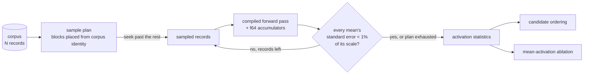

`--stats-sample-records 0` restores the exhaustive full-corpus scan.

The sample weakens `min` / `max` most — they are extreme-value statistics — so
the `narrow-range` ordering signal is the noisiest of the four. That is
acceptable: an ordering only decides which neuron is tested sooner, and every
candidate still faces the sampled screen and the full authoritative scorer.

## Mean-activation ablation

For hidden neuron `i`, let its measured mean post-activation be `mean_i`. For each
supported ordinary downstream connection `i -> j` with weight `w_ij`, Ockham
proposes:

```text
bias_j' = bias_j + mean_i * w_ij
```

and removes neuron `i`.

This preserves the removed neuron's **average downstream contribution**, not its
record-by-record behaviour. It is therefore a proposal mechanism, not a proof of
equivalence.

Unsupported aggregate or typed-synapse semantics are skipped rather than guessed.

## Exact cleanup

After a proposed removal, Ockham repeatedly applies safe deterministic cleanup.

A hidden neuron with no outgoing synapses cannot affect an output and is removed.
This can recursively make upstream structure redundant.

A supported hidden neuron with no incoming synapses is constant. Its constant
output can be folded into downstream biases before removing it.

For a suitable `IDENTITY` neuron:

```text
y = bias_y + Σ(x_k * a_k)
```

with downstream weight `b`, Ockham can exactly replace it with:

```text
bias_z += bias_y * b
x_k -> z weight += a_k * b
```

Parallel synapses are merged. Automatic `IDENTITY` collapse is only attractive
when the resulting NEAT growth cost is lower.

Every completed structural candidate must pass NEAT-AI-core
`creature.validate()` before it reaches the scorer.

### The exact cleanup pre-pass

Those rewrites are also run **before** the first statistical screen, as a
canonicalisation pass over the incumbent (`--no-exact-cleanup` turns it off).
If we can prove the wood is dead, we do not buy an experiment to find out. 🪒

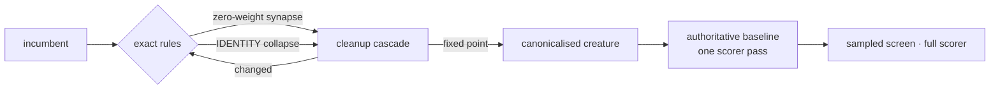

The rules, and why each is exact:

| Rule | Transformation | Invariant |
|---|---|---|
| `zero-weight-synapse` | drop an ordinary synapse of weight exactly `0.0` | it contributes `0.0 * x = 0.0` to a weighted sum for every finite `x` |
| `dead-structure` | drop a non-output neuron with no outgoing synapse | its value reaches no output |
| `constant-fold` | fold a hidden neuron with no incoming synapse into its targets' biases | its activation is the constant `squash(bias)` |
| `identity-collapse` | eliminate a hidden `IDENTITY` neuron | the substitution above, cost-gated on growth units |

Exactly zero, never "near zero": a weight of `1e-18` is small, not absent, and
cutting it stays the scorer's decision. Typed synapses and aggregate-squash
targets (`MIN`, `MAX`, `IF`, `HYPOT`, `MEAN`) are skipped, never guessed — an
aggregate reduces its whole synapse range, so dropping a member changes the
reduction. Duplicate consolidation needs no rule of its own: NEAT-AI-core
refuses duplicate ordinary synapses, and the one transform that can create a
parallel edge merges it by adding weights as it writes it.

The pass runs to a deterministic fixed point (rules in a fixed order, targets in
declaration order, every applied rewrite strictly lowering growth units), and
the canonicalised creature must pass `creature.validate()`. A rewrite that fails
validation is rolled back and named in `rejected` — never dropped silently. A
collapse that was offered and declined is counted by reason in `collapseSkips`
(`cost-increase` is the ordinary one: collapsing a wide neuron costs more
structure than it saves; the rest — `typed-synapse`, `aggregate-target`,
`self-loop`, `not-identity`, `not-hidden`, `unknown-neuron`, `invalid` — name a
topology the pass refused to guess at).

"Exact" here means *algebraically* exact: the canonicalised creature computes
the same function term for term. It does not promise bit-identical `f32`
arithmetic — folding a bias and composing weights re-order floating-point
operations, so outputs agree to rounding rather than to the last bit.

**It buys no scorer time of its own.** The authoritative baseline is established
*after* the pass, so that single full-corpus score is the sanity check over the
canonicalised creature; no exact rewrite consumes a candidate or a full score.
What it removed is reported in `exact-cleanup.json`, as the first
`exactCleanup` record in `experiments.jsonl`, and in `ockham report` as
`exactCleanupHiddenRemoved` / `exactCleanupGrowthUnitsSaved`.

Measured by `cargo run --release --example exact_cleanup_bench` — the pre-pass
is real and timed, the scorer is modelled at 2,000,000 records and 20,000
records/ms:

```text
   live   ident    zero |   hidden↓    growth↓  pass ms |  screen+full        saved
     50      25      25 |        50       59.9     13.7 |         5250         383×
    200     100     100 |       200      239.9    144.7 |        21000         145×
   1000     250     250 |       500      599.9   2311.5 |        52500          23×
   2000     500     500 |      1000     1199.9   9468.2 |       105000          11×
```

One representative run: the `pass ms` column is host-dependent, the
`screen+full` column is the model, and the ratio is only as good as the model's
assumptions.

Seconds of local work replace minutes of scorer work, and the saving is
structure the sweep never has to propose. The pass costs roughly one creature
clone and one validation per `IDENTITY` candidate, so it grows with the
creature: budget for a few seconds on a large forest, once per run.
## Correlated-neuron merging

A mature evolved creature accumulates hidden neurons that behave almost
identically. Neither is quiet, so mean-activation ablation never nominates
either of them — yet between the two there is one neuron too many.

**Two busy neurons can still be one neuron too many.** 🪒

Merging is **off by default**. `--merge-correlation <r>` turns it on, and only
then does the activation scan retain the probe records the signatures are built
from. The probe count is part of the activation-statistics cache key, so a
merge-enabled run can never be served a probe-free cached scan and silently
propose nothing.

### Finding the pairs without an N² matrix

A full correlation matrix over several thousand hidden neurons is not
affordable inside a forty-five-minute budget, so discovery runs in four cheap
stages:

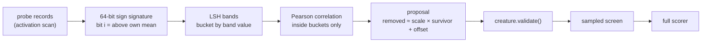

1. The scan retains each hidden neuron's post-activation at `--merge-probes`
   deterministically-placed records. The slots are a function of the sampling
   plan alone, so the same corpus and spec reproduce the same probes — and they
   sit inside the records the scan is *guaranteed* to visit, so adaptive
   stopping never shortens the probe set.
2. Each probe vector reduces to one `u64`: bit `i` is set when the neuron sat at
   or above its own probe mean at probe `i`. Centring on the neuron's own mean
   is what makes the bit comparable across neurons on wildly different scales.
3. Signatures are split into bands of `--merge-band-bits` and bucketed by band
   value, so only neurons that already agree on a whole band are ever compared.
   An anti-correlated pair agrees on the *complement* of every band, so the key
   is canonicalised to the smaller of the band and its complement and the two
   land in one bucket. **The band widens automatically with the creature** — a
   fixed width would give every unrelated pair a `2^-bits` chance of sharing a
   bucket, which grows with the *square* of the neuron count.
4. Pearson correlation, the exact and expensive part, runs on the probe vectors
   of bucket members only, and `--merge-max-bucket` bounds the worst case. A
   bucket the sweep declines to finish is **counted and logged**, never dropped
   quietly.

### Spending the relation

For a pair the correlation clears, a least-squares fit gives

```text
removed(t) ≈ scale * survivor(t) + offset
```

and for every ordinary outgoing synapse `removed → z` carrying weight `w`:

```text
bias_z       += w * offset
survivor → z   weight += w * scale
```

Parallel synapses merge by adding weights, `removed` goes, and whatever is left
feeding nothing cascades away with it. **Both survivor directions are
proposed** — which of two near-duplicates is the cheaper one to lose is a
structural question the signature pass cannot answer.

For an exactly duplicated neuron the fit is `scale = 1`, `offset = 0` and the
merged creature computes the same outputs. It is still recorded as an
**approximate** transform: a relation fitted from sampled probes is evidence,
never proof.

Unsupported topology is skipped, never guessed — a **typed** outgoing synapse
carries a role a plain weighted edge cannot stand in for; an **aggregate**
target (`IF`, `MEAN`, `MINIMUM`, …) does not sum its inputs; and a survivor that
does not already precede the target would make the rewritten edge run backwards
through a forward-only creature.

Unlike an `IDENTITY` collapse a merge cannot cost more than it saves: it deletes
one hidden neuron and every synapse incident to it, and writes back at most one
edge per *outgoing* synapse it deleted, so NEAT growth units always fall.

A merge candidate carries its survivor (`mergedWith`) through screening and into
the candidate log written by `--candidate-log`, so the audit trail records
**which pair** was tried rather than only which neuron went. The shared
learnings cache stores the verdict by uuid and kind, as it does for every other
transform; the survivor is re-derived from the current signatures at replay,
which is why the run re-discovers the pairs after every accept — a proposal
naming a survivor the accept already removed would be a stale cut wearing a
winner's uuid.

Two consequences a reader should know rather than discover. A replayed verdict
is a **hypothesis** that is re-scored on the full corpus, so re-deriving the
survivor cannot accept a cut the scorer did not confirm — but it can re-propose
a *different* pair under the same uuid. And a merge is tried **before** the
mean-activation ablation for a visited neuron, so a neuron with a valid merge
candidate spends that visit on the merge; the ablation is offered on a later
pass.

The threshold only ever **generates** proposals. Every merge candidate faces
`creature.validate()`, the sampled screen and the authoritative full scorer like
any other proposal, and the scorer alone decides whether the neuron it removes
was earning its keep.

### Benchmark

```bash
cargo run --release --example correlated_merge_bench
```

The harness plants exact twin pairs, near-twin pairs and a crowd of unrelated
neurons in one creature, measures every probe vector with the real NEAT-AI-core
forward pass, then judges each proposal by compiling the candidate and comparing
its outputs — screened on a subset of the probes, confirmed on all of them. On a
560-hidden-neuron creature (40 exact twin pairs, 40 near pairs, 400 unrelated):

| transform | proposals | candidates | screened | confirmed | confirmed/h | neurons | synapses |
|---|---:|---:|---:|---:|---:|---:|---:|
| merge | 860 | 860 | 9% | 9% | 134008 | 40 | 280 |
| ablation | 860 | 860 | 0% | 0% | 0 | 0 | 0 |

Every confirmed cut is a planted duplicate — all forty pairs — and the
mean-activation control confirms none of them: the neurons are all busy, which
is exactly the blind spot this transform exists to cover. `neurons` and
`synapses` count each pair **once**: both survivor directions confirm, but only
one neuron of the two was ever redundant. Nine per cent of the proposals
surviving is the cost side of the same measurement — a `0.98` threshold on 64
sign bits proposes generously, and the screen is what pays for that.
`confirmed/h` is this harness's proxy judge, not scorer economics; the
run-level figures come from `report` on a real run.

Discovery cost as the creature grows, on synthetic signatures:

| hidden | band bits | buckets | pairs compared | ms |
|---:|---:|---:|---:|---:|
| 1000 | 10 | 2679 | 5739 | 1.2 |
| 2000 | 11 | 4412 | 9733 | 2.1 |
| 4000 | 12 | 8825 | 19657 | 4.7 |
| 8000 | 13 | 14073 | 31678 | 8.1 |

Eight times the creature costs about seven times the discovery, not sixty-four:
the widening band is what holds the comparison count near linear.

The same measurement on **real compiled creatures**, probe capture included, so
the claim covers the forward pass behind the signatures rather than the
signature pass alone:

| hidden | synapses | probe capture (ms) | pairs compared | discovery (ms) |
|---:|---:|---:|---:|---:|
| 1100 | 7700 | 1.3 | 25157 | 5.4 |
| 2750 | 19250 | 3.4 | 59834 | 12.6 |
| 5500 | 38500 | 6.5 | 87516 | 18.0 |

Five times the creature costs five times the probe capture and about three
times the discovery — comfortably inside a forty-five-minute budget at several
thousand hidden neurons.

## Sampling and authoritative promotion

The current defaults are deliberately simple:

```text
candidate batch       100
screen sample rate    0.05
promotion policy      every sampled winner
run budget            2700 seconds
minimum full win      1e-6
```

The incumbent and all candidates in a sampled screen use the same scorer sample
context. Sampling may reject or promote candidates; it can never accept one.

Every sampled winner is full-scored. Ockham also tries grouped removals because
individual pruning effects are not assumed additive.

The highest strict full-corpus improvement becomes the next Ockham incumbent,
even if that improvement is tiny.

### Progressive screening

A fixed 5% screen pays the same scorer time for a candidate that is
catastrophically worse as for one that is a hair better. `--screen-stages` turns
the screen into a ladder of ascending sample rates, so the obvious losers are
paid for at the smallest sample and never reach the larger ones:

```bash
neat_ai_ockham creature.json training/ --screen-stages 0.0025:0.01,0.01:0.005,0.05
```

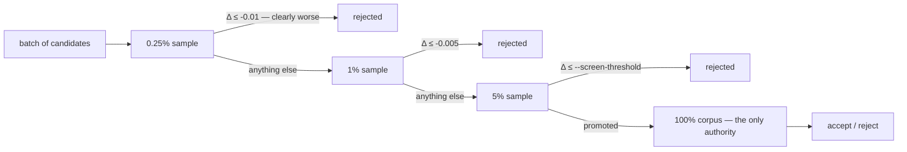

Two rules hold at every rung:

- **Sampling may reject or propose; only the full-corpus scorer accepts.** The
  ladder ends at the promotion stage; the cohort and `--min-improvement` decide
  the rest, exactly as they always have.
- **A borderline candidate collects more evidence.** A non-final stage rejects
  only when the sampled Δ is at or below `-margin`; anything uncertain — a tiny
  loss, a tiny gain — is carried to the next, larger sample. A non-final margin
  of `0` is refused for that reason: it would kill a candidate at the smallest
  sample merely for being a hair worse.

Each stage scores the incumbent alongside its candidates in one call, so the
comparison stays apples-to-apples even though the stages sample at different
phases. Stage sample phases are a pure function of the batch index and the stage
position (`batch × stages + stage`), so a seed and corpus replay the same records
exactly. Which records a phase selects is the scorer's stride, so how far two
rungs' slices overlap is its business, not Ockham's. Each rung journals a
`screenStage` record — records scored, mean sampled Δ, elapsed ms, how many
entered, were rejected and were carried — so the claim that a loser stopped
early is checkable rather than asserted, and the run log names how many losers
were *clearly worse* against how many merely missed `--screen-threshold`.

**A ladder run's coverage is only as strong as the rung that ended the
candidate.** A neuron rejected at 0.25% files the same screen record as one
rejected at 5% ([Screen coverage](#screen-coverage) has no notion of sample
rate), so `checked` counts a cheaper look than it does under the control. That
is the trade the ladder makes for its throughput, and it is one more reason the
default stays at the fixed 5%.

**The default is unchanged.** Omit `--screen-stages` and the screen is one stage
at `--screen-sample-rate`, which is the fixed 5% control this was measured
against and remains the default until fleet evidence on real creatures earns a
change:

```bash
cargo run --release --example progressive_screen_bench
```

| Measure (300 batches × 100 candidates, modelled scorer) | Fixed 5% control | `0.25% → 1% → 5%` |
|---|---:|---:|
| candidates/hour | 304,569 | **434,098** |
| scorer-records/candidate | 101,000 | **32,728** |
| full-scores/hour | 20,619 | **28,896** |
| confirmed cuts/hour | 12,173 | **17,248** |
| missed-winner rate | 28.84% | 29.26% |

The ladder confirms **1.42×** the cuts per wall-clock hour on **32%** of the
screen records, and misses 0.4 percentage points more of the true winners. The
benchmark models the scorer — cost linear in records read, a sampled score
carrying `0.15/√n` standard error, an exact full corpus — because the honest
comparison needs a corpus larger than a fixture and a ground truth to grade the
missed-winner rate against. Both arms run the real ladder over the real cohort
machinery on the same candidate population.

### Exploiting every screened winner

A screen that finds 38 winners has already paid for 38 pieces of evidence, and
only one of them can be applied — every candidate in a cohort is scored from the
same incumbent snapshot. The other 37 are the cheapest cuts Ockham will ever
find again, so nothing throws them away:

- **Every winner is full-scored.** `--max-full` caps how many are scored
  *individually*; it never decides which combinations are tried.
- **Combination plans are structurally different, not one nested chain.** The
  generator emits the all-winners plan, two complementary disjoint halves, an
  all-identity and an all-ablation group, then power-of-two prefixes — capped,
  de-duplicated and deterministic. A single ranked chain cannot localise a
  winner that poisons every bundle it joins; two disjoint plans can.
- **A confirmed winner is remembered, not buried.** A cut whose own full-corpus
  delta beat `--min-improvement` but which lost its cohort is recorded with that
  delta, so it is never mistaken for a failure and suppressed fleet-wide. Within
  a run it joins later batches' bundles through an in-run pool; across runs
  replay picks it up from the learnings cache.
- **Replay shrinks before it probes.** When a combined replay plan misses, the
  same cohort carries shrink steps that drop the weakest members first, and only
  then does Ockham fall back to scoring known wins one at a time.
- **The cohort is sized to the wall clock.** A rolling cost estimate from
  observed cohort timings decides how many entries fit in the budget left,
  keeping a reserve to apply and write the win. When entries must be dropped,
  the structurally distinct plans and the strongest individuals are kept, and
  the log and the commit description say what went — a silent cap reads as "we
  tried everything" when we did not. When not even a minimal cohort fits, the
  run stops rather than starting a scorer call that would overrun.

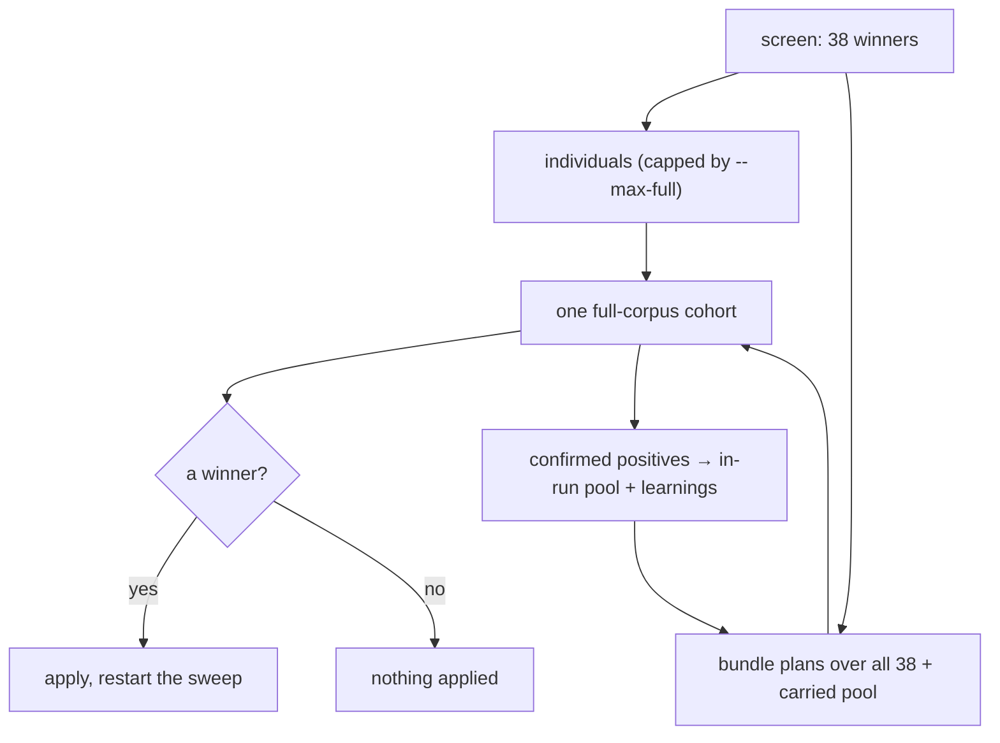

### Screen coverage

A neuron counts as **checked** once the sweep has **visited** it under the
corpus in hand (#100). With `--learnings-dir` set, every visit leaves one screen
record in `screens/<host>.jsonl`, stamped with the corpus it was measured
against:

| Visit | Record `kind` | Version | Counted as |
|---|---|---|---|
| Candidate the scorer screened, winner or loser | `identity` / `ablation` / `constant` / `merge` | 2 | checked |
| Nothing could be proposed — no finite activation statistic, a candidate that would not validate | `skipped` (with a `blockedReason`) | 3 | checked **and** blocked |
| A standing full-corpus verdict suppressed the try | `known-failure` | 3 | checked |

A record for a visit that scored nothing is written at **version 3**, which a
pre-#93 binary does not accept. The fleet runs mixed versions against one shared
`screens/` directory, and an old reader has no notion of a visit with nothing to
score: it would count these as screens and publish a percentage far above what
it had screened. An unknown version is *skipped*, never a load failure, so an
old host simply keeps reporting the figures it can justify until it is
upgraded.

The same records are filed when `--screen-sample-rate 0` sends candidates
straight to full scoring. A batch whose screen call fails files nothing for its
candidates — they were never checked — but the visits the sweep already made
past them still count. Each batch also journals a `screened` record, so coverage
is reconstructable from `experiments.jsonl` alone.

Filing the unproposable visits is what fixed `checked` going *backwards*
(#93). On a forest-heavy creature roughly four hidden neurons in five feed an
aggregate squash and could not be ablated; while those visits filed nothing the
numerator was pinned to the prunable minority, fell by one on every accepted cut
and reported `1417/6969` one run, `1416/7005` the next. A visit is coverage even
when there was nothing to try — and `blocked` says how much of `checked` was
reached that way, so the percentage never claims a screen that never happened.

Since #103 a blocked visit also records **why**, as a reason code on the record
(`blockedReason`), and each batch logs its skips by the same codes
(`missing-activation: 6, known-failure: 3`). One number could not be attacked; a
breakdown can be, and the dominant category — aggregate and typed structure the
bias fold cannot express — is now *proposed* as a
[constant substitution](docs/blocked-reasons.md) rather than blocked, which is
why `aggregate-squash` is a category the codes can still name but the sweep
rarely reaches. `blocked` never meant *not pruneable forever*: it means the
current proposal mechanism does not know how to test this neuron safely, and the
code says which mechanism is missing.

A substituted candidate is a third scored kind, `constant`, in `screens/` and in
the journal. It leaves a `constant` neuron where the hidden one was, so `cut:`
counts it — the hidden neuron is gone and the structure that fed it with it —
while the creature keeps one node emitting a fixed value. As always, the
full-corpus scorer decides whether that trade was worth making.

Coverage is still a statement about the creature in front of us, not a score
that only ever rises: a cut removes a checked neuron, so the count still steps
down by what a run prunes. What #93 changed is that it now *rises* with every
visit rather than only ever falling.

A screen record is a coverage fact, never a prune verdict: only a full-corpus
learnings verdict may accept or reject a cut, and a screens IO fault warns
rather than failing the run.

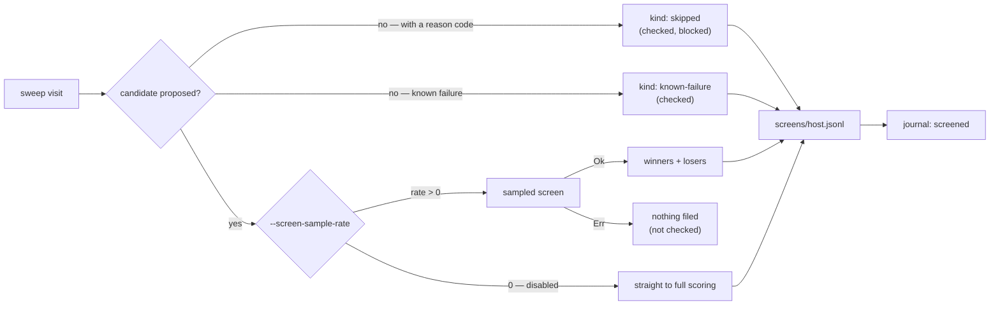

#### Coverage outlives the corpus — the record does, the authority does not

The screen path carries **no corpus identity** (#76). GRQ regenerates the
training corpus before every Ockham run, so a corpus-keyed screen directory
partitioned the fleet's coverage: each identity saw only its own slice and
re-screened neurons another identity had already checked. The identity is
recorded on the record instead — `corpusIdentity`, `SCREENS_FORMAT_VERSION` 2 —
so no record is ever stranded behind a path nothing writes to.

Verdicts are the opposite and are untouched: a full-corpus `Accepted` /
`Rejected` genuinely is a claim about one corpus, so those stay in
`corpus-<identity>/`. A verdict from another corpus is still never loaded **as a
verdict** — a wrong `Rejected` suppresses that uuid fleet-wide for seven days —
and it never joins the set that suppresses or accepts. It is read as *evidence*
instead: what to look at first, and what to re-score first. See
[Old-corpus priority](#old-corpus-priority).

Pre-#76 `screens-<identity>/` directories are still **read**, so the first run
after the change starts from the union of what the fleet already knows rather
than from zero. They are never written to, and a record from either location
counts once per uuid. A fault in one of those legacy directories is warned and
skipped rather than failing the whole union: nothing rewrites them, so one
truncated line would otherwise zero the fleet's coverage on every run — the
plateau, reinstated. A fault in the live `screens/` directory is still an error.

#### A sweep can finish; Ockham never finishes

What that recorded identity is *for* is the screening **epoch** (#100).
`sweep X/X checked (100.0% of epoch)` says the sweep is complete for the
training data in hand — not that Ockham is done. Every artefact says so in
those words (#102): the percentage is always `of epoch`, a finished sweep is
reported as `sweep complete for this epoch`, and the epoch is named beside the
figure. The corpus is extended every few days, and a screen
taken against the old one says nothing about how the neuron behaves under the
new data, so coverage is authoritative only for the corpus it was measured
against.

Every run therefore reads the whole screen history and counts the records filed
under the corpus in front of it. When the corpus identity changes:

- coverage opens at `0 / current_hidden_count` before the run records a visit;
- every hidden neuron is eligible to be visited again, `blocked`,
  `known-failure`, screened-loser and screened-winner alike — none of them is
  current-epoch coverage;
- the previous epoch's records are **kept, read and still named** by the corpus
  they were measured against. This invalidates coverage *authority*, never
  history;
- `coverage.json` and the journal `coverage` record carry `corpusIdentity`, so a
  reader comparing two runs can tell a fresh epoch from a collapse in coverage.
  `report` surfaces it as `corpusIdentity` beside `sweepComplete` (#102), and
  the human-readable surfaces carry the first eight characters of it — enough
  to see a reset, short enough for a commit subject;
- the records the new epoch does not count are still **reported**, on their own
  `history:` line: `N of M ever checked across K corpus epochs` (#102). What a
  new epoch invalidates is the authority of a screen, never the record of it.

Selecting the epoch rather than clearing the store is what keeps the **record**
half of #76 intact. The fleet sits on several live corpus identities at once —
hosts pull training data independently — so a host that moves back to an
identity it has screened before finds that epoch's coverage exactly where it
left it, and an identity it has never screened simply opens empty rather than
wiping anything. Nothing is ever cleared, so no coverage is lost, only scoped.

Say plainly what the **authority** half costs, because it is a deliberate
reversal of #76 and not a free win: on a host whose corpus genuinely changes
between runs, every run now opens at `0 / hidden` and re-screens the creature.
That is the intended reading of `100%` — the sweep finished *that* corpus — but
it is only affordable because the corpus turns over in days rather than runs.
The evidence in #100 is four corpus identities across six days, one of them
taking verdicts for the whole window; the older claim that GRQ regenerates the
corpus before *every* run does not match it. Should the corpus ever go back to
turning over per run, the epoch is the wrong scope and this is the paragraph to
revisit — the symptom is a `screens: 0 of N record(s) … are current-epoch
coverage` line on every run, and a `progress:` figure that never compounds.

A corpus is identified by its authoritative content: widths, file names, sizes
and each file's head and tail bytes. A **repacked** corpus with identical
content hashes to the same identity and keeps its coverage; an **extended** one
does not, and starts a new epoch. Pre-#76 `screens-<identity>/` records are
stamped with the identity their directory name carries as they are read, so
that history lands in the epoch it was measured against rather than in none.

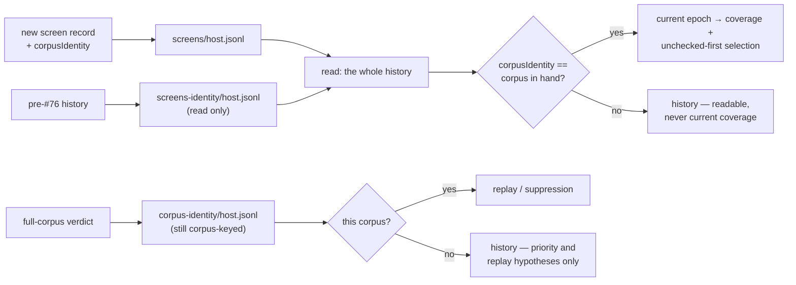

#### Every run advances the checked count

The guarantee, stated rather than left to emerge (#77): **every run advances the
checked count by up to the batch size until 100% of the epoch's hidden neurons
have been tried, and at 100% the sweep restarts** and begins re-screening the
stalest neurons. Four rules hold it up.

- **An exhausted sweep is rebuilt, never idled on.** A run that has visited
  every hidden neuron builds a fresh permutation, re-applies unchecked-first
  selection and carries on; the restart is logged and journalled as a
  `sweepRestart` record, because a creature screened end to end is fleet news,
  not noise. Before this an exhausted sweep ended the run then and there with
  the stop reason `exhausted`: whatever budget was left went unused, and a
  creature the fleet had worked all the way through simply stopped being
  screened instead of recycling its stalest neurons.
- **Nothing spins, and nothing stops early.** An empty batch from a sweep that
  still has neurons left is
  normal — every candidate was skipped — and the sweep simply advances. An empty
  batch from an exhausted sweep must restart or stop. A whole pass in which not
  one hidden neuron proposed a candidate would restart into exactly the same
  nothing, so the run stops with `no-candidates`.
- **One screening batch is reserved from the wall clock.** The replay stage and
  its full-corpus scoring can consume the whole budget before the first batch is
  filled, leaving a run that screened nothing and looked identical to one that
  screened a batch of losers. So once the budget left has fallen to the
  estimated cost of one screening batch — and only while this run has screened
  **nothing** — the replay stage stands down and the sweep takes what remains.
  The reserve is claimed inside the budget: the batch starts before the
  deadline and no scorer call is started after it, so the soft-budget contract
  is untouched — the reserved screen may finish past the deadline exactly as any
  other in-flight call does. Its size is deliberately
  the smallest that can exist, exactly one batch, because the cost falls on
  full-corpus scoring, which is where accepts actually come from — reserve too
  much and the fleet screens diligently while pruning nothing, which looks like
  healthy rising coverage and would read as success for weeks. The batch cost
  is a measured screen where one exists, otherwise the full-corpus cost scaled
  by `--screen-sample-rate` (by 1 when screening is disabled, where the batch
  *is* a cohort). A batch that would cost more than half the run budget is not a
  reserve but the whole plan, and none is taken.
- **A run that advanced nothing says so.** The distinct UUIDs a run moved from
  unscreened to screened are counted, reported in the `stop` journal record
  (`newly_screened`), in the run summary (`newlyScreened`) and on the
  `progress:` line of the commit description, and a run that ends with zero of
  them while unchecked neurons remain logs a warning naming both figures. The
  overnight plateau behind #63 ran for eight runs because every artefact was
  well-formed and the only evidence was a number failing to change across
  commits nobody compares.
- **A replay accept ends the search, not the run.** A replayed known win used
  to end the run the moment it landed — and with it the run's other job. Nine
  consecutive GRQ-sampler check-ins reported `progress: 0 newly screened this
  run` while the razor kept cutting, because every one of those runs accepted
  before it had screened anything (#91). The replay accept still ends the
  **search** — `best.json` is written, and nothing after it replays,
  full-scores or accepts — but what is left of the budget goes to screening,
  batch after batch, over a sweep rebuilt against the creature the accept just
  changed so unchecked-first selection applies to it. A **search** accept ends
  nothing since #96 removed the accept cap: the sweep restarts over the changed
  creature and the run searches on until its budget is spent. The stop reason
  still names the replay accept (`replay-accepts`), because that is what ended
  the search; what ended the **tail** is journalled separately as a
  `coverageTail` record carrying its batches, the candidates it screened and its
  own end reason, so a tail that ran out of wall clock is not confused with one
  that ran out of experiments. A sampled winner the tail turns up is **left
  unchecked**: nothing in this run will score it, and filing it as checked would
  bury it — the record would be the freshest in the store, so unchecked-first
  would defer it behind every never-screened neuron on the creature. Left
  unchecked, the next run screens *and* full-scores it. With
  `--screen-sample-rate 0`, or without `--learnings-dir`, no tail is opened at
  all: the only check available without a sampled screen is a full-corpus cohort
  — the search the accept just ended — and replay reads its wins from the
  learnings cache, so a run without one never reaches a replay accept.

Two stop reasons move with this: `no-candidates` is new, and `exhausted` is
retired — an exhausted sweep can no longer end a run, so the only way the loop
falls out on its own is having no hidden neurons left (`no-hidden`).

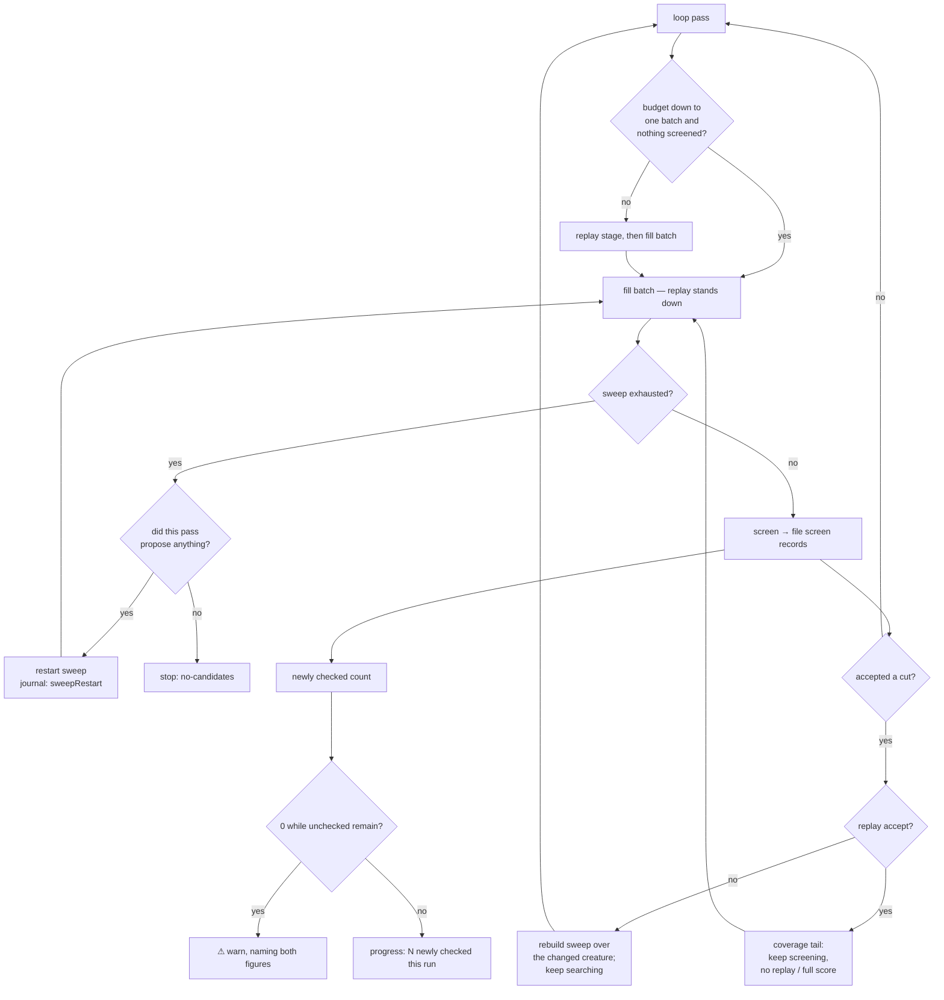

### How far Ockham has got

`coverage::coverage` turns those records into one answer, computed in exactly
one place so the tag, the commit description and `report` can never disagree:

```text
sweep 1204/5013 checked (24.0% of epoch), 7 cut, 42 tagged
```

The denominator is every hidden neuron of the **current** incumbent:

- a screen record for a uuid no longer on the creature is ignored — it raises
  neither `checked` nor `hidden`;
- duplicate records for one uuid count once;
- tagged neurons stay in the denominator and a screened one
  counts as checked (#74). Selection stopped exempting them in #63, so
  deducting them here overstated progress; `tagged` is still reported beside
  the percentage, never subtracted from it;
- newly evolved neurons start unchecked and therefore *lower* the percentage.
  That is intended: coverage describes the creature in front of us, not a
  score that only ever rises;
- a visit the razor could propose nothing for counts as checked and is reported
  as `blocked` beside the percentage (#93), never deducted from it — the neuron
  is on the creature and the sweep has been to it. `blocked` says no cut *was*
  proposed on the visits so far, not that none ever could be: one real screen
  anywhere in fleet history clears it, and since #103 the reason on the record
  says which mechanism was missing, split by code in `blockedByReason` and on
  the `reasons:` line of the description;
- only records measured against the **corpus in hand** are counted (#100): a
  changed corpus opens a new screening epoch at `0 / hidden`, and `100%` means
  100% of that epoch. See
  [A sweep can finish; Ockham never finishes](#a-sweep-can-finish-ockham-never-finishes).

With `--learnings-dir` set, the run journals one `coverage` record at the end,
so `report` shows `hidden`, `tagged`, `checkable`, `checked`, `unchecked`,
`cut`, `coveragePercent` and — since #102 — the `corpusIdentity` those figures
were measured against with `sweepComplete` beside it, across runs. `checkable` keeps its key so `coverage.json`
stays readable by anything already parsing it; since #74 it means "hidden
neurons Ockham may try", which is all of them. Without a learnings dir there is
no coverage state, and nothing is journalled — absent rather than a misleading
0%.

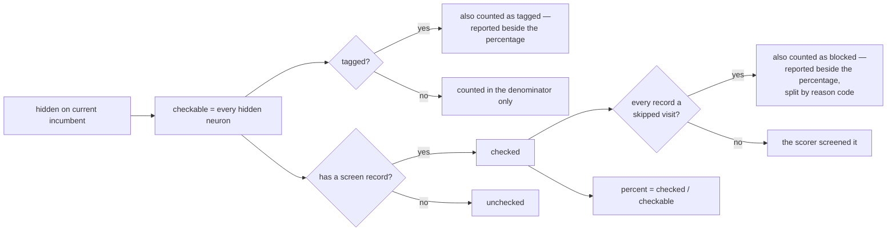

### The GRQ commit-description contract

The `ockham` tag is one crowded line, so the readable answer to "how many
neurons have been checked, and have they earnt their keep?" belongs in the
commit **description**. Ockham produces that block; GRQ only pastes it.

On the normal completion path, a run with `--learnings-dir` writes two files
into `--output-dir`, beside `best.json`:

| Path | Contents |
|---|---|
| `coverage.txt` | The rendered description block, ready to paste into `git commit`. |
| `coverage.json` | The same figures as the serialised `CoverageReport` struct. |

`coverage.txt` is line-oriented and stable — treat it as a contract:

```text
🪒 Ockham neuron screening coverage
sweep:     1204 of 5013 hidden (24.0% of epoch)
epoch:     corpus 6fc028da — coverage counts this corpus only
cut:       7 this run
unchecked: 3809 remaining this epoch (~39 runs at 100/run)
blocked:   412 checked with no cut proposed
reasons:   missing-activation 380 (92.2%) · validation-failed 32 (7.8%)
tagged:    42 carry tags, screened like any other
progress:  100 newly checked this run
history:   4802 of 5013 ever checked across 3 corpus epochs
winners:   38 screened · 22 confirmed · 1 applied · 21 carried
bundles:   9 plans · best 14 cuts (Δ +1.2e-4) · 3 skipped
dropped:   12 entries over budget (est 18s/creature)
```

- the runs-remaining estimate divides `unchecked` by the configured
  `--candidates` batch size (`~1 run` when one batch would finish it), and the
  whole clause is **omitted** — never `inf` or `NaN` — when that batch size is
  zero. A finished sweep reads `0 remaining — sweep complete for this epoch`
  instead (#102), and a creature with no hidden neurons reads
  `0 remaining — no hidden neurons to sweep`: there was nothing to finish;
- the `blocked:` line is omitted when nothing is blocked, and says how many of
  the `checked` were reached by a visit that proposed no cut (#93) — they stay
  inside the percentage, because the sweep has been to them;
- the `reasons:` line follows it (#103) and splits that total by reason code,
  commonest first with each category's share of the blocked total. The counts
  are over UUIDs and sum to `blocked` exactly, so the line is a work list: the
  head of it is the category a new proposal path would pay for. Omitted with
  the `blocked:` line it qualifies;
- the `tagged:` line is omitted when no neuron is tagged, and says only how many
  hidden neurons carry tags — a tagged neuron the run cut is counted by `cut:`
  like any other (#87);
- the `progress:` line is **never** omitted, zero included (#77): coverage is
  cumulative fleet state, so the per-run figure beside it is the only thing that
  makes a plateau visible by reading two consecutive commits;
- the `epoch:` line names the corpus the figures were measured against (#100),
  directly under the percentage it qualifies (#102): `100.0% of epoch` above it
  is 100% of *that* corpus, and extending the training data starts a fresh
  epoch. The identity is the first eight characters of the corpus fingerprint —
  `coverage.json` keeps it in full. Every run that writes these files names its
  corpus, so the line is absent only from an artefact written before #100;
- the `history:` line is the cumulative counterpart (#102): how many of the
  current hidden neurons the fleet has ever checked, under how many corpus
  epochs. It is reported beside the percentage and never inside it — mixing a
  screen taken against last week's training data into today's figure is the
  misleading `100%` this reporting exists to prevent. Omitted when the screen
  store holds no records;
- the `winners:` / `bundles:` / `dropped:` lines are each omitted when they have
  nothing to report, so a run that screened nothing renders the coverage lines
  alone, exactly as it did before they existed;
- `coverage.json` carries the same per-run figure under `newlyScreened`, the
  epoch under `corpusIdentity` (in full), the cumulative figures under an
  additive `history` key and the winner figures under an additive
  `winners` key, and
  still deserialises straight into `Coverage` for a consumer that ignores them,
  so nothing downstream needs to parse the prose.

Both files are written only when coverage exists: no `--learnings-dir` means no
screen store, no coverage state, and neither file. A write fault warns and the
run still completes — reporting must never cost a verified prune.

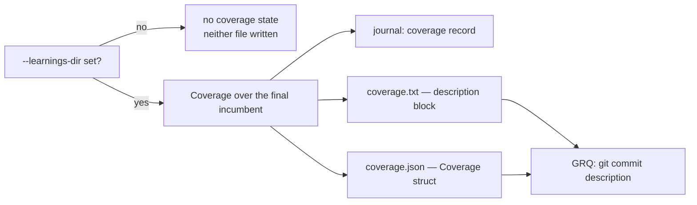

### Unchecked-first selection

With thousands of hidden neurons and roughly a hundred screened per run,
independent runs re-screen the same neurons by chance and coverage crawls.
`--unchecked-first` fixes that at selection time, one layer above the ordering
strategies: coverage is per-fleet state, while a strategy must stay reproducible
from `(--seed, --ordering, --ordering-random-quota)` alone.

The still-unvisited tail is **partitioned**, never filtered — it stays a
permutation of the same UUIDs, so a run that exhausts the never-screened block
rolls straight into re-screening the stalest neurons instead of stopping:

- **block A** — UUIDs with no screen record, in ordering-strategy order;
- **block B** — already-screened UUIDs, oldest-screened first.

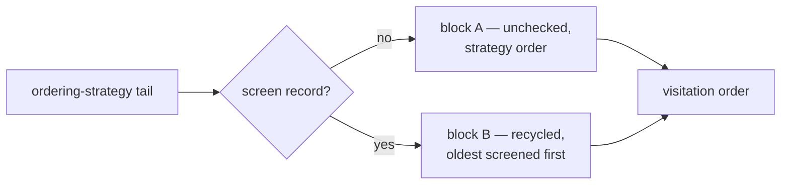

The flag defaults to on with `--learnings-dir` and off without it: with no
screen store there is no coverage state to prefer, and the order is then
identical to the raw seeded permutation. The `permutation_identity` in the
journal is hashed **before** this reorder, so `--ordering` comparisons stay
valid; the `start` record carries `unchecked_first` so a run is reconstructable.
Known-failure skips still apply on top; a tag never skips a neuron (#87).

### Old-corpus priority

Unchecked-first says *do not repeat work*; this says *guess better about what is
left* (#88). GRQ regenerates the training corpus before every run, so the
`corpus-<identity>/` verdicts of earlier corpora are never consulted again even
though the fleet paid full-corpus scoring for every one of them. A hidden neuron
one of those corpora **removed** — and that is still on the incumbent, still
unchecked against the corpus in hand — was removable under at least one set of
training data, which makes it a better first guess than a neuron with no history
at all.

So Ockham reads every sibling `corpus-*` directory under `--learnings-dir` and
moves that set to the **front** of the screening queue, ahead of block A:

- **qualifying** — *any* foreign-corpus record for the uuid is `Accepted`, or is
  a *confirmed but not applied* win: a `Rejected` record whose measured
  individual `fullDelta` beat `--min-improvement`, which lost its cohort to a
  better candidate rather than failing (#52). One corpus rejecting later does
  not cancel another corpus's win — that would be per-corpus suppression
  crossing corpora, which is precisely what this hint must not do;
- **still there** — the uuid is a hidden neuron of the current incumbent;
- **not yet checked here** — no screen record naming this run's
  `corpusIdentity`. Screening itself stays cross-corpus (#76): this filter only
  decides what to look at *first*, and it never changes how coverage is counted;
- **ordered** — best measured full-corpus delta first, applied cuts ahead of
  confirmed-only ones, recency and uuid breaking ties, so every host in the
  fleet builds the same queue.

Old data is a hint, never proof. A prioritised neuron passes the sampled screen
and full-corpus scoring exactly as any other candidate does, and nothing read
from another corpus can suppress or accept a cut — a foreign `Rejected`
does not deprioritise anything either, because failure suppression stays
per-corpus. A fault in one foreign directory is warned and skipped, so a single
truncated line costs that corpus's hint and nothing else.

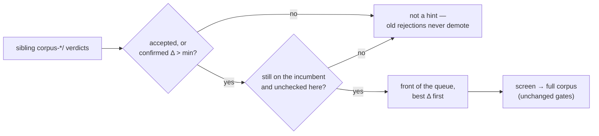

The flag defaults to on with `--learnings-dir` and off without it, and
`--old-corpus-first=false` disables it. The count moved to the front is logged
beside the coverage line — `coverage: 7 neuron(s) prioritised from older corpus
caches (#88)` — so the reordering is observable in every run's log.

#### Historical results are evidence; the current scorer is truth

A corpus epoch change resets *coverage*, and it must not throw away what the
fleet has already paid to learn (#101). Every learning is kept and read across
epochs, stamped with the corpus that established it — `load_prior_corpora`
returns the record and its epoch together, so the cache is longitudinal history
rather than a single generation of verdicts. The epochs are logged on every run
that has them:

```text
prior corpora: 46 verdict(s) from /fleet/learnings across 3 historical epoch(s),
  read as priority and replay hypotheses
  history: corpus 6fc028da266d6c51 — 31 verdict(s)
```

That evidence is put to work as a **replay hypothesis** as well as an ordering
hint. A cut an older epoch confirmed is the best guess the fleet has about the
new corpus, so the replay stage takes it up before the sweep starts — and
re-scores it against the corpus in hand, which is the only thing that may accept
it. Three rules keep evidence from becoming truth.

- **An old winner is replayed, never applied.** It enters the replay stage
  behind this corpus's own confirmed wins, is full-corpus scored here, and is
  filed as this corpus's `Accepted` or `Rejected` on the result. A run whose
  scorer says no cuts nothing.
- **An old failure suppresses nothing.** It is not a replay hypothesis and it is
  not a priority, and it never skips a current-epoch visit: the neuron is
  screened on its merits as though the fleet had never seen it. Only *this*
  corpus's fresh `Rejected` suppresses, and only for `DEFAULT_RETRY_AFTER_SECS`.
- **A current-corpus verdict settles it.** Once this corpus has scored the uuid,
  history stops proposing it: an `Accepted` or confirmed record is replayed from
  this corpus's own cache, and a `Rejected` one is the current answer, which
  older evidence does not overrule.

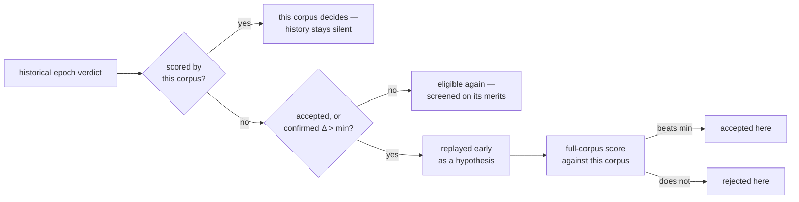

Both channels ride on `--old-corpus-first`: with it off the run reads nothing
historical, replaying and prioritising only what this corpus has measured. The
replay log line counts what came from where — `replay: combining 3 of 3 known
win(s) still on incumbent (1 applied elsewhere, 0 confirmed only, 2 from older
corpus epochs — re-scored here)`.

## Where this sits in the literature

Structured pruning of trained networks is one of the best-studied problems in
the field, and Ockham is a deliberately simple member of that family rather than
a new idea. The central question is not untested: it is decades old and largely
confirmed, which is good news for the razor. This section records the published
prior art each mechanism above already implements, and the one place the
literature says Ockham is most exposed.

```mermaid
flowchart LR
    O[activation statistics] -->|"OBD / OBS / Molchanov saliency"| A[mean-activation ablation]
    A -->|"Nagel bias correction, ThiNet"| B[downstream compensation]
    B -->|"Srinivas & Babu"| C["exact IDENTITY collapse"]
    C -->|"racing, F-Race, successive halving"| S[5% sampled screen]
    S -->|"Rissanen MDL, Hinton & van Camp"| F[full-corpus accept]
    F -->|"Frankle & Carbin, Dense-Sparse-Dense"| O
    F -.->|"Dwork, Blum & Hardt — the caveat"| X[adaptive overfitting]
```

### Removing structure from a trained network

The core question — whether deleting structure from an already-trained network
can improve it — is **Optimal Brain Damage** (LeCun, Denker & Solla, 1989) and
**Optimal Brain Surgeon** (Hassibi & Stork, 1993). Both rank a parameter by a
saliency estimate of the loss change its removal would cause: OBD from the
diagonal of the Hessian, OBS from the full inverse Hessian. The modern form of
the same criterion is a Taylor expansion of the loss around the trained weights
(Molchanov et al., 2017, 2019).

Ockham's [mean-activation ablation](#mean-activation-ablation) is the
**zeroth-order** member of that family. It uses no derivative of the loss at
all — only the measured mean activation — and then asks the scorer what actually
happened. First-order (gradient) or second-order (Hessian) saliency would rank
candidates better, but each order costs another corpus pass and a gradient the
external scorer does not expose. The order Ockham operates at is therefore a
deliberate cost choice, and closing part of that gap without gradients is
exactly what [candidate ordering](#candidate-ordering) measures.

### Compensating downstream after a removal

Folding a removed unit's mean activation into downstream biases is **bias
correction** (Nagel et al., 2019), where the expected error an approximation
introduces is absorbed by the following layer's bias. Reconstruction-based
pruning (**ThiNet**, Luo et al., 2017) attacks the same problem from the other
side by re-fitting the surviving weights to reproduce the next layer's response.

### Folding redundant and identity structure

Exact `IDENTITY` collapse and the removal of functionally redundant units is
**data-free parameter pruning** (Srinivas & Babu, 2015), which merges neurons
computing the same function and rewires their outgoing weights. That is the same
algebraic move as [exact cleanup](#exact-cleanup), restricted there to the cases
Ockham can prove rather than estimate.

[Correlated-neuron merging](#correlated-neuron-merging) is the *measured* half
of the same idea: Srinivas & Babu identify duplicates from the weights alone,
while Ockham identifies them from sampled behaviour and lets the full-corpus
scorer settle whether the pair really was one neuron. The candidate generation
borrows the locality-sensitive hashing of **Indyk & Motwani** (1998) — the sign
signature and its bands are the SimHash construction of **Charikar** (2002) — so
near-duplicates are found without ever building the `N × N` matrix.

### Iterating: the compounding hypothesis

Prune, retest, then prune again from the survivor is the **lottery-ticket**
procedure (Frankle & Carbin, 2019) and **Dense-Sparse-Dense** training (Han et
al., 2017). Both report that iterated pruning leaves the model better than it
found it, which is direct published support for Ockham's central bet.

### The name is formalisable

Ockham's razor has a mathematical counterpart: **minimum description length**
(Rissanen, 1978). A model is scored by the cost of describing the model plus the
cost of describing the data given that model, so simpler structure is preferred
only where it does not cost accuracy. Hinton & van Camp (1993), *Keeping neural
networks simple by minimising the description length of the weights*, applies
MDL directly to network weights.

That is the shape of the growth gate. `growth_units` — `hidden + synapses / 10`,
the unitless quantity the scorer multiplies by its growth-cost knob
(`costOfGrowth` in NEAT-AI, `growthCost` in `NEAT-AI-scorer`) — is the
model-description term; the scorer's error over the corpus is the
data-given-model term. Accepting a cut only when the authoritative full-corpus
score improves is an MDL trade-off with the scorer supplying both terms. Citing
MDL turns the pun into a principle: `costOfGrowth` is a complexity penalty with
a formal justification, not a taste for small networks.

### Screening on a sample before confirming on the corpus

Testing many candidates cheaply and confirming only the survivors is **racing**
(Maron & Moore, 1994) and **F-Race** (Birattari et al., 2002); allocating the
budget by repeatedly discarding the worst half is **successive halving**
(Jamieson & Talwalkar, 2016). Ockham's
[5% screen](#sampling-and-authoritative-promotion) is the simplest possible
member of that family — one round, one rate — and it keeps the invariant those
methods rely on: a sample may reject or promote a candidate, but only the full
corpus may accept one.

### The caveat this README must carry

The stated hypothesis — many individually tiny, scorer-verified pruning wins may
compound into a material improvement — is precisely the hypothesis that fails
under evaluation noise. Every accept is selected against the same corpus, so
tiny wins accumulate **bias as readily as skill**: the adaptive-overfitting
results (Dwork et al., 2015, *The reusable holdout*; Blum & Hardt, 2015,
*The Ladder*) show that a long sequence of decisions taken against one held-out
set ends up measuring the set rather than the model.

Ockham accepts even tiny full-scorer local wins by design — `--min-improvement`
defaults to `1e-6` — so of the sibling experiments it carries the largest
exposure to this failure mode. The known remedy is a Ladder-style gate: accept
only when the improvement exceeds the previous best by more than the scorer's
noise floor, which turns an unbounded run of micro-accepts into a bounded number
of real ones. Ockham does not implement that gate today. It is documented here
so a compounding result is read with the right suspicion, and so the scorer's
noise floor is measured before it is trusted.

## Usage

```bash
neat_ai_ockham <creature.json> <training-data-dir> [OPTIONS]
neat_ai_ockham report <experiments.jsonl> [...]
neat_ai_ockham train-ordering <candidates.jsonl> [...] --out <model.json>
neat_ai_ockham --help
```

Common options:

| Flag | Default | Purpose |
|---|---:|---|
| `--timeout-seconds` | `2700` | Wall-clock optimisation budget. |
| `--candidates` | `100` | Candidates per sampled sweep batch. |
| `--screen-sample-rate` | `0.05` | Sample rate used only for screening; `0` disables it. |
| `--screen-stages` | none | Progressive screening ladder: ascending `rate[:margin]` stages, e.g. `0.0025:0.02,0.01,0.05`. Omitted, the screen is one stage at `--screen-sample-rate` — the control. See [Progressive screening](#progressive-screening). |
| `--screen-reject-margin` | `0.01` | Early-rejection margin for a ladder stage that names none: a sampled Δ at or below its negation is rejected there instead of re-tested. Refused without `--screen-stages`, where it would do nothing. |
| `--screen-threshold` | `0` | Sampled Δscore required for promotion. |
| `--stats-sample-records` | `100000` | Records sampled for hidden-neuron activation statistics; `0` scans the whole corpus. See [Activation statistics](#activation-statistics). |
| `--merge-correlation` | none | Propose removing one of two hidden neurons whose sampled behaviour correlates at least this strongly, compensating through the survivor; see [Correlated-neuron merging](#correlated-neuron-merging). Omitted: merging is off and no probes are retained. A threshold only proposes — the full scorer still decides. |
| `--merge-probes` | `64` | Probe activations retained per hidden neuron for merge signatures. |
| `--merge-band-bits` | `8` | Minimum signature bits a pair must share to be compared at all; widened automatically on a large creature so the comparison count stays linear in the neuron count. |
| `--merge-max-bucket` | `48` | Neurons compared pairwise inside one signature bucket. Members beyond it are reported, never dropped quietly. |
| `--merge-max-partners` | `3` | Merge proposals kept per removable neuron. |
| `--max-full` | none | Cap sampled winners sent to full scoring (highest sample Δ first). |
| `--learnings-dir` | none | Shared full-corpus prune-verdict cache. Omitted: do not read or write. |
| `--learnings-host` | hostname | Per-host jsonl label (unqualified `$HOSTNAME` / `$HOST` / `hostname`). |
| `--learnings-replay` | `0` | Max known-win UUIDs to replay before the random sweep; `0` = all still present on the incumbent. |
| `--max-consecutive-scorer-failures` | `3` | Abort after this many consecutive scorer failures. |
| `--min-improvement` | `1e-6` | Strict authoritative improvement required locally. |
| `--seed` | drawn | Reproducible random sweep seed. |
| `--unchecked-first` | on with `--learnings-dir`, off without | Screen never-checked neurons first, then recycle the stalest; see [Unchecked-first selection](#unchecked-first-selection). Set `--unchecked-first=false` to keep the raw seeded permutation. |
| `--old-corpus-first` | on with `--learnings-dir`, off without | Read what older corpus epochs learnt: check the hidden neurons they once removed before the rest, and replay their confirmed winners early as hypotheses; see [Old-corpus priority](#old-corpus-priority). Evidence only — every one is re-scored against the current corpus, and no historical record can suppress or accept a cut. Set `--old-corpus-first=false` to disable. |
| `--ordering` | `random` | Named candidate ordering; see [Candidate ordering](#candidate-ordering). |
| `--ordering-random-quota` | `0`, `0.1` for `learned` | Fraction of sweep slots reserved for the random control, in `[0, 1)`. A `learned` run reserves one visit in ten unless the flag says otherwise, so a fitted model cannot permanently starve the candidates it ranks last. |
| `--ordering-model` | none | Fitted ranking model for `--ordering learned`, built by `train-ordering`; see [Composite and learned priority](#composite-and-learned-priority). Ranking only — the scorer still decides what survives. |
| `--candidate-log` | none | Append one candidate feature/outcome row per scored candidate, as offline training data. Omitted: write nothing. |
| `--group-cuts` | off | Also propose bounded structural neighbourhoods — chains and low-fan-out branches cut as one candidate; see [Structural neighbourhood group cuts](#structural-neighbourhood-group-cuts). Experimental, opt-in, and no bypass: a group faces the same screen and the same full-corpus scorer. |
| `--group-max-size` | `4` | Hidden neurons in one group proposal, `2`–`8`. A size outside that range is refused rather than clamped. |
| `--group-proposals` | `8` | Group proposals offered per sweep batch, best-ranked first. |
| `--no-exact-cleanup` | off (the pre-pass runs) | Skip the exact structural cleanup pre-pass; see [The exact cleanup pre-pass](#the-exact-cleanup-pre-pass). The pre-pass removes only structure it can prove redundant, before the first sampled screen and without a scorer call of its own — skip it to measure what it buys. |
| `--max-experiments` | none | Optional experiment cap in addition to timeout. |
| `--scorer` | `rust_scorer` | NEAT-AI-scorer binary. |
| `--scorer-arg` | none | Extra scorer argument; repeatable. |
| `--global-champion` | none | Latest champion JSON for the re-entry comparison. |
| `--output-dir` | `.` | Output workspace. |

The supplied creature is never modified in place.

## Candidate ordering

An ordering decides only **which hidden neuron is tested sooner**. It never
declares a neuron safe to remove, and it never weakens a gate: every candidate
still passes `creature.validate()`, the sampled screen and full authoritative
scoring exactly as it does under the random control.

| `--ordering` | Ranking signal (earliest first) |
|---|---|
| `random` | Seeded permutation — the control, and the default. |
| `low-variance` | Lowest activation variance (nearly constant neurons). |
| `low-mean-abs` | Lowest mean absolute activation (quietest neurons). |
| `narrow-range` | Smallest activation range (`max - min`). |
| `low-outgoing-contribution` | Smallest `mean_abs_activation × Σ abs(outgoing weight)`. |
| `low-fan-out` | Fewest outgoing synapses (smallest structural blast radius). |
| `high-growth-saving` | Largest growth-unit saving per removed structure. |
| `identity-first` | `IDENTITY` neurons — exact-fold opportunities. |
| `cascade-saving` | Largest **cascade-aware** growth-unit saving; see [Cascade-aware structural saving](#cascade-aware-structural-saving). |
| `cascade-risk-ratio` | Least `mean_abs_activation × Σ abs(outgoing weight)` per cascade growth unit. |
| `low-output-sensitivity` | Least **downstream output sensitivity**; see [Downstream output sensitivity](#downstream-output-sensitivity). |
| `low-estimated-effect` | Least `mean_abs_activation × output importance` — how loud the neuron is, scaled by how much of that reaches the outputs. |
| `composite` | Highest hand-built **expected pruning value**: every signal above read together; see [Composite and learned priority](#composite-and-learned-priority). |
| `learned` | The same economics with `P` from a fitted model (`--ordering-model`). |

Every strategy starts from the seeded random permutation and then applies a
**stable** sort by its ranking key, so ties keep an unbiased random order and
the whole visitation order is reproducible from `(--seed, --ordering,
--ordering-random-quota)`. The permutation identity recorded in the journal
covers all three.

`--ordering-random-quota` reserves that fraction of visitation slots for the
random control, so a ranking can be mixed with deliberate exploration:

```bash
neat_ai_ockham creature.json training/ \
  --seed 42 --ordering low-variance --ordering-random-quota 0.2
```

The optimisation target is **cumulative local improvement**, not one large
deletion. A ranking earns its place by reaching a productive chain of tiny
scorer-verified wins sooner — which is what the report below measures.

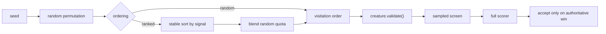

The default ordering changes only if benchmark evidence shows better
scorer-verified improvement economics. Until then `random` stays the default and
remains available as the control for every comparison.

## Cascade-aware structural saving

Cutting one hidden neuron strands structure on both sides of it. A neuron that
fed only the cut neuron now feeds nothing; a neuron the cut neuron was the only
source for now folds to a constant. The ablation already removes that structure
recursively **after** a candidate is built — `cascade-saving` asks how much it
would remove **before** any scorer time is spent on the candidate.

The dry run is topology only and never touches the incumbent: it indexes the
creature once, then applies the same two exact rules the cleanup applies until
nothing more is strandable.

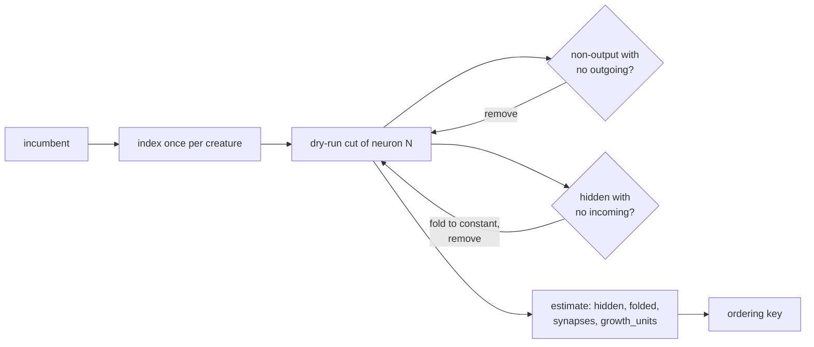

Both rules only ever remove structure, so the fixpoint does not depend on the
order they are applied in: the estimate for a creature and a cut is the same on
every run and under any listing order. Estimates are built once per creature and
reused for every candidate, so ranking a whole sweep costs one index and no
clone of the creature.

Structure the transform would refuse is predicted too. An aggregate or unknown
squash, an aggregate fold target and a typed edge each make the ablation fail
closed, so a cut the razor could never build is reported as saving nothing and
ranks last — it keeps its place in the sweep, because the constant substitution
may still propose a candidate for it.

`high-growth-saving` counts only the neuron and the synapses touching it, so a
neuron with many edges outranks a chain head with two — even when cutting the
chain head takes five neurons with it. `cascade-saving` sees the chain.
`cascade-risk-ratio` divides the downstream sensitivity
`mean_abs_activation × Σ abs(outgoing weight)` by the cascade saving, so a quiet
cut that removes a lot of structure is tried before a loud one that removes
little.

```bash
cargo run --release --example cascade_ordering_bench
```

On a synthetic creature of 2,000 lone hidden neurons and 200 five-neuron chains,
the first 200 visits are worth — scored by putting every visited neuron through
the real ablation and its recursive cleanup, not by the ranking key:

| `--ordering` | Growth units in 200 visits | Per visit |
|---|---|---|
| `random` | 543.8 | 2.72 |
| `high-growth-saving` | 260.0 | 1.30 |
| `cascade-saving` | 1120.0 | 5.60 |
| `cascade-risk-ratio` | 1120.0 | 5.60 |

Building the order is a once-per-sweep cost, and the dry run pays for itself
against the ranking it replaces: at 7,000 hidden neurons and 19,200 synapses,
`cascade-saving` builds its order in 184 ms against `high-growth-saving`'s
232 ms.

The estimate is a **prioritisation signal only**. It reasons about topology and
knows nothing of aggregate squashes, typed synapses or behaviour: a candidate it
ranks first can still be blocked when it is proposed, and can still lose. Only
the full-corpus scorer accepts a cut — so every accept journals what the dry-run
predicted beside what the accepted creature actually removed:

```json
{"record":"cascade","kind":"individual","cuts":1,"estimated_hidden":3,
 "estimated_synapses":4,"estimated_growth_units":3.4,"actual_hidden":3,
 "actual_synapses":4,"actual_growth_units":3.4}
```

`report` folds those records into `cascadeAccepts`,
`cascadeEstimatedGrowthUnits`, `cascadeActualGrowthUnits` and
`cascadeEstimateRatio`. A ratio below `1.0` means the accept removed less than
the dry run predicted — an exact IDENTITY collapse rewires an edge the topology
said would go, and a constant substitution keeps one — and a signal that drifts
from what the razor really removes is a signal to stop paying for. The record is
written on every accept, whatever ordering the run used, so the control runs
measure the predictor too.

## Downstream output sensitivity

A neuron can fire hard and still change nothing. The weights and topology
between it and the outputs may attenuate everything it produces, and activation
statistics cannot see that: they measure how loud a neuron is, not whether
anything downstream listens. `low-output-sensitivity` and `low-estimated-effect`
ask the second question 🪒

```text
importance(output) = 1
importance(N)      = Σ abs(weight(N → child)) × importance(child)

estimated_effect(N) = mean_abs_activation(N) × importance(N)
```

The estimate is topology only and never touches the incumbent. The creature is
indexed once, condensed into its strongly connected components, and importance
is propagated backwards from the outputs through those components in reverse
topological order — `O(neurons + synapses)` work per creature, no scorer calls,
and no clone of the creature.

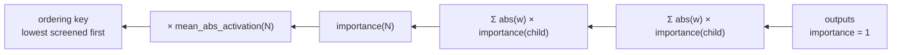

`low-outgoing-contribution` is the one-layer special case of the same idea:
`mean_abs_activation × Σ abs(outgoing weight)` is `estimated_effect` with every
child's importance pinned at `1`. It therefore sees a dead edge only where that
edge touches an output, while the backward propagation keeps multiplying all the
way to the score — the difference the benchmark below measures.

Recurrent and otherwise cyclic topology is handled **conservatively**. A cycle
has no first-order fixpoint a single backward pass can read, so every member of
a cyclic component takes the largest importance any member sends out of that
component: a loop is never ranked as dead wood merely because it could not be
resolved, and the answer does not depend on which member the walk entered by.
Outputs anchor the recursion at `1` and are never propagated through. A weight
product too large to represent, and a neuron the estimate does not cover, rank
**last** rather than first — missing importance data never removes a neuron from
the sweep.

```bash
cargo run --release --example sensitivity_ordering_bench
```

The benchmark builds a creature carrying exactly the failure mode above: 60
loud four-neuron chains whose last edge into the output carries weight zero,
beside 600 quiet neurons wired straight into an output with a heavy weight and
600 ordinary contributors. Every visited neuron goes through the real
`ablate_mean` and its recursive cleanup, and the candidate is judged by a
compiled forward pass over 64 fixed probes — **not** by the ranking key. A cut
is *confirmed* when the outputs are unchanged within `1e-6`.

| `--ordering` | Time to first confirmed cut | Confirmed cuts/hour | Growth units/hour | Calls per confirmed cut |
|---|---|---|---|---|
| `random` | 59.9 ms | 193,217 | 869,478 | 7.1 |
| `low-variance` | none in 150 visits | 0 | 0 | none |
| `low-mean-abs` | none in 150 visits | 0 | 0 | none |
| `low-outgoing-contribution` | 2.6 ms | 548,245 | 2,467,101 | 2.5 |
| `low-fan-out` | 59.1 ms | 193,526 | 870,869 | 7.1 |
| `high-growth-saving` | 59.7 ms | 192,526 | 866,369 | 7.1 |
| `low-output-sensitivity` | 2.6 ms | 1,319,931 | 5,939,688 | 1.0 |
| `low-estimated-effect` | 2.6 ms | 1,312,038 | 5,904,173 | 1.0 |

The per-hour figures are the rate of this harness, whose judge is a forward pass
rather than a full corpus; the number that carries across to a real run is
**calls per confirmed cut**, which is the scorer time an ordering spends per cut
it earns. The activation-only rankings screen the quiet neurons that matter and
confirm nothing at all in 150 visits. Building the order costs 1.2 ms against
`high-growth-saving`'s 8.0 ms on the same creature, so the ranking pays for
itself several times over before the first candidate is scored. Visits the razor
could propose nothing for are counted and printed as `blocked` — a ranking that
spends its budget on refusals must not read as one that spends nothing.

The fixture is a **designed best case** for this failure mode: its dead wood is
also its loudest structure, and there is more of it than the 150-visit budget,
so `1.0` calls per confirmed cut is what the ordering achieves when the creature
really does carry attenuated structure — not a figure to expect from an
arbitrary creature.

This is a **prioritisation heuristic only**. It is first-order and knows nothing
of squash saturation or behaviour, so every candidate it ranks first still faces
`creature.validate()`, the sampled screen and full authoritative scoring. The
proxy judge above is not the scorer, so these two orderings are **not** the
default: `random` stays the control until scorer-verified benchmark economics
from real runs beat it, measured with the `report` recipe below:

```bash
for o in random low-outgoing-contribution low-output-sensitivity low-estimated-effect; do
  neat_ai_ockham creature.json training/ --seed 42 --ordering "$o" \
    --output-dir "runs/$o"
  neat_ai_ockham report "runs/$o/experiments.jsonl"
done
```

`firstWinMs`, `cutsPerHour`, `growthUnitsSavedPerHour` and `fullCalls` against
`acceptedCuts` are the four measures to compare — the same four the benchmark
above reports against its proxy judge.

## Composite and learned priority

Each ordering above reads one signal. `composite` reads them together and ranks
by the economics the sweep is actually paid in:

```text
expected_pruning_value = P(the full scorer confirms the cut)
                       × ln(1 + expected growth-unit saving)
                       ÷ expected evaluation cost
```

- **`P`** is a transparent logistic of the signals in `features.rs` — quietness
  (`mean_abs`, variance), downstream sensitivity, fan-out, `IDENTITY` squash,
  topology depth, and what earlier corpus epochs learnt about the uuid.
- **the saving** is the cascade dry-run's growth units, entered as
  `ln(1 + units)`: a cut twice the size is not twice as likely to compound into
  cumulative improvement, so the cascade breaks ties between candidates of
  similar odds rather than overruling them.
- **the cost** is one sampled screen plus a full score at the fleet's promotion
  rate. It is charged at a *rate*, not per candidate: the ranking cannot predict
  which candidates the screen promotes — sampled false positives are exactly the
  ones no signal saw coming — and charging `P × full-score cost` instead makes a
  hopeless candidate look cheap, promoting precisely the cuts the scorer will not
  confirm. The benchmark below measured that form as worse on both economics.

`learned` is the same expression with `P` from a fitted model. The model is a
logistic regression over the same fifteen named features — fifteen coefficients
and a bias in a JSON file, readable by a human — fitted offline from Ockham's own
outcomes:

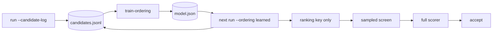

**The model only ranks.** It chooses what is tested sooner and nothing else:
every candidate it promotes still passes `creature.validate()`, the sampled
screen and full-corpus scoring, and only that scorer accepts a cut. No model,
weight or historical record can remove a neuron.

### Telemetry

`--candidate-log <path>` appends one self-describing JSON line per candidate the
run spent scorer time on — the feature vector the ranking saw, beside what the
scorer made of it:

```json
{"version":1,"unixSecs":1770000000,"host":"GRQ-23","corpusIdentity":"9f3c…",
 "creatureChecksum":"a3d4…","ordering":"composite","seed":42,"uuid":"h_a",
 "kind":"ablation","features":{"measured":1.0,"logMeanAbs":0.916,"…":0.0},
 "sampleDelta":0.31,"fullDelta":0.002,"outcome":"accepted",
 "growthUnitsRemoved":1.1,"scorerMs":804}
```

Written **after** a verdict and never read during one. A candidate the screen
threw out is logged too, with its sampled Δ and no full Δ: it is the only
evidence the ranker gets about what does *not* work. `kind` is always the
sweep's — `identity`, `ablation`, `constant` or `merge`. A `merge` row also
carries `mergedWith`, the survivor that absorbed the neuron.

Three exclusions, each for the same reason — a row must carry only what the
scorer actually said about that neuron:

- **replayed candidates are not logged.** A replay candidate is a uuid the
  learnings cache already called a winner, so its outcomes come from a
  population the ranking did not choose;
- **only individually scored uuids carry a `fullDelta`.** A uuid measured solely
  inside a bundle had no contribution of its own measured;
- **`growthUnitsRemoved` is non-zero only for an accepted individual.** A
  bundle's saving is shared structure no member removed alone, so it is
  attributed to none of them rather than counted once per member.

### Training

```bash
neat_ai_ockham train-ordering runs/*/candidates.jsonl --out model.json
neat_ai_ockham creature.json training/ --ordering learned --ordering-model model.json
```

`train-ordering` is offline, deterministic and reproducible: full-batch gradient
descent from a zero start, no RNG, and a holdout of every fifth row by position
— the same rows and hyper-parameters give the same model on every host. It
prints the fit's held-out ranking quality (`auc`, `accuracy`, `logLoss`), the
corpus identities the rows came from, and every coefficient by name. `--epochs`,
`--learning-rate`, `--l2`, `--holdout-every` and `--min-improvement` tune the
fit; `--holdout-every 0` evaluates on the training rows and says so rather than
presenting an optimistic number as a held-out one.

The model records the feature schema it was fitted on, and a model whose schema
differs from the running binary's is **refused at load** rather than read against
the wrong columns. `--ordering learned` without a model that loads stops the run
— a run that asked to be ranked by a model must not quietly rank by something
else.

Historical evidence is a **prior, not current truth**: verdicts from older corpus
epochs — and only older epochs — enter `P` as saturating `ln(1 + wins)` and
`ln(1 + failures)` terms that move a candidate earlier or later and can never
rule one in or out.

Every strategy keeps `--ordering-random-quota`, and a `learned` run reserves
`0.1` of its visits for the random control by default. A hand-written ranking is
a fixed function of the creature, so a neuron it buries is buried for a reason a
human can read; a fitted model learns from the outcomes of the candidates it
chose, so a uuid it ranks last is never tried, never logged and never gets to
change its own mind. Reserved exploration is what stops that loop closing — and
every strategy still visits every eligible neuron eventually.

### Benchmark

```bash
cargo run --release --example priority_ordering_bench
```

The benchmark simulates one budget per strategy against a declared ground truth,
the same screen and full-score costs, and the same creature — 2,250 hidden
neurons as 1,500 lone neurons and 150 five-neuron chains, with the loud neurons
carrying the heavy outgoing weights they earned. A quiet neuron is confirmable,
except that one in ten is not and one loud neuron in twenty is anyway: a ground
truth that *is* one of the ranking signals would score that signal against
itself. Growth units are what the real `ablate_mean` and its recursive cleanup
remove, not the ranking key. The budget is deliberately smaller than the sweep,
because an ordering only matters when the budget cannot reach everything:

| `--ordering` | Time to first cut | Confirmed cuts/hour | Growth units/hour | Missed winners |
|---|---:|---:|---:|---:|
| `random` | 0.9s | 3012 | 8044 | 59.6% |
| `low-variance` | 0.8s | 4212 | 11461 | 37.6% |
| `low-mean-abs` | 0.8s | 4212 | 11461 | 37.6% |
| `narrow-range` | 0.8s | 4212 | 11461 | 37.6% |
| `low-outgoing-contribution` | 0.8s | 4224 | 12612 | 37.4% |
| `low-fan-out` | 0.8s | 2928 | 12578 | 61.1% |
| `high-growth-saving` | 0.9s | 3000 | 3900 | 59.8% |
| `identity-first` | 0.9s | 3012 | 8044 | 59.6% |
| `cascade-saving` | 0.8s | 2928 | 12578 | 61.1% |
| `cascade-risk-ratio` | 0.8s | 4224 | 12612 | 37.4% |
| `composite` | 0.8s | 4128 | 12642 | 39.1% |
| `learned` | 0.8s | 4236 | 12628 | 37.1% |

Both new strategies beat the random control on every measure. `learned` — fitted
from 400 rows of a previous run's outcomes, held-out AUC 0.895 on 200 rows the
fit never saw — finds the most
confirmed cuts per hour and misses the fewest winners of any strategy;
`composite` removes the most growth units per hour, marginally ahead of
`cascade-risk-ratio`, while trailing it slightly on cuts. Order-building is a
once-per-sweep 29ms at this size, the same order as `cascade-risk-ratio`'s.

That is **not** a promotion. The simulated scorer's ground truth is quietness
plus noise, and quietness is a signal both new strategies read, so the harness
can show a ranking's discovery rate and cannot show whether a real scorer agrees.
`random` stays the default until real runs on a mature creature say otherwise:

```bash
for o in random cascade-risk-ratio composite; do
  neat_ai_ockham creature.json training/ --seed 42 --ordering "$o" \
    --candidate-log "runs/$o/candidates.jsonl" --output-dir "runs/$o"
  neat_ai_ockham report "runs/$o/experiments.jsonl"
done
```

`cutsPerHour`, `growthUnitsSavedPerHour` and `firstWinMs` are what to compare.

## Structural neighbourhood group cuts

Some dead wood is a branch, not a twig 🪒.

A hidden neuron is tested one at a time, and that is the right default — but a
chain, a leaf branch or a small low-importance subgraph can be collectively
redundant while **each** neuron in it is a poor approximation on its own.
`--group-cuts` proposes those neighbourhoods as single candidates (#108).

Three shapes are generated, from topology and the ranking signals Ockham
already builds — never from a brute-force search over neuron subsets:

- **chain** — `a → b → c`, where each link is the only way out of `a` and the
  only way into `b`, so nothing else reads the intermediate values;
- **branch** — a single-output tributary: a neuron with one outgoing synapse,
  grown upstream through predecessors that feed nothing but the group;
- **cluster** — a small connected subgraph grown from one neuron through hidden
  neighbours **no louder than the neuron it started from**. This is the shape
  that may leave through several edges, and therefore the one no single cut can
  stand in for.

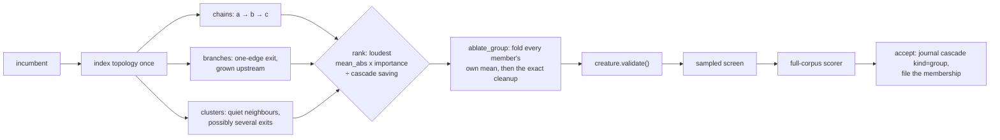

Groups are deliberately **bounded** (`--group-max-size`, 2–8 neurons) and
**capped** (`--group-proposals` per batch), because the number of connected
subgraphs grows combinatorially and a razor that spends its budget enumerating
them prunes nothing. Generation is deterministic: the walks follow the
creature's own listing order, and proposals are ranked by
`max(mean_abs × downstream importance) ÷ estimated growth units saved` with ties
broken on the member UUIDs. A proposal whose cascade removes exactly what a
larger proposal removes is dropped in favour of the larger one — otherwise every
two-neuron prefix of a chain outranks the chain, because it strands the same
tail with a quieter numerator. A membership already screened this run is passed
over and the search reaches further down the ranked list; an accept clears that
memory, because the incumbent those verdicts were measured against is gone.

Nothing about a group bypasses anything. It is built by the same mean
substitution applied member by member on one clone, followed by the same exact
cleanup; it must pass `creature.validate()`, the sampled screen and full-corpus
scoring; and only that scorer accepts it. What a group does **not** do is claim
screening coverage for its members, or a training row, or a place in the bundle
pool: a neighbourhood verdict is about the neighbourhood, and reading it as a
verdict on one of its neurons is the mistake this whole design avoids.

An accepted group files its **whole membership** on every member's learnings
record, so a later run rebuilds the plan it was:

```json
{"version":1,"uuid":"h_a","kind":"group","outcome":"accepted",
 "group":["h_a","h_b"],"host":"ockham-1","unixSecs":1764930000}
```

Replay uses it. Each member's own latest verdict may say the cut loses alone —
that is exactly why the group was proposed — so a group is replayed with the
group transform rather than as members applied one at a time. Applying a chain
member by member strands the rest of the chain in the cleanup cascade, the next
member is "already gone", and the plan would be dropped. A rejected group is
filed too, keyed on the membership, so a plan that has stopped paying stops
being replayed exactly as a single cut does. Group records are never read as
per-neuron evidence: they cannot replay a member alone, and they cannot suppress
one as a known failure. The membership is an additive optional field, so a
mixed-version fleet sharing one cache reads the record either way, and a group
is only replayed while **every** member is still on the creature.

### What a group is worth

```bash
cargo run --release --example neighbourhood_bench
```

On a synthetic creature of 1,161 neurons and 2,140 synapses — 500 lone neurons,
60 chains of four, 60 single-output tributaries and 60 two-exit webs — 300
bounded proposals are ranked in ~7 ms, and each is scored by what the **real**
transform removes, against the best single cut available in the same
neighbourhood:

| Shape | Proposals | Group units | Best single units | Group ÷ single |
|---|---:|---:|---:|---:|
| chain | 60 | 270.0 | 270.0 | 1.00x |
| branch | 120 | 360.0 | 360.0 | 1.00x |
| cluster | 120 | 444.0 | 228.0 | **1.95x** |
| all shapes | 300 | 1074.0 | 858.0 | 1.25x |

Those `1.00x` rows are the finding, not a disappointment. A chain and a
tributary each leave the creature through **one** edge, so cutting that exit
alone already strands the rest — and the arithmetic agrees exactly: the group
folds each member's own mean, but only the exit's mean ever reaches a surviving
neuron, which is precisely what the single cut folds. For those shapes a group
cut *is* the exit cut, written with more names.

A cluster can leave through several edges, and there no single cut stands in for
it: cutting either member leaves the other alive, because each survivor keeps
its own input. That is where the 1.95x comes from, and it is why the default
batch on this creature is filled with clusters.

Fidelity is a separate question from structure. On an off-centre three-neuron
chain over 401 inputs, the group cut is arithmetically identical to cutting the
chain's last neuron, and cutting the head is closer still:

| Transform | Mean abs Δoutput | Hidden removed |
|---|---:|---:|
| group cut | 0.429 | 3 |
| single cut of the head (`f0`) | 0.344 | 3 |
| single cut of the middle (`f1`) | 0.362 | 3 |
| single cut of the tail (`f2`) | 0.429 | 3 |

So the proposal may be clever; the scorer is still the judge. A run reports what
it actually bought:

```json
{"groupAccepts":3,"groupCutsAccepted":8,"groupHiddenRemoved":11,
 "groupSynapsesRemoved":19,"groupGrowthUnitsRemoved":12.9,
 "groupHiddenPerAccept":3.7,"groupSynapsesPerAccept":6.3,
 "groupGrowthUnitsPerAccept":4.3,"groupAcceptsPerHour":4.0,
 "groupGrowthUnitsRemovedPerHour":17.2}
```

`report` reads those off the `cascade` journal records an accept writes — the
same series that audits the cascade estimate — so `kind: "group"` accepts are
counted beside `individual` and `bundle` ones rather than in a series of their
own. A control run without `--group-cuts` reports `groupAccepts: 0` and every derived
figure as `null` rather than as a rate it never measured, which is what makes the
comparison a comparison.

## Outputs

| Path | Purpose |
|---|---|
| `best.json` | Best authoritative local Ockham result found during the run. |
| `experiments.jsonl` | Append-only experiment journal. |
| `exact-cleanup.json` | What the exact cleanup pre-pass removed and why — written whenever the pass ran, because "already canonical" is a finding too. Absent under `--no-exact-cleanup`; see [The exact cleanup pre-pass](#the-exact-cleanup-pre-pass). |
| `coverage.txt` | Screening-coverage block for the GRQ commit description. Written only with `--learnings-dir`. |
| `coverage.json` | The same coverage figures as JSON. Written only with `--learnings-dir`. |
| `winners/` | Accepted intermediate Ockham incumbents. |
| `workspace/` | Isolated run state, baseline and statistics caches. |
| `population-candidate.json` | Written only after beating the supplied current global champion. |

`best.json` remains useful even when the moving frontier has already passed it;
it records a genuine pruning result against its own lineage. It is not presented
as population-ready unless the fresh frontier comparison also succeeds.

## Reporting

```bash
neat_ai_ockham report path/to/experiments.jsonl
```

The report focuses on the experiment Ockham actually cares about: whether many
small verified cuts compound into useful improvement. Journals preserve per-step
and cumulative scorer deltas, accepted pruning steps, timing and structural
changes.

Useful measures include:

- the named `ordering` and its random quota, so runs are comparable;
- cumulative scorer improvement from the opening parent;
- distribution of individual accepted win sizes (`acceptedCutSizes`);
- time to the first authoritative local winner (`firstWinMs`);
- candidates screened before that first win (`candidatesBeforeFirstWin`);
- authoritative local accepts per hour (`acceptsPerHour`);
- confirmed cuts and growth units removed per hour (`cutsPerHour`,
  `growthUnitsSavedPerHour`) — the two economics an ordering is judged on;
- estimated versus actual cascade saving across accepted cuts
  (`cascadeAccepts`, `cascadeEstimatedGrowthUnits`,
  `cascadeActualGrowthUnits`, `cascadeEstimateRatio`);
- sample and full scorer calls consumed (`screenCalls`, `fullCalls`);
- progressive screening economics (`screenStageCalls`, `screenStageRecords`,
  `screenStageRejected`) — all `0` on a fixed-rate control run, which journals
  no stage records; see [Progressive screening](#progressive-screening);
- screen-coverage records filed (`screened`);
- sweeps rebuilt after reaching 100% of the hidden neurons (`sweepRestarts`);
- screening coverage of the incumbent — every figure of the commit-description
  block (`hidden`, `tagged`, `checkable`, `checked`, `unchecked`, `cut`,
  `coveragePercent`);
- growth-cost reduction (`growthUnitsSaved`);
- structure the exact pre-pass removed before the first statistical screen
  (`exactCleanupHiddenRemoved`, `exactCleanupSynapsesRemoved`,
  `exactCleanupGrowthUnitsSaved`, `exactCleanupMs`) — all `0` under
  `--no-exact-cleanup`, and all bought with no scorer call of their own;
- neurons and synapses removed;
- sampled-screen false positives;
- individual versus bundled winners;
- population headroom when a global-champion comparison was performed.

To compare an ordering against the control, run both on the same creature,
scorer configuration, seed and wall-clock budget, then report each journal:

```bash
neat_ai_ockham creature.json training/ --seed 42 --ordering random \
  --output-dir runs/control
neat_ai_ockham creature.json training/ --seed 42 --ordering low-variance \
  --output-dir runs/low-variance
neat_ai_ockham report runs/control/experiments.jsonl
neat_ai_ockham report runs/low-variance/experiments.jsonl
```

The same recipe benchmarks the cascade orderings against the edge-count ranking
they replace. `cutsPerHour` and `growthUnitsSavedPerHour` are what to compare:

```bash
for o in random high-growth-saving cascade-saving cascade-risk-ratio; do
  neat_ai_ockham creature.json training/ --seed 42 --ordering "$o" \
    --output-dir "runs/$o"
  neat_ai_ockham report "runs/$o/experiments.jsonl"
done
```

## Safety invariants

1. The supplied creature is never modified in place.
2. Version 1 accepts forward-only creatures only.
3. Every candidate starts from a known authoritative incumbent clone.
4. Every completed structural candidate must pass `creature.validate()`.
5. Unknown activation/synapse/aggregate semantics are skipped, never guessed.
6. Mean-activation substitution is explicitly approximate.
7. Sample scoring can screen candidates but cannot accept them.
8. Only full-corpus NEAT-AI-scorer results may replace the Ockham incumbent.
9. Scorer failure means no winner; Ockham fails closed.
10. Activation statistics are recomputed after an accepted topology change.
11. Bundle deltas are never assumed additive.
12. A local Ockham win and a current-global-frontier win are reported separately.
13. `best.json` may never be worse than the opening authoritative baseline.
14. A local Ockham winner is not automatically population-ready.

## Related repositories

- [NEAT-AI](https://github.com/stSoftwareAU/NEAT-AI) — evolutionary neural-network library and trainer.
- [NEAT-AI-core](https://github.com/stSoftwareAU/NEAT-AI-core) — canonical Rust creature/network implementation.
- [NEAT-AI-scorer](https://github.com/stSoftwareAU/NEAT-AI-scorer) — authoritative scorer used by Ockham.
- [NEAT-AI-Forests](https://github.com/stSoftwareAU/NEAT-AI-Forests) — experimental search for useful structure to add.
- [NEAT-AI-Lamarck](https://github.com/stSoftwareAU/NEAT-AI-Lamarck) — experimental acquired-information optimisation.

## Development

The project is pure Rust and expects sibling clones of `NEAT-AI-core` and
`NEAT-AI-scorer` where required by the local development setup.

```bash
./quality.sh < /dev/null
```

See [CONTRIBUTING.md](CONTRIBUTING.md) for the local and CI quality gates.
Ockham commit messages use the **🪒** prefix.

## Version-1 constraints

- **Pure Rust.**
- **Forward-only creatures only.** Recurrent/self-connected networks are out of
  scope initially.
- **The supplied creature is immutable.** Every candidate starts from a clone of
  a scorer-verified incumbent.
- **The full scorer is king.** Highest full-corpus score wins locally.
- **45-minute default run budget.** The global champion is perishable while
  normal evolution and Forests continue elsewhere.

## Repository layout

```text
NEAT-AI-Ockham/
├── Cargo.toml                 # workspace
├── ockham/
│   ├── Cargo.toml
│   └── src/
│       ├── main.rs            # CLI
│       ├── lib.rs
│       ├── config.rs          # flags and defaults
│       ├── scorer.rs          # external rust_scorer judge
│       ├── incumbent.rs       # immutable forward-only load + checksum
│       ├── corpus.rs          # training-data identity / streaming
│       ├── baseline.rs        # full-corpus scorer baseline
│       ├── stats.rs           # hidden-neuron activation statistics
│       ├── ablation.rs        # mean-activation ablation + cleanup
│       ├── collapse.rs        # exact IDENTITY neuron collapse
│       ├── canonical.rs       # exact zero-risk cleanup pre-pass
│       ├── substitute.rs      # mean-valued constant substitution
│       ├── signature.rs       # behavioural signatures + correlated-pair discovery
│       ├── merge.rs           # correlated-neuron merging
│       ├── blocked.rs         # blocked-reason codes + per-epoch breakdown
│       ├── sweep.rs           # seeded random sweep + 5% screen
│       ├── screening.rs       # progressive adaptive screening ladder
│       ├── promote.rs         # full-score winners + bundles
│       ├── journal.rs         # experiments.jsonl
│       ├── reentry.rs         # population re-entry vs global champion
│       ├── report.rs          # experiments.jsonl summary
│       ├── tags.rs            # GRQ-sampler creature/neuron tag sidecar
│       ├── learnings.rs       # fleet prune-verdict cache + screen coverage
│       ├── coverage.rs       # checked/total/percent + coverage.txt / coverage.json
│       ├── ordering.rs        # named candidate ordering strategies
│       ├── cascade.rs         # topology-only cascade dry-run for ordering
│       ├── sensitivity.rs     # backward output-sensitivity estimate for ordering
│       ├── features.rs        # per-candidate feature vectors for ranking
│       ├── priority.rs        # composite expected-pruning-value ranking
│       ├── model.rs           # learned logistic ranker (ranking only)
│       ├── neighbourhood.rs   # bounded chain/branch group-cut proposals
│       ├── telemetry.rs       # candidate feature/outcome training rows
│       ├── fixtures.rs
│       ├── run.rs
│       ├── log.rs
│       └── cancel.rs
├── docs/
│   ├── grq-integration.md   # audit: how GRQ invokes Ockham and reads it back
│   ├── blocked-reasons.md   # blocked codes, and the path built for the largest
│   └── population-entry.md  # how cuts actually enter the live population
├── quality.sh
├── rust-toolchain.toml
└── neat-core.expected-version
```

[docs/grq-integration.md](docs/grq-integration.md) is the checked-in audit of
the integration itself: the invocation path, every flag GRQ passes, how the
shared learnings cache is mounted, the check-in gates, where the commit subject
and description come from, and the table of Ockham surfaces GRQ reads — which is
what makes them load-bearing.

## Implementation roadmap

Shipped through the iterative loop, re-entry comparison, report command, GRQ
check-in tags, learnings replay, and named candidate orderings
(#1–#11, #23, #25–#27). Tagged neurons were exempt from screening under #26;
issue #63 reversed that, so neuron tags no longer keep a hidden neuron out
of the prune pool.

Correlated-neuron merging landed under #109: behavioural signatures, LSH
bucketing and the survivor-compensated cut, off by default behind
`--merge-correlation`.

Two experiments are now the work. First, ordering: run each named strategy
against the seeded random control on a mature creature and let the report decide
whether any of them earns the default. Second, merging: run a mature creature
with and without `--merge-correlation` and let the confirmed-removals-per-hour
figures decide whether the extra screen slots it spends are earning their keep.

## What success looks like

The useful metric is not simply how many neurons Ockham deletes. It is:

> **whether those structural cuts are adopted into the general population
> evolving independently on other machines.**

A local `best.json` that never checks in is a private notebook. A prune that
lands in `samples/*.json` (and then in non-Ockham offspring) is the proof. Small
cost-of-growth wins have to be published quickly or Forests supersedes them.

If nothing can be removed profitably, that is also useful evidence about how
efficiently evolution is already using its structure.
