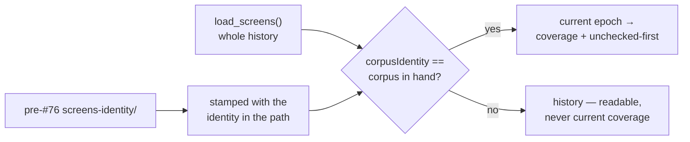

# Reset screening coverage when the training corpus changes (#100)

## Summary

Screening coverage is now authoritative only for the corpus it was measured
against. Every run reads the whole screen history and counts the records filed
under the corpus in front of it; extending the training corpus therefore opens a
fresh screening epoch at `0 / current_hidden_count`, with every hidden neuron —
screened winner, screened loser, `blocked` and `known-failure` alike — eligible
to be visited again. `checked X/X (100%)` reads as *100% of this corpus epoch*,
never as permanent completion. Closes #100.

Nothing is deleted. The epoch is **selected**, not cleared, so:

- a repacked corpus with identical authoritative content hashes to the same
  identity and keeps its coverage (the case #76 was really about);
- a host that returns to an identity it screened before finds that epoch intact,
  which matters because the fleet sits on several live identities at once;
- pre-#76 `screens-<identity>/` records — whose identity lived in the directory
  name — are stamped with it as they are read, so that history lands in the
  epoch it was measured against rather than in none at all.

The corpus identity is the existing content fingerprint (`corpus::corpus_info`:
widths, file names, sizes, head and tail bytes); no new identity scheme was
invented. `coverage.json` and the journal `coverage` record now carry
`corpusIdentity`, and the GRQ commit-description block gains an `epoch:` line.
Both new serde fields are optional and skipped when absent, so a mixed-version
fleet reads artefacts in both directions.

### Deliberate reversal of part of #76, stated plainly

Issue #76 made screen coverage survive a corpus change; #100 says it survives as
a *record* but not as *authority*. On a host whose corpus genuinely changes
between runs, every run now opens at `0 / hidden`. That is affordable because
the corpus turns over in days — the evidence in #100 is four identities across
six days — and the README records the symptom to watch for
(`screens: 0 of N record(s) … are current-epoch coverage` every run) should that
ever stop being true.

## Evidence

Backend/CLI change with no web interface, so no screenshot applies. The evidence
is the test suite and the local gate.

`./quality.sh < /dev/null` passes in full: shellcheck, neat-core version gate,
codespell, markdownlint-cli2, actionlint, cargo-deny, `cargo fmt --check`,
clippy with `-D warnings -D clippy::filter_next -D clippy::collapsible_if`,
`cargo test --workspace --all-features` (283 lib tests + integration suites, 0
failures) and rustdoc with `-D warnings`.

The behaviour is asserted end to end through `establish_run`, not only at unit
level: `an_extended_corpus_starts_a_new_epoch_and_keeps_the_old_records` runs
Ockham twice over one learnings root and reads the `coverage.json` each run
wrote — `checked: 2` then `checked: 2` again under the extended corpus, with both
epochs present in the store and the same UUIDs re-visited.

## Acceptance Criteria

<!-- vibe-spec-review inputs="diff+issue-body" -->

- **met** — With an unchanged corpus, restarting Ockham preserves current-epoch
  coverage — evidence:
  `ockham/src/run.rs::two_successive_runs_advance_the_checked_count_by_the_batch_size`
  (two runs, one corpus, `checked` 2 → 3) and
  `ockham/src/run.rs::a_repacked_corpus_with_identical_content_keeps_its_coverage`
  — reviewer: partial — reason: the reviewer found the one real hole in this
  criterion — pre-#76 legacy records name no corpus of their own and were being
  dropped from every epoch, so a host that had not run since #76 would re-screen
  under an unchanged corpus. Fixed in commit 2 (`stamp_legacy_identity`,
  `ockham/src/learnings.rs`), covered by
  `a_legacy_record_lands_in_the_epoch_its_directory_named`.
- **met** — Extending or otherwise changing the corpus starts a new epoch and
  reports fresh coverage from zero — evidence:
  `ockham/src/run.rs::an_extended_corpus_starts_a_new_epoch_and_keeps_the_old_records`
  and `ockham/src/coverage.rs::a_corpus_change_opens_a_new_epoch_at_zero_coverage`
  — reviewer: met
- **met** — Old screen records remain readable and distinguishable from the new
  epoch — evidence:
  `ockham/src/learnings.rs::screens_survive_a_corpus_identity_change` and the
  `screens_by_epoch` grouping in
  `ockham/src/run.rs::an_extended_corpus_starts_a_new_epoch_and_keeps_the_old_records`
  — reviewer: met
- **met** — A neuron previously marked blocked or failed is eligible for
  reconsideration in the new epoch — evidence:
  `ockham/src/run.rs::a_blocked_or_failed_neuron_is_eligible_again_in_the_new_epoch`
  — reviewer: met
- **met** — Tests cover unchanged corpus, changed corpus, and historical-record
  retention — evidence: the four tests above plus
  `ockham/src/learnings.rs::the_current_epoch_is_the_records_filed_under_this_corpus`
  and `returning_to_an_earlier_corpus_finds_that_epoch_intact` — reviewer: met
- **unrequested** — an `epoch:` line in the rendered commit-description block
  (`ockham/src/coverage.rs`) — reviewer: unrequested — reason: the issue asks for
  persistence only, but the block is the human-facing surface where `100%` is
  misread as "Ockham is done", which is the issue's stated Principle. It is
  appended after `progress:` and omitted when the report names no epoch, so no
  existing line moves.
- **unrequested** — `LearningsStore::corpus_identity()` accessor
  (`ockham/src/learnings.rs`) — reviewer: unrequested — reason: a two-line getter
  beside the existing `corpus_dir()` / `host_path()`; it lets the test fixtures
  file seeded records under the store's own epoch instead of hard-coding an
  identity that the epoch filter would then discard.
- **unrequested** — `corpusIdentity` on the journal `coverage` record
  (`ockham/src/journal.rs`) — reviewer: unrequested — reason: traceable to
  "persist that corpus identity alongside coverage records"; `report` needs no
  change to consume it, because it reports the latest snapshot, which is the
  current epoch's by construction.

## Standards Review

<!-- vibe-standards-review inputs="diff+CODING-STANDARDS.md" -->

The repo has no `CODING-STANDARDS.md`; the reviewer was given `CONTRIBUTING.md`,
the README conventions and the project-wide rules (Australian English, real
tests, fail loudly, serde back-compat, documented public items).

- **violation** — no crate version bump for a binary-affecting change
  (CONTRIBUTING "Principles every change must keep" #8) — evidence:
  `ockham/Cargo.toml:3` — reason: fixed here, `0.1.36` → `0.1.37`, with
  `Cargo.lock` updated to match.
- **violation** — `docs/grq-integration.md` still described the pre-#100
  contract, contradicting the rewritten README — evidence:
  `docs/grq-integration.md:281` — reason: fixed here; the section now states the
  epoch semantics, and the artefact table records the `epoch:` line and the
  `corpusIdentity` key.
- **violation** — the README claimed #76's fix was left intact without saying
  what the authority half costs under GRQ's corpus regeneration — evidence:
  `README.md:453` — reason: fixed here; the section now states the cost, the
  evidence it rests on, and the symptom that would mean the epoch is the wrong
  scope.
- **violation** — documented behaviour that cannot occur: `corpus_identity` is
  "`None` on a run with no screen store", but the report is only ever built
  inside `if store.is_some()` — evidence: `ockham/src/coverage.rs:350` and
  `README.md:676` — reason: fixed here; both now say the epoch is absent only
  from a `CoverageReport::new` report or a pre-#100 artefact.
- **violation** — commit subject missing the documented 🪒 prefix — evidence:
  commit `8034f92` — reason: the follow-up commit `379046f` carries it; the first
  commit was already pushed history at that point and CONTRIBUTING explicitly
  forbids rejecting otherwise valid commits over the emoji.
- **clean** — serde back-compat (both new fields `Option` + `default` +
  `skip_serializing_if`, round-trip and pre-#100 deserialisation asserted with
  real `serde_json` calls); Australian English throughout; every new public item
  documented and rustdoc clean under `-D warnings`; tests call real functions and
  assert on returned values or written files, with no source-text grepping; the
  epoch filter logs what it dropped rather than silently narrowing coverage; no
  unrequested refactor — dropping `Copy` from `CoverageReport` is forced by the
  new `String` field and `Coverage` itself is still `Copy`; no hidden or secret
  paths staged.

## Test Plan

Added:

- `ockham/src/learnings.rs::the_current_epoch_is_the_records_filed_under_this_corpus`
- `ockham/src/learnings.rs::returning_to_an_earlier_corpus_finds_that_epoch_intact`
- `ockham/src/learnings.rs::records_a_store_files_belong_to_the_epoch_it_reads`
- `ockham/src/learnings.rs::a_legacy_record_lands_in_the_epoch_its_directory_named`
- `ockham/src/learnings.rs::stamping_never_overwrites_an_identity_or_invents_one`
- `ockham/src/coverage.rs::a_corpus_change_opens_a_new_epoch_at_zero_coverage`
- `ockham/src/coverage.rs::the_artefacts_name_the_corpus_epoch_the_figures_belong_to`
- `ockham/src/coverage.rs::a_report_with_no_epoch_renders_and_writes_exactly_as_before`
- `ockham/src/run.rs::a_repacked_corpus_with_identical_content_keeps_its_coverage`
- `ockham/src/run.rs::an_extended_corpus_starts_a_new_epoch_and_keeps_the_old_records`
- `ockham/src/run.rs::a_blocked_or_failed_neuron_is_eligible_again_in_the_new_epoch`

Modified (business-logic change, documented rather than silent):

- `ockham/src/run.rs::a_second_run_against_a_regenerated_corpus_advances_fleet_coverage`
  **replaced** by the two tests above. It asserted that a corpus whose *content*
  differed still accumulated coverage — the exact behaviour #100 reverses. Its
  surviving intent, that a regenerated-but-identical corpus keeps its coverage,
  is now asserted by `a_repacked_corpus_with_identical_content_keeps_its_coverage`,
  which also checks the two identities are genuinely equal.
- `ockham/src/learnings.rs::screens_survive_a_corpus_identity_change` — still
  asserts the record survives a corpus change, and now also asserts it is history
  under the new corpus and current-epoch coverage again under its own.
- `ockham/src/learnings.rs::legacy_corpus_keyed_screens_still_count_as_checked` —
  the legacy record now carries the identity recovered from its directory name
  rather than `None`.
- `ockham/src/run.rs::seed_screens` and the fully-screened restart fixture — file
  seeded records under the store's own corpus identity, since a fixture naming
  another corpus is history and seeds no coverage.
- `ockham/src/report.rs` — four `Event::Coverage` literals gained the new field;
  the production match already used `..`.

No test was removed or commented out.
