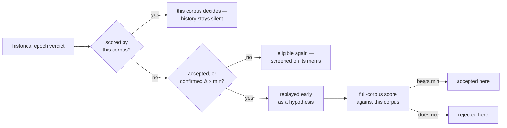

# Reuse historical Ockham learnings across screening epochs

## Summary

A corpus epoch change reset coverage (#100) but left the fleet's earlier
learnings sitting unread as anything but an ordering hint. This change makes
them **evidence**: every historical verdict is loaded with the corpus epoch that
established it, previous winners are replayed early as hypotheses, and the
current corpus's scorer remains the only thing that may accept a cut.
Closes #101.

- `LearningsStore::load_prior_corpora` now returns `HistoricalLearning` — the
  verdict plus the epoch identity its `corpus-<identity>/` directory names — so
  no learning loses its provenance when a corpus changes.
- `historical_replay` turns those records into replay hypotheses: previous
  winners still on the incumbent, ranked behind this corpus's own confirmed
  wins, and excluded once this corpus has judged the uuid itself.
- The replay stage in `run.rs` re-scores every one of them against the current
  training data before anything is applied, and files the result as *this*
  corpus's verdict.
- `history_epochs` summarises what each epoch taught, logged per run, so a
  corpus change reads as evidence gained rather than evidence lost.
- Historical failures and blocked visits are unchanged in effect: they suppress
  nothing and count as no current coverage.



## Evidence

Backend/CLI change with no web interface, so there is no screenshot to capture.
The evidence is the test suite and the full gate.

- `./quality.sh` passes end to end: shellcheck, neat-core version gate,
  codespell, markdownlint-cli2, actionlint, `cargo deny check`, `cargo fmt
  --check`, clippy with `-D warnings`, 330 tests, and `cargo doc` with
  `RUSTDOCFLAGS="-D warnings"`.
- The two end-to-end replay tests were confirmed **red** against the unfixed
  behaviour: with the historical hypotheses removed from the replay stage,
  `a_historical_winner_is_replayed_and_the_current_corpus_accepts_it` and
  `a_historical_winner_the_current_corpus_rejects_is_not_cut` both fail; with
  the change they pass.
- Run log of a seeded fixture run, showing the epoch attribution and the replay
  provenance:

```text
prior corpora: 1 verdict(s) from /tmp/…/learnings across 1 historical epoch(s),
  read as priority and replay hypotheses
  history: corpus an-older-corpus — 1 verdict(s)
replay: combining 1 of 1 known win(s) still on incumbent (0 applied elsewhere,
  0 confirmed only, 1 from older corpus epochs — re-scored here)
```

## Acceptance Criteria

<!-- vibe-spec-review inputs="diff+issue-body" -->

- **met** — Starting a new corpus epoch does not erase the learnings cache —
  evidence: `ockham/src/learnings.rs::a_new_corpus_epoch_keeps_the_learnings_it_inherited`
  — reviewer: met
- **met** — Previously confirmed cuts can be replayed against the new corpus —
  evidence: `ockham/src/learnings.rs::historical_replay` wired at
  `ockham/src/run.rs` replay stage, test
  `ockham/src/run.rs::a_historical_winner_is_replayed_and_the_current_corpus_accepts_it`
  — reviewer: partial — reason: the reviewer noted the channel is gated on
  `--old-corpus-first` and that a uuid this corpus has already judged is not
  re-proposed by history. Both are deliberate — the flag is the existing
  historical-evidence switch and a current-corpus verdict is authoritative by
  the issue's own principle — so the criterion is met as stated, with the
  narrowing documented in the README.
- **met** — A historical failure cannot cause a current-epoch neuron visit to be
  skipped solely because it failed in an older epoch — evidence:
  `ockham/src/learnings.rs::a_historical_failure_leaves_the_uuid_eligible_again`
  and `ockham/src/run.rs::a_historical_failure_is_replayed_by_nothing_and_suppresses_nothing`
  — reviewer: met
- **met** — Current acceptance always requires a current-corpus scorer result —
  evidence: `ockham/src/run.rs::a_historical_winner_the_current_corpus_rejects_is_not_cut`
  and `ockham/src/run.rs::a_bundled_historical_hypothesis_is_measured_against_this_corpus`
  — reviewer: partial — reason: the reviewer observed that a hypothesis inside a
  winning *bundle* is accepted on the bundle's current-corpus score rather than
  an individual one. That is a current-corpus scorer result, and it is how
  replay has always treated this corpus's own confirmed wins (#57); the added
  bundled test shows the miss path measures each member individually here.
- **met** — Tests demonstrate a historical failure becoming eligible again and a
  historical winner being replayed then accepted/rejected by the new corpus —
  evidence: the three `run.rs` tests named above, the accept and reject halves
  confirmed red before the fix — reviewer: met
- **met** — Previous blocked/unproposable status must not count as current
  coverage and should be revisited — evidence: `current_epoch_screens` (#100),
  covered by `ockham/src/run.rs::a_blocked_or_failed_neuron_is_eligible_again_in_the_new_epoch`
  — reviewer: missing — reason: the reviewer is right that this diff adds no
  code for it; the behaviour already landed in #100 and the pre-existing test
  named above is the evidence, so nothing was needed here.
- **unrequested** — `history_epochs` plus the per-epoch log lines — reviewer:
  unrequested — reason: the issue asks that evidence be marked with its epoch
  and retained "for longitudinal reporting"; this is the surface that makes the
  marking observable, and it is nine lines.
- **unrequested** — the replay log line now counts historical members separately
  — reviewer: unrequested — reason: without it an operator cannot tell which
  replayed cuts came from history, which is the one new behaviour in the stage.

## Standards Review

<!-- vibe-standards-review inputs="diff+CODING-STANDARDS.md" -->

The repository has no `CODING-STANDARDS.md`; the reviewer was given the
project's engineering standards verbatim plus `CONTRIBUTING.md` and the README
conventions.

- **violation** — a code change owes a docs change: `docs/grq-integration.md`
  still said nothing from another corpus can "suppress, replay or accept a cut"
  — evidence: `docs/grq-integration.md:134` — reason: fixed in this diff, along
  with the replay description in `docs/population-entry.md:46`.
- **violation** — `CONTRIBUTING.md` #8 requires a `ockham/Cargo.toml` version
  bump for binary-affecting changes — evidence: `ockham/Cargo.toml:3` — reason:
  bumped to `0.1.38` with the lockfile in this diff.
- **violation** — never fail silently: the prior-corpus load warning named only
  the lost priority, not the lost replay hypotheses — evidence:
  `ockham/src/run.rs:685` — reason: the warning now names both.
- **violation** — rustdoc claimed `history_epochs` returns "oldest name first"
  while the implementation orders by content-hash identity — evidence:
  `ockham/src/learnings.rs:916` — reason: the doc now states identity order and
  why age is not available.
- **violation** — an undocumented silent fallback in `stamp_epoch` for a path
  with no final component — evidence: `ockham/src/learnings.rs:541` — reason:
  documented, and it is unreachable through `other_corpus_dirs`.
- **clean** — Australian English throughout; tests drive real functions and full
  runs rather than inspecting source text; every new public function has happy,
  error and edge cases; the one modified existing test documents why in its own
  doc comment and no test was removed or commented out; no wall-clock
  thresholds; no error swallowed in the new load path; no hidden files staged;
  no new input-parsing or injection surface; scope confined to the issue's path.

## Test Plan

Added in `ockham/src/learnings.rs`:

- `a_new_corpus_epoch_keeps_the_learnings_it_inherited` — a fresh epoch opens
  with no verdicts of its own and inherits both older epochs' records, each
  still attributed.
- `a_historical_failure_leaves_the_uuid_eligible_again` — an old failure
  suppresses nothing, earns no priority and is no replay hypothesis.
- `historical_winners_are_replayed_best_evidence_first` — applied cuts outrank
  confirmed-only ones; a departed uuid is dropped.
- `a_verdict_from_this_corpus_settles_what_history_only_suggests` — a
  current-corpus verdict stops history re-proposing the uuid.
- `one_epoch_rejecting_does_not_withdraw_another_epoch_s_hypothesis`
- `the_epoch_summary_counts_the_verdicts_each_corpus_established`
- `stamping_an_epoch_takes_the_identity_from_the_directory_name`

Added in `ockham/src/run.rs` (end-to-end runs against a scripted scorer):

- `a_historical_winner_is_replayed_and_the_current_corpus_accepts_it`
- `a_historical_winner_the_current_corpus_rejects_is_not_cut`
- `a_bundled_historical_hypothesis_is_measured_against_this_corpus`
- `a_historical_failure_is_replayed_by_nothing_and_suppresses_nothing`
- `old_corpus_first_off_replays_no_history`

Modified, with the reason documented in the test's own doc comment:

- `an_old_corpus_win_is_screened_before_neurons_with_no_history` — the run now
  has a replay stage in front of the sweep, so the budget is two experiments and
  the assertion is "the first uuid visited" rather than "the one uuid screened".
  The ordering claim it guards is unchanged.
