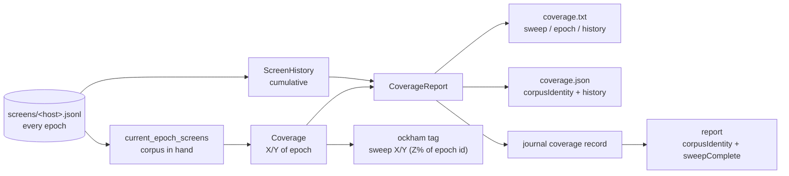

# Epoch-aware coverage and check-in reporting (Issue #102)

## Summary

Every coverage figure Ockham publishes now says what it is a percentage **of**:
the current screening epoch. `checked 7284 of 7284 hidden (100.0%)` read as
"Ockham has finished"; the corpus is extended every few days, so that reading
was false by the next run. Closes #102.

- **Wording** — `Coverage::summary` renders
  `sweep 1204/5013 checked (24.0% of epoch), 7 cut`, and the `coverage.txt`
  block leads with `sweep:     1204 of 5013 hidden (24.0% of epoch)`.
- **Epoch identity** — the `epoch:` line moved directly under the percentage it
  qualifies and carries the corpus fingerprint in compact `short_epoch` form
  (`corpus 6fc028da`). `coverage.json` and the journal `coverage` record keep
  the full identity, so a reset stays diagnosable exactly.
- **A finished sweep is a finished sweep** — `unchecked:` reads
  `0 remaining — sweep complete for this epoch`, never "Ockham complete". A
  creature with no hidden neurons reads `0 remaining — no hidden neurons to
  sweep`: nothing was swept, so nothing finished.
- **Check-in subject** — the `ockham` tag clause is
  `· sweep 1204/5013 (24.0% of epoch 6fc028da)`: 41 characters against the old
  clause's 25, and still one skimmable line under 160 characters.
- **Cumulative reporting, kept separate** — a new `history:` line and additive
  `history` JSON object report how many of the current hidden neurons the fleet
  has ever checked, across how many corpus epochs. Built from the **unfiltered**
  screen load, so it survives the epoch reset; never folded into the
  current-epoch percentage. Both halves are scoped to the creature in hand, so
  the line cannot read `0 ever checked across 7 corpus epochs`.
- **`report`** — carries `corpusIdentity` and `sweepComplete` beside
  `coveragePercent`, so a `100.0` read out of a journal is readable as "100% of
  that corpus".



## Evidence

Backend/CLI only — there is no web interface to screenshot. The evidence is the
rendered artefacts, asserted verbatim by the tests below, plus the full gate:
the gate passes (shellcheck, markdownlint, actionlint, cargo-deny, fmt, clippy
`-D warnings`, 307 lib tests + 35 integration tests, rustdoc `-D warnings`).
`codespell` cannot be installed in this container — it has no `pip`, `pipx` or
`brew` — so that one stage was not run locally; CI runs it on every push and its
Spell Check job is green on this branch.

Rebased onto `Develop` after #113 (Issue #101) landed. Two conflicts, both
textual: the README bullet — kept #101's "inherits every previous epoch's
learnings" clause alongside the new epoch-scoped wording — and the
`ockham_loop` local declarations, where the new `screen_history` index now sits
beside #101's `prior_records: Vec<HistoricalLearning>`. Crate version re-bumped
to `0.1.39`, since #101 had taken `0.1.38`.

The block a completed sweep now publishes, from
`run::tests::a_finished_sweep_then_a_corpus_change_publishes_fresh_epoch_coverage`:

```text
🪒 Ockham neuron screening coverage
sweep:     4 of 4 hidden (100.0% of epoch)
epoch:     corpus 6f709b1c — coverage counts this corpus only
cut:       0 this run
unchecked: 0 remaining — sweep complete for this epoch
progress:  4 newly checked this run
history:   4 of 4 ever checked across 1 corpus epoch
```

…and the same creature after GRQ extends the training data:

```text
🪒 Ockham neuron screening coverage
sweep:     2 of 4 hidden (50.0% of epoch)
epoch:     corpus 27477312 — coverage counts this corpus only
cut:       0 this run
unchecked: 2 remaining this epoch (~1 run at 2/run)
progress:  2 newly checked this run
history:   4 of 4 ever checked across 2 corpus epochs
```

## Acceptance Criteria

<!-- vibe-spec-review inputs="diff+issue-body" -->

- **met** — `coverage.json` exposes the current epoch/corpus identity — evidence:
  `ockham/src/coverage.rs::coverage::tests::the_artefacts_name_the_corpus_epoch_the_figures_belong_to`
  — reviewer: met
- **met** — `coverage.txt`, `report` and the GRQ check-in text make the epoch
  scope clear — evidence:
  `ockham/src/coverage.rs::coverage::tests::a_finished_sweep_is_reported_as_a_complete_sweep_never_a_finished_ockham`,
  `ockham/src/report.rs::report::tests::the_report_names_the_epoch_and_whether_that_sweep_finished`,
  `ockham/src/tags.rs::tags::tests::search_carries_the_compact_epoch_scoped_coverage_clause`
  — reviewer: met — reason: the reviewer noted `report` is JSON-only, so its
  epoch scope rests on the `corpusIdentity` / `sweepComplete` field names rather
  than prose; `report` has no prose surface to add wording to
  (`ockham/src/main.rs:129` prints JSON), so the field pair is the whole of what
  that surface can carry
- **met** — a corpus change cannot leave a misleading `100%` — evidence:
  `ockham/src/run.rs::run::tests::a_finished_sweep_then_a_corpus_change_publishes_fresh_epoch_coverage`
  asserts the fresh block contains neither `100.0%` nor `sweep complete` —
  reviewer: partial — reason: the reviewer noted that a run with **no accept**
  republishes the input creature verbatim (`ockham/src/run.rs:159`), so its
  `ockham` tag still carries the previous epoch's subject. That tag never
  becomes a commit subject: GRQ's pre-rebase improvement gate requires the
  candidate to strictly beat the source score (`docs/grq-integration.md`,
  section 4 step 3), and a no-accept run publishes the source score unchanged,
  so the check-in is discarded before the subject is read. Every path that does
  reach a commit — the accept stamp (`run.rs:2168`) and the end-of-run re-stamp
  (`run.rs:1593`) — stamps the run's own epoch
- **met** — historical/cumulative data remains available but distinct —
  evidence: `History` / `ScreenHistory` (`ockham/src/coverage.rs`), the
  `history:` line and the additive `history` JSON key, asserted by
  `coverage::tests::the_history_round_trips_through_the_json_artefact`,
  `coverage::tests::history_counts_current_hidden_uuids_across_every_epoch` and
  `coverage::tests::the_history_epoch_count_is_scoped_to_the_creature_it_counts`
  — reviewer: met
- **met** — tests cover a 100%-complete epoch followed by a corpus change and
  fresh partial coverage — evidence:
  `ockham/src/coverage.rs::coverage::tests::a_complete_epoch_then_a_corpus_change_reports_fresh_partial_coverage`
  (unit) and
  `ockham/src/run.rs::run::tests::a_finished_sweep_then_a_corpus_change_publishes_fresh_epoch_coverage`
  (end to end, two real runs over two corpora) — reviewer: met

- **unrequested** — `Report::sweep_complete`, a derived boolean on the `report`
  JSON (`ockham/src/report.rs:96`) — reviewer: unrequested — reason: kept.
  `report` prints JSON only (`ockham/src/main.rs:129`), so this field pair is
  the only way that surface can carry the "sweep complete, not Ockham complete"
  wording the issue asks for
- **unrequested** — the `0 remaining — no hidden neurons to sweep` branch
  (`ockham/src/coverage.rs:130`) — reviewer: unrequested — reason: kept. Without
  it a creature with no hidden neurons would render `0/0` as a finished sweep —
  a new misleading completion claim, which is the thing this issue removes
- **unrequested** — the run log line now appends an `· epoch corpus <short-id>`
  clause
  (`ockham/src/run.rs:1600`) — reviewer: unrequested — reason: kept, and the
  smallest of the three. The issue asks for "enough identity to human-readable
  output to diagnose resets"; the run log is where a reset is diagnosed months
  later

The reviewer traced everything else to the issue — `History` / `ScreenHistory`
to "preserve cumulative/historical reporting separately", `sweep_complete()` to
"`sweep complete`, not `Ockham complete`" — and confirmed the version bump and
the PR-summary file are repository convention rather than creep.

## Standards Review

<!-- vibe-standards-review inputs="diff+CONTRIBUTING.md" -->

The repository has no `CODING-STANDARDS.md`; the reviewer was given
`CONTRIBUTING.md`, the README conventions and the fleet-wide standards.

- **violation** — a code change owes a docs change: the README still documented
  the **old** `Coverage::summary()` output, in the section claiming the tag, the
  commit description and `report` can never disagree — evidence: `README.md:617`
  read `checked 1204 of 5013 hidden (24.0%), 7 cut, 42 tagged` — reason: fixed
  here — now the rendered `sweep 1204/5013 checked (24.0% of epoch), …`
- **violation** — stale renamed wording left in rustdoc-published comments —
  evidence: `ockham/src/learnings.rs:220`, `ockham/src/learnings.rs:1003`,
  `ockham/src/run.rs:1576`, `ockham/src/run.rs:2067` all still named
  `checked X/Y` — reason: fixed here — all four now say `sweep X/Y`
- **violation** — the README enumeration of what `report` surfaces was not
  extended with the two new public `Report` fields — evidence: `README.md:643`
  — reason: fixed here — `corpusIdentity` and `sweepComplete` added to the list
- **violation** — incorrect factual claim in this PR summary: the check-in
  clause was described as "nine characters longer" — evidence:
  `docs/archive/pr-summaries/pr-summary-102.md:22` — reason: fixed here —
  measured 25 → 41 characters, and the summary now states both figures
- **violation** — the previous commit's rewrap left a 126-character line inside
  a paragraph wrapped at 74–82 — evidence: `docs/grq-integration.md:303` —
  reason: fixed here — the paragraph is wrapped consistently (MD013 is disabled,
  so CI would not have caught it)
- **clean** — Australian English throughout the new prose (`deserialises`,
  `artefact`); no hidden paths staged; every new test calls real code
  (`Coverage::summary`, `CoverageReport::description`,
  `ScreenHistory::new/merge/over`, `short_epoch`, `summarise`,
  `ockham_progress_message`, `establish_run`) rather than inspecting source
  text; unreadable screens still warn loudly and omit the `history:` line rather
  than fabricating `0 of N`; `sweep_complete` is `None`, not `false`, when a
  journal carries no coverage record; no new `unwrap` outside `#[cfg(test)]`;
  `short_epoch` truncates on a character boundary so a non-hex identity cannot
  panic; version bumped to `0.1.39` with `Cargo.lock` in step; all commits carry
  the `🪒` prefix; the GRQ contract rows in `docs/grq-integration.md` match what
  the code emits

## Test Plan

Added:

- `coverage::tests::the_epoch_short_id_is_compact_and_never_splits_a_character`
  — truncation is eight characters, not eight bytes, and never lengthens.
- `coverage::tests::a_finished_sweep_is_reported_as_a_complete_sweep_never_a_finished_ockham`
  — the `sweep complete` wording, and that no artefact claims Ockham finished.
- `coverage::tests::an_empty_denominator_never_claims_a_complete_sweep` —
  `0/0` is "no hidden neurons to sweep", not an achievement.
- `coverage::tests::a_complete_epoch_then_a_corpus_change_reports_fresh_partial_coverage`
  — the headline case, through the rendered block.
- `coverage::tests::history_counts_current_hidden_uuids_across_every_epoch`,
  `::the_history_line_is_omitted_when_the_store_holds_no_records`,
  `::the_history_round_trips_through_the_json_artefact`,
  `::a_single_epoch_history_line_is_singular` — the cumulative figures, their
  JSON round trip, and that a pre-#102 artefact still deserialises.
- `coverage::tests::the_history_epoch_count_is_scoped_to_the_creature_it_counts`
  — both halves of the `history:` line describe the same creature, so an epoch
  whose records are all for departed uuids cannot produce
  `0 ever checked across 7 corpus epochs`.
- `report::tests::the_report_names_the_epoch_and_whether_that_sweep_finished`,
  `::a_journal_with_no_coverage_record_names_no_epoch`.
- `tags::tests::search_carries_the_compact_epoch_scoped_coverage_clause` — the
  check-in subject, asserted verbatim and length-bounded.
- `run::tests::a_finished_sweep_then_a_corpus_change_publishes_fresh_epoch_coverage`
  — two real runs over two corpora, asserting the published `coverage.txt` and
  `coverage.json`.

Modified (wording contract only, no test removed or weakened): the existing
`summary` / `description` / check-in-clause assertions in `coverage.rs`,
`tags.rs` and `run.rs` now assert the epoch-scoped wording. The behavioural
assertions they carried — the denominator (#74), the `blocked` share (#93), the
runs-remaining clause, the re-stamp after a coverage tail (#91) — are unchanged.
