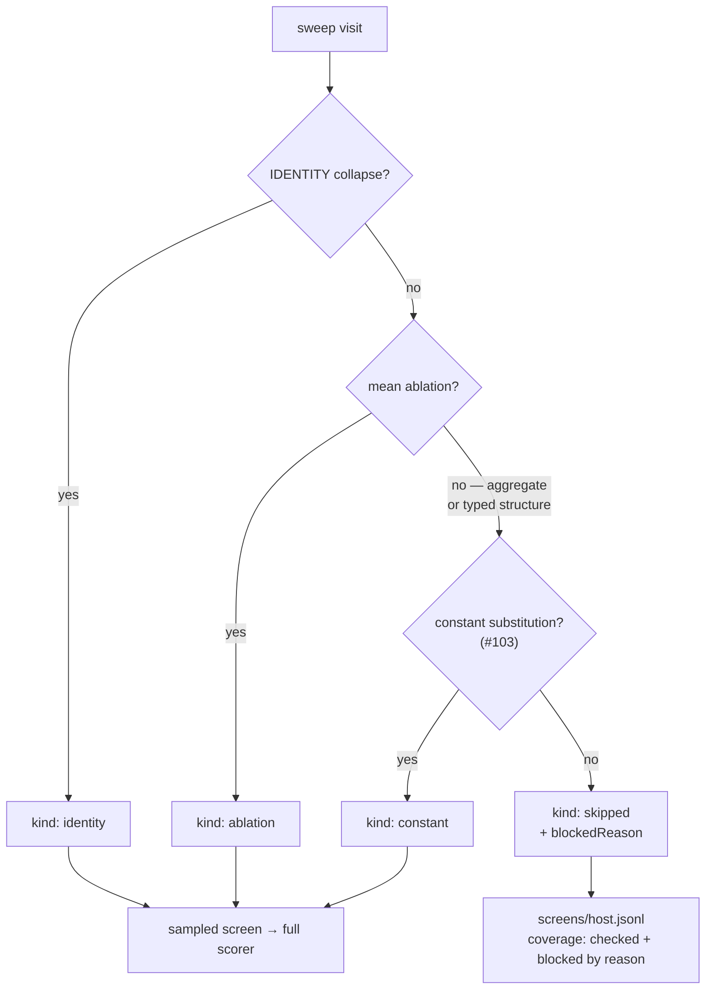

# 🪒 Break blocked neurons down by reason, and attack the largest category

## Summary

`blocked` was one number — "the sweep has been to N neurons and could test none
of them" — and one number cannot be attacked. This change gives every blocked
visit a **reason code**, carries that code on the screen record and through
every reporting surface, and then builds the proposal path the largest category
was waiting for. Closes #103.

- **`ockham/src/blocked.rs`** — seven stable codes (`aggregate-squash`,
  `missing-activation`, `unsafe-topology`, `validation-failed`,
  `no-output-path`, `other`, `unrecorded`) and a `Copy` breakdown whose counts
  are over UUIDs and sum to `blocked` exactly.
- **`ockham/src/substitute.rs`** — the new proposal path. Where the
  mean-activation ablation fails closed on structure a bias fold cannot express
  (an aggregate target, a role-carrying synapse), the hidden neuron becomes a
  `constant` neuron emitting its measured mean: its **incoming** half and the
  upstream structure that leaves feeding nothing are removed, its **outgoing**
  edges — weights and roles — are preserved byte for byte. `MEAN` keeps its
  arity, `IF` keeps one edge of each role, and the candidate still faces
  `creature.validate()`, the sampled screen and the full-corpus scorer.
- **Persistence and reporting** — `blockedReason` per neuron in
  `screens/<host>.jsonl`; `blockedByReason` in `coverage.json`, the journal
  `coverage` record and `report`; a `reasons:` line under `blocked:` in
  `coverage.txt`; `dominantBlockedReason` and one `blockedEpochs` row per
  screening epoch, with counts and percentages, so historical blocked reasons
  are inspectable across epochs.
- **`docs/blocked-reasons.md`** — every code, whether a safe candidate can be
  constructed for it, the strategy built for the dominant one, what it costs,
  and a concrete reason for each category still without a path.

Every artefact is additive: a pre-#93/#100/#102/#103 `coverage.json`, journal or
screen record still deserialises, an unknown code from a newer host reads as
`other` rather than failing the load, and a blocked total with no reasons is
accounted for as `unrecorded` rather than silently breaking the sum invariant.

### What changed in the sweep

## Evidence

Backend/CLI only — there is no web interface to screenshot. The evidence is the
test suite and the local gate.

- `./quality.sh < /dev/null` passes end to end: shellcheck, neat-core version
  gate, codespell, markdownlint, actionlint, `cargo deny check`,
  `cargo fmt --check`, clippy with `-D warnings -D clippy::filter_next
  -D clippy::collapsible_if`, `cargo test --workspace --all-features`
  (338 lib + 35 integration tests, 0 failures) and rustdoc with `-D warnings`.
  `codespell` is not installed in the run container and cannot be installed from
  it (no `pip`, no root); it was run from a locally downloaded copy of the same
  version — `codespell: no typos found` — and CI runs it for real.
- The substitution is checked against the compiled network, not only against
  the shape: `substitute::tests::substituting_a_genuinely_constant_neuron_preserves_every_output`
  compiles both creatures and compares outputs across four inputs.
- `run::tests::aggregate_structure_that_was_blocked_is_proposed_as_a_constant`
  drives a whole run over the fixture Issue #93 introduced for the blocked case
  and asserts that all three of its hidden neurons are now screened, two of them
  under the new `constant` kind, with nothing blocked.

## Acceptance Criteria

<!-- vibe-spec-review inputs="diff+issue-body" -->

- **met** — A run reports a deterministic blocked-reason breakdown — evidence:
  `ockham/src/coverage.rs::the_reason_counts_sum_to_the_blocked_total`,
  `ockham/src/coverage.rs::the_freshest_record_decides_the_reason_whatever_order_it_was_read_in`,
  `ockham/src/blocked.rs::the_breakdown_is_ordered_commonest_first_and_ties_break_on_the_code`
  — reviewer: met
- **met** — The sum of reason counts equals the blocked total — evidence:
  `ockham/src/coverage.rs:664` derives `blocked` from the breakdown, and
  `ockham/src/report.rs::account_for_every_blocked` files the shortfall of a
  pre-#103 journal as `unrecorded`
  (`report::tests::the_report_carries_the_blocked_figure_and_reads_a_pre_93_journal`)
  — reviewer: partial — reason: the reviewer found the invariant held on the
  live path but not on the journal-replay path, where `blocked` and
  `blockedByReason` were read as independent fields; that gap was fixed in this
  diff after the review, which is why the status departs from the verdict
- **met** — Historical blocked reasons can be inspected across epochs —
  evidence: `ockham/src/learnings.rs::a_blocked_visit_round_trips_its_reason_through_the_store`,
  `ockham/src/report.rs::blocked_reasons_are_reported_per_epoch_across_corpus_changes`
  — reviewer: met
- **met** — At least the dominant blocked category has a documented proposal
  strategy or a concrete reason it cannot yet be safely handled — evidence:
  `docs/blocked-reasons.md` documents all seven codes, the constant-substitution
  strategy for the dominant one and a concrete blocker for each of the rest —
  reviewer: met — reason: the reviewer noted the *identification* of the
  dominant category restates the #93 measurement rather than a fresh one; no
  GRQ corpus or Forest-heavy creature is reachable from the run container, so
  the split under the new codes is stated as what the code paths imply and the
  `reasons:` line is what will measure it on the first live run
- **met** — If a safe new proposal path is implemented, tests demonstrate both
  valid and invalid cases — evidence: four valid cases
  (`a_typed_edge_the_ablation_path_blocks_substitutes_a_constant`,
  `the_aggregate_neuron_itself_substitutes_and_its_upstream_cascades`,
  `substituting_a_genuinely_constant_neuron_preserves_every_output`,
  `the_substituted_constant_is_ordered_ahead_of_every_hidden_neuron`) and four
  invalid ones (`a_non_finite_mean_is_a_missing_activation_skip`,
  `an_unknown_or_non_hidden_neuron_is_an_unsafe_topology_skip`,
  `a_neuron_that_feeds_nothing_is_refused_rather_than_emitted`,
  `a_candidate_that_fails_validation_is_reported_not_emitted`) in
  `ockham/src/substitute.rs` — reviewer: met
- **partial** — (from *Required work*) Report counts **and percentages** by
  reason for each screening epoch — evidence: the `reasons:` line in
  `coverage.txt` and `EpochBlocked::reasons` in `report` — reviewer: partial —
  reason: the reviewer found the epoch rows carried counts only; they now carry
  the rendered percentages too, and the raw per-code counts remain beside them
- **unrequested** — the batch skip log now tallies reason codes
  (`aggregate-squash: 41`) instead of the #93 word-prefix classifier
  (`aggregate target: 41`), and `skip_reason_class` is deleted — reviewer:
  unrequested — reason: the issue asks for the coarse count to be replaced by
  reason codes, and two classification schemes for the same skips could not be
  reconciled; the log line, the record and the breakdown now name one set of
  categories
- **unrequested** — a cost-increasing IDENTITY collapse with no activation
  statistic is recorded as `missing-activation` rather than under the collapse's
  own code — reviewer: unrequested — reason: with a measured mean that visit
  would have fallen through to the ablation, so the statistic is what actually
  stopped it; the collapse's message is still on the record
- **unrequested** — `ockham/Cargo.toml` bumped to `0.1.40` and `Cargo.lock` with
  it — reviewer: unrequested — reason: CONTRIBUTING principle 8 requires a
  version bump for binary-affecting changes, and the unattended machines key
  their rebuild off it

## Standards Review

<!-- vibe-standards-review inputs="diff+CODING-STANDARDS.md" -->

The repository has no `CODING-STANDARDS.md`; the reviewer was given
`CONTRIBUTING.md` and `README.md`, which carry the documented standards.

- **violation** — no silent failure: a `SweepSkip` carrying no reason code was
  filed as a `known-failure` record, the strongest "checked" claim in the store
  — evidence: `ockham/src/run.rs:1875` — reason: fixed here. `skip_try` now
  files a known failure only for the `KNOWN_FAILURE_REASON` sentinel and blocks
  anything else as `other`, covered by
  `run::tests::a_known_failure_files_no_blocked_reason`
- **violation** — CONTRIBUTING principle 8, bump `ockham/Cargo.toml` for
  binary-affecting changes — evidence: `ockham/Cargo.toml:3` — reason: fixed
  here, `0.1.39` → `0.1.40`, with `Cargo.lock`
- **violation** — docs updated alongside code: the screen-record contract table
  still listed a scored kind as `identity` / `ablation` while `constant` is now
  written to disk — evidence: `README.md:364` — reason: fixed here; the table,
  the surrounding prose and `docs/blocked-reasons.md` all name the third kind
  and say what `cut:` counts when a substitution is accepted
- **violation** — docs must describe what the code does: the skip-log example
  `aggregate-squash: 41` is now near-unreachable, because that structure is
  proposed rather than blocked — evidence: `README.md:392` — reason: fixed here;
  the example is a reachable one and the sentence says why the aggregate code is
  rare now
- **violation** — docs must describe what the code does: the `unsafe-topology`
  row described the typed-synapse case the code no longer records — evidence:
  `docs/blocked-reasons.md:16` — reason: fixed here; each row now says what the
  code records today
- **violation** — reuse: `cascade_dead_sources` repeated the dead-source loop
  that `ablation::cleanup_cascade` already drives — evidence:
  `ockham/src/substitute.rs:190` — reason: fixed here;
  `first_dead_non_output` and `remove_neuron` are `pub(crate)` and reused
- **violation** — CONTRIBUTING commit-message convention: the earlier commits on
  this branch omit the 🪒 prefix — evidence: commits `ac95530`…`748a1de` —
  reason: stands. The later commits carry it; rewriting published-branch history
  to add an emoji CONTRIBUTING explicitly forbids enforcing in CI is not worth
  the risk
- **clean** — Australian English throughout the added prose and doc comments
  (`deserialises`, `artefact`, `optimiser`, `journalled`); the only `-ize`
  spellings are serde API identifiers
- **clean** — every new test calls real code: `substitute_constant` plus
  `compile_creature`/`activate`, `coverage()` over real records, `file_screens`
  and `load_screens` round trips, `summarise()` over a real journal, and
  `establish_run` end to end. No test greps source text
- **clean** — fail-closed candidate generation: the incumbent is cloned and
  asserted unchanged, `validate_creature` gates every emitted candidate, and a
  rejection is reported rather than retried under a different transform
- **clean** — the GRQ audit contract: both affected rows of
  `docs/grq-integration.md` updated, with the "a pre-#103 file still
  deserialises" guarantee
- **clean** — repository-layout docs list both new modules and the new
  `docs/` page; `tests/readme_contract.rs` passes
- **clean** — small focused files: two new single-purpose modules rather than
  additions to the already-large `run.rs`, which net-shrinks

## Test Plan

Added:

- `ockham/src/blocked.rs` — code round trip, unknown code degrades to `other`,
  sum-to-total, commonest-first ordering with a code tie-break, zero categories
  omitted, dominant category, fixed camelCase JSON keys, pre-#103 read.
- `ockham/src/substitute.rs` — the four valid and four invalid cases listed
  above, including output equivalence against the compiled network and
  NEAT-AI-core rule 11 ordering.
- `ockham/src/coverage.rs` — sum-to-blocked over real records, freshest record
  decides the reason whatever the read order, a screened uuid contributes no
  reason, the rendered `reasons:` line, its omission when nothing is blocked,
  and a pre-#103 `coverage.json`.
- `ockham/src/learnings.rs` — reason round trip through the store (with the
  version-3 record kind), a pre-#103 record reading as `unrecorded`, an unknown
  code from a newer host still loading.
- `ockham/src/report.rs` — breakdown and dominant category in the report, one
  row per screening epoch with counts and percentages, and a pre-#103 journal
  accounted for as `unrecorded`.
- `ockham/src/run.rs` — skip tally by code,
  `a_known_failure_files_no_blocked_reason` (including the fail-closed default),
  and `aggregate_structure_that_was_blocked_is_proposed_as_a_constant`.

Modified, and why:

- `run::tests::a_visit_the_razor_cannot_propose_for_is_still_recorded_as_checked`
  → `every_hidden_neuron_of_an_aggregate_creature_is_checked`. Its fixture was
  the aggregate creature, whose neurons are no longer blocked at all — the
  outcome this issue asks for — so the run-level assertion is now that every one
  of them is checked and proposed. The #93 invariants it used to carry are
  asserted where they can still be exercised: one record per visit that scored
  nothing, in `a_known_failure_skip_is_checked_without_being_called_unprunable`,
  and blocked counting in `coverage::tests`.
- `run::tests::skip_reasons_are_tallied_by_class_not_by_neuron`
  → `skip_reasons_are_tallied_by_code_not_by_neuron`, following the log line
  from the deleted word-prefix classifier to the reason codes.
- Existing `Coverage`, `Screened` and journal-event literals in tests gained the
  new fields; no assertion was weakened or removed.
