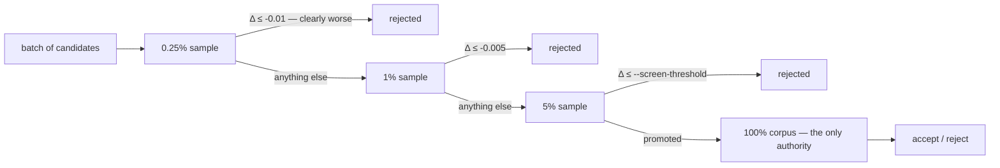

# Progressive adaptive screening (Issue #104)

## Summary

Adds an opt-in progressive screening ladder so an obviously bad pruning
candidate is paid for at a tiny sample and never reaches the larger ones, while
the full-corpus scorer remains the only thing that may accept. `--screen-stages`
takes ascending `rate[:margin]` rungs; a non-final rung rejects only a candidate
the sample calls clearly worse (Δ at or below `-margin`), anything uncertain is
carried to the next, larger sample, and only the promotion rung applies
`--screen-threshold` — which is exactly today's rule. The default is unchanged:
without `--screen-stages` the screen is one stage at `--screen-sample-rate`, the
fixed 5% control. Closes #104.

New module `ockham/src/screening.rs` holds the ladder; `sweep::screen_batch` is
reused per rung, so the incumbent is scored alongside the candidates in every
call and the comparison stays apples-to-apples. Closes #104.

## Evidence

Backend/CLI change — no web interface to screenshot. The evidence is the
benchmark, the journal records and the test suite.



`cargo run --release --example progressive_screen_bench`, 300 batches × 100
candidates per arm, both arms over the same candidate population and the same
real ladder machinery:

| Measure | Fixed 5% control (before) | `0.25% → 1% → 5%` (after) |
|---|---:|---:|
| candidates/hour | 304,569 | **434,098** |
| scorer-records/candidate | 101,000 | **32,728** |
| full-scores/hour | 20,619 | **28,896** |
| confirmed cuts/hour | 12,173 | **17,248** |
| missed-winner rate | 28.84% | 29.26% |

**1.42× the confirmed cuts per wall-clock hour on 32% of the screen records**,
for 0.4 percentage points more missed winners. The control's 101,000
records/candidate matches the closed form exactly (101 creatures × 0.05 × 2M
records × 300 batches ÷ 30,000 candidates), which is what the accounting fix in
the second commit was checked against.

The scorer is modelled — cost linear in records read, a sampled score carrying
`0.15/√n` standard error, an exact full corpus — because grading a missed-winner
rate needs a ground truth and a corpus larger than a fixture. No real creature or
real corpus was available in this container; see the `partial` entry below.

Because the benchmark shows a gain only for the opt-in ladder and the fleet has
not yet measured it on a real creature, **the default stays the fixed 5%
control**, as the issue requires.

## Acceptance Criteria

<!-- vibe-spec-review inputs="diff+issue-body" -->

- **met** — Progressive screening produces the same final acceptance rule as
  today — evidence:
  `ockham/src/run.rs::a_progressive_ladder_accepts_exactly_what_the_fixed_rate_control_accepts`
  (same accepts, stop reason and cumulative delta for both arms); the promote
  path is untouched — reviewer: met
- **met** — Obvious loser candidates terminate after a substantially smaller
  fraction of the corpus — evidence:
  `ockham/src/run.rs::an_obvious_loser_stops_at_the_first_rung_of_the_ladder`
  and `ockham/src/screening.rs::an_obvious_loser_is_rejected_at_the_first_stage_and_never_scored_again`
  — reviewer: met
- **met** — Benchmark reports candidates/hour, scorer-records/candidate,
  full-scores/hour, confirmed cuts/hour and missed-winner rate versus the fixed
  5% control — evidence: `ockham/examples/progressive_screen_bench.rs`, table
  above — reviewer: partial — reason: the reviewer read the pre-fix version,
  whose control figure (99,600) was short by one cohort; the accounting is fixed
  in commit `b1d4ffa` and the control now reproduces the closed-form 101,000
- **met** — Default behaviour changes only on benchmark evidence — evidence:
  `ockham/src/config.rs::the_default_ladder_is_the_fixed_rate_control` —
  reviewer: met
- **met** — Deterministic/reproducible sample selection for a given seed/corpus
  — evidence: `ScreenLadder::phase` is `batch × stages + stage`, tested in
  `ockham/src/screening.rs::phases_are_deterministic_and_distinct_per_stage` —
  reviewer: met
- **met** — Apples-to-apples incumbent vs candidate at each stage — evidence:
  every rung goes through `screen_batch`, which writes `baseline.json` into the
  rung's own directory and scores it in the same cohort (`ockham/src/sweep.rs`)
  — reviewer: met
- **partial** — Record records scored, elapsed time, sample delta,
  promotion/rejection reason, final result — evidence: `Event::ScreenStage`
  (`ockham/src/journal.rs`) carries records scored, ms, mean Δ, entered,
  rejected, promoted and outcome per rung; the run log names clearly-worse
  against below-threshold rejections; `ScreenedLoser` carries per-candidate Δ,
  stage and reason — reviewer: partial — reason: the per-*candidate* reason is
  in the API and the log but not persisted per candidate; the learnings screen
  record has no field for it, and widening that format is a separate change
- **met** — Keep the fixed 5% behaviour available as a control — evidence:
  `OckhamConfig::screen_ladder` resolves to `ScreenLadder::single(rate)` when no
  stages are given, and the control journals no stage records
  (`ockham/src/run.rs::the_fixed_rate_control_journals_no_stage_records`) —
  reviewer: met
- **met** — Configuration for stages and early-rejection thresholds — evidence:
  `--screen-stages`, `--screen-reject-margin`, `ScreenLadder::parse`, resolved
  stages echoed in `ConfigReport` — reviewer: met
- **partial** — Benchmark on real representative creatures/corpora — evidence:
  `ockham/examples/progressive_screen_bench.rs` runs the real ladder but against
  a modelled scorer and a fixture creature — reviewer: missing — reason: no real
  creature, corpus or `rust_scorer` binary exists in the run container; the
  fleet must re-run the comparison on a real creature before the default moves,
  which is why the default is unchanged
- **partial** — Adaptive early stopping *within* stages — evidence: rejection
  happens at rung boundaries (`ockham/src/screening.rs::screen_progressive`) —
  reviewer: partial — reason: a rung is one scorer call over a fixed sample, so
  there is no mid-call stop to take; the issue scoped this "where practical"
- **met** — Guardrail: sampling may reject/propose, only the full corpus accepts
  — evidence: `screen_progressive` returns candidates for `promote`, which is
  unchanged — reviewer: met
- **met** — Guardrail: a borderline candidate collects more evidence — evidence:
  a non-final margin of `0` is refused at construction, and
  `ockham/src/run.rs::a_borderline_candidate_is_carried_to_the_larger_samples`
  — reviewer: met
- **unrequested** — `--screen-stages` with `--screen-sample-rate 0`, and
  `--screen-reject-margin` without `--screen-stages`, are refused with exit 2 —
  reviewer: unrequested — reason: the alternative is a silently ignored flag,
  which the fail-loud standard forbids; tested in `ockham/tests/cli.rs`
- **unrequested** — `screenStageCalls` / `screenStageRecords` /
  `screenStageRejected` on `report` — reviewer: unrequested — reason:
  `summarise` matches the event enum exhaustively, so the new record had to be
  folded somewhere; these are the recording requirement surfaced where the fleet
  reads economics
- **unrequested** — per-rung workspace directories `screen-<batch>/s<n>` —
  reviewer: unrequested — reason: correctness, not scope — a candidate file left
  by an earlier rung would be scored again by the next
- **unrequested** — crate version bump to 0.1.42 — reviewer: unrequested —
  reason: CONTRIBUTING requires it for binary-affecting changes

## Standards Review

<!-- vibe-standards-review inputs="diff+CODING-STANDARDS.md" -->

- **violation** — `ockham/Cargo.toml:3` still at `0.1.39`; CONTRIBUTING requires
  a bump for binary-affecting changes — evidence: `ockham/Cargo.toml:3` —
  reason: fixed here, bumped to `0.1.42` with `Cargo.lock` (0.1.41 landed on
  Develop meanwhile, resolved in the merge)
- **violation** — `screen_ladder()` swallowed a construction error with `.ok()`,
  and `None` means *screening disabled*, so a library caller that skipped
  `validate()` would get a silently un-screened run — evidence:
  `ockham/src/config.rs:173` — reason: fixed here; it returns
  `Result<Option<ScreenLadder>, String>` and the run aborts on the error
- **violation** — `--screen-reject-margin` was silently ignored without
  `--screen-stages` — evidence: `ockham/src/main.rs:64` — reason: fixed here;
  it is refused with exit 2 and covered by a CLI test
- **violation** — the new `report` counters and the `Event::ScreenStage` arm had
  no test — evidence: `ockham/src/report.rs:236` — reason: fixed here,
  `ladder_rungs_total_their_records_without_inflating_screen_calls`
- **violation** — `promotion_rate_creatures` had an untested fallback that
  silently switched cost units on a degenerate rate — evidence:
  `ockham/src/screening.rs:260` — reason: fixed here by taking the rate from the
  validated `ScreenLadder`, so the degenerate branch no longer exists
- **violation** — `ProgressiveScreen::baseline_score` documented as the
  promotion stage's, but holds the last rung that ran — evidence:
  `ockham/src/screening.rs:238` — reason: fixed here; the doc now states what it
  holds, including the empty-batch `NaN`
- **violation** — two consecutive `if ladder.is_progressive()` blocks, and the
  ladder cloned per batch — evidence: `ockham/src/run.rs:1295` — reason: fixed
  here; resolved once before the loop, one block
- **violation** — `records_scored` extrapolated from the incumbent's record
  count instead of summing what each creature reported — evidence:
  `ockham/src/sweep.rs:475` — reason: fixed here; it sums each
  `ScoreResult::record_count`
- **violation** — the screening reserve priced a ladder batch as a single
  promotion-stage pass, so ladder runs over-reserved — evidence:
  `ockham/src/run.rs:312` — reason: fixed here via `batch_cost_multiple`, tested
  in `the_reserve_prices_every_rung_of_a_ladder`
- **violation** — the docs claimed stages never read the same slice, which the
  ladder cannot guarantee for non-nested rates — evidence:
  `ockham/src/screening.rs:172`, `README.md` — reason: fixed here; both now say
  only that each rung gets its own deterministic phase
- **clean** — Australian English throughout (no US spellings in the diff); no
  hidden or secret files staged; tests drive real functions, the real binary and
  the real journal rather than grepping source; scorer failures propagate rather
  than yielding a partial verdict; README documents both new flags, the new
  report fields and `screening.rs` in the layout tree, with the README-contract
  tests passing.

One standards concern is recorded rather than fixed: a candidate rejected at
0.25% files the same screen-coverage record as one rejected at 5%, so a ladder
run's `checked` count rests on weaker evidence than the control's. Changing the
screens record format is out of scope here; the trade-off is now stated in
README under [Progressive screening], and it is another reason the default is
unchanged.

## Quality Gate

`./quality.sh` was run in the foreground and **every stage passes**, ending on
`All quality checks passed!`.

An earlier attempt had to record the spell check as unrun — codespell was not
installed and the container has no `pip`, `pipx` or `brew`. It is now installed
from the PyPI wheel into `~/.local/lib`, with a shim on `~/.local/bin` (the path
`scripts/spell-check.sh` already adds), so the stage runs for real rather than
being reasoned about:

```text
📝 Running codespell on: /…/NEAT-AI-Ockham
codespell: no typos found
```

That install is container state only — no repository file changes with it.

Stages, all green: bash syntax, shellcheck, neat-core version gate, codespell,
markdownlint-cli2, actionlint, `cargo deny check`
(advisories/bans/licenses/sources ok), `cargo fmt --all -- --check`, `cargo
clippy --workspace --all-targets --all-features -D warnings`, `cargo test
--workspace --all-features` and `cargo doc` with `-D warnings`.

## Test Plan

- `ockham/src/screening.rs` — ladder validation (empty, descending, out of
  range, zero margin on a non-final rung, malformed spec, default margin);
  deterministic phases; an obvious loser rejected at rung 0 and never scored
  again; a borderline candidate carried to the promotion rung; a rung that
  rejects everything ends the batch; the single-stage control reproduces the
  fixed-rate screen and its directory; a rung failure aborts the batch.
- `ockham/src/run.rs` — a ladder accepts exactly what the control accepts; an
  obvious loser stops at the first rung (asserted on the real journal); the
  control journals no stage records; a borderline candidate reaches the
  promotion rung; the reserve prices every rung.
- `ockham/src/config.rs` — the default ladder is the fixed-rate control;
  explicit stages replace it and report resolved; stages with screening disabled
  are refused.
- `ockham/src/report.rs` — rung records total their scored records without
  inflating `screenCalls`; a control run reports zeros.
- `ockham/tests/cli.rs` — a malformed, descending, out-of-range or contradictory
  ladder, and a margin with no ladder, all exit 2 with the reason on stderr.
- `ockham/examples/progressive_screen_bench.rs` — the before/after benchmark
  above.
