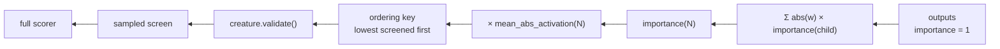

# Rank pruning candidates by downstream output sensitivity (Issue #105)

## Summary

Ockham could see how loud a hidden neuron is, never whether anything downstream
listened. This adds `ockham/src/sensitivity.rs`, a topology-only backward
importance estimate propagated from the outputs, and two explicit ordering
strategies that read it:

```text
importance(output) = 1
importance(N)      = Σ abs(weight(N → child)) × importance(child)

estimated_effect(N) = mean_abs_activation(N) × importance(N)
```

- `low-output-sensitivity` — topology alone: a neuron nothing downstream depends
  on is screened first, however loud it is.
- `low-estimated-effect` — that importance scaled by the activation statistics.
  `low-outgoing-contribution` is its one-layer special case, with every child's
  importance pinned at `1`.

The estimate is built once per creature in `O(neurons + synapses)` work — one
iterative Tarjan condensation, then one pass per component in reverse
topological order — with no scorer calls and no clone of the creature. Cyclic
topology has no first-order fixpoint, so a component is relaxed once against the
largest importance it sends out of itself: every member keeps at least that
exit, and a member that amplifies into it is credited for the hop. Missing,
undefined or unrepresentable importance ranks a neuron **last**, never removes
it from the sweep.

`random` remains the default control; nothing was promoted. Version bumped to
`0.1.43`. Closes #105.

## Evidence

Backend/CLI change with no web interface to screenshot. The evidence is the test
suite and the benchmark below.



`cargo run --release --example sensitivity_ordering_bench` — 60 loud four-neuron
chains whose last edge into the output carries weight zero, beside 600 quiet
neurons wired straight into an output and 600 ordinary contributors. Every
visited neuron goes through the real `ablate_mean` and its recursive cleanup;
the candidate is judged by a compiled forward pass over 64 fixed probes, **not**
by the ranking key.

| `--ordering` | Time to first confirmed cut | Confirmed cuts/hour | Growth units/hour | Calls per confirmed cut |
|---|---|---|---|---|
| `random` | 59.9 ms | 193,217 | 869,478 | 7.1 |
| `low-variance` | none in 150 visits | 0 | 0 | none |
| `low-mean-abs` | none in 150 visits | 0 | 0 | none |
| `low-outgoing-contribution` | 2.6 ms | 548,245 | 2,467,101 | 2.5 |
| `low-fan-out` | 59.1 ms | 193,526 | 870,869 | 7.1 |
| `high-growth-saving` | 59.7 ms | 192,526 | 866,369 | 7.1 |
| `low-output-sensitivity` | 2.6 ms | 1,319,931 | 5,939,688 | 1.0 |
| `low-estimated-effect` | 2.6 ms | 1,312,038 | 5,904,173 | 1.0 |

Order build cost is 1.2 ms against `high-growth-saving`'s 8.0 ms on the same
creature. The fixture is a **designed best case** for this failure mode and the
judge is a forward pass rather than a corpus, so these are proxy economics; the
scorer-verified comparison is the `report` recipe documented in the README.

`./quality.sh` was run in the foreground after the final edit and ends on
`All quality checks passed!` — 398 unit plus 36 integration tests, clippy with
`-D warnings`, `cargo fmt --check`, cargo-deny, codespell, markdownlint and
rustdoc with `-D warnings`.

## Acceptance Criteria

<!-- vibe-spec-review inputs="diff+issue-body" -->

- **met** — Reproducible sensitivity values for a fixed creature — evidence:
  `ockham/src/sensitivity.rs::the_index_is_deterministic_and_independent_of_listing_order`
  (8 repeats plus a reversed neuron/synapse listing) — reviewer: met
- **met** — New ordering is a permutation of all eligible hidden neurons —
  evidence: `ockham/src/ordering.rs::every_ordering_is_a_permutation_of_the_hidden_neurons`
  and `ockham/src/sweep.rs::prefer_unchecked_is_a_permutation_under_every_ordering_and_quota`,
  both looping `Ordering::ALL` — reviewer: met
- **met** — Unit tests cover simple chains, branches and zero-weight downstream
  paths — evidence:
  `ockham/src/sensitivity.rs::a_chain_multiplies_the_weights_between_the_neuron_and_the_output`,
  `::a_branch_sums_every_downstream_path`,
  `::a_zero_weight_downstream_path_leaves_the_neuron_invisible_to_the_outputs`
  — reviewer: met
- **partial** — Benchmark reports time-to-first-confirmed-cut, confirmed
  cuts/hour, structural units removed/hour and full scorer calls per accepted
  cut — evidence: all four columns in
  `ockham/examples/sensitivity_ordering_bench.rs` and the README table —
  reviewer: partial — reason: the judge is a compiled forward pass over fixed
  probes, not the full corpus scorer, so the fourth measure is proxy calls per
  confirmed cut; the scorer-verified form is the `report` recipe
  (`firstWinMs`, `cutsPerHour`, `growthUnitsSavedPerHour`, `fullCalls` against
  `acceptedCuts`), which needs a real corpus and judge this run cannot reach
- **met** — Promote to a default only if scorer-verified benchmark economics
  beat the existing control — evidence: `ockham/src/config.rs:26`
  `DEFAULT_ORDERING` unchanged at `Ordering::Random`, README states the two new
  orderings are not the default — reviewer: met
- **met** — Add one or more explicit ordering strategies without replacing the
  random control — evidence: `ockham/src/ordering.rs:62-74`, `Ordering::ALL`,
  `name()`; `config.rs:331` still asserts random is the control — reviewer: met
- **met** — Compute importance in O(V+E) graph work, no scorer calls for ranking
  — evidence: `ockham/src/sensitivity.rs::solve` and
  `::strongly_connected_components`, built once per creature behind
  `Ordering::needs_sensitivity()` — reviewer: met
- **met** — Handle recurrent/complex topology conservatively and
  deterministically — evidence:
  `ockham/src/sensitivity.rs::a_cycle_keeps_the_exit_it_sends_out_and_credits_one_hop_into_it`,
  `::a_loop_that_reaches_no_output_is_still_dead_wood`,
  `::a_self_loop_is_relaxed_as_a_cycle_rather_than_summed_into_itself` —
  reviewer: met — reason: the reviewer flagged the original rule as
  under-estimating a loop member that amplifies into the exit (r1 scored 7
  where the first-order value is 14); the component is now relaxed once against
  its largest exit, which scores that member 14, and the doc no longer oversells
  the guarantee
- **met** — Missing/unsupported importance data must never remove a neuron —
  evidence: `ockham/src/ordering.rs::rankable` plus
  `::a_neuron_the_sensitivity_covers_but_the_statistics_do_not_keeps_its_place`
  and `ockham/src/sensitivity.rs::a_muted_edge_behind_an_overflowed_path_is_still_dead_wood`
  — reviewer: met — reason: the reviewer found `0 × ∞ → NaN → INFINITY` could
  rank a genuinely muted neuron last; a zero weight now contributes nothing
  regardless of the child's value, with the regression test named above
- **met** — Record the ordering strategy in the journal/report — evidence:
  `ockham/src/report.rs::every_ordering_strategy_round_trips_through_the_journal_by_name`
  — reviewer: met
- **met** — Compare against random, low-variance, low-mean-abs,
  low-outgoing-contribution, low-fan-out and high-growth-saving — evidence: the
  strategy loop in `ockham/examples/sensitivity_ordering_bench.rs` and the
  README table — reviewer: met
- **unrequested** — `ockham/Cargo.toml` / `Cargo.lock` version bump to `0.1.43`
  — reviewer: unrequested — reason: CONTRIBUTING item 8 requires a bump for a
  binary-affecting change, enforced by `ockham/tests/auto_version.rs`
- **unrequested** — `rank_key`'s cascade plumbing folded into a `Signals`
  struct — reviewer: unrequested — reason: a second per-creature signal had to
  be threaded through the same call; adding a sixth parameter beside the
  existing five was the alternative
- **unrequested** — `pub use sensitivity::SensitivityIndex` in `lib.rs` —
  reviewer: unrequested — reason: the benchmark example prints raw importance
  values and lives outside the crate
- **unrequested** — overflow guard `finite()` and its two stress tests (20,000
  deep chain, 400 × 1e6 product) — reviewer: unrequested — reason: it is how
  "missing/unsupported importance must never remove a neuron" is honoured for
  unrepresentable values, and how the iterative Tarjan is proven stack-safe
- **unrequested** — the second strategy `low-estimated-effect` — reviewer:
  unrequested — reason: the issue asks for "one or more" strategies and names
  `estimated_effect` explicitly

## Standards Review

<!-- vibe-standards-review inputs="diff+CODING-STANDARDS.md" -->

- **violation** — the PR summary for the issue was missing — evidence:
  `docs/archive/pr-summaries/pr-summary-105.md` — reason: this file, added in
  the final commit
- **violation** — the benchmark swallowed three faults: a blocked visit was
  dropped uncounted, a candidate that would not compile was reported as an
  ordinary non-confirmation, and it was already counted as a judge call —
  evidence: `ockham/examples/sensitivity_ordering_bench.rs:201` — reason: fixed
  here — blocked visits are counted and printed in their own column, `outputs`
  returns `Result` and a validated candidate that will not compile now panics
  with the uuid and the error, and a call is counted only once the judge ran
- **violation** — undocumented private constructor against the module's own
  convention — evidence: `ockham/src/sensitivity.rs:105` — reason: fixed here,
  `Builder::new` now carries a doc comment like `cascade.rs`'s equivalent
- **violation** — dead `Default` derive on `Signals`, never constructed that
  way — evidence: `ockham/src/ordering.rs:232` — reason: removed here
- **violation** — README repository-layout tree comment misaligned by one column
  — evidence: `README.md:1527` — reason: fixed here
- **violation** — two new tests called `attenuated_stats()` only to clear it,
  implying attenuated statistics mattered where they did not — evidence:
  `ockham/src/ordering.rs:838` and `:915` — reason: fixed here, both now start
  from the base `stats()` helper as `cascading_stats` does
- **clean** — CONTRIBUTING item 8 version bump with `Cargo.lock` in step and no
  changelog; 🪒 commit prefix on every commit; Australian English throughout
  (codespell clean, no `-ize`/`behavior`/`color` in the diff); every new public
  item documented with rustdoc `-D warnings` clean; tests call real functions
  and assert on returned values with no source-text grepping; `quality.sh`
  reproduces clean; README claims reproduce when the benchmark is re-run; the
  index takes `&CreatureExport` and never mutates (asserted by
  `indexing_never_writes_to_the_creature`); `random` stays `DEFAULT_ORDERING`;
  the new variants are wired into `ALL`, `name()` and the serde kebab-case
  journal name; no change to `run.rs`, `sweep.rs`, `promote.rs`, acceptance
  logic or CLI defaults

## Test Plan

Added in `ockham/src/sensitivity.rs` (16 tests): chain multiplication, branch
summation, zero-weight downstream path, a neuron reaching no output, a cycle
relaxed against its exit, a loop that reaches no output, a self loop, a muted
edge behind an overflowed path, an overflowing weight product, determinism and
listing-order independence, non-mutation of the creature, hidden-neuron
coverage, a creature with no hidden neurons, and a 20,000-deep chain proving the
iterative Tarjan is stack-safe.

Added in `ockham/src/ordering.rs` (5 tests): the muted-but-loud neuron screened
first under both new strategies, the activation ranking visiting it last, the
estimated effect separating neurons the topology ties, a neuron the statistics
do not cover keeping its place, and a recurrent loop not screened ahead of a
genuinely muted neuron. The pre-existing permutation, reproducibility and
name round-trip tests loop `Ordering::ALL` and now cover the new variants.

Added in `ockham/src/report.rs` (1 test): every strategy round-trips through the
journal by its kebab-case name and is read back by `report`.

No existing test was modified or removed, other than the two cycle tests added
earlier in this same branch, which were updated when the cycle rule was
strengthened in response to the spec review.
