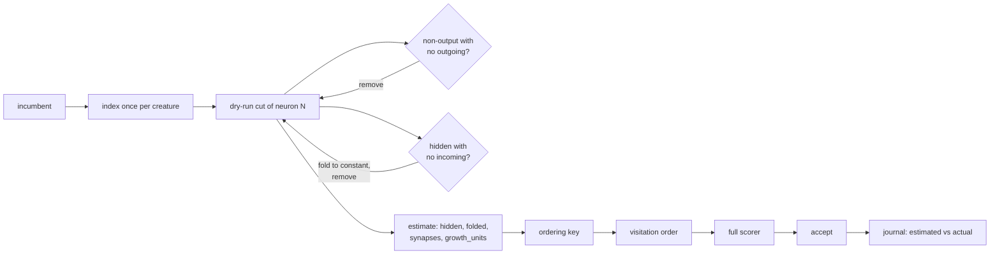

# Rank candidates by cascade-aware structural saving

## Summary

Ockham ranked candidates by the structure touching a neuron, so a well-connected
neuron outranked a chain head whose removal strands five more neurons behind it.
This adds a topology-only cascade dry run, two orderings that rank by it, and a
per-accept record of what the prediction was worth. Closes #106.

- **`ockham/src/cascade.rs`** — `CascadeIndex` indexes a creature once, then
  estimates, for any cut, the structure recursive cleanup would remove:
  requested neuron, stranded hidden neurons, constant/foldable structure
  exposed, synapses and `growth_units`. It applies the two exact cleanup rules
  in the cleanup's own priority order, counts the structure the incumbent had
  already stranded (which any accepted cut removes), and predicts the refusals
  the transform fails closed on — aggregate or unknown squash, aggregate fold
  target, typed edge — so a cut the razor can never build is estimated as saving
  nothing. The incumbent is never written to and no creature is cloned.
- **`ockham/src/ordering.rs`** — `cascade-saving` (largest predicted saving
  first) and `cascade-risk-ratio` (`mean_abs × Σ|outgoing weight|` per cascade
  growth unit, the issue's `damage / saving` priority). `random` stays the
  default and every existing strategy and the random quota are untouched.
  Ranking keys are now computed once per neuron instead of once per comparison,
  which is what makes one dry run per candidate affordable.
- **`ockham/src/run.rs`, `journal.rs`, `report.rs`** — every accept journals a
  `cascade` record with the predicted and the actual structure removed; `report`
  folds them into `cascadeAccepts`, `cascadeEstimatedGrowthUnits`,
  `cascadeActualGrowthUnits` and `cascadeEstimateRatio`, and adds `cutsPerHour`
  and `growthUnitsSavedPerHour`.

## Evidence

Backend/CLI only — no web interface to screenshot. The evidence is the
benchmark and the test suite.

`cargo run --release --example cascade_ordering_bench` on a synthetic creature
of 2,000 lone hidden neurons and 200 five-neuron chains (3,002 neurons, 7,200
synapses). Each of the first 200 visits is put through the **real**
`ablate_mean` and its recursive cleanup — the score is what the transform
actually removes, not the ranking key being tested:

| `--ordering` | Growth units in 200 visits | Per visit | Order build |
|---|---|---|---|
| `random` | 543.8 | 2.72 | 0.1 ms |
| `high-growth-saving` | 260.0 | 1.30 | 30.4 ms |
| `cascade-saving` | **1120.0** | **5.60** | 34.8 ms |
| `cascade-risk-ratio` | **1120.0** | **5.60** | 54.9 ms |

4.3× the structure per visit against `high-growth-saving` and 2.1× against the
random control. The order is built once per sweep and the dry run pays for
itself against the ranking it replaces: at 7,000 hidden neurons and 19,200
synapses, `cascade-saving` builds in 184 ms against `high-growth-saving`'s
232 ms.

Confirmed cuts/hour and growth-units-removed/hour are now reported per run
(`cutsPerHour`, `growthUnitsSavedPerHour`); measuring them for real needs a
scorer-backed run against a live creature, which this container cannot do.

Quality gate: `cargo fmt --check`, clippy with `-D warnings
-D clippy::filter_next -D clippy::collapsible_if`, `cargo test --workspace
--all-features` (361 unit + 35 integration tests), `cargo doc` with
`-D warnings`, `cargo deny check`, `markdownlint-cli2` and shellcheck all pass.
`codespell` could not be run — the container has no `pip`/`pipx`
(`/usr/bin/python3: No module named pip`), so that one stage of `./quality.sh`
is left to CI.

## Acceptance Criteria

<!-- vibe-spec-review inputs="diff+issue-body" -->

- **met** — tests demonstrate a candidate whose removal exposes multiple
  redundant neurons and synapses — evidence:
  `ockham/src/cascade.rs::a_cut_that_strands_a_chain_counts_every_neuron_and_synapse_behind_it`
  (2 stranded neurons, 4 synapses) — reviewer: met
- **met** — estimated cascade is deterministic — evidence:
  `ockham/src/cascade.rs::the_estimate_is_deterministic_and_independent_of_listing_order`
  — reviewer: met
- **met** — accepted-candidate reporting compares estimated and actual
  growth-unit saving — evidence: `ockham/src/run.rs::journal_cascade`,
  `ockham/src/report.rs` cascade fields,
  `run.rs::an_accepted_cut_journals_the_estimated_cascade_beside_the_actual_saving`
  — reviewer: met — reason: the reviewer's caveat (the ratio could not separate
  estimator drift from transform mismatch) is addressed by recording the cohort
  `kind` on the record; the transform kind is not plumbed to the accept path, so
  a collapse and a substitution still read alike, which is stated in the journal
  doc rather than hidden
- **met** — benchmark against `high-growth-saving` and random ordering —
  evidence: `ockham/examples/cascade_ordering_bench.rs`, table above — reviewer:
  partial — reason: the reviewer was right that scoring by the cascade estimate
  was tautological; the benchmark now scores every visit through the real
  `ablate_mean`, which is independent of the ranking key
- **partial** — measure confirmed cuts/hour and growth-units removed/hour —
  evidence: `report.rs` `cuts_per_hour` / `growth_units_saved_per_hour`, tested
  in `report_compounds_tiny_accepts_rather_than_only_the_final_score` — reviewer:
  partial — reason: the measures are computed and reported per run, but taking
  them for real needs a scorer-backed run this container cannot perform
- **met** — dry run must not mutate the incumbent — evidence:
  `cascade.rs::estimating_never_writes_to_the_creature` — reviewer: met
- **met** — reuse existing cleanup logic so estimate semantics match —
  evidence: `cascade.rs::the_estimate_matches_the_structure_the_ablation_actually_removes`
  (every hidden neuron of three fixtures, compared against `ablate_mean`) —
  reviewer: partial — reason: the reviewer found two genuine divergences —
  pre-existing stranded structure was not counted, and refused transforms were
  credited with their cascade — and both are fixed with regression tests
  (`structure_the_incumbent_already_stranded_is_counted_like_the_cleanup_counts_it`,
  `a_cut_the_transform_would_refuse_is_estimated_as_saving_nothing`). The rules
  are still mirrored rather than shared, because `cleanup_cascade` mutates a
  cloned creature and the dry run must not clone one; the parity test is what
  holds the two together
- **met** — cache topology-derived estimates within a creature run — evidence:
  `ordering.rs::hidden_order` builds one `CascadeIndex` per sweep and reads
  `hidden_estimates()` — reviewer: met
- **met** — explicit ordering/metrics, random and existing controls retained —
  evidence: `Ordering::ALL`, `random` still the default,
  `every_ordering_is_a_permutation_of_the_hidden_neurons` — reviewer: met
- **met** — record estimated versus actual structure removed for accepted
  candidates — evidence: `journal::Event::Cascade` — reviewer: met
- **met** — cascade size is a prioritisation signal only, the full scorer stays
  authoritative — evidence: nothing in the diff touches acceptance; the ordering
  only reorders the sweep — reviewer: met
- **unrequested** — ranking keys are precomputed once per neuron rather than per
  comparison (`ordering.rs::hidden_order`) — reviewer: unrequested — reason:
  required for the dry run to be affordable, and it also cut
  `high-growth-saving`'s order build; behaviour is unchanged and covered by the
  existing reproducibility tests
- **unrequested** — bundle (multi-UUID) estimation and
  `a_bundle_counts_shared_cascade_structure_once` — reviewer: unrequested —
  reason: accepted winners can carry several UUIDs, so the accept record would
  over-count shared cascade structure without it
- **unrequested** — the `cascade` record is written on every accept, including
  runs using `random` — reviewer: unrequested — reason: deliberate, and stated
  in the journal doc: the control runs are where the predictor most needs
  auditing
- **unrequested** — `cutsPerHour` / `growthUnitsSavedPerHour` on the report —
  reviewer: unrequested — reason: this is the issue's "measure confirmed
  cuts/hour and growth-units removed/hour" criterion

## Standards Review

<!-- vibe-standards-review inputs="diff+CODING-STANDARDS.md" -->

- **violation** — `actual_hidden` / `actual_synapses` clamped an increase to
  zero with `saturating_sub`, so an accepted collapse that rewires more synapses
  than it removes would have been recorded as "removed nothing" — evidence:
  `ockham/src/run.rs:2104` — reason: fixed here; both are signed `i64` deltas and
  the field docs say why
- **violation** — the estimate-versus-ablation parity test skipped silently on
  `Err`, so it could have passed green having compared nothing — evidence:
  `ockham/src/cascade.rs:369` — reason: fixed here; it iterates the fixtures'
  own hidden neurons, panics on an unexpected refusal and asserts a minimum
  comparison count
- **violation** — `cascadeEstimateRatio` was `None` both when no accept was
  recorded and when the accepts were predicted to save nothing — evidence:
  `ockham/src/report.rs:464` — reason: fixed here; `cascadeAccepts` distinguishes
  them, covered by `an_accept_predicted_to_save_nothing_is_counted_without_a_ratio`
- **violation** — the journal doc claimed the record described the dry run that
  ranked the candidate, but it is written on every accept whatever the ordering
  — evidence: `ockham/src/journal.rs:177` — reason: fixed here; the doc now says
  so plainly
- **violation** — the cost doc understated the per-estimate work — evidence:
  `ockham/src/cascade.rs:76` — reason: fixed here; the doc states the real cost
  and the README carries a measured build time at 7,000 hidden neurons
- **violation** — `CascadeEstimate` derived `Serialize` with a camelCase
  attribute nothing used, contradicting the journal's snake_case fields —
  evidence: `ockham/src/cascade.rs:36` — reason: fixed here; the derive is gone
- **violation** — `CascadeIndex::estimate` with an empty slice and
  `hidden_estimates` on a creature with no hidden neurons were untested public
  paths — evidence: `ockham/src/cascade.rs` — reason: fixed here;
  `an_empty_cut_and_a_creature_without_hidden_neurons_estimate_nothing`
- **clean** — Australian English throughout; version bumped 0.1.40 → 0.1.41 with
  `Cargo.lock` in step and no changelog; 🪒 commit prefix; rustdoc on every new
  public item; tests call real functions and assert on results, with no
  wall-clock thresholds; no hidden paths staged and no new dependencies; README
  updated for both orderings, the report fields, the journal record, the module
  tree and the benchmark recipe; `docs/grq-integration.md` needed no change
  because GRQ never passes `--ordering`; journal-write faults propagate rather
  than being swallowed

## Test Plan

Added in `ockham/src/cascade.rs`:

- `a_cut_that_strands_a_chain_counts_every_neuron_and_synapse_behind_it`
- `a_cut_with_no_cascade_saves_only_its_own_structure`
- `a_cut_that_leaves_a_neuron_without_incoming_structure_counts_it_as_folded`
- `the_estimate_matches_the_structure_the_ablation_actually_removes`
- `structure_the_incumbent_already_stranded_is_counted_like_the_cleanup_counts_it`
- `a_cut_the_transform_would_refuse_is_estimated_as_saving_nothing`
- `a_cut_whose_own_structure_is_aggregate_is_estimated_as_saving_nothing`
- `the_estimate_is_deterministic_and_independent_of_listing_order`
- `estimating_never_writes_to_the_creature`
- `a_bundle_counts_shared_cascade_structure_once`
- `unknown_and_non_hidden_uuids_are_estimated_as_no_cuts`
- `an_empty_cut_and_a_creature_without_hidden_neurons_estimate_nothing`
- `every_hidden_neuron_is_estimated_once_per_creature`
- `the_free_function_agrees_with_the_index`

Added in `ockham/src/ordering.rs`:

- `cascade_saving_visits_the_cuts_that_strand_the_most_structure_first`
- `cascade_saving_outranks_the_edge_count_high_growth_saving_reads`
- `cascade_risk_ratio_prefers_quiet_cuts_that_save_the_most_structure`
- `a_cut_the_transform_would_refuse_ranks_behind_one_it_can_build`
- `a_neuron_without_statistics_ranks_last_under_the_risk_ratio`

Added in `ockham/src/report.rs` and `ockham/src/run.rs`:

- `accepted_cuts_report_the_estimated_cascade_beside_the_actual_saving`
- `a_journal_with_no_accepted_cuts_reports_no_cascade_comparison`
- `an_accept_predicted_to_save_nothing_is_counted_without_a_ratio`
- `an_accepted_cut_journals_the_estimated_cascade_beside_the_actual_saving`

Extended `report_compounds_tiny_accepts_rather_than_only_the_final_score` with
the `cutsPerHour` and `growthUnitsSavedPerHour` assertions. The pre-existing
`ALL`-driven ordering tests (permutation, reproducibility, quota) now cover the
two new strategies as well. No existing test was removed or weakened.
