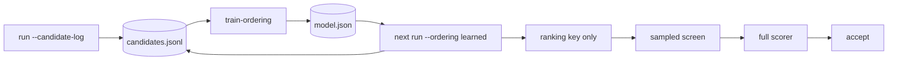

# Composite and learned dead-wood ordering (Issue #107)

## Summary

Ockham's sweep ranked by one heuristic at a time. This adds two orderings that
read every available signal together and rank by the economics the sweep is paid
in — `P(scorer confirms) × ln(1 + cascade saving) ÷ expected evaluation cost` —
plus the telemetry and the offline trainer that fit the same ranking from
Ockham's own outcomes. Closes #107.

- **`features.rs`** — one named 15-column feature vector per hidden neuron:
  quietness, range, downstream sensitivity, fan-in/out, direct and cascade
  growth saving, `IDENTITY` squash, topology depth, and what earlier corpus
  epochs learnt. Built once per creature: one cascade index, one synapse walk,
  one breadth-first depth pass.
- **`priority.rs`** — the hand-built composite, independent of any model.
- **`model.rs`** — a 15-coefficient logistic ranker, versioned against the
  feature schema and refused at load when it drifts.
- **`telemetry.rs`** — `--candidate-log` rows written *after* a verdict and
  never read during one, plus the `CandidateLog` writer.
- **`train-ordering`** — deterministic offline fit with a positional holdout and
  a held-out AUC.
- **`priority_ordering_bench`** — time-to-first-cut, confirmed cuts/hour,
  growth-units/hour and missed-winner rate against every existing ordering.

Both strategies **rank only**. Every candidate they promote still passes
`creature.validate()`, the sampled screen and full-corpus scoring, and only the
scorer accepts a cut. `random` stays the default.

## Evidence

Backend/CLI change with no web interface, so no screenshot: the evidence is the
benchmark, the test suite and the quality gate.

`cargo run --release --example priority_ordering_bench` — 2,250 hidden neurons
(1,500 lone, 150 five-neuron chains), a simulated scorer whose ground truth is
quietness **plus noise** (one quiet neuron in ten is not confirmable, one loud
neuron in twenty is), and a budget deliberately smaller than the sweep. Growth
units are what the real `ablate_mean` and its recursive cleanup remove, not the
ranking key:

| `--ordering` | First cut | Cuts/hour | Units/hour | Missed |
|---|---:|---:|---:|---:|
| `random` | 0.9s | 3012 | 8044 | 59.6% |
| `low-variance` | 0.8s | 4212 | 11461 | 37.6% |
| `low-mean-abs` | 0.8s | 4212 | 11461 | 37.6% |
| `narrow-range` | 0.8s | 4212 | 11461 | 37.6% |
| `low-outgoing-contribution` | 0.8s | 4224 | 12612 | 37.4% |
| `low-fan-out` | 0.8s | 2928 | 12578 | 61.1% |
| `high-growth-saving` | 0.9s | 3000 | 3900 | 59.8% |
| `identity-first` | 0.9s | 3012 | 8044 | 59.6% |
| `cascade-saving` | 0.8s | 2928 | 12578 | 61.1% |
| `cascade-risk-ratio` | 0.8s | 4224 | 12612 | 37.4% |
| `composite` | 0.8s | 4128 | **12642** | 39.1% |
| `learned` | 0.8s | **4236** | 12628 | **37.1%** |

`learned` (held-out AUC 0.895 on 200 rows the fit never saw) finds the most
confirmed cuts per hour and misses the fewest winners; `composite` removes the
most growth units per hour. **This is not a promotion** — the simulated ground
truth is a signal both strategies read, so the harness shows discovery rate, not
scorer agreement. `random` remains the default until real runs say otherwise.

The formula is benchmark-driven, and two forms were measured and rejected:
ranking on the raw cascade saving (spends the budget on the largest cascades
whatever their odds — 3312 cuts/hour), and charging the full-score cost per
candidate as `P × cost` (makes a hopeless candidate look cheap and promotes it —
3552 cuts/hour).

Quality gate: `cargo fmt --check`, `clippy -D warnings`, `cargo test --workspace
--all-features` (430 + 41 integration tests, 0 failures), `RUSTDOCFLAGS="-D
warnings" cargo doc`, `cargo deny check`, `markdownlint-cli2` and `actionlint`
all pass. **`codespell` could not be run in this container** — no `pip`, no
`ensurepip` and no `sudo`, so `./quality.sh` stops at its spell-check preflight;
CI runs that stage for real, and the added prose was swept by hand for US
spellings (none).

## Acceptance Criteria

<!-- vibe-spec-review inputs="diff+issue-body" -->

- **met** — Composite ordering implemented independently of learned ordering —
  evidence: `ockham/src/priority.rs::composite_value` never reads `self.model`;
  `ockham/src/ordering.rs::tests::a_learned_ordering_ranks_by_its_model_not_the_hand_built_weights`
  — reviewer: met
- **met** — Outcome telemetry sufficient to train/evaluate the model offline —
  evidence: `ockham/src/telemetry.rs::CandidateRecord` (features by name, sample
  Δ, full Δ, outcome, growth units removed, scorer ms) and the end-to-end
  `ockham/tests/cli.rs::train_ordering_fits_a_model_from_candidate_logs_and_reports_its_ranking_quality`
  — reviewer: partial — reason: the reviewer's round-one objection (screened-out
  rows over-charged for cohort scorer time) was fixed in `a347870`; the round-two
  re-review confirmed the remaining fields
- **met** — Learned strategy enabled experimentally without changing scorer
  acceptance semantics — evidence: the model reaches only
  `ockham/src/ordering.rs::rank_key`; the accept path is untouched;
  `ockham/src/run.rs::tests::a_candidate_log_records_the_features_and_the_verdict_of_every_judged_candidate`
  — reviewer: met
- **met** — Benchmark reports time-to-first-cut, confirmed cuts/hour,
  growth-units removed/hour and missed-winner rate — evidence:
  `ockham/examples/priority_ordering_bench.rs`; both reviewers ran it and
  reproduced the README table — reviewer: met
- **met** — Promote only if it beats the random and best hand-written controls on
  real runs — evidence: `DEFAULT_ORDERING` stays `Ordering::Random`
  (`ockham/src/config.rs`), asserted by `config::tests::defaults_match_the_charter`;
  README declines promotion and gives the real-run comparison recipe — reviewer: met
- **met** — Random ordering remains available as control — evidence:
  `ockham/src/ordering.rs::Ordering::Random`, unchanged and still the default —
  reviewer: met
- **met** — New strategy must still visit every eligible neuron eventually —
  evidence: `ockham/src/ordering.rs::tests::every_ordering_is_a_permutation_of_the_hidden_neurons`
  over `Ordering::ALL` × four quotas — reviewer: met
- **met** — Reserve configurable random exploration so the learned model cannot
  starve unusual candidates — evidence:
  `ockham/src/config.rs::resolve_random_quota` + `DEFAULT_LEARNED_RANDOM_QUOTA`,
  tested by `config::tests::a_learned_run_reserves_exploration_unless_the_flag_says_otherwise`
  — reviewer: partial — reason: round one found the quota configurable but
  defaulting to `0`; a learned run now reserves one visit in ten by default
- **met** — Model/training data versioned and reproducible — evidence:
  `PRIORITY_MODEL_FORMAT_VERSION` and `CANDIDATE_LOG_FORMAT_VERSION`;
  `model::tests::the_same_rows_and_hyper_parameters_reproduce_the_same_model`;
  `model::tests::a_model_fitted_on_another_schema_is_refused_at_load` — reviewer: met
- **met** — Historical evidence from old corpus epochs is a prior, not current
  truth — evidence: `ockham/src/run.rs` builds `PriorEvidence` from
  `prior_records` only; `priority::tests::history_moves_the_estimate_without_deciding_it`
  — reviewer: met
- **met** — Report comparison against individual existing orderings — evidence:
  the benchmark loops `Ordering::ALL`; twelve-row table in README and above —
  reviewer: met
- **met** — Phase 1: composite metric over the listed signals — evidence:
  `ockham/src/features.rs::FEATURE_NAMES` and
  `ockham/src/priority.rs::CompositeWeights` — reviewer: met — reason: round one
  found fan-in and range extracted but unused by `P`; both are now weighted
  terms, and the direct saving is deliberately not a separate term because the
  cascade saving already counts the neuron and its own edges
- **met** — Phase 2: persist feature vectors with outcomes, fit a small
  transparent model, ranking only — evidence: `ockham/src/model.rs` (15
  coefficients and a bias in JSON), `ockham/src/main.rs::train_ordering` —
  reviewer: met
- **unrequested** — `effective_strategy` degradation path — reviewer:
  unrequested — reason: a defensive branch for a library caller that skipped both
  validation gates; it warns and records the strategy that actually ranked, so a
  hand-built order is never filed under the learned name
- **unrequested** — `readme_contract.rs` now reads each subcommand's `--help` —
  reviewer: unrequested — reason: without it the contract could neither see
  `train-ordering`'s flags nor allow the README to document them; this widens
  existing coverage rather than relaxing it
- **unrequested** — crate version bump 0.1.42 → 0.1.43 and the
  `docs/grq-integration.md` flag note — reviewer: unrequested — reason: repo
  convention (`scripts/auto-version.sh`) and the docs-owe-a-docs-change rule

## Standards Review

<!-- vibe-standards-review inputs="diff+CODING-STANDARDS.md" -->

- **violation** — module doc stated the pre-benchmark formula (raw saving,
  per-candidate cost) the implementation deliberately does not use — evidence:
  `ockham/src/priority.rs:8` — reason: fixed in `a347870`; the header, the
  `Composite` variant doc and the README now agree with `expected_pruning_value`
- **violation** — `scorerMs` on screened-out rows charged the whole cohort's
  time to the losers alone — evidence: `ockham/src/telemetry.rs:287` — reason:
  fixed in `a347870`; the cost is shared across every creature the call scored
- **violation** — a bundle member counted as a training win whatever its own
  measured delta said — evidence: `ockham/src/telemetry.rs:146` — reason: fixed
  in `a347870`; `is_win` reads the scorer's measurement of the neuron alone when
  one exists
- **violation** — `kind` field doc omitted `constant`, a value the field carries
  — evidence: `ockham/src/telemetry.rs:89` — reason: fixed in `a347870`
- **violation** — a cohort entry naming no uuid was dropped with no counter —
  evidence: `ockham/src/telemetry.rs:347` — reason: fixed in `a347870`; it is
  counted and reported like every other drop
- **violation** — new `train-ordering` branches (`--holdout-every` 0 and 1) had
  no test — evidence: `ockham/src/main.rs:341` — reason: fixed in `a347870`; two
  CLI tests added
- **violation** — DRY: a fourth copy of the identity-squash predicate and a
  third of the Issue #52 confirmed-win rule — evidence:
  `ockham/src/features.rs:227` — reason: fixed in `a347870`; both now call the
  existing `sweep::is_identity` and `learnings::confirmed_positive`
- **violation** — the round-one diff put the ~130-line `CandidateLog` writer in
  `run.rs`, already the largest file in the crate — evidence:
  `ockham/src/run.rs:2130` — reason: fixed in `fa1cc7e`; moved to
  `telemetry.rs`, which it exclusively serves. `run.rs` still grows by ~60 lines
  of wiring plus four integration tests, which belong beside the run loop
- **violation** — `docs/grq-integration.md` CLI inventory not updated for the new
  flags — evidence: `docs/grq-integration.md:124` — reason: fixed in `fa1cc7e`
- **clean** — Australian English throughout (no US spellings in any added line);
  doc comments on every public item under `#![warn(missing_docs)]`; issue-numbered
  module docs on all four new modules; inline `#[cfg(test)] mod tests`; no
  source-grepping tests — every test calls real APIs or drives the real binary;
  no hidden files staged; no unbounded loops or spin-waiting (the fit is bounded
  by a validated `epochs`, the depth BFS by a visited map); fail-loud IO
  throughout — model load/save, `telemetry::append`/`load` and corrupt-line
  handling all error with the path named and are tested

## Test Plan

New unit tests (inline, calling real functions):

- `features.rs` — extraction covers every hidden neuron and no output; structural
  signals from topology; a chain head predicts more saving than a lone neuron; an
  unmeasured neuron is flagged not read as quiet; depth rises from the inputs; an
  unreachable neuron is deepest; the vector matches the named schema; historical
  wins and failures counted apart; evidence reaches the vector.
- `priority.rs` — quiet outranks loud; probabilities stay inside `(0, 1)` at
  extremes; history moves the estimate without deciding it; a bigger saving is
  worth more at equal odds; a likelier cut outranks a bigger long shot; the cost
  scales the value without reordering; a refused cut is worth nothing and an
  unmeasured one ranks last.
- `model.rs` — fits the signal it was trained on; identical rows reproduce an
  identical model; evaluation reports ranking quality; one-class, mis-shaped,
  non-finite and bad-hyper-parameter inputs are refused by name; file round trip;
  a stale schema or format version is refused at load; unreadable and unwritable
  paths name the file.
- `telemetry.rs` — every feature by name; round trip through the log; a corrupt
  line and a foreign format version fail loud with `file:line`; confirmed-but-not-
  applied counts as a win; training rows count what the schema cannot read;
  provenance lists every corpus; unwritable and missing paths name the file.
- `ordering.rs` — composite visits the quiet, high-saving cut first; it beats the
  single signal it replaces; history moves a candidate forward without removing
  another; the learned ordering ranks by its model, not the hand-built weights; a
  learned config with no model ranks as composite **and records itself as such**;
  a learned run with no model is refused; an unmeasured neuron ranks last.
- `config.rs` — telemetry and the model are opt-in; `--ordering learned` without
  `--ordering-model` names the flag; a learned run reserves exploration unless
  the flag says otherwise.
- `run.rs` — the candidate log records features and verdicts for every judged
  candidate (one accepted row per accept, every schema column present, every row
  trainable); a screened-out candidate is logged with its sampled Δ and no full
  Δ; an unwritable log warns without stopping the run; a learned run with an
  unreadable model stops and names the file.
- `tests/cli.rs` — `train-ordering` fits a model from a candidate log, reports
  held-out AUC and coefficients, and writes a model the sweep loads; no logs
  prints usage; `--holdout-every 0` says it evaluated on the training rows;
  `--holdout-every 1` is refused and writes no model; `--ordering learned`
  without a model names the flag.

**Existing test modified, deliberately:** `tests/readme_contract.rs::help()` now
reads each subcommand's `--help` as well as the top-level one. `train-ordering`'s
flags were invisible to both directions of the contract — undocumented flags went
unnoticed, and documenting one was reported as a flag the binary does not accept.
No assertion was weakened; both directions still pass.
