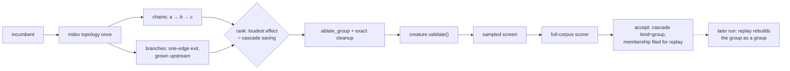

# Structural neighbourhood group cuts (Issue #108)

## Summary

Ockham tested one hidden neuron at a time, so structure that is only removable
as a group stayed for ever: cut the middle of a chain and a single bias has to
carry the whole chain's behaviour, the sampled screen says no, and the chain
survives every sweep. This adds bounded structural neighbourhood proposals —
linear chains and single-output tributaries of 2–8 neurons — cut as one
candidate, behind the opt-in `--group-cuts`. Closes #108.

- **`neighbourhood.rs`** — the generator. Chains (`a → b → c`, each link the only
  way out and the only way in) and branches (a one-edge exit grown upstream
  through predecessors that feed nothing but the group), ranked by
  `max(mean_abs × downstream importance) ÷ estimated growth units saved`,
  bounded by `--group-max-size` and capped by `--group-proposals`. Deterministic:
  the walk follows the creature's own listing order and ties break on member
  UUIDs.
- **`ablation.rs`** — `ablate_group`: every member folded on one clone with its
  own measured mean, then the existing exact cleanup cascade runs once.
  `ablate_mean` now shares the same per-neuron helpers, so there is one set of
  fail-closed rules, not two.
- **`sweep.rs` / `promote.rs`** — a candidate names every neuron it cuts, group
  candidates ride the ordinary batch with `g000…` stems, and `evaluate_full`
  scores them as their own kind rather than crediting one member.
- **`learnings.rs`** — an accepted group files its whole membership on every
  member's record (additive optional field), and `confirmed_groups` hands the
  plan back to replay.
- **`report.rs`** — `groupAccepts`, `groupCutsAccepted`, `groupHiddenRemoved`,
  `groupSynapsesRemoved`, `groupGrowthUnitsRemoved`,
  `groupGrowthUnitsPerAccept`, `groupGrowthUnitsRemovedPerHour`.

Nothing bypasses anything. A group is built by the same mean substitution and
the same exact cleanup, must pass `creature.validate()`, the sampled screen and
full-corpus scoring, and only the scorer accepts it. It also claims **no**
screening coverage for its members: a neighbourhood screen says nothing about
whether those neurons come out one at a time.

## Evidence

Backend/CLI change with no web interface, so no screenshot: the evidence is the
benchmark, the tests and the quality gate.

`cargo run --release --example neighbourhood_bench` — 921 neurons, 1,600
synapses (500 lone neurons, 60 chains of four, 60 single-output tributaries).
32 bounded proposals ranked in ~2.5 ms, every one buildable:

| Transform | Proposals | Hidden | Synapses | Growth units | Per proposal |
|---|---:|---:|---:|---:|---:|
| group cut | 32 | 128 | 160 | 144.0 | 4.00 hidden, 4.50 units |
| best single cut in the same neighbourhood | 32 | 128 | 160 | 144.0 | 4.00 hidden, 4.50 units |

That `1.00x` is the honest headline, and it is a real finding: on these shapes
the **exact cleanup already gets there** — cutting a chain head strands the
rest. What a group changes is the arithmetic left behind. The single cut folds
`squash(bias + mean × w)` onward (the activation at the mean input); the group
folds each member's own measured mean (the mean of the activations). On the
benchmark's off-centre three-neuron chain over 401 inputs:

| Transform | Mean abs Δoutput | Hidden removed |
|---|---:|---:|
| group cut | 0.362 | 3 |
| single cut of the chain head | 0.344 | 3 |
| single cut of the middle | 0.362 | 3 |

Neither dominates, which is exactly why this ships as an opt-in experiment with
the scorer as judge and `--group-cuts` off by default. A control run reports
`groupAccepts: 0`, which is what makes the comparison a comparison.

Quality gate: `cargo fmt --check`, `clippy -D warnings`, `cargo test --workspace
--all-features` (478 unit + 41 integration tests, 0 failures), `RUSTDOCFLAGS="-D
warnings" cargo doc`, `cargo deny check`, `markdownlint-cli2` and `actionlint`
all pass. **`codespell` could not be run in this container** — no `pip`, no
`ensurepip` and no `sudo`, so `./quality.sh` stops at its spell-check preflight;
CI runs that stage for real, and the added prose was swept by hand for US
spellings (none).

## Acceptance Criteria

<!-- vibe-spec-review inputs="diff+issue-body" -->

PLACEHOLDER_SPEC

## Standards Review

<!-- vibe-standards-review inputs="diff+CODING-STANDARDS.md" -->

PLACEHOLDER_STANDARDS

## Test Plan

Added:

- `ockham/src/ablation.rs` — `a_group_cut_removes_every_member_and_its_cascade`,
  `a_group_cut_distinguishes_primary_cuts_from_cleanup_cascade`,
  `a_group_cut_folds_each_member_mean_into_what_survives_it`,
  `a_repeated_member_is_folded_once`,
  `a_group_cut_that_disconnects_every_output_folds_it_to_a_constant`,
  `an_unbuildable_member_blocks_the_whole_group`,
  `a_single_member_group_matches_the_single_neuron_ablation`.
- `ockham/src/neighbourhood.rs` —
  `a_linear_chain_is_proposed_head_to_tail_as_one_group`,
  `a_single_output_tributary_is_proposed_as_a_branch`,
  `a_group_batch_builds_a_validated_candidate_per_proposal`,
  `a_batch_without_statistics_builds_nothing_and_says_so`,
  `a_proposal_is_buildable_by_the_group_ablation`,
  `generation_is_deterministic_and_bounded`,
  `a_size_outside_the_bounds_is_clamped_rather_than_obeyed`,
  `the_quietest_group_with_the_largest_saving_ranks_first`,
  `structure_the_razor_could_never_cut_is_not_proposed`,
  `a_creature_with_no_measured_statistics_proposes_nothing`,
  `a_creature_with_no_chain_or_tributary_proposes_nothing`,
  `a_disconnected_hidden_neuron_is_not_grown_into_a_group`.
- `ockham/src/promote.rs` —
  `a_group_candidate_wins_as_a_group_and_names_every_neuron_it_cut`,
  `a_group_winner_is_not_offered_as_a_bundle_member`.
- `ockham/src/learnings.rs` —
  `an_accepted_group_is_replayed_as_one_plan_not_as_its_members`,
  `a_group_missing_a_member_is_not_reconstructed`,
  `a_group_record_round_trips_through_the_store_and_older_readers_ignore_it`.
- `ockham/src/config.rs` — `group_cuts_are_off_by_default_and_bounded_when_asked_for`.
- `ockham/src/run.rs` (end to end, real run against a scripted scorer) —
  `a_group_cut_the_single_neuron_sweep_cannot_reach_is_accepted_and_filed`,
  `a_recorded_group_is_replayed_as_a_group_by_a_later_run`,
  `without_the_flag_a_run_proposes_no_group_at_all`.

Modified: existing `SweepCandidate` / `Learning` / `FullOutcome` / `FullConfig`
construction sites gained the new fields. No test was removed, disabled or
weakened.
