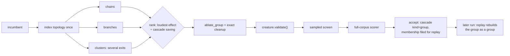

# Structural neighbourhood group cuts (Issue #108)

## Summary

Ockham tested one hidden neuron at a time, so structure that is only removable
as a group stayed for ever. This adds bounded structural neighbourhood
proposals — chains, single-output tributaries and small low-importance clusters
of 2–8 neurons — cut as one candidate, behind the opt-in `--group-cuts`.
Closes #108.

- **`neighbourhood.rs`** — the generator. Chains (`a → b → c`, each link the only
  way out and the only way in), branches (a one-edge exit grown upstream) and
  clusters (a connected subgraph grown through hidden neighbours no louder than
  the neuron it started from). Ranked by
  `max(mean_abs × downstream importance) ÷ estimated growth units saved`,
  bounded by `--group-max-size` and capped by `--group-proposals`. Deterministic:
  the walks follow the creature's listing order, ties break on member UUIDs, and
  a proposal whose cascade removes exactly what a larger one removes is dropped
  in favour of the larger one.
- **`ablation.rs`** — `ablate_group`: every member folded on one clone with its
  own measured mean, then the existing exact cleanup cascade runs once.
  `ablate_mean` now shares the same per-neuron helpers, so there is one set of
  fail-closed rules, not two.
- **`sweep.rs` / `promote.rs`** — a candidate names every neuron it cuts, group
  candidates ride the ordinary batch with `g000…` stems, and `evaluate_full`
  scores them as their own kind rather than crediting one member.
- **`learnings.rs`** — a scored group files its whole membership on every
  member's record (additive optional field), won or lost. Verdicts are keyed on
  the **membership**, and group records are never read as evidence about a
  member: they cannot replay one alone, and cannot suppress one as a known
  failure.
- **`report.rs`** — `groupAccepts`, `groupCutsAccepted`, `groupHiddenRemoved`,
  `groupSynapsesRemoved`, `groupGrowthUnitsRemoved`, the three per-accept
  figures and `groupAcceptsPerHour` / `groupGrowthUnitsRemovedPerHour`. Absent,
  not zero, on a control run.

Nothing bypasses anything. A group is built by the same mean substitution and
the same exact cleanup, must pass `creature.validate()`, the sampled screen and
full-corpus scoring, and only the scorer accepts it. It claims no screening
coverage for its members, no training row and no place in the bundle pool: a
neighbourhood verdict is about the neighbourhood.

## Evidence

Backend/CLI change with no web interface, so no screenshot: the evidence is the
benchmark, the tests and the quality gate.

`cargo run --release --example neighbourhood_bench` — 1,161 neurons, 2,140
synapses (500 lone neurons, 60 chains of four, 60 single-output tributaries, 60
two-exit webs). 300 bounded proposals ranked in ~7 ms, each scored by what the
**real** transform removes against the best single cut available in the same
neighbourhood:

| Shape | Proposals | Group units | Best single units | Group ÷ single |
|---|---:|---:|---:|---:|
| chain | 60 | 270.0 | 270.0 | 1.00x |
| branch | 120 | 360.0 | 360.0 | 1.00x |
| cluster | 120 | 444.0 | 228.0 | **1.95x** |
| all shapes | 300 | 1074.0 | 858.0 | 1.25x |

The two `1.00x` rows are the finding, and they are why this PR is larger than
the issue's "first experiment". A chain and a tributary leave the creature
through **one** edge, so cutting that exit alone already strands the rest — and
the arithmetic agrees exactly: only the exit's mean ever reaches a surviving
neuron, which is what the single cut folds. For those shapes a group cut *is*
the exit cut with more names. The cluster shape — the issue's "small connected
subgraphs whose combined downstream sensitivity is very low" — can leave through
several edges, and there no single cut stands in for it.

Fidelity is a separate question from structure. On an off-centre three-neuron
chain over 401 inputs the group cut is arithmetically identical to cutting the
chain's tail, and cutting the head is closer still (0.344 vs 0.429 mean
|Δoutput|). Neither dominates, which is why this ships opt-in with the scorer as
judge and `--group-cuts` off by default.

Two rounds of independent review ran against this diff; the second round's
verdicts are recorded below. Round one found four real faults, all fixed here:
group deltas reaching the candidate log as per-neuron training rows; a replayed
group never filed as rejected, so the same plan was re-offered every pass; every
upstream sub-cut of a chain outranking the chain itself; and the single-exit
equivalence above, which the cluster shape answers.

Quality gate: `cargo fmt --check`, `clippy -D warnings`, `cargo test --workspace
--all-features` (489 unit + 41 integration tests, 0 failures), `RUSTDOCFLAGS="-D
warnings" cargo doc`, `cargo deny check`, `markdownlint-cli2` and `actionlint`
all pass. **`codespell` could not be run in this container** — no `pip`, no
`ensurepip` and no `sudo`, so `./quality.sh` stops at its spell-check preflight;
CI runs that stage for real, and the added prose was swept by hand for US
spellings (none).

## Acceptance Criteria

<!-- vibe-spec-review inputs="diff+issue-body" -->

PLACEHOLDER_SPEC

## Standards Review

<!-- vibe-standards-review inputs="diff+CODING-STANDARDS.md" -->

PLACEHOLDER_STANDARDS

## Test Plan

Added:

- `ockham/src/ablation.rs` — `a_group_cut_removes_every_member_and_its_cascade`,
  `a_group_cut_distinguishes_primary_cuts_from_cleanup_cascade`,
  `a_group_cut_folds_each_member_mean_into_what_survives_it`,
  `a_repeated_member_is_folded_once`,
  `a_group_cut_that_disconnects_every_output_folds_it_to_a_constant`,
  `an_unbuildable_member_blocks_the_whole_group`,
  `a_single_member_group_matches_the_single_neuron_ablation`.
- `ockham/src/neighbourhood.rs` —
  `a_linear_chain_is_proposed_head_to_tail_as_one_group`,
  `a_single_output_tributary_is_proposed_as_a_branch`,
  `a_two_exit_cluster_is_proposed_where_no_single_cut_removes_it`,
  `a_proposal_a_larger_one_already_removes_is_not_offered_twice`,
  `a_membership_already_tried_is_passed_over_for_the_next_one`,
  `a_group_batch_builds_a_validated_candidate_per_proposal`,
  `a_batch_without_statistics_proposes_nothing_to_build`,
  `a_proposal_is_buildable_by_the_group_ablation`,
  `generation_is_deterministic_and_bounded`,
  `a_size_outside_the_bounds_is_clamped_rather_than_obeyed`,
  `the_quietest_group_with_the_largest_saving_ranks_first`,
  `structure_the_razor_could_never_cut_is_not_proposed`,
  `a_creature_with_no_measured_statistics_proposes_nothing`,
  `a_creature_with_no_chain_or_tributary_proposes_nothing`,
  `a_disconnected_hidden_neuron_is_not_grown_into_a_group`,
  `a_group_key_names_its_membership_in_order`,
  `every_shape_has_a_kebab_case_name`.
- `ockham/src/promote.rs` —
  `a_group_candidate_wins_as_a_group_and_names_every_neuron_it_cut`,
  `a_group_winner_is_not_offered_as_a_bundle_member`.
- `ockham/src/learnings.rs` —
  `an_accepted_group_is_replayed_as_one_plan_not_as_its_members`,
  `a_group_missing_a_member_is_not_reconstructed`,
  `a_group_the_corpus_later_rejected_stops_being_replayed`,
  `a_group_verdict_is_never_read_as_a_verdict_on_its_members`,
  `a_group_record_round_trips_through_the_store_and_older_readers_ignore_it`.
- `ockham/src/report.rs` —
  `group_accepts_report_their_own_economics_beside_the_rest`,
  `a_control_run_reports_no_group_economics_rather_than_zeroes`.
- `ockham/src/config.rs` — `group_cuts_are_off_by_default_and_bounded_when_asked_for`.
- `ockham/src/run.rs` (end to end, real run against a scripted scorer) —
  `a_group_cut_the_single_neuron_sweep_cannot_reach_is_accepted_and_filed`,
  `a_recorded_group_is_replayed_as_a_group_by_a_later_run`,
  `a_replayed_group_the_corpus_rejects_is_filed_and_not_offered_again`,
  `a_group_verdict_never_becomes_a_per_neuron_training_row`,
  `without_the_flag_a_run_proposes_no_group_at_all`.

Modified: existing `SweepCandidate` / `Learning` / `FullOutcome` / `FullConfig`
construction sites gained the new fields. No test was removed, disabled or
weakened.
