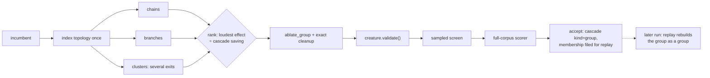

# Structural neighbourhood group cuts (Issue #108)

## Summary

Ockham tested one hidden neuron at a time, so structure that is only removable
as a group stayed for ever. This adds bounded structural neighbourhood
proposals — chains, single-output tributaries and small low-importance clusters
of 2–8 neurons — cut as one candidate, behind the opt-in `--group-cuts`.
Closes #108.

- **`neighbourhood.rs`** — the generator. Chains (`a → b → c`, each link the only
  way out and the only way in), branches (a one-edge exit grown upstream) and
  clusters (a connected subgraph grown through hidden neighbours no louder than
  the neuron it started from). Ranked by
  `max(mean_abs × downstream importance) ÷ estimated growth units saved`,
  bounded by `--group-max-size` and capped by `--group-proposals`. Deterministic:
  the walks follow the creature's listing order, ties break on member UUIDs, and
  a proposal whose cascade removes exactly what a larger one removes is dropped
  in favour of the larger one.
- **`ablation.rs`** — `ablate_group`: every member folded on one clone with its
  own measured mean, then the existing exact cleanup cascade runs once.
  `ablate_mean` now shares the same per-neuron helpers, so there is one set of
  fail-closed rules, not two.
- **`sweep.rs` / `promote.rs`** — a candidate names every neuron it cuts, group
  candidates ride the ordinary batch with `g000…` stems, and `evaluate_full`
  scores them as their own kind rather than crediting one member.
- **`learnings.rs`** — a scored group files its whole membership on every
  member's record (additive optional field), won or lost. Verdicts are keyed on
  the **membership**, and group records are never read as evidence about a
  member: they cannot replay one alone, and cannot suppress one as a known
  failure.
- **`report.rs`** — `groupAccepts`, `groupCutsAccepted`, `groupHiddenRemoved`,
  `groupSynapsesRemoved`, `groupGrowthUnitsRemoved`, the three per-accept
  figures and `groupAcceptsPerHour` / `groupGrowthUnitsRemovedPerHour`. Absent,
  not zero, on a control run.

Nothing bypasses anything. A group is built by the same mean substitution and
the same exact cleanup, must pass `creature.validate()`, the sampled screen and
full-corpus scoring, and only the scorer accepts it. It claims no screening
coverage for its members, no training row and no place in the bundle pool: a
neighbourhood verdict is about the neighbourhood.

## Evidence

Backend/CLI change with no web interface, so no screenshot: the evidence is the
benchmark, the tests and the quality gate.

`cargo run --release --example neighbourhood_bench` — 1,161 neurons, 2,140
synapses (500 lone neurons, 60 chains of four, 60 single-output tributaries, 60
two-exit webs). 300 bounded proposals ranked in ~7 ms, each scored by what the
**real** transform removes against the best single cut available in the same
neighbourhood:

| Shape | Proposals | Group units | Best single units | Group ÷ single |
|---|---:|---:|---:|---:|
| chain | 60 | 270.0 | 270.0 | 1.00x |
| branch | 120 | 360.0 | 360.0 | 1.00x |
| cluster | 120 | 444.0 | 228.0 | **1.95x** |
| all shapes | 300 | 1074.0 | 858.0 | 1.25x |

The two `1.00x` rows are the finding, and they are why this PR is larger than
the issue's "first experiment". A chain and a tributary leave the creature
through **one** edge, so cutting that exit alone already strands the rest — and
the arithmetic agrees exactly: only the exit's mean ever reaches a surviving
neuron, which is what the single cut folds. For those shapes a group cut *is*
the exit cut with more names. The cluster shape — the issue's "small connected
subgraphs whose combined downstream sensitivity is very low" — can leave through
several edges, and there no single cut stands in for it.

Fidelity is a separate question from structure. On an off-centre three-neuron
chain over 401 inputs the group cut is arithmetically identical to cutting the
chain's tail, and cutting the head is closer still (0.344 vs 0.429 mean
|Δoutput|). Neither dominates, which is why this ships opt-in with the scorer as
judge and `--group-cuts` off by default.

Two rounds of independent review ran against this diff, and the verdicts of both
are recorded below. Round one found four faults — group deltas reaching the
candidate log as per-neuron training rows, a replayed group never filed as
rejected so the same plan was re-offered every pass, every upstream sub-cut of a
chain outranking the chain itself, and the single-exit equivalence above. Round
two found eleven more, chiefly a winning group marking its members' own verdicts
accepted and a confirmed-but-not-chosen group being stored as a failure. All are
fixed here; each is listed with its evidence below.

Quality gate: `cargo fmt --check`, `clippy -D warnings`, `cargo test --workspace
--all-features` (491 unit + 41 integration tests, 0 failures), `RUSTDOCFLAGS="-D
warnings" cargo doc`, `cargo deny check`, `markdownlint-cli2` and `actionlint`
all pass. **`codespell` could not be run in this container** — no `pip`, no
`ensurepip` and no `sudo`, so `./quality.sh` stops at its spell-check preflight;
CI runs that stage for real, and the added prose was swept by hand for US
spellings (none).

## Acceptance Criteria

<!-- vibe-spec-review inputs="diff+issue-body" -->

- **met** — Candidate generator produces deterministic bounded neighbourhoods —
  evidence: `ockham/src/neighbourhood.rs::propose_neighbourhoods` (hard ceiling
  `MAX_NEIGHBOURHOOD_SIZE = 8`, total sort order on `(rank, members)`, walks in
  creature listing order), pinned by
  `neighbourhood::tests::generation_is_deterministic_and_bounded` — reviewer: met
- **met** — Tests cover chains, branches and invalid/disconnected cases —
  evidence: `a_linear_chain_is_proposed_head_to_tail_as_one_group`,
  `a_single_output_tributary_is_proposed_as_a_branch`,
  `structure_the_razor_could_never_cut_is_not_proposed`,
  `a_disconnected_hidden_neuron_is_not_grown_into_a_group`,
  `a_creature_with_no_chain_or_tributary_proposes_nothing`, plus
  `ablation::tests::an_unbuildable_member_blocks_the_whole_group` — reviewer: met
- **met** — A group candidate can be scored/applied/replayed like existing
  Ockham wins — evidence: screened in the ordinary batch (`ockham/src/run.rs`
  batch assembly), full-scored as `FullOutcome::groups`
  (`ockham/src/promote.rs`), applied through the normal winner path, replayed
  through `FullConfig::group_plans`; end-to-end
  `run::tests::a_group_cut_the_single_neuron_sweep_cannot_reach_is_accepted_and_filed`
  and `run::tests::a_recorded_group_is_replayed_as_a_group_by_a_later_run` —
  reviewer: met
- **met** — Learnings preserve the group membership so Rebase/replay can
  reconstruct it safely — evidence: `learnings::Learning::group` (additive,
  optional), `learnings::confirmed_groups` keyed on membership with an
  all-members-present guard, `latest_by_uuid` excluding group records;
  `a_group_verdict_is_never_read_as_a_verdict_on_its_members`,
  `a_group_the_corpus_later_rejected_stops_being_replayed` — reviewer: met
- **met** — Benchmark reports accepted group cuts, neurons/synapses removed per
  accepted proposal and improvement per wall-clock hour — evidence:
  `report::Report::{group_accepts, group_hidden_per_accept,
  group_synapses_per_accept, group_growth_units_per_accept, group_accepts_per_hour,
  group_growth_units_removed_per_hour}`, tested by
  `report::tests::group_accepts_report_their_own_economics_beside_the_rest` and
  `a_control_run_reports_no_group_economics_rather_than_zeroes` — reviewer: met
  — reason: the reviewer added that `neighbourhood_bench` itself reports only the
  structural half, because it has no scorer; the accepted-cut and per-hour
  figures come from `neat_ai_ockham report`, which is where a run's economics
  have always been read.
- **partial** — Stated requirement (not an acceptance criterion): "record all
  UUIDs removed and distinguish primary group cuts from cleanup cascades" —
  evidence: `ablation::GroupAblation::cascade_uuids` and the run's
  `group: cut a + b (2 neurons); cleanup cascade: c` detail line — reviewer:
  partial — reason: the reviewer found the record was built and then discarded
  by `propose_group`; it now reaches the run log by name, but the journal still
  carries counts only, because `journal.rs` deliberately names no UUIDs.
- **unrequested** — `ablate_mean` refactored onto the helpers `ablate_group`
  shares (`require_ablatable_hidden`, `reject_unfoldable_edges`,
  `fold_and_remove`) — reviewer: unrequested — reason: one set of fail-closed
  rules rather than two; behaviour pinned by
  `a_single_member_group_matches_the_single_neuron_ablation`.
- **unrequested** — `--group-cuts` as an opt-in gate, and `--group-max-size`
  refused rather than clamped at the CLI — reviewer: unrequested — reason: the
  issue calls the work "deliberately experimental", so a control run must be
  able to leave it out, and a size the generator would clamp is a typo worth
  stopping for.
- **unrequested** — the `fidelity()` half of `neighbourhood_bench` (mean
  |Δoutput| over 401 inputs) — reviewer: unrequested — reason: it is what
  exposed that a single-exit group cut is arithmetically the exit cut, which the
  cluster shape answers; without it the benchmark would report `1.00x` and not
  say why.
- **unrequested** — `AblationSkip::EmptyGroup` and its row in
  `docs/blocked-reasons.md` — reviewer: unrequested — reason: a group with no
  members would otherwise be scored as a candidate identical to the incumbent.
- **unrequested** — `Serialize` derives on the new types, which had forced one
  onto `CascadeEstimate` — reviewer: unrequested — reason: agreed and reverted;
  `cascade.rs` is now untouched by this branch.

## Standards Review

<!-- vibe-standards-review inputs="diff+CODING-STANDARDS.md" -->

- **violation** — a winning group marked its members' own individual verdicts
  accepted — evidence: `ockham/src/run.rs::file_full_outcome` (the `win` set was
  built without checking the winner's kind) — reason: fixed here; the set is
  built only for a non-group winner, pinned by
  `run::tests::a_winning_group_does_not_accept_its_members_individual_verdicts`.
- **violation** — a group that beat the incumbent but lost the cohort was filed
  `Rejected` with `full_delta: None`, so it could never be replayed — evidence:
  `ockham/src/run.rs::file_full_outcome` — reason: fixed here; the group's own
  measured delta is filed against the membership, pinned by
  `learnings::tests::a_group_that_beat_the_incumbent_but_lost_the_cohort_is_still_replayable`.
- **violation** — a replayed group was stamped `replay-bundle` in `best.json` —
  evidence: `ockham/src/run.rs::apply_local_win` origin match — reason: fixed
  here as `replay-group`, and the vocabulary updated in `ockham/src/tags.rs` and
  `docs/population-entry.md`.
- **violation** — refused proposals were re-generated every batch, so the
  `tried_groups` memo only half worked — evidence: `ockham/src/run.rs` batch
  assembly — reason: fixed here; `GroupBatch::blocked` now carries the
  membership as `RefusedGroup`, and the run remembers refusals too.
- **violation** — `update_pool` read a candidate kind without a group guard,
  unlike the two identical lookups the diff did guard — evidence:
  `ockham/src/run.rs::update_pool` — reason: fixed here with
  `!w.candidate.is_group()`.
- **violation** — two different predicates for "is this a group" in one function
  (`members.len() > 1` for winners, `kind` for losers) — evidence:
  `ockham/src/sweep.rs::SweepCandidate::is_group` — reason: fixed here;
  `is_group()` is now the kind, so both filters are the same test.
- **violation** — `--group-max-size` help said "Only with `--group-cuts`" while
  it is validated unconditionally — evidence: `ockham/src/main.rs` flag doc —
  reason: fixed here; the help now says the bound is refused either way.
- **violation** — README claimed a control run "leaves every derived figure
  absent"; `Report` has no `skip_serializing_if`, so it prints `null` —
  evidence: `README.md` group-economics paragraph — reason: fixed here after
  running `report` on a control journal and reading the output.
- **violation** — `GroupAblation::cascade_uuids()` was public with no production
  caller — evidence: `ockham/src/ablation.rs` — reason: fixed here; the batch
  carries the cascade UUIDs (`neighbourhood::BuiltGroup`) and the run logs them
  beside the primary cuts, which is also the issue's "distinguish primary cuts
  from cleanup cascades".
- **violation** — the benchmark's "N of them cluster" counted
  `members.len() > 1`, which is every group candidate — evidence:
  `ockham/examples/neighbourhood_bench.rs` — reason: fixed here; the batch's
  memberships are matched back to the ranked proposals and counted by shape.
- **violation** — `effect_of`'s doc omitted that an endpoint missing from the
  sensitivity index is declined as non-finite — evidence:
  `ockham/src/neighbourhood.rs` — reason: fixed here in the doc comment.
- **clean** — gates (fmt, clippy with the CONTRIBUTING lints, full test suite,
  markdownlint, actionlint, cargo-deny); Australian English throughout the added
  lines; every number in the README's benchmark tables reproduced exactly from
  `neighbourhood_bench`; fail-loud behaviour (refusals surfaced with a reason,
  out-of-range size refused not clamped, no swallowed errors); tests calling
  real functions on real fixtures with no wall-clock assertions; happy/error/edge
  coverage on every new public function; additive `#[serde(default)]` record
  fields with old-reader tests; determinism of the ranking and the walks; the
  version bump, the 🪒 commit prefix, the README layout tree and flag table; no
  hidden files and no secrets.

## Test Plan

Added:

- `ockham/src/ablation.rs` — `a_group_cut_removes_every_member_and_its_cascade`,
  `a_group_cut_distinguishes_primary_cuts_from_cleanup_cascade`,
  `a_group_cut_folds_each_member_mean_into_what_survives_it`,
  `a_repeated_member_is_folded_once`,
  `a_group_cut_that_disconnects_every_output_folds_it_to_a_constant`,
  `an_unbuildable_member_blocks_the_whole_group`,
  `a_single_member_group_matches_the_single_neuron_ablation`.
- `ockham/src/neighbourhood.rs` —
  `a_linear_chain_is_proposed_head_to_tail_as_one_group`,
  `a_single_output_tributary_is_proposed_as_a_branch`,
  `a_two_exit_cluster_is_proposed_where_no_single_cut_removes_it`,
  `a_proposal_a_larger_one_already_removes_is_not_offered_twice`,
  `a_membership_already_tried_is_passed_over_for_the_next_one`,
  `a_group_batch_builds_a_validated_candidate_per_proposal`,
  `a_batch_without_statistics_proposes_nothing_to_build`,
  `a_proposal_is_buildable_by_the_group_ablation`,
  `generation_is_deterministic_and_bounded`,
  `a_size_outside_the_bounds_is_clamped_rather_than_obeyed`,
  `the_quietest_group_with_the_largest_saving_ranks_first`,
  `structure_the_razor_could_never_cut_is_not_proposed`,
  `a_creature_with_no_measured_statistics_proposes_nothing`,
  `a_creature_with_no_chain_or_tributary_proposes_nothing`,
  `a_disconnected_hidden_neuron_is_not_grown_into_a_group`,
  `a_group_key_names_its_membership_in_order`,
  `every_shape_has_a_kebab_case_name`.
- `ockham/src/promote.rs` —
  `a_group_candidate_wins_as_a_group_and_names_every_neuron_it_cut`,
  `a_group_winner_is_not_offered_as_a_bundle_member`.
- `ockham/src/learnings.rs` —
  `an_accepted_group_is_replayed_as_one_plan_not_as_its_members`,
  `a_group_that_beat_the_incumbent_but_lost_the_cohort_is_still_replayable`,
  `a_group_missing_a_member_is_not_reconstructed`,
  `a_group_the_corpus_later_rejected_stops_being_replayed`,
  `a_group_verdict_is_never_read_as_a_verdict_on_its_members`,
  `a_group_record_round_trips_through_the_store_and_older_readers_ignore_it`.
- `ockham/src/report.rs` —
  `group_accepts_report_their_own_economics_beside_the_rest`,
  `a_control_run_reports_no_group_economics_rather_than_zeroes`.
- `ockham/src/config.rs` — `group_cuts_are_off_by_default_and_bounded_when_asked_for`.
- `ockham/src/run.rs` (end to end, real run against a scripted scorer) —
  `a_group_cut_the_single_neuron_sweep_cannot_reach_is_accepted_and_filed`,
  `a_recorded_group_is_replayed_as_a_group_by_a_later_run`,
  `a_replayed_group_the_corpus_rejects_is_filed_and_not_offered_again`,
  `a_group_verdict_never_becomes_a_per_neuron_training_row`,
  `a_winning_group_does_not_accept_its_members_individual_verdicts`,
  `without_the_flag_a_run_proposes_no_group_at_all`.

Modified: existing `SweepCandidate` / `Learning` / `FullOutcome` / `FullConfig`
construction sites gained the new fields. No test was removed, disabled or
weakened.
