# Correlated-neuron merging (Issue #109)

## Summary

A mature evolved creature accumulates hidden neurons that behave almost
identically. Neither is quiet, so mean-activation ablation never nominates
either of them — yet between the two there is one neuron too many.

This adds two modules and wires them into the existing sweep:

- `ockham/src/signature.rs` — behavioural signatures and correlated-pair
  discovery. The activation scan retains a short probe vector per hidden neuron
  at deterministically-placed records; each vector reduces to a 64-bit sign
  signature; signatures are bucketed by locality-sensitive bands whose width
  **widens with the creature**, so the comparison count stays near linear; and
  Pearson correlation runs on bucket members only.
- `ockham/src/merge.rs` — the transform. For a fitted
  `removed ≈ scale * survivor + offset`, every ordinary outgoing synapse
  `removed → z` carrying `w` becomes `bias_z += w * offset` and
  `survivor → z  weight += w * scale`; `removed` goes and its now-dead upstream
  cascades away.

Off by default behind `--merge-correlation`. A control run retains no probe
records at all, and the probe count is part of the activation-statistics cache
key, so a merge-enabled run can never be served a probe-free cached scan and
silently propose nothing.

Closes #109.

## Evidence

Backend/CLI only — there is no web interface to screenshot. The evidence is the
test suite, the benchmark and the full quality gate.

### How a proposal becomes a candidate

```mermaid
flowchart LR
    A["probe records<br/>(activation scan)"] --> B["64-bit sign signature<br/>bit i = above own mean"]
    B --> C["LSH bands<br/>bucket by band value"]
    C --> D["Pearson correlation<br/>inside buckets only"]
    D --> E["proposal, both directions<br/>removed ≈ scale × survivor + offset"]
    E --> F["merge_correlated<br/>absorb into the survivor"]
    F --> G["creature.validate()"] --> H["sampled screen"] --> I["full scorer"]
    I --> J["accept only on an authoritative win"]
```

### Benchmark — `cargo run --release --example correlated_merge_bench`

560 hidden neurons: 40 planted exact twin pairs, 40 near pairs, 400 unrelated.
Every probe vector is measured with the real NEAT-AI-core forward pass; each
proposal is compiled and judged by comparing outputs, screened on a 16-probe
subset and confirmed on all 64.

| transform | proposals | candidates | screened | confirmed | confirmed/h | neurons | synapses |
|---|---:|---:|---:|---:|---:|---:|---:|
| merge | 860 | 860 | 9% | 9% | 134008 | 40 | 280 |
| ablation | 860 | 860 | 0% | 0% | 0 | 0 | 0 |

Every confirmed cut is a planted duplicate — all forty pairs — and the
mean-activation control confirms none of them, which is exactly the blind spot
the issue describes. `neurons`/`synapses` count each pair once: both survivor
directions confirm, but only one neuron of the two was ever redundant.
`confirmed/h` is this harness's proxy judge, not scorer economics.

Discovery cost on real compiled creatures, probe capture included:

| hidden | synapses | probe capture (ms) | pairs compared | discovery (ms) |
|---:|---:|---:|---:|---:|
| 1100 | 7700 | 1.3 | 25157 | 5.4 |
| 2750 | 19250 | 3.4 | 59834 | 12.6 |
| 5500 | 38500 | 6.5 | 87516 | 18.0 |

Five times the creature costs five times the probe capture and about three
times the discovery — not twenty-five times either.

### Quality gate

`./quality.sh` passes in full: shellcheck, the neat-core version gate,
codespell, `cargo deny`, `cargo fmt --check`, `cargo clippy -D warnings`,
`cargo test --workspace --all-features` (503 tests) and `cargo doc -D warnings`.

## Acceptance Criteria

<!-- vibe-spec-review inputs="diff+issue-body" -->

- **met** — Synthetic tests detect deliberately duplicated/near-duplicated
  neurons — evidence:
  `ockham/src/signature.rs::a_deliberately_duplicated_neuron_is_discovered_with_an_exact_relation`,
  `::a_scaled_and_shifted_duplicate_recovers_its_scale_and_offset`,
  `::an_anti_correlated_pair_shares_a_bucket_and_is_proposed`,
  `::unrelated_neurons_are_not_proposed`,
  `::a_duplicate_is_found_among_several_thousand_unrelated_neurons` — reviewer: met
- **met** — Candidate compensation preserves exact behaviour for an exactly
  duplicated linear/IDENTITY case — evidence:
  `ockham/src/merge.rs::an_exactly_duplicated_identity_neuron_merges_with_identical_outputs`
  (survivor weight asserted to 1e-12; compiled-forward-pass outputs identical
  within f32 tolerance), and
  `::an_exactly_duplicated_tanh_neuron_merges_with_identical_outputs` — reviewer: met
- **met** — Approximate cases are scorer-tested rather than assumed safe —
  evidence: `ockham/src/merge.rs:377` always records
  `TransformClass::Approximate`; merge candidates are ordinary `SweepCandidate`s
  and flow through `screen_progressive` and `evaluate_full` unchanged — reviewer: met
- **met** — Benchmark reports proposal count, screening survival rate, confirmed
  removals/hour and neurons/synapses removed — evidence:
  `ockham/examples/correlated_merge_bench.rs` table above — reviewer: partial —
  reason: the reviewer flagged that `neurons`/`synapses` double-counted both
  survivor directions of one pair and that `confirmed/h` is proxy-judge time.
  Both were fixed after the review: the tally now counts each unordered pair
  once (80 → 40 neurons) and the README and this summary state plainly that
  `confirmed/h` is the harness's proxy judge, not scorer economics.
- **met** — Demonstrate that the discovery method scales reasonably on a
  creature with several thousand hidden neurons — evidence: the real-compiled-
  creature table above, up to 5,500 hidden neurons and 38,500 synapses, plus
  `ockham/src/signature.rs::discovery_costs_the_creature_not_its_square` —
  reviewer: partial — reason: the reviewer saw only synthetic `ActivationStats`
  in the diff. Correct at the time; a real-creature scaling table with probe
  capture included was added afterwards.
- **met** — Avoid quadratic memory/time across thousands of hidden neurons —
  evidence: `ockham/src/signature.rs::effective_band_bits` widens the band with
  the neuron count, `DiscoveryConfig::max_bucket` bounds the worst case, and
  `::discovery_costs_the_creature_not_its_square` asserts a 4× creature costs
  under 8× — reviewer: met
- **met** — Signature generation must be deterministic for a corpus/seed —
  evidence: `SampleSpec::probe_slots` is a pure function of spec and plan,
  `discover` walks `BTreeMap`/`BTreeSet`;
  `ockham/src/stats.rs::probe_records_are_retained_only_when_asked_for_and_are_reproducible`
  and `ockham/src/signature.rs::discovery_is_deterministic_for_the_same_statistics` — reviewer: met
- **met** — Threshold only generates proposals, never accepts — evidence:
  `ockham/src/signature.rs:392` filters proposals only; acceptance stays in the
  shared screen/full-scorer path — reviewer: met
- **met** — Try both survivor directions where structurally meaningful —
  evidence: `ockham/src/signature.rs` emits both directions per pair;
  `ockham/src/merge.rs::a_survivor_that_does_not_precede_the_target_is_refused`
  shows the meaningless direction being refused and the other accepted — reviewer: met
- **met** — Preserve proposal provenance for learnings/replay/Rebase —
  evidence: `SweepCandidate.merged_with` → `ScreenedLoser.merged_with` →
  `CandidateRecord.merged_with` in the `--candidate-log` rows;
  `learnings::kind_label` gains `merge` — reviewer: partial — reason: the
  reviewer correctly found the survivor was persisted nowhere and the README
  overclaimed it. Both fixed after the review: the survivor now rides into the
  candidate log, and the README says exactly where the pair is recorded and
  that the learnings cache stores uuid + kind with the survivor re-derived at
  replay.
- **met** — Normal validation, sample screening and authoritative full scoring
  remain mandatory — evidence: `merge_correlated` calls `validate_creature`
  before returning `Ok`; `ockham/src/sweep.rs::a_correlated_pair_is_proposed_as_a_merge_naming_its_survivor`
  re-asserts it on every emitted candidate — reviewer: met
- **unrequested** — Four tuning knobs beyond the one threshold the issue names
  (`--merge-probes`, `--merge-band-bits`, `--merge-max-bucket`,
  `--merge-max-partners`) — reviewer: unrequested — reason: the issue asks for
  several discovery techniques to be *benchmarked*; the knobs are how the
  benchmark and an operator vary the signature length, band width, bucket cap
  and partner cap without a rebuild. All four keep working defaults and are
  validated by name.
- **unrequested** — `MergeSkip::CostIncrease` growth-unit check — reviewer:
  unrequested — reason: a merge deletes one hidden neuron and writes back at
  most one edge per outgoing synapse it deleted, so growth units always fall.
  The check is a fail-loud guard on that structural invariant, not an
  acceptance policy; documented as such in `merge.rs`.
- **unrequested** — Merge index threaded through `apply_bundle` /
  `apply_available` / `standing_pool` — reviewer: unrequested — reason: bundles
  re-propose their members from the incumbent, so without it a merge winner
  would be silently rebuilt as an ablation inside its own bundle. The known
  limitation in the other direction — a replayed historical `ablation` verdict
  can now be re-derived as a merge — is stated in the README rather than left
  for a reader to discover.

## Standards Review

<!-- vibe-standards-review inputs="diff+CODING-STANDARDS.md" -->

- **violation** — `ockham/Cargo.toml` version not bumped for a binary-affecting
  change (CONTRIBUTING.md principle 8) — evidence: `ockham/Cargo.toml:8` —
  reason: fixed here, `0.1.44` → `0.1.45`.
- **violation** — Silent cap on `--merge-probes`: `with_probes` clamped to 64
  with no error or warning — evidence: `ockham/src/stats.rs:130` — reason:
  fixed here. `with_probes` is a plain setter and `OckhamConfig::validate`
  refuses a count outside `8..=64` by the flag's name.
- **violation** — Every `MergeSkip` discarded silently in `propose_merge`, so a
  run whose merge proposals all failed reported nothing — evidence:
  `ockham/src/sweep.rs:393` — reason: fixed here. The first skip is kept and
  appended to the blocked detail through `with_merge_detail`, so
  `MergeSkip::blocked_reason` now has a production path to the report.
- **violation** — Documented `kind` vocabulary not updated for the new `merge`
  label — evidence: `README.md:571`, `README.md:1588`,
  `ockham/src/telemetry.rs:94` — reason: fixed here; all three now list `merge`,
  and the candidate-log section documents `mergedWith`.
- **violation** — README claimed a learnings entry, a replay and a GRQ check-in
  record which pair was tried, which no artefact carried — evidence:
  `README.md` merging section — reason: fixed here by doing both halves —
  `merged_with` now reaches the candidate log, and the README states the
  learnings cache stores uuid + kind with the survivor re-derived at replay.
- **violation** — Stale duplicated doc comment describing a timing test sitting
  on a PRNG helper — evidence: `ockham/src/signature.rs:632` — reason: fixed
  here; the duplicate was removed.
- **violation** — New merge validation inserted between an existing comment and
  the `--ordering learned` check it explains — evidence:
  `ockham/src/config.rs:204` — reason: fixed here; the merge block moved above
  it and the ordering comment sits back on its own check.
- **violation** — Error-path/edge-case coverage gaps on new public functions
  (`MergeSkip::SelfLoop`, the probe-count bound, `signature()`, `correlate()`)
  — evidence: `ockham/src/merge.rs`, `ockham/src/signature.rs` — reason: fixed
  here; four tests added
  (`a_removed_neuron_that_feeds_the_survivor_is_refused`,
  `a_signature_is_the_sign_of_each_probe_against_its_own_mean`,
  `correlation_needs_two_moving_vectors_of_usable_length`, and the oversized
  `--merge-probes` case in `bad_merge_values_name_the_flag`).
- **violation** — Second silent floor: `cfg.max_bucket.max(2)` quietly corrected
  an unvalidated config — evidence: `ockham/src/signature.rs:374` — reason:
  fixed here; the cap is honoured literally and the members it declines to
  compare are counted in `truncated_buckets` / `dropped_members`.
- **violation** — `fill_batch` allocated a fresh `MergeIndex::default()` where
  the shared `MergeIndex::empty()` exists for exactly that — evidence:
  `ockham/src/sweep.rs:295` — reason: fixed here.
- **violation** — `signature()` took its mean over the whole vector but set bits
  only from the first 64 — evidence: `ockham/src/signature.rs:224` — reason:
  fixed here; the mean is taken over the probes the bits come from, and the
  behaviour is pinned by a test.
- **violation** — A pair counted in `correlated_pairs` could emit no proposals
  when the backward fit failed — evidence: `ockham/src/signature.rs:395` —
  reason: fixed here; the counter moved after both fits exist.
- **violation** — No `docs/archive/pr-summaries/pr-summary-109.md` — evidence:
  `docs/archive/pr-summaries/` — reason: this file.
- **violation** — `STATS_FORMAT_VERSION` bumped 2 → 3, discarding every existing
  activation-stats cache including control runs, although `probes` is
  `#[serde(default)]` and the probe count is already in `SampleSpec::tag()` —
  evidence: `ockham/src/stats.rs:38` — reason: reverted to `2` here.
- **violation** — DRY: the PRNG and synthetic-stats helpers are duplicated
  between `ockham/examples/correlated_merge_bench.rs:601` and
  `ockham/src/signature.rs:637` — evidence: those two lines — reason: stands.
  They live in different compilation units (an example and a `#[cfg(test)]`
  module) and are six lines each; exporting a fixture to share them would be
  the premature abstraction the standards warn against.
- **clean** — Australian English throughout (`behaviour`, `behavioural`,
  `optimised`, `artefact`; no US spellings in the diff); workspace lints
  (`unused`, `collapsible_if`, `filter_next`) and `#![warn(missing_docs)]` all
  satisfied; no wall-clock thresholds in tests — the one timing test is a
  same-machine 4× ratio; every test calls real functions (compiled forward
  passes, a real temp corpus, the real binary) with no source-text grepping; no
  hidden paths or secrets staged; incumbent immutability asserted after every
  transform; `creature.validate()` on every emitted candidate; the README-as-
  contract tests cover all five new flags in both directions and the repository
  layout lists both new modules; `merge.rs` and `signature.rs` are ~740 lines
  each with a single responsibility.

## Test Plan

New tests:

- `ockham/src/merge.rs` — `an_exactly_duplicated_identity_neuron_merges_with_identical_outputs`,
  `an_exactly_duplicated_tanh_neuron_merges_with_identical_outputs`,
  `a_scaled_relation_folds_the_offset_into_the_downstream_bias`,
  `a_new_survivor_edge_is_written_and_dead_upstream_cascades`,
  `a_typed_outgoing_edge_or_aggregate_target_fails_closed`,
  `a_survivor_that_does_not_precede_the_target_is_refused`,
  `a_wide_fan_out_merge_still_shrinks_the_creature`,
  `a_removed_neuron_that_feeds_the_survivor_is_refused`,
  `unusable_requests_are_named_rather_than_guessed`.
- `ockham/src/signature.rs` — `a_signature_is_the_sign_of_each_probe_against_its_own_mean`,
  `correlation_needs_two_moving_vectors_of_usable_length`,
  `a_deliberately_duplicated_neuron_is_discovered_with_an_exact_relation`,
  `a_scaled_and_shifted_duplicate_recovers_its_scale_and_offset`,
  `an_anti_correlated_pair_shares_a_bucket_and_is_proposed`,
  `unrelated_neurons_are_not_proposed`,
  `a_flat_or_short_probe_vector_is_never_signed`,
  `the_threshold_only_widens_or_narrows_what_is_proposed`,
  `discovery_is_deterministic_for_the_same_statistics`,
  `an_over_full_bucket_is_truncated_and_reported`,
  `a_bad_configuration_names_the_flag`,
  `a_short_probe_vector_is_banded_over_the_bits_it_filled`,
  `the_band_widens_with_the_creature`,
  `discovery_costs_the_creature_not_its_square`,
  `a_duplicate_is_found_among_several_thousand_unrelated_neurons`.
- `ockham/src/stats.rs` — `probe_records_are_retained_only_when_asked_for_and_are_reproducible`,
  `a_probe_free_cache_entry_is_never_served_to_a_probing_scan`,
  `adaptive_stopping_does_not_shorten_the_probe_set`.
- `ockham/src/sweep.rs` — `a_correlated_pair_is_proposed_as_a_merge_naming_its_survivor`,
  `without_a_merge_index_no_candidate_is_a_merge`.
- `ockham/src/config.rs` — `correlated_neuron_merging_is_off_until_a_threshold_is_named`,
  `bad_merge_values_name_the_flag`.
- `ockham/tests/cli.rs` — `merge_correlation_turns_on_probe_capture_and_nothing_else_does`,
  `an_invalid_merge_correlation_names_the_flag`.

No existing test was removed or weakened. `ockham/tests/readme_contract.rs`
enforces the five new flags and the two new modules without modification.
