# Correlated-neuron merging (Issue #109)

## Summary

A mature evolved creature accumulates hidden neurons that behave almost
identically. Neither is quiet, so mean-activation ablation never nominates
either of them — yet between the two there is one neuron too many.

This adds two modules and wires them into the existing sweep:

- `ockham/src/signature.rs` — behavioural signatures and correlated-pair
  discovery. The activation scan retains a short probe vector per hidden neuron
  at deterministically-placed records spread over the whole sampled plan; each
  vector reduces to a 64-bit sign signature; signatures are bucketed by
  locality-sensitive bands whose width **widens with the creature**, so the
  comparison count stays near linear; and Pearson correlation runs on bucket
  members only.
- `ockham/src/merge.rs` — the transform. For a fitted
  `removed ≈ scale * survivor + offset`, every ordinary outgoing synapse
  `removed → z` carrying `w` becomes `bias_z += w * offset` and
  `survivor → z  weight += w * scale`; `removed` goes and its now-dead upstream
  cascades away.

Off by default behind `--merge-correlation`. A control run retains no probe
records at all, and the probe count is part of the activation-statistics cache
key, so a merge-enabled run can never be served a probe-free cached scan and
silently propose nothing.

This branch also merges the current `Develop` (structural neighbourhood group
cuts #108, exact cleanup pre-pass #110), which is why the previous PR could not
be merged.

Closes #109.

## Evidence

Backend/CLI only — there is no web interface to screenshot. The evidence is the
test suite, the benchmark and the full quality gate.

### How a proposal becomes a candidate

```mermaid
flowchart LR
    A["probe records<br/>(spread over the sampled plan)"] --> B["64-bit sign signature<br/>bit i = above own mean"]
    B --> C["LSH bands<br/>bucket by band value"]
    C --> D["Pearson correlation<br/>inside buckets only"]
    D --> E["proposal, both directions<br/>removed ≈ scale × survivor + offset"]
    E --> F["merge_correlated<br/>absorb into the survivor"]
    F --> G["creature.validate()"] --> H["sampled screen"] --> I["full scorer"]
    I --> J["accept only on an authoritative win"]
```

### Benchmark — `cargo run --release --example correlated_merge_bench`

560 hidden neurons: 40 planted exact twin pairs, 40 near pairs, 400 unrelated.
Every probe vector is measured with the real NEAT-AI-core forward pass; each
proposal is compiled and judged by comparing outputs, screened on a 16-probe
subset and confirmed on all 64.

| transform | proposals | candidates | screened | confirmed | confirmed/h | neurons | synapses |
|---|---:|---:|---:|---:|---:|---:|---:|
| merge | 860 | 860 | 9% | 9% | 82420 | 40 | 280 |
| ablation | 860 | 860 | 0% | 0% | 0 | 0 | 0 |

Every confirmed cut is a planted duplicate — all forty pairs — and the
mean-activation control confirms none of them, which is exactly the blind spot
the issue describes. `neurons`/`synapses` count each pair once: both survivor
directions confirm, but only one neuron of the two was ever redundant. On this
synthetic corpus the screen and the judge agree exactly, so the survival rate is
a floor rather than a measurement of what a screen discards, and `confirmed/h`
is this harness's proxy judge, not scorer economics.

Discovery cost on real compiled creatures, probe capture included:

| hidden | synapses | probe capture (ms) | pairs compared | discovery (ms) |
|---:|---:|---:|---:|---:|
| 1100 | 7700 | 1.7 | 25157 | 6.3 |
| 2750 | 19250 | 8.4 | 59834 | 17.2 |
| 5500 | 38500 | 12.9 | 87516 | 26.8 |

Five times the creature multiplies the comparison count by three and a half, not
twenty-five. `pairs compared` is deterministic and reproduces exactly on every
run; the millisecond columns are one run on one shared host and move with the
load.

### Quality gate

`./quality.sh` passes in full: shellcheck, the neat-core version gate,
codespell, markdownlint, actionlint, `cargo deny`, `cargo fmt --check`,
`cargo clippy -D warnings`, `cargo test --workspace --all-features` (593 tests)
and `cargo doc -D warnings`.

## Acceptance Criteria

<!-- vibe-spec-review inputs="diff+issue-body" -->

- **met** — Synthetic tests detect deliberately duplicated/near-duplicated
  neurons — evidence:
  `ockham/src/signature.rs::a_deliberately_duplicated_neuron_is_discovered_with_an_exact_relation`,
  `::a_scaled_and_shifted_duplicate_recovers_its_scale_and_offset`,
  `::an_anti_correlated_pair_shares_a_bucket_and_is_proposed`,
  `::unrelated_neurons_are_not_proposed`,
  `::a_duplicate_is_found_among_several_thousand_unrelated_neurons` — reviewer: met
- **met** — Candidate compensation preserves exact behaviour for an exactly
  duplicated linear/IDENTITY case — evidence:
  `ockham/src/merge.rs::an_exactly_duplicated_identity_neuron_merges_with_identical_outputs`
  and `::an_exactly_duplicated_tanh_neuron_merges_with_identical_outputs` —
  reviewer: met — reason: the reviewer noted the assertion is a 1e-5 relative
  tolerance, not bit-exact, and that the module doc overclaimed; the doc now
  says algebraic exactness rather than bit-identical `f32` arithmetic
  (`ockham/src/merge.rs:25`).
- **met** — Approximate cases are scorer-tested rather than assumed safe —
  evidence: `ockham/src/merge.rs` always records
  `TransformClass::Approximate`; merge candidates are ordinary `SweepCandidate`s
  and flow through `screen_progressive` and `evaluate_full` unchanged — reviewer: met
- **partial** — Benchmark reports proposal count, screening survival rate,
  confirmed removals/hour and neurons/synapses removed — evidence:
  `ockham/examples/correlated_merge_bench.rs` and the table above — reviewer:
  partial — reason: all four figures are printed, but two are weak and now say
  so in the README and above — the 16-probe screen and the 64-probe judge agree
  exactly on this synthetic corpus, so the survival rate is a floor, and
  `confirmed/h` is the harness's proxy judge rather than scorer economics.
- **met** — Demonstrate that the discovery method scales reasonably on a
  creature with several thousand hidden neurons — evidence: the
  real-compiled-creature table above, up to 5,500 hidden neurons and 38,500
  synapses, plus `ockham/src/signature.rs::discovery_costs_the_creature_not_its_square` —
  reviewer: met
- **met** — Avoid quadratic memory/time across thousands of hidden neurons —
  evidence: `ockham/src/signature.rs::effective_band_bits` widens the band with
  the neuron count, `DiscoveryConfig::max_bucket` bounds the worst case, and
  `::discovery_costs_the_creature_not_its_square` asserts a 4× creature costs
  under 8× — reviewer: met
- **met** — Signature generation must be deterministic for a corpus/seed —
  evidence: `SampleSpec::probe_slots` is a pure function of spec and plan,
  `discover` walks `BTreeMap`/`BTreeSet`;
  `ockham/src/stats.rs::probe_records_are_retained_only_when_asked_for_and_are_reproducible`
  and `ockham/src/signature.rs::discovery_is_deterministic_for_the_same_statistics` — reviewer: met
- **met** — Threshold only generates proposals, never accepts — evidence:
  `ockham/src/signature.rs` filters proposals only; acceptance stays in the
  shared validate/screen/full-scorer path — reviewer: met
- **met** — Try both survivor directions where structurally meaningful —
  evidence: `ockham/src/signature.rs` emits both directions per pair;
  `ockham/src/merge.rs::a_survivor_that_does_not_precede_the_target_is_refused`
  shows the meaningless direction being refused and the other accepted — reviewer: met
- **partial** — Preserve proposal provenance for learnings/replay/Rebase —
  evidence: `SweepCandidate.merged_with` → `ScreenedLoser.merged_with` →
  `CandidateRecord.merged_with`, now pinned by
  `ockham/src/telemetry.rs::a_screened_out_merge_writes_its_survivor_to_the_log`;
  replay restricted by recorded kind through `learnings::merge_wins` and
  `MergeIndex::restricted_to` — reviewer: partial — reason: the reviewer found
  the survivor persisted only in the candidate log and untested, and that replay
  could rebuild an accepted `ablation` as a merge. The test and the
  kind-restricted replay fix both halves; the shared learnings cache still
  stores uuid + kind with the survivor re-derived at replay, which the README
  now states plainly rather than overclaiming.
- **met** — Normal validation, sample screening and authoritative full scoring
  remain mandatory — evidence: `merge_correlated` calls `validate_creature`
  before returning `Ok`;
  `ockham/src/sweep.rs::a_correlated_pair_is_proposed_as_a_merge_naming_its_survivor`
  re-asserts it on every emitted candidate — reviewer: met — reason: the
  reviewer noted no end-to-end CLI test drives a merge candidate through screen
  and full scoring; the path is the shared one every other kind uses, and
  `ockham/tests/cli.rs::merge_correlation_turns_on_probe_capture_and_nothing_else_does`
  covers the CLI wiring.
- **unrequested** — A merge is tried before the mean-activation ablation for a
  visited neuron — reviewer: unrequested — reason: the ladder has to order the
  transforms somehow and a merge is the cheaper cut when it builds; a neuron
  with a valid merge spends that visit on it and is offered an ablation on a
  later pass, which the README states.
- **unrequested** — `MergeSkip::CostIncrease` growth-unit guard — reviewer:
  unrequested — reason: a merge deletes one hidden neuron and writes back at
  most one edge per outgoing synapse it deleted, so growth units always fall.
  The check is a fail-loud guard on that structural invariant, not an acceptance
  policy, and it is documented as such in `merge.rs`.
- **unrequested** — The merge refusal is appended to the blocked detail of a
  visit that fell through to another transform — reviewer: unrequested —
  reason: without it a run whose merge proposals all failed reported nothing at
  all; the `BlockedReason` classification still comes from the transform that
  actually stopped the razor.
- **unrequested** — Four tuning knobs beyond the one threshold the issue names
  (`--merge-probes`, `--merge-band-bits`, `--merge-max-bucket`,
  `--merge-max-partners`) — reviewer: unrequested — reason: the issue asks for
  several discovery techniques to be *benchmarked*; the knobs are how the
  benchmark and an operator vary signature length, band width, bucket cap and
  partner cap without a rebuild. All four keep working defaults and are
  validated by name.
- **unrequested** — Merge index threaded through `apply_bundle` /
  `apply_available` / `standing_pool` — reviewer: unrequested — reason: bundles
  re-propose their members from the incumbent, so without it a merge winner
  would be silently rebuilt as an ablation inside its own bundle.
- **unrequested** — `docs/archive/pr-summaries/pr-summary-109.md`, the
  `0.1.46 → 0.1.47` version bump, and a one-word README prior-art edit
  (`restricted here` → `restricted there`) — reviewer: unrequested — reason:
  the first two are repo convention (`CONTRIBUTING.md` principle 8 and the
  archive directory); the third is required by the paragraph this diff adds
  after it, which makes the original "here" ambiguous.

## Standards Review

<!-- vibe-standards-review inputs="diff+CODING-STANDARDS.md" -->

- **violation** — Silent clamping: `probe_slots` shortened the probe set when
  the plan could not hold it, with no report, while the doc claimed "not
  clamped" — evidence: `ockham/src/stats.rs:171` — reason: fixed here; the scan
  reports the shortfall before it starts and the doc names both structural
  bounds.
- **violation** — Swallowed errors: only the first merge refusal was kept, while
  the comment claimed none were dropped — evidence: `ockham/src/sweep.rs:436` —
  reason: fixed here; `MergeRefusal` names the strongest partner's reason and
  counts the weaker partners refused behind it.
- **violation** — Swallowed errors in the benchmark: `let Ok(built) = … else
  { continue }` dropped both merge and ablation refusals, in a file whose doc
  says a fault is never swallowed — evidence:
  `ockham/examples/correlated_merge_bench.rs:299` — reason: fixed here; refusals
  are counted by reason code and printed under the table.
- **violation** — `MergeSkip::CostIncrease` fires on "not lower" but its message
  said "raises", misdescribing the equal case; neither it nor
  `MergeSkip::Invalid` had a test — evidence: `ockham/src/merge.rs:196` —
  reason: fixed here; the message reads "does not lower growth units" and
  `a_guard_skip_says_what_broke_and_which_code_counts_it` pins both variants and
  their reason codes.
- **violation** — Untested documented surface: no test asserted `mergedWith`
  reaches the candidate log — evidence: `ockham/src/telemetry.rs:326` — reason:
  fixed here by `a_screened_out_merge_writes_its_survivor_to_the_log`, which
  drives `screened_out` and reads the row back off disk.
- **violation** — Docs not updated for a changed surface: merging adds
  `unsafe-topology` cases and the first `other` case, and the reason-code doc
  #103/#108 both updated was untouched — evidence: `docs/blocked-reasons.md:16`
  — reason: fixed here; both rows name the merge cases.
- **violation** — `## Correlated-neuron merging` sat directly under the
  preceding paragraph with no blank line — evidence: `README.md:367` — reason:
  fixed here; an artefact of the `Develop` merge resolution.
- **clean** — Australian English throughout the added prose and identifiers;
  `CONTRIBUTING.md` principles (incumbent never mutated, forward-only guard,
  approximate generation with acceptance still `creature.validate()` + sampled
  screen + full scorer, merging off by default, no TypeScript);
  `ockham/Cargo.toml` bumped with `Cargo.lock` in step and no changelog; 🪒
  commit prefix; the README-as-contract test covers all five new flags and both
  new modules; `cargo fmt`, clippy `-D warnings` and the whole test suite pass;
  tests call real functions on real data with no source-text grepping, and the
  one timing test is a same-machine ratio rather than a wall-clock threshold; no
  secrets, no hidden paths staged, no external-input injection surface.

## Test Plan

New in this run:

- `ockham/src/merge.rs::a_guard_skip_says_what_broke_and_which_code_counts_it` —
  the two guard skips name what broke and map to `other` / `validation-failed` /
  `missing-activation`.
- `ockham/src/sweep.rs::a_restricted_index_re_derives_a_merge_only_for_the_uuids_it_names`
  — replay rebuilds a recorded verdict as the transform it was judged as.
- `ockham/src/learnings.rs::only_recorded_merges_are_replayed_as_merges` —
  `merge_wins` reads the latest accepted verdict and its kind.
- `ockham/src/telemetry.rs::a_screened_out_merge_writes_its_survivor_to_the_log`
  — the survivor round-trips through the candidate log; an ablation names none.
- `ockham/src/stats.rs::adaptive_stopping_waits_for_the_whole_probe_set`
  (replaces `adaptive_stopping_does_not_shorten_the_probe_set`, whose name
  described the old prefix placement) — a probing scan runs to the last slot; a
  control run keeps its early stop.
- `ockham/tests/cli.rs::merge_correlation_turns_on_probe_capture_and_nothing_else_does`
  now uses a `TANH` hidden neuron: the exact cleanup pre-pass (#110) collapses
  an `IDENTITY` hidden neuron before the scan, so the old fixture had nothing
  left to probe. Same assertions, live fixture.

From the first pass, unchanged:

- `ockham/src/merge.rs` — `an_exactly_duplicated_identity_neuron_merges_with_identical_outputs`,
  `an_exactly_duplicated_tanh_neuron_merges_with_identical_outputs`,
  `a_scaled_relation_folds_the_offset_into_the_downstream_bias`,
  `a_new_survivor_edge_is_written_and_dead_upstream_cascades`,
  `a_typed_outgoing_edge_or_aggregate_target_fails_closed`,
  `a_survivor_that_does_not_precede_the_target_is_refused`,
  `a_wide_fan_out_merge_still_shrinks_the_creature`,
  `a_removed_neuron_that_feeds_the_survivor_is_refused`,
  `unusable_requests_are_named_rather_than_guessed`.
- `ockham/src/signature.rs` — `a_signature_is_the_sign_of_each_probe_against_its_own_mean`,
  `correlation_needs_two_moving_vectors_of_usable_length`,
  `a_deliberately_duplicated_neuron_is_discovered_with_an_exact_relation`,
  `a_scaled_and_shifted_duplicate_recovers_its_scale_and_offset`,
  `an_anti_correlated_pair_shares_a_bucket_and_is_proposed`,
  `unrelated_neurons_are_not_proposed`,
  `a_flat_or_short_probe_vector_is_never_signed`,
  `the_threshold_only_widens_or_narrows_what_is_proposed`,
  `discovery_is_deterministic_for_the_same_statistics`,
  `an_over_full_bucket_is_truncated_and_reported`,
  `a_bad_configuration_names_the_flag`,
  `a_short_probe_vector_is_banded_over_the_bits_it_filled`,
  `the_band_widens_with_the_creature`,
  `discovery_costs_the_creature_not_its_square`,
  `a_duplicate_is_found_among_several_thousand_unrelated_neurons`.
- `ockham/src/stats.rs` — `probe_records_are_retained_only_when_asked_for_and_are_reproducible`,
  `a_probe_free_cache_entry_is_never_served_to_a_probing_scan`.
- `ockham/src/sweep.rs` — `a_correlated_pair_is_proposed_as_a_merge_naming_its_survivor`,
  `without_a_merge_index_no_candidate_is_a_merge`.
- `ockham/src/config.rs` — `correlated_neuron_merging_is_off_until_a_threshold_is_named`,
  `bad_merge_values_name_the_flag`.
- `ockham/tests/cli.rs` — `an_invalid_merge_correlation_names_the_flag`.

No existing test was removed or weakened. One was renamed and extended:
`adaptive_stopping_does_not_shorten_the_probe_set` became
`adaptive_stopping_waits_for_the_whole_probe_set`, because the probe placement
it pinned was the corpus-prefix behaviour this run replaced; the new test
asserts both the probing and the control path.
