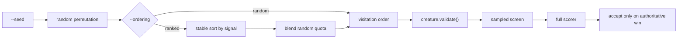

# Named candidate orderings with random as the measured control

## Summary

Ockham can now run its pruning sweep under a **named, reproducible ordering**
instead of only the seeded random permutation, and the report carries the
measures needed to decide whether any ordering actually earns its place.
Closes #11.

The rule the issue insists on is enforced structurally: an ordering only decides
**which hidden neuron is tested sooner**. It produces a `Vec<String>` of hidden
UUIDs and nothing else — every candidate still goes through
`creature.validate()`, the sampled screen and full authoritative scoring exactly
as it does under the control. No ordering can declare a neuron safe to remove.

What landed:

- `ockham/src/ordering.rs` — eight strategies: `random` (control),
  `low-variance`, `low-mean-abs`, `narrow-range`, `low-outgoing-contribution`,
  `low-fan-out`, `high-growth-saving`, `identity-first`.
- Every strategy starts from the seeded random permutation and applies a
  **stable** sort by its ranking key, so ties keep an unbiased random order and
  the whole visitation order is reproducible from `(--seed, --ordering,
  --ordering-random-quota)`.
- `--ordering-random-quota` reserves a fixed fraction of visitation slots for
  the random control — the "mixture that reserves an exploration quota" the
  issue asks for.
- `--ordering` defaults to `random`. **The default is unchanged**: the control
  is still what ships, and only benchmark evidence may move it.
- The journal `start` record names the ordering and its quota, and the
  permutation identity hash now covers seed, ordering name and quota, so two
  strategies can never collide on one identity.
- `neat_ai_ockham report` gained the comparison measures: time to the first
  authoritative local winner, candidates screened before it, accepted-cut size
  distribution, sample/full scorer calls consumed, accepts per hour, and
  growth-cost reduction — alongside the cumulative gain that was already there.

Deliberately **not** done: no ordering was made the default, and no claim is
made about which one wins. That is the experiment this change exists to enable.

## Evidence

This is a backend/CLI change with no web interface, so there is no screenshot to
capture. Evidence is the test suite plus real CLI output.

### Where an ordering sits in the pipeline



The ranking branch feeds the *same* gate chain as the control. That is the
structural reason an ordering cannot weaken a gate.

### Each ordering gets its own reproducible permutation identity

Same creature, same corpus, same `--seed 42`:

```text
random                 quota=0    identity=1a4039bcc93c59ef
low-variance           quota=0    identity=4e6d50a85533b26d
low-variance           quota=0.5  identity=7d4ddc8621f53e2e
identity-first         quota=0    identity=71c676317572be76
```

Re-running any row reproduces its identity and order exactly.

### The journal names the ordering

```json
{"record":"start","seed":42,"ordering":"low-variance","ordering_random_quota":0.0,
 "permutation_identity":"4e6d50a8...","hidden":6,"synapses":15,"opening_score":0.9}
```

### The report compares discovery economics, not the largest single cut

Two runs of the same 6-hidden-neuron creature and fake deterministic scorer,
identical seed and budget:

```text
=== ordering=random ===
  "ordering": "random",
  "cumulativeDelta": 0.00009999999999998899,
  "accepts": 2,
  "fullCalls": 2,
  "firstWinMs": 4,
  "candidatesBeforeFirstWin": 4,
  "acceptedCuts": 2,
  "acceptsPerHour": 900000.0,
  "growthUnitsSaved": 2.3,

=== ordering=low-variance ===
  "ordering": "low-variance",
  "cumulativeDelta": 0.00009999999999998899,
  "accepts": 2,
  "fullCalls": 2,
  "firstWinMs": 3,
  "candidatesBeforeFirstWin": 4,
  "acceptedCuts": 2,
  "acceptsPerHour": 1028571.4285714285,
  "growthUnitsSaved": 2.3,
```

The numbers themselves prove nothing about which ordering is better — this is a
toy creature with a scripted scorer. What they demonstrate is that the
comparison the issue specified is now measurable from the journal alone.

### Quality gate

`./quality.sh` runs clean except for one step that cannot execute in this
container:

```text
spell-check: codespell is not installed.
```

`codespell` has no installable path here (no `pip`, `pipx`, `brew` or `sudo`),
and the script correctly fails loud rather than reporting a false pass. CI runs
it for real. Every other gate was run individually and passes:

```text
shellcheck: all scripts passed
OK   neat-core 0.10.6 matches handled baseline 0.10.6
markdownlint-cli2 ... Summary: 0 issues in 0 files
actionlint (clean)
cargo deny check ... advisories ok, bans ok, licenses ok, sources ok
cargo fmt --all -- --check (clean)
cargo clippy --workspace --all-targets --all-features -D warnings (clean)
cargo test --workspace --all-features -- --test-threads=2 ... 114 passed; 0 failed
RUSTDOCFLAGS="-D warnings" cargo doc (clean)
```

### Security self-check

- Input validation: `--ordering` is parsed against a closed allowlist of eight
  names and rejects anything else by naming the valid set;
  `--ordering-random-quota` is range- and finiteness-checked in `[0, 1)`.
- No secrets, no new dependency, no new shell/SQL/HTTP/filesystem call, no new
  network or privileged surface. `git diff --cached --name-only` staged only
  `README.md`, `ockham/src/*`, `ockham/tests/cli.rs`.

## Test Plan

New tests (all call real functions with real data and assert on results):

`ockham/src/ordering.rs`

- `every_ordering_is_a_permutation_of_the_hidden_neurons` — the safety property:
  across all eight strategies × four quotas, no neuron is dropped or duplicated,
  so an ordering can never shrink the sweep.
- `a_fixed_seed_and_ordering_reproduce_the_same_visitation_order` — the issue's
  reproducibility criterion, for every strategy.
- `random_control_changes_with_the_seed`.
- One test per signal pinning the expected first-visited neuron:
  `low_variance_visits_the_flattest_neuron_first`,
  `low_mean_abs_visits_the_quietest_neuron_first`,
  `narrow_range_visits_the_tightest_neuron_first`,
  `low_outgoing_contribution_multiplies_mean_abs_by_outgoing_weight`,
  `low_fan_out_visits_the_smallest_blast_radius_first`,
  `high_growth_saving_visits_the_biggest_structural_saving_first`,
  `identity_first_visits_identity_neurons_ahead_of_the_rest`.
- `a_random_quota_reserves_exploration_slots_for_the_control`.
- `a_neuron_without_statistics_is_visited_last_not_dropped` — a missing signal
  demotes, it never silently removes a candidate.
- `names_round_trip_and_unknown_names_list_the_valid_set`.
- `an_out_of_range_random_quota_names_the_flag`.

`ockham/src/sweep.rs`

- `a_named_ordering_reprioritises_the_sweep_without_changing_what_is_tested` —
  the gate-integrity test: ranked and control sweeps hold the same UUID set,
  have different permutation identities, and every emitted candidate still
  passes `creature.validate()`.
- `a_named_ordering_is_reproducible_for_a_fixed_seed`.

`ockham/src/run.rs`

- `the_named_ordering_reaches_the_journal_and_the_report` — end-to-end through
  `establish_run`: the ordering and quota appear in `experiments.jsonl` and come
  back out of `summarise`.

`ockham/src/report.rs`

- `report_names_the_ordering_and_its_random_quota`.
- `report_measures_discovery_economics_not_just_the_largest_cut` — pins
  `firstWinMs`, `candidatesBeforeFirstWin`, `acceptedCutSizes`, `screenCalls`,
  `fullCalls`, `acceptsPerHour` and `growthUnitsSaved`.
- `a_journal_written_before_issue_11_still_parses_as_the_random_control` —
  regression guard: journals written before this change still parse, and report
  as the control rather than failing.

`ockham/src/config.rs`

- `defaults_match_the_charter` extended to assert `random` stays the default.
- `bad_values_name_the_flag` extended for the quota.

`ockham/tests/cli.rs`

- `an_unknown_ordering_names_the_valid_strategies`.
- `an_out_of_range_ordering_random_quota_names_the_flag`.
- `help_lists_the_ordering_flags`.

No existing test was removed, commented out or weakened. Full suite: 114 passed,
0 failed.
