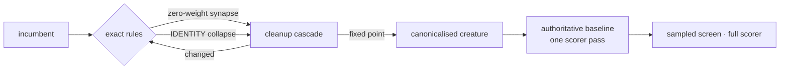

# Run exact zero-risk structural cleanup before statistical pruning

## Summary

Ockham now canonicalises the incumbent with **exact** rewrites before it spends
any scorer budget on statistical ablation. The new `canonical` module drives the
existing cleanup and collapse code — it re-derives none of its semantics — to a
deterministic fixed point over four provably behaviour-preserving rules:
`zero-weight-synapse`, `dead-structure`, `constant-fold` and `identity-collapse`.
The pass runs before the authoritative baseline, so that single full-corpus score
doubles as the one scorer sanity check over the canonicalised creature and **no
exact rewrite consumes a candidate or full score of its own**. What it removed is
reported in `exact-cleanup.json`, as the first `exactCleanup` record in
`experiments.jsonl`, and in `ockham report`. `--no-exact-cleanup` is the control
switch. Closes #110.



## Evidence

Backend/CLI change — no web interface to screenshot. The evidence is the test
suite and the benchmark.

**Tests** — 515 lib tests plus the integration suites pass
(`cargo test --workspace`), including 17 new rule tests in `canonical`, 5 new
run-level tests and 2 new report tests (listed under Test Plan).

**Benchmark** — `cargo run --release --example exact_cleanup_bench`. The
pre-pass is real and timed; the scorer is modelled (2,000,000 records at 20,000
records/ms, one 5% screen plus one full score per dead neuron — deliberately
generous to the statistical route):

```text
   live   ident    zero |   hidden↓    growth↓  pass ms |  screen+full        saved
     50      25      25 |        50       59.9     13.7 |         5250         383×
    200     100     100 |       200      239.9    144.7 |        21000         145×
   1000     250     250 |       500      599.9   2311.5 |        52500          23×
   2000     500     500 |      1000     1199.9   9468.2 |       105000          11×

total: 11938.1ms measured pre-pass work replaced 183750ms of modelled scorer work
```

**Quality gate** — every stage was run and passes except the `codespell`
preflight, which cannot run in this container: `codespell` is not installed and
there is no `pip`/`pipx` to install it. `bash -n`, `shellcheck`, the neat-core
version gate, `markdownlint-cli2`, `actionlint`, `cargo deny check`,
`cargo fmt --check`, `cargo clippy -D warnings`, `cargo test --workspace
--all-features` and `RUSTDOCFLAGS="-D warnings" cargo doc` were each run
individually and pass. The added prose was also grepped for the common
misspellings `codespell` catches; CI runs the real stage on the PR.

<!-- vibe-quality-gate-skipped stage="codespell" reason="codespell not installed in this container and no pip/pipx available; every other gate stage run individually and passing; CI runs it for real" -->

## Acceptance Criteria

<!-- vibe-spec-review inputs="diff+issue-body" -->

- **met** — Unit tests cover each exact rewrite rule and demonstrate identical outputs over representative inputs — evidence: `ockham/src/canonical.rs::exactly_zero_weight_synapses_are_removed`, `::dead_branch_is_removed_and_outputs_are_identical`, `::a_hidden_neuron_with_no_incoming_is_constant_folded_exactly`, `::a_hidden_identity_neuron_is_collapsed_exactly`, each asserting through `assert_same_outputs` over a compiled network — reviewer: met — reason: reviewer noted `dead-structure` and `constant-fold` are only reachable via a zero-weight drop, which is inherent — NEAT-AI-core refuses a valid creature that already carries them
- **met** — Pre-pass reaches a fixed point deterministically — evidence: `ockham/src/canonical.rs::rules_compose_recursively_to_a_fixed_point`, `::canonicalisation_is_deterministic` — reviewer: met
- **met** — No statistical threshold such as `near zero` in the exact pass — evidence: `ockham/src/canonical.rs::a_tiny_non_zero_weight_is_kept` (a `1e-18` weight survives; the test is a bit-exact `weight == 0.0` contract) — reviewer: met
- **met** — Real runs report how much structure was removed before the first statistical screen — evidence: `ockham/src/run.rs::the_exact_pre_pass_removes_provable_structure_before_the_first_screen` (asserts the `exactCleanup` record is the journal's first line) and `ockham/src/report.rs::the_exact_cleanup_record_is_counted_apart_from_the_accepts` — reviewer: met
- **partial** — Benchmark reports wall-clock/scorer work saved — evidence: `ockham/examples/exact_cleanup_bench.rs` — reviewer: partial — reason: the pre-pass wall clock is measured, the scorer side is a documented cost model (a corpus large enough to make the comparison meaningful cannot live in a fixture), so the ratios are modelled, not measured
- **met** — Reuse existing collapse/cleanup code rather than creating divergent semantics — evidence: `ockham/src/canonical.rs` imports `cleanup_cascade` and `collapse_identity`; the module is a driver, not a second implementation — reviewer: met
- **met** — Every transformation has a proof/explicit invariant — evidence: the rule/invariant table in `ockham/src/canonical.rs` module docs and per-rule function docs — reviewer: met
- **met** — Deterministic cleanup report listing removed neurons/synapses and growth units saved — evidence: `CleanupReport` in `ockham/src/canonical.rs`, `::the_report_totals_agree_with_the_snapshots`, filed as `exact-cleanup.json` — reviewer: met
- **met** — Validate the resulting creature — evidence: `ockham/src/canonical.rs` validates the incumbent up front, every step before commit, and the final creature; `::an_invalid_incumbent_fails_loudly` — reviewer: met
- **met** — Optionally one scorer sanity check, never one score per exact rewrite — evidence: `ockham/src/run.rs::the_exact_pre_pass_spends_no_scorer_call_per_rewrite` (a counting scorer proves parity with the `--no-exact-cleanup` control) — reviewer: met
- **partial** — Integrate safely with learnings, coverage and Rebase provenance — evidence: `ockham/src/run.rs::coverage_and_learnings_describe_the_canonicalised_creature`, `CreatureMeta::retain_neurons` carrying surviving neurons' tags — reviewer: partial — reason: the reviewer's gap (no test of the learnings/coverage interaction) was closed by that new test after the review; "Rebase provenance" names no surface in this repo, so it is covered only as the GRQ tag sidecar Ockham actually carries
- **met** — Candidate: hidden neurons with no path to any output, unreachable/dead branches, recursive cleanup exposed by the above — evidence: `ockham/src/canonical.rs::a_chain_with_no_path_to_an_output_is_removed_recursively` — reviewer: met
- **partial** — Candidate: exact constant folding — evidence: `ockham/src/canonical.rs::a_hidden_neuron_with_no_incoming_is_constant_folded_exactly` — reviewer: partial — reason: only *hidden* neurons stranded with no incoming are folded, reusing `cleanup_cascade`; declared `constant`-type neurons are not folded, which would need new semantics rather than the reuse the issue asks for
- **met** — Candidate: exact `IDENTITY` collapse/passthrough — evidence: `ockham/src/canonical.rs::a_hidden_identity_neuron_is_collapsed_exactly`, `::a_cost_increasing_identity_collapse_is_declined_and_counted` — reviewer: met
- **partial** — Candidate: duplicate/parallel synapse consolidation where algebraically equivalent — evidence: `ockham/src/canonical.rs::the_canonicalised_creature_carries_no_duplicate_synapses` — reviewer: partial — reason: no rule of its own — NEAT-AI-core refuses duplicate ordinary synapses, so the only source is `identity-collapse`, which merges by adding weights as it writes; where duplicates are legal (an `IF` target reading its synapses by role) merging is not algebraically equivalent
- **met** — Candidate: zero-weight structural artefacts — evidence: `ockham/src/canonical.rs::exactly_zero_weight_synapses_are_removed`, `::a_zero_weight_into_an_aggregate_target_is_kept`, `::a_zero_weight_typed_synapse_is_kept` — reviewer: met
- **met** — Do not include approximate pruning in this pass — evidence: no activation statistic, sampled score or tolerance is read anywhere in `ockham/src/canonical.rs` — reviewer: met
- **unrequested** — `--no-exact-cleanup` flag, `OckhamConfig::exact_cleanup` and the `ConfigReport` field — evidence: `ockham/src/main.rs`, `ockham/src/config.rs` — reviewer: unrequested — reason: the control arm the benchmark and the acceptance criteria need ("how much was removed before the first screen" is only measurable against a run without the pass), and the escape hatch for a new on-by-default behaviour
- **unrequested** — the pre-pass is on by default, and the pre-existing loop/CLI tests opt out via a test-local default — evidence: `ockham/src/run.rs` (`test_defaults`), `ockham/tests/cli.rs`, `ockham/tests/sweep_restart.rs` — reviewer: unrequested — reason: those fixtures are hidden `IDENTITY` creatures built to exercise the sampled path, which the pass now canonicalises away before the sweep sees them; the opt-out is documented at each site and no test was removed or weakened
- **unrequested** — opening `best.json` is re-serialised through `CreatureMeta::serialize_with` when the pass fired — evidence: `ockham/src/run.rs` — reviewer: unrequested — reason: it must be the creature the baseline actually scored, with tags reattached; the untouched case still publishes the source bytes (`::an_already_canonical_incumbent_reports_and_changes_nothing`)
- **unrequested** — `BaselineRun.incumbent` keeps describing the source creature while the baseline describes the canonicalised one — evidence: `ockham/src/run.rs` — reviewer: unrequested — reason: the source metadata is the provenance record and must not silently change meaning; both field docs now say which creature they describe

## Standards Review

<!-- vibe-standards-review inputs="diff+CODING-STANDARDS.md" -->

- **violation** — the pre-pass adopts a new incumbent with no scorer result of its own, which the reviewer read against "only a full-corpus scorer result can accept a candidate" — evidence: `ockham/src/run.rs` (`exact_cleanup_pre_pass`) — reason: stands, and deliberately: the rewrites are proven equivalent rather than proposed, and `best.json` is written only *after* `establish_baseline` has full-scored the canonicalised creature, so nothing is published above a score it did not earn. The issue explicitly permits one sanity check and forbids one score per rewrite
- **violation** — module docs claimed identical outputs "for every finite input", which is exact in real arithmetic but not bit-identical in `f32` — evidence: `ockham/src/canonical.rs` module docs — reason: fixed here — the docs and README now say *algebraically* exact and name the rounding
- **violation** — `cumulative_delta` documented as the gain from "the opening parent" while the parent is now the canonicalised creature — evidence: `ockham/src/run.rs` (`BaselineRun`) — reason: fixed here — the field doc says what it counts and points at `exactCleanup` for the rest
- **violation** — false failure marker: a refused zero-weight *batch* filed a `rejected` note even when the per-synapse retry then succeeded, and re-filed it every pass — evidence: `ockham/src/canonical.rs` (`try_drop`) — reason: fixed here — the batch attempt records nothing, only a genuinely refused individual drop is a finding, and findings are deduplicated
- **violation** — DRY: `rule_growth_units` restated `ablation::growth_units`'s `hidden + synapses / 10` with its own constant — evidence: `ockham/src/canonical.rs` — reason: fixed here — it now composes `growth_units`, which is linear in both terms
- **violation** — undocumented artefact `workspace/canonical.json`, and `exact-cleanup.json` skipped when the pass changed nothing despite the README promising rolled-back rewrites are named in the report — evidence: `ockham/src/run.rs` — reason: fixed here — the extra artefact is gone and the report is filed whenever the pass ran
- **violation** — `skip_code` introduces a second reason-code vocabulary beside `BlockedReason` — evidence: `ockham/src/canonical.rs` — reason: stands — `BlockedReason` folds `cost-increase` and `not-identity` into `Other`, losing exactly the distinction `collapseSkips` exists to report; the eight codes are now documented in the README pre-pass section
- **violation** — small, focused files: the pre-pass orchestration and its tests were added to `run.rs`, already the largest file in the crate — evidence: `ockham/src/run.rs` — reason: stands — the rewrite logic is in its own module (`canonical.rs`); what landed in `run.rs` is the pipeline step itself, which belongs beside `establish_run` and the incumbent/meta/journal state it threads
- **clean** — Australian English throughout (canonicalise, behaviour, optimisation); the supplied creature is never written and the run re-verifies its bytes; `creature.validate()` on the incumbent, every step and the result; tests call real functions and compile/activate real networks rather than grepping source; version bumped 0.1.45 → 0.1.46 with the lockfile; README updated in the same change (section, flag row, output row, report measures, repository tree); no secrets or hidden files staged; the only collateral edit is `Deserialize` on `StructureSnapshot`, with a comment saying why

## Test Plan

New unit tests — `ockham/src/canonical.rs` (17):

- `exactly_zero_weight_synapses_are_removed`, `a_tiny_non_zero_weight_is_kept`,
  `a_zero_weight_into_an_aggregate_target_is_kept`,
  `a_zero_weight_typed_synapse_is_kept`,
  `two_zero_weight_feeds_of_one_output_never_both_go`,
  `the_last_incoming_synapse_of_an_output_is_kept` — the zero-weight rule and
  every guard on it
- `dead_branch_is_removed_and_outputs_are_identical`,
  `a_chain_with_no_path_to_an_output_is_removed_recursively` — dead structure
- `a_hidden_neuron_with_no_incoming_is_constant_folded_exactly` — constant fold,
  asserting the folded bias to `1e-12`
- `a_hidden_identity_neuron_is_collapsed_exactly`,
  `a_cost_increasing_identity_collapse_is_declined_and_counted`,
  `the_canonicalised_creature_carries_no_duplicate_synapses` — IDENTITY collapse
- `rules_compose_recursively_to_a_fixed_point`,
  `canonicalisation_is_deterministic`,
  `an_already_canonical_creature_is_returned_unchanged`,
  `the_report_totals_agree_with_the_snapshots`,
  `an_invalid_incumbent_fails_loudly` — fixed point, determinism, report and
  fail-loud behaviour

New run-level tests — `ockham/src/run.rs` (5):

- `the_exact_pre_pass_removes_provable_structure_before_the_first_screen`
- `the_exact_pre_pass_spends_no_scorer_call_per_rewrite`
- `no_exact_cleanup_leaves_the_structure_for_the_sweep`
- `an_already_canonical_incumbent_reports_and_changes_nothing`
- `coverage_and_learnings_describe_the_canonicalised_creature`

New report tests — `ockham/src/report.rs` (2):

- `the_exact_cleanup_record_is_counted_apart_from_the_accepts`
- `a_journal_without_a_cleanup_record_reports_no_pre_pass_saving`

Modified tests: the pre-existing loop tests in `ockham/src/run.rs` now build
their config from a test-local default with `exact_cleanup: false`, and two
`ockham/tests/cli.rs` cases plus `ockham/tests/sweep_restart.rs` pass
`--no-exact-cleanup`. Their fixtures are hidden `IDENTITY` creatures that exist
to exercise the sampled path, which the new default would canonicalise away
before the sweep ran. No test was removed, weakened or commented out.
