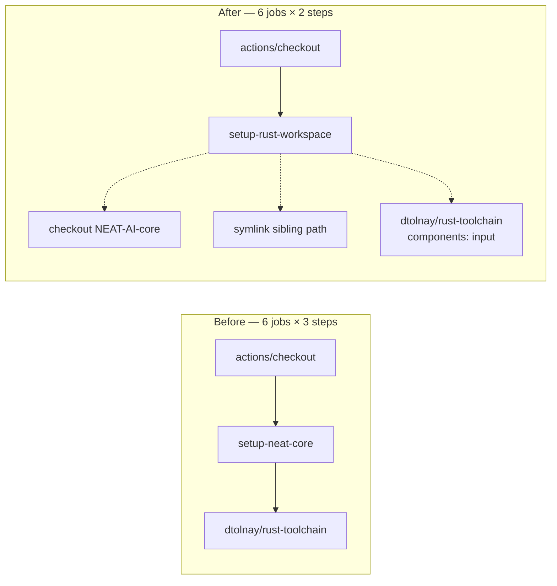

# PR Summary — Issue #126

## Summary

The neat-core sibling checkout and the `dtolnay/rust-toolchain` pin were
copy-pasted across six Cargo jobs in five workflow files, so bumping the
toolchain SHA meant six identical hand-applied edits. `.github/actions/setup-neat-core`
is renamed to `.github/actions/setup-rust-workspace` and now installs the
toolchain as well, behind an optional `components` input; all six call sites
collapse to a single `uses:` step. Closes #126.

**One deviation from the suggested fix.** The issue asks for the workflow's own
`actions/checkout` to move into the composite action too, collapsing three steps
into one. That is not possible: a local composite action (`uses: ./…`) is
resolved from the checked-out tree, so the repository must already be on disk
before the action exists to run. The preamble therefore collapses from three
steps to two, and the constraint is recorded in the action's own description so
the next reader does not re-attempt it.

`cargo-audit.yml` keeps its own `dtolnay/rust-toolchain` step and is deliberately
untouched — it was not among the five files in the issue, it does not need the
neat-core sibling (`cargo audit` reads `Cargo.lock` directly), and routing it
through the composite would add an unnecessary repository checkout to every run.

### Before / after



## Evidence

Backend/CI-configuration change with no web interface to screenshot. The
evidence is the linter and the regression test, both run in this container.

**Behaviour is unchanged per call site.** `dtolnay/rust-toolchain` at the pinned
SHA builds its rustup flags with `for c in ${components//,/ }`, so an empty
`components` produces exactly the same command line as an omitted one — the four
jobs that installed the bare toolchain still do, and the two that asked for
`rustfmt, clippy` still pass them through the new input.

**actionlint validates local composite-action inputs**, so it is a real gate on
this change, not a formatting check. Against the *old* action, passing the new
input failed:

```text
.github/workflows/sbom.yml:64:11: input "components" is not defined in action
"Set up NEAT-AI-core sibling" defined at "./.github/actions/setup-neat-core".
available inputs are "ref" [action]
```

After the change `actionlint` exits 0 across all eleven workflows, and still
rejects an undeclared input (`toolchain: nightly` → exit 1), confirming the
check retains its teeth.

Full gate stages run individually because `codespell` cannot be installed in
this container (no `pip`/`pip3`) — see the skip note below. All others pass:
shellcheck, neat-core version gate, markdownlint (0 issues), actionlint (0),
`cargo deny check` (advisories/bans/licenses/sources ok), `cargo fmt --check`,
clippy with `-D warnings`, `cargo test --workspace --all-features`
(550 + 47 tests, 0 failures), and rustdoc with `-D warnings`.

<!-- vibe-quality-gate-skipped reason="codespell is not installed in this container and there is no pip/pip3 to install it; ./quality.sh stops at that stage. Every other gate stage was run individually and passed. CI runs codespell for real." -->

## Test Plan

Added `ockham/tests/workflow_preamble.rs`, following the existing
workflow-as-contract pattern of `ockham/tests/workflow_pins.rs`:

- `composite_callers_do_not_install_the_toolchain_themselves` — a workflow that
  calls `setup-rust-workspace` must not also carry a `dtolnay/rust-toolchain`
  step. Verified red by re-adding the duplicated step to `sbom.yml`:
  `.github/workflows/sbom.yml:66: installs the Rust toolchain directly while
  also calling 'setup-rust-workspace' …`; green with the step removed.
- `the_toolchain_pin_has_one_home_per_call_site` — the composite action installs
  the toolchain exactly once and exposes a `components` input.
- `no_workflow_references_the_retired_action_path` — no workflow still points at
  the renamed `setup-neat-core`, which would fail to resolve on the runner.
  Verified red against the pre-change workflows (`git stash push -- .github`):
  all three tests failed; all three pass after.

Existing suites are unmodified and pass unchanged.

## Documentation

- `CONTRIBUTING.md` — the CI-layout paragraph now names
  `.github/actions/setup-rust-workspace` and what it covers.
- `ockham/Cargo.toml` — the path-dependency comment pointing at the old action
  directory is updated to the new one.
