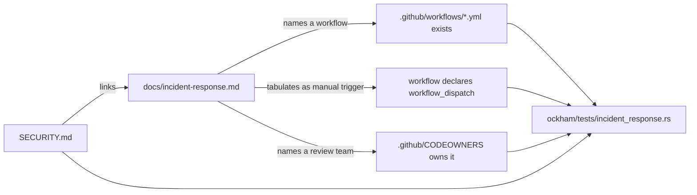

# 🪒 Document the emergency dependency-update override (Issue #129)

## Summary

`SECURITY.md` documented vulnerability *disclosure* but nothing about
expediting an internal fix, and `CONTRIBUTING.md` described only the standard
gate. A maintainer facing an actively exploited advisory against a pinned crate
had to improvise the override under pressure: `cargo-audit.yml` and
`cargo-upgrade.yml` both carry `workflow_dispatch`, but nothing pointed at it.

This adds `docs/incident-response.md` — the fast lane — and links it from
`SECURITY.md` under a new **Expediting a fix** section. The runbook states when
the override applies (advisory against a crate in `Cargo.lock`, active
exploitation, waiting is itself the risk), tabulates the manually dispatchable
workflows and what each is for, gives the direct-bump steps, and names
`@stSoftwareAU/developers` as the expedited reviewer. It is equally explicit
about what the override does **not** shorten: `ci-required`, `./quality.sh`, and
code-owner review — no `--no-verify`, no admin merge, no disabled check.

Documentation-only, plus a contract test. Closes #129.

## Evidence

No web interface to screenshot — this is a documentation and test-only change.
The Playwright browser tools were not present in this session (`ToolSearch` for
`browser_navigate` / `browser_take_screenshot` returned "No matching deferred
tools found"), so the diagram below is offered as the rendered artefact GitHub
produces from the committed source rather than as a captured image.

The runbook is checked against the repository rather than against itself, so it
cannot silently rot:



Test run after the final edit:

```text
cargo test --test incident_response
test result: ok. 8 passed; 0 failed
cargo test --workspace --all-features -- --test-threads=2
test result: ok. 550 passed; 0 failed   (+ 55 across the integration suites)
```

Quality gate: `./quality.sh` was run in full. Shell syntax, shellcheck, the
neat-core version gate, markdownlint (43 files), actionlint, `cargo deny check`
(advisories/bans/licenses/sources ok), `cargo fmt --check`, clippy with
`-D warnings`, the full test suite and `cargo doc -D warnings` all pass. The
codespell stage could not run here — neither `codespell` nor `pip` is installed
in this container (`spell-check: codespell is not installed`) — so CI's
spell-check job is the enforcing run for that one stage. No other check was
skipped.

## Test Plan

New file `ockham/tests/incident_response.rs` (8 tests), following the
established README-as-contract pattern. Written first: all 7 repository-facing
tests failed against the unfixed tree (`docs/incident-response.md: No such file
or directory`) and pass after the change.

- `runbook_exists_and_states_its_purpose` — the runbook keeps its
  when-to-use / fast-lane / after-the-incident sections.
- `security_policy_links_the_runbook` — `SECURITY.md` links the runbook and
  keeps the **Expediting a fix** section, so the entry point survives.
- `every_workflow_the_runbook_names_exists` — every `*.yml` cited resolves to a
  real file in `.github/workflows/`; a renamed workflow fails the test.
- `every_tabulated_workflow_is_manually_dispatchable` — every workflow offered
  as a manual trigger really declares `workflow_dispatch`; removing that
  trigger from `cargo-audit.yml` turns the runbook into a lie and the test red.
- `the_dependency_cadence_workflows_are_on_the_fast_lane` — `cargo-audit.yml`
  and `cargo-upgrade.yml` stay on the fast lane, since they are the cadence
  being short-circuited.
- `every_review_team_the_runbook_names_owns_reviews` — every `@org/team` named
  is present in `.github/CODEOWNERS`.
- `runbook_keeps_the_gate_and_never_sanctions_bypassing_it` — the runbook still
  states that `ci-required` and `quality.sh` apply.
- `workflow_mention_and_table_parsers_read_markdown` — unit test for the three
  parsers and the `workflow_dispatch` detector, including the negative case
  where the phrase appears only inside a YAML comment.

Also updated: the `docs/` tree in the README repository-layout section lists the
new file.
