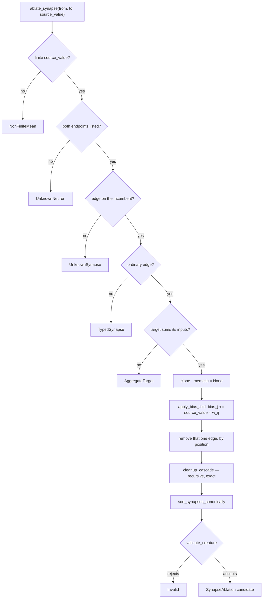

# `ablate_synapse` — remove one ordinary synapse with bias compensation

## Summary

Adds `ablate_synapse` to `ockham/src/ablation.rs`: the third member of the
ablation family, where the unit removed is the **edge**, not the neuron. The
removed synapse's contribution is folded into the target's bias
(`bias_j' = bias_j + source_value × w_ij`), the existing `cleanup_cascade`
strips whatever that cut stranded, and the candidate must pass
`validate_creature` before it is emitted. Nothing calls it yet — sweep wiring,
coverage, learnings and reporting are separate sub-issues.

`AblationSkip::UnknownSynapse { from_uuid, to_uuid }` is new, maps to
`BlockedReason::UnsafeTopology`, and returns `false` from
`substitution_may_help()` — there is no constant to substitute for an edge that
is not there. No weight, magnitude or contribution threshold appears anywhere in
the new code: every ordinary synapse is eligible and the full-corpus scorer
remains the only acceptance authority.

Closes #133.

## Evidence

Backend/library change with no web interface, so there is no screenshot to
capture; the evidence is the test suite and a mutation check.

- `cargo test --workspace --all-features -- --test-threads=2`: 560 lib tests +
  every integration suite pass; the 28 `ablation` tests include the 10 added
  here.
- `cargo clippy --workspace --all-targets --all-features -D warnings
  -D clippy::filter_next -D clippy::collapsible_if`, `cargo fmt --all --check`,
  `cargo deny check`, `markdownlint-cli2`, `actionlint` and
  `RUSTDOCFLAGS="-D warnings" cargo doc` all clean.
- Mutation check: deleting the `apply_bias_fold` call turns four of the new
  tests red (`folding_one_edge_leaves_the_mean_output_unchanged`,
  `cutting_the_last_outgoing_edge_cascades_the_chain`,
  `cutting_a_constants_only_edge_cascades_the_constant`,
  `an_output_left_with_no_incoming_edge_is_still_a_candidate`), so the
  compensation is genuinely asserted rather than incidentally green.
- Behaviour probed against NEAT-AI-core rather than assumed: `validate_creature`
  **accepts** an output neuron left with no incoming synapse (see the
  Acceptance Criteria note on the fifth fail-closed case).

## Acceptance Criteria

<!-- vibe-spec-review inputs="diff+issue-body" -->

- **met** — `ablate_synapse` removes exactly one ordinary synapse and returns a
  creature that passes `validate_creature` — evidence:
  `ockham/src/ablation.rs::ablate_synapse`,
  `ablation.rs::only_the_folded_edge_is_removed_when_a_pair_repeats`,
  `ablation.rs::a_pure_edge_cut_costs_one_tenth_of_a_growth_unit` — reviewer:
  partial — reason: the reviewer's first gap was real — removal by `(from, to)`
  also dropped a second edge on the same pair, uncompensated — and is fixed in
  commit `4cfe4b7` (removal by position) with the named regression test; its
  second gap, that an `input-N` source is reported `UnknownNeuron`, is the
  issue's own "unknown `from_uuid`" fail-closed rule and is pinned by test, and
  no input activation statistic exists to fold anyway
  (`stats::compute_activation_stats` measures hidden neurons only).
- **met** — mean output unchanged to within `1e-9` for a linear/`IDENTITY` path
  — evidence: `ablation.rs::folding_one_edge_leaves_the_mean_output_unchanged`
  — reviewer: met
- **met** — cutting the last outgoing synapse cascades the neuron away, and a
  chain cascades recursively, listed with `reason: "no-outgoing"` — evidence:
  `ablation.rs::cutting_the_last_outgoing_edge_cascades_the_chain` — reviewer:
  met
- **met** — the same for a `constant` neuron left with no outgoing synapse —
  evidence: `ablation.rs::cutting_a_constants_only_edge_cascades_the_constant`
  — reviewer: met
- **met** — a pure removal reports `after.growth_units == before.growth_units -
  0.1` — evidence: `ablation.rs::a_pure_edge_cut_costs_one_tenth_of_a_growth_unit`
  — reviewer: met
- **partial** — a typed synapse, an aggregate target, a non-finite
  `source_value`, an unknown edge **and a removal that would strand an output
  neuron** each return the specific `AblationSkip` and produce no candidate —
  evidence: `ablation.rs::a_typed_edge_and_an_aggregate_target_fail_closed`,
  `ablation.rs::unknown_endpoints_edges_and_source_values_fail_closed`,
  `ablation.rs::a_candidate_creature_validate_rejects_is_not_emitted` —
  reviewer: partial — reason: four of the five are met; the fifth rests on a
  premise NEAT-AI-core does not hold. `creature.validate()` **accepts** an
  output with no incoming synapse (probed directly, and already pinned for the
  neuron transform by the pre-existing
  `a_group_cut_that_disconnects_every_output_folds_it_to_a_constant`), so no
  `Invalid` is reachable there and inventing a rejection would be the razor
  overruling the scorer. The emitted-candidate behaviour is pinned by
  `an_output_left_with_no_incoming_edge_is_still_a_candidate`, and the `Invalid`
  gate itself is covered separately.
- **met** — `AblationSkip::UnknownSynapse` maps to
  `BlockedReason::UnsafeTopology` and `substitution_may_help() == false`,
  asserted by test — evidence:
  `ablation.rs::an_unknown_synapse_is_unsafe_topology_with_no_substitution` —
  reviewer: met
- **met** — no numeric threshold on weight or contribution in the new code —
  evidence: `ockham/src/ablation.rs::ablate_synapse` — the only numeric
  predicate is `source_value.is_finite()` — reviewer: met
- **met** — `cargo test`, `cargo clippy -- -D warnings` and `cargo fmt --check`
  pass — evidence: full-workspace run recorded under Evidence — reviewer: met —
  reason: `./quality.sh` stops at its codespell preflight because neither
  `codespell` nor `pip` is installed in this container; every other stage of the
  gate was run individually and passed, and CI runs codespell for real.
- **unrequested** — `an_output_left_with_no_incoming_edge_is_still_a_candidate`
  — reviewer: unrequested — reason: it pins the verified behaviour behind the
  criterion above, so the contract is asserted rather than left implicit.
- **unrequested** — the whole-pair typed check: every synapse on the requested
  pair passes `require_ordinary`, so an ordinary edge coexisting with a typed
  one is refused rather than cut — reviewer: unrequested — reason: fail closed
  where the role-carrying edge makes the fold ambiguous, matching the
  neuron transform's `reject_unfoldable_edges`.
- **unrequested** — `ockham/src/lib.rs` module-table row for the new transform —
  reviewer: unrequested — reason: the crate's index of transforms is a
  documented surface this code change owes an update to.
- **unrequested** — `ockham/Cargo.toml` / `Cargo.lock` version bump 0.1.50 →
  0.1.51 — reviewer: unrequested — reason: the reviewer judged it "not creep",
  required by `CONTRIBUTING.md` principle 8; listed here for completeness.

## Standards Review

<!-- vibe-standards-review inputs="diff+CONTRIBUTING.md+fleet standards" -->

The repo has no `CODING-STANDARDS.md`; the standards reviewer was given
`CONTRIBUTING.md` ("Principles every change must keep", commit and version
conventions) plus the fleet-wide engineering standards.

- **violation** — never fail silently: removal by `(from, to)` dropped every
  edge on the pair while only one was bias-folded — evidence:
  `ockham/src/ablation.rs:573` (pre-fix) — reason: fixed in `4cfe4b7`; the
  folded edge is now removed by position and
  `only_the_folded_edge_is_removed_when_a_pair_repeats` covers it.
- **violation** — a documented surface changed without its docs: the new
  `unsafe-topology` case was absent from the blocked-reason table — evidence:
  `docs/blocked-reasons.md:16` — reason: fixed in `4cfe4b7`, which names the
  #133 case alongside the #103/#108/#109 ones.
- **violation** — README described `ablation.rs` as neuron-only — evidence:
  `README.md:2101` — reason: the module map now reads "mean-activation +
  single-synapse ablation + cleanup". The "Current state" capability bullets
  (`README.md:32`) are deliberately unchanged: nothing calls the transform yet,
  and listing it there would claim a run capability this PR does not ship.
- **violation** — DRY: third verbatim copy of the clone → `memetic = None` →
  snapshot → `cleanup_cascade` → sort → validate block — evidence:
  `ockham/src/ablation.rs:558-580` — reason: stands. Extracting a shared helper
  would refactor `ablate_mean` and `ablate_group`, which this issue explicitly
  scopes out ("the pure transform only"); it is the right follow-up once the
  sweep wiring lands.
- **clean** — Australian English throughout; CONTRIBUTING principles 1–8 (the
  incumbent is never written to, asserted in three tests; approximate
  generation, untouched acceptance; every candidate through
  `creature.validate()`; version bumped, no changelog); scope limited to
  `ablation.rs`, the lib table and the two docs surfaces; typed `AblationSkip`
  on every failure path with no silent fallback; tests call real
  `compile_creature` / `activate` / `validate_creature` with real data, cover
  happy path, both cascade paths and every error path, run deterministically in
  ~1s with no sleeps and no absolute wall-clock assertions (the float comparison
  uses dyadic-rational fixtures, so the f32 activation is exact); no secrets, no
  I/O, no injection surface; no hidden files staged. One consistency note the
  reviewer did not raise as a violation: `UnknownSynapse`'s `Display` omits the
  `; skipped` suffix its aggregate/typed siblings carry — it reads
  ``no synapse `a`→`b` ``, matching `UnknownNeuron`'s ``no neuron `u` `` form
  instead.

## Test Plan

Added to `ockham/src/ablation.rs` (all new):

- `folding_one_edge_leaves_the_mean_output_unchanged` — mean output preserved to
  `1e-9` over four inputs, plus the exact folded bias and an untouched second
  output.
- `a_pure_edge_cut_costs_one_tenth_of_a_growth_unit` — no cascade, one fewer
  synapse, `growth_units` down exactly 0.1.
- `cutting_the_last_outgoing_edge_cascades_the_chain` — recursive `no-outgoing`
  cascade over `h_leaf` then `h_up`.
- `cutting_a_constants_only_edge_cascades_the_constant` — the same for a
  `constant` neuron, asserting `neuron_type` and `after.constant_neurons == 0`.
- `only_the_folded_edge_is_removed_when_a_pair_repeats` — regression test for
  the review fix: the uncompensated second edge survives.
- `a_typed_edge_and_an_aggregate_target_fail_closed` — `TypedSynapse` and
  `AggregateTarget`, incumbent unmutated.
- `unknown_endpoints_edges_and_source_values_fail_closed` — NaN, infinity,
  unknown source, unknown target, an input source, and an absent edge.
- `an_unknown_synapse_is_unsafe_topology_with_no_substitution` — the reason
  code, the substitution verdict and the `Display` string.
- `a_candidate_creature_validate_rejects_is_not_emitted` — the `Invalid` gate,
  via a fixture breaking NEAT-AI-core rule 14.
- `an_output_left_with_no_incoming_edge_is_still_a_candidate` — the emitted
  candidate the scorer, not the razor, judges.

Fixtures added alongside them: `shared_output_fan_out`, `constant_leaf`,
`ordinary_edge_into_aggregate`, and the `mean_output` helper.
