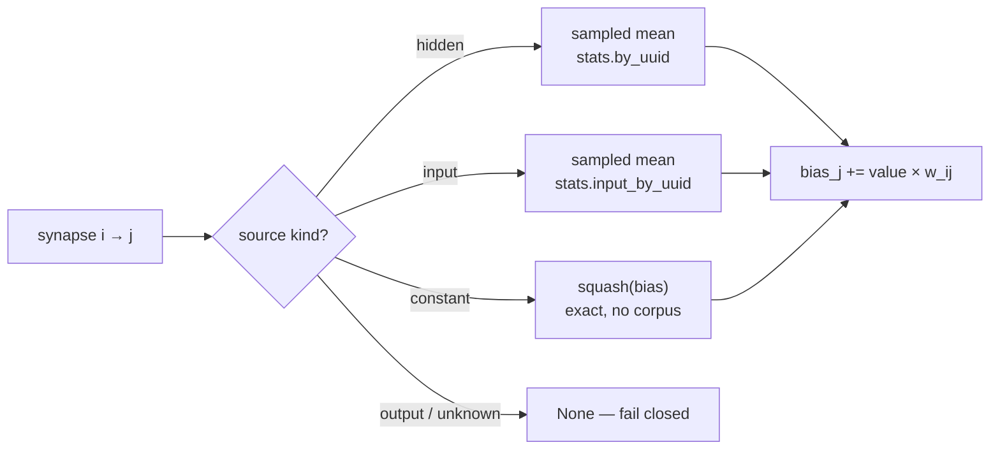

# 🪒 Resolve synapse-source fold values for constant and input neurons

## Summary

The activation scan measured hidden neurons only, so a synapse whose source was
an input or a constant had no value to fold and the cut would fail closed for
want of a statistic — "every ordinary synapse is a prune candidate" degraded to
"every hidden-sourced synapse is a prune candidate".

This change teaches Ockham what those sources contribute:

- the scan accumulates **input** post-activation means alongside the hidden
  ones, on the same pass and from the same activation buffer — one accumulator
  per measured neuron, so the bound is hidden + input rather than hidden;
- `stats::source_value(creature, stats, uuid) -> Option<SourceValue>` is the one
  resolver for every source kind: the sampled mean for a hidden or input source
  (`SourceValueKind::Mean`), the exactly computed `squash(bias)` for a
  `constant` (`SourceValueKind::Constant`, no corpus read at all), and `None`
  for an output, an unknown uuid, an aggregate squash, an unmeasured neuron or a
  non-finite value;
- `ActivationStats::by_uuid` is unchanged in meaning — hidden neurons only — so
  ordering, feature vectors and merge discovery see exactly the population they
  saw before. Input means live in a separate `inputs` vector behind
  `input_by_uuid`, and inputs carry no merge probes.

Closes #134.

## Evidence

Backend/library change with no web interface to screenshot. The evidence is the
test suite and the local gate.

- `cargo test --workspace --all-features -- --test-threads=2` — **565** lib
  tests plus every integration suite, 0 failures.
- `cargo clippy --workspace --all-targets --all-features -- -D warnings -D
  clippy::filter_next -D clippy::collapsible_if` — clean.
- `cargo fmt --all -- --check`, `RUSTDOCFLAGS="-D warnings" cargo doc --workspace
  --no-deps --all-features`, `markdownlint-cli2`, `actionlint`, `cargo deny
  check` — all clean.
- Red-capability check: with the input accumulation removed from the record
  loop, `input_means_are_recorded_by_the_scan_and_match_a_hand_calculation` and
  `memory_is_bounded_by_hidden_plus_input_neuron_count` both fail (`left: 0,
  right: 4` / `right: 10000`); with it restored they pass.

<!-- vibe-quality-gate-skipped reason="codespell not installable in this container — no pip/pipx; every other ./quality.sh stage was run individually and passed" -->

`./quality.sh` stops at its codespell preflight because `codespell` is not
installed in this container and there is no `pip`/`pipx` to install it. Every
other stage of the gate was run individually and passed (listed above); CI runs
codespell for real on the PR. No American spellings were introduced — checked
by hand over the diff.

## Behaviour changes worth a reviewer's attention

1. **A creature with no hidden neuron is now scanned for its inputs.** It used
   to return an empty measurement without reading the corpus. Its
   `input -> output` edges are prune candidates and a cut folds the source's
   mean, so leaving them unmeasured would keep exactly the shape this issue is
   about failing closed. Two existing tests are restated for the new contract
   rather than removed:
   `a_creature_without_hidden_neurons_is_not_scanned_at_all` →
   `a_creature_without_hidden_neurons_is_still_scanned_for_its_inputs`, and the
   assertion inside `run::tests::baseline_gate_writes_workspace_and_does_not_prune`.
2. **Input means gate adaptive stopping.** A folded input mean must be as
   converged as a hidden one, so inputs join the relative-standard-error check.
   A scan whose inputs are still moving now runs on where it previously stopped
   at the floor — bounded, as before, by `--stats-sample-records`. Pinned by
   `a_moving_input_holds_the_scan_open_past_a_settled_hidden_neuron`.
3. **`STATS_FORMAT_VERSION` 2 → 3.** A v2 cache entry deserialises with no input
   means; serving one would leave every input-sourced synapse unresolvable while
   reading as a cache hit. The version keys the cache, so stale entries are
   refused instead.

## Acceptance Criteria

<!-- vibe-spec-review inputs="diff+issue-body" -->

- **met** — `source_value` returns the sampled mean for a hidden source, the
  exact squashed bias for a `constant` source, and the sampled mean for an
  `input` source — evidence: `ockham/src/stats.rs::source_value`, exercised by
  `ockham/src/stats.rs::input_means_are_recorded_by_the_scan_and_match_a_hand_calculation`
  — reviewer: met
- **met** — Unit test: a `constant` source resolves without any corpus scan at
  all, and its value equals `apply_squash(squash, bias)` to within `1e-12` —
  evidence: `ockham/src/stats.rs::a_constant_source_resolves_exactly_without_any_corpus_scan`
  (resolves against `ActivationStats::empty()`) — reviewer: met
- **met** — Unit test: an aggregate-squash `constant` source, an `output`
  source, and an unknown uuid each resolve to `None` — evidence:
  `ockham/src/stats.rs::an_aggregate_constant_an_output_and_an_unknown_uuid_resolve_to_none`
  — reviewer: met
- **met** — Unit test: input-neuron means are recorded by the scan and match a
  hand-computed mean over a fixture corpus — evidence:
  `ockham/src/stats.rs::input_means_are_recorded_by_the_scan_and_match_a_hand_calculation`
  — reviewer: met
- **met** — Regression test: `by_uuid` still returns `Some` only for hidden
  neurons, asserted against a creature with inputs, hidden neurons and constants
  — evidence: `ockham/src/stats.rs::by_uuid_still_answers_for_hidden_neurons_alone`
  — reviewer: met
- **met** — Existing scan determinism and memory-bound tests still pass, with
  the memory bound restated as hidden + input — evidence:
  `ockham/src/stats.rs::the_sample_plan_is_deterministic_ascending_and_capped`
  unchanged and
  `ockham/src/stats.rs::memory_is_bounded_by_hidden_plus_input_neuron_count`
  — reviewer: met
- **met** — `cargo test`, `cargo clippy -- -D warnings` and `cargo fmt --check`
  pass — evidence: the Evidence section above — reviewer: met
- **met** — Extend the activation scan to accumulate input means alongside the
  hidden ones, reusing the existing accumulator rather than a second pass —
  evidence: `ockham/src/stats.rs` record loop, one `Accumulator` per input
  reading the same activation buffer — reviewer: partial — reason: the reviewer
  saw the hidden-less fast path leave an `input -> output` creature unmeasured;
  that path was removed in response (behaviour change 1 above) and the criterion
  is now satisfied for every creature.
- **unrequested** — input accumulators join the adaptive-stopping convergence
  check — reviewer: unrequested — reason: a mean that is folded into a bias has
  to be as converged as a hidden one, and leaving inputs out would fold an
  under-sampled scalar; pinned by a new test and called out above.
- **unrequested** — `STATS_FORMAT_VERSION` bumped 2 → 3 — reviewer: unrequested
  — reason: the new field is `#[serde(default)]`, so without the bump a v2 cache
  entry would be served as a hit with every input mean silently missing.
- **unrequested** — `SourceValueKind::label()` — reviewer: unrequested — reason:
  the "how it was obtained" the issue asks for has to reach
  `BiasCompensation::kind`, which is a `&'static str` of exactly `mean` /
  `constant`; covered by the resolver tests.
- **unrequested** — README "Synapse-source fold values" section and the
  surrounding wording updates — reviewer: unrequested — reason: the repo's
  standing rule is that a code change owes a docs change; the section says
  plainly that nothing calls the resolver on a run yet.
- **unrequested** — crate version 0.1.51 → 0.1.52 and the scan log line now
  reporting the input count — reviewer: unrequested — reason: `CONTRIBUTING.md`
  principle 8 requires a version bump for a binary-affecting change, and a log
  line naming only hidden neurons would under-report what the scan measured.

## Standards Review

<!-- vibe-standards-review inputs="diff+CODING-STANDARDS.md" -->

No `CODING-STANDARDS.md` exists in this repo; the reviewer used
`CONTRIBUTING.md`, `quality.sh`, `.github/workflows/ci.yml`, the workspace lint
configuration and `docs/blocked-reasons.md`.

- **violation** — `CONTRIBUTING.md` principle 8: no crate version bump on a
  binary-affecting change — evidence: `ockham/Cargo.toml:3` — reason: fixed here,
  0.1.51 → 0.1.52, with `Cargo.lock` updated to match.
- **violation** — `CONTRIBUTING.md` commit convention: the 🪒 prefix, not a
  Conventional Commits taxonomy — evidence: the two `feat:` / `fix:` commit
  subjects — reason: fixed here, both messages rewritten with the 🪒 prefix
  before the branch was pushed.
- **violation** — README claimed an aggregate squash or an uuid the incumbent
  does not carry is recorded as `missing-activation`, which
  `docs/blocked-reasons.md:16` assigns to `aggregate-squash` / `unsafe-topology`
  — evidence: `README.md:269` — reason: fixed here; neither the README nor the
  `source_value` rustdoc names a reason code now, because the code is the
  caller's to pick.
- **violation** (lower confidence) — the README section read as shipped
  behaviour although nothing calls `source_value` yet, against the README's own
  convention of labelling undocumented-as-unimplemented paths — evidence:
  `README.md:251` — reason: fixed here with an explicit sentence saying the
  sweep that calls it lands with the rest of the milestone.
- **clean** — the local gate: `cargo fmt --check`, clippy with the repo's three
  extra denies, `cargo test --workspace --all-features`, rustdoc with
  `-D warnings` (every new intra-doc link resolves), `markdownlint-cli2`,
  `actionlint`, `cargo deny check`.
- **clean** — tests call real code: every new test drives
  `compute_activation_stats` over a corpus written to disk, or calls
  `source_value` against a real `CreatureExport`. No source-text grepping.
- **clean** — principle 1 (the supplied creature is never written to):
  `source_value` and its helpers take `&CreatureExport` and only read; tests that
  vary a constant clone first.
- **clean** — fail-loud handling: `Option` rather than a fabricated scalar,
  explicit `is_aggregate()` / `is_finite()` refusals, no swallowed errors, and
  the `#[serde(default)]` field paired with the format-version bump.
- **clean** — Australian English throughout; rustdoc on every new public and
  private item; no hidden or secret paths staged (`README.md`, `Cargo.lock`,
  `ockham/Cargo.toml`, `ockham/src/*.rs`, this summary).

## Test Plan

Added to `ockham/src/stats.rs`:

- `a_constant_source_resolves_exactly_without_any_corpus_scan` — a `constant`
  resolves against `ActivationStats::empty()` (no scan at all) to
  `apply_squash(squash, bias)` within `1e-12`, and a second bias resolves
  differently, so the value is not hardcoded.
- `an_aggregate_constant_an_output_and_an_unknown_uuid_resolve_to_none` — plus
  an unparseable squash, `input-2` past the declared width, `input-007`, and an
  unmeasured hidden neuron.
- `input_means_are_recorded_by_the_scan_and_match_a_hand_calculation` — two
  inputs over a four-record corpus against hand-computed means (2.5 and 1.0),
  the wires not interchangeable, and the hidden source still resolving to its
  own sampled mean.
- `by_uuid_still_answers_for_hidden_neurons_alone` — against a creature with
  inputs, a constant, two hidden neurons and an output: `stats.neurons` is
  exactly the hidden population in listed order, `by_uuid` misses every input,
  constant and output, and merge probes exist for the hidden neurons only.
- `a_moving_input_holds_the_scan_open_past_a_settled_hidden_neuron` — pins the
  adaptive-stopping change.
- `memory_is_bounded_by_hidden_plus_input_neuron_count` — the memory bound
  restated (was `memory_is_bounded_by_hidden_neuron_count`).

Restated for the new contract (business-logic change, not removal):

- `a_creature_without_hidden_neurons_is_still_scanned_for_its_inputs` — was
  `a_creature_without_hidden_neurons_is_not_scanned_at_all`.
- `run::tests::baseline_gate_writes_workspace_and_does_not_prune` — the
  activation assertions only.
