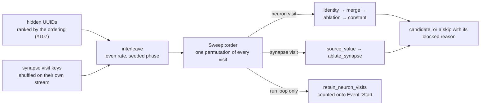

# 🪒 Mix synapse visits into the seeded sweep pool as a `Synapse` candidate kind

## Summary

`Sweep::order` was a permutation of hidden-neuron UUIDs, so the single-synapse
cut #133 built and the fold values #134 resolved had no walk to reach them from.
This change makes the sweep's unit a **visit** — a hidden neuron, or one edge:

- `CandidateKind::Synapse`, and the `"synapse"` arm of `learnings::kind_label`.
- `synapse_key(from, to)` / `parse_synapse_key(key)`, joined by the ASCII UNIT
  SEPARATOR (`U+001F`) so a visit key can never collide with, or be mistaken
  for, a neuron UUID in a keyed store. `parse_synapse_key` fails closed on a
  bare tag, a missing segment, an empty endpoint or a nested key.
- `Sweep::with_ordering` interleaves `ordering::synapse_order` (one key per
  distinct pair, shuffled on its own seed stream) into `ordering::hidden_order`
  at an even rate, from a seeded phase. The orderings go on ranking hidden
  neurons and only hidden neurons — no strategy needs a per-synapse feature
  vector — and `permutation_identity` covers the whole ordered visit list.
- `SweepCandidate` gains `from_uuid`, `to_uuid` and `weight`, each an `Option`
  skipped in serialisation for every other kind, mirroring `merged_with`.
- `propose` gains a synapse branch: resolve the source value, call
  `ablate_synapse`, and return `CandidateKind::Synapse`. No resolvable source is
  `MissingActivation`; every other refusal is the `AblationSkip` under its own
  `blocked_reason()`. A refused visit files a `SweepSkip`, so the walk advances.
- No threshold decides membership. Every ordinary synapse is a visit, and a
  typed one is visited and fails closed rather than being filtered out — a
  blocked visit is still coverage.

The **run loop** keeps walking neuron visits only. Screen-record and
learnings-cache parity (#136), epoch coverage (#137) and accepting a pure
synapse win (#138) each land with their own work, and a visit the run cannot
record is one it would make again every batch forever. The drop happens after
`permutation_identity` is hashed, so it is stated rather than silent:
`Sweep::retain_neuron_visits` returns and records the count, and `Event::Start`
carries `synapse_visits_deferred` beside the `unchecked_first` and
`old_corpus_first` fields that record the other two post-hash reorderings.

Closes #135.

## Evidence

Backend/library change with no web interface, so there is no screenshot to
capture. The evidence is the test suite and the benchmark example the issue
asked for.

`cargo run --release --example synapse_sweep_bench` over a forest-heavy creature
— 799 hidden neurons, 1606 synapses, a typed `IF` gate every eighth tree and a
`MEAN` collector every fifth:

| Figure | Value |
| --- | --- |
| pool | 2386 visits (799 neuron, 1587 synapse) |
| synapse proposals built and validated | 1129 |
| refused | 458 — 270 `aggregate-squash`, 188 `unsafe-topology` |
| removed per proposal built | 2.03 synapses, 0.89 neurons cascaded |
| cost | ~2.3–2.6ms per synapse visit, ~3.2–3.6ms per proposal built |

Two thirds of the edges yield a candidate, and the average proposal built takes
more than the one synapse it asked for — the cleanup cascade takes the structure
the cut stranded with it. Nothing here is accepted: the benchmark scores
nothing, and only the full-corpus scorer accepts.

Gate: `cargo fmt --all -- --check`, `cargo clippy --workspace --all-targets
--all-features -D warnings`, `cargo test --workspace --all-features` (602 unit
tests plus the integration suites), `cargo doc` with
`RUSTDOCFLAGS=-D warnings`, `cargo deny check`, `markdownlint-cli2` and
`actionlint` all pass locally. `codespell` cannot be installed in this container
(no `pip`), so that one stage was not run here; CI runs it on the PR.

## Acceptance Criteria

<!-- vibe-spec-review inputs="diff+issue-body" -->

- **met** — Every ordinary synapse on the incumbent appears exactly once in
  `Sweep::order`, alongside every hidden neuron; typed synapses are visited and
  fail closed — evidence:
  `ockham/src/sweep.rs::every_hidden_neuron_and_every_synapse_is_visited_exactly_once`
  and `::a_typed_synapse_enters_the_pool_rather_than_being_filtered_out` —
  reviewer: met
- **met** — Two `Sweep`s built from the same creature, stats and seed produce
  identical `order` and `permutation_identity`; changing the seed changes both —
  evidence: `ockham/src/sweep.rs::the_seed_alone_decides_the_mixed_order_and_its_identity`
  and `::the_permutation_identity_covers_every_visit_including_the_synapses` —
  reviewer: met
- **met** — `fill_batch_avoiding` returns a mixed batch of neuron and synapse
  candidates, each with a valid creature that passes `creature.validate()` —
  evidence: `ockham/src/sweep.rs::fill_batch_returns_a_mixed_batch_of_valid_candidates`
  — reviewer: met
- **met** — A `CandidateKind::Synapse` candidate carries its `from_uuid`,
  `to_uuid` and `weight`; no other kind serialises those fields — evidence:
  `ockham/src/sweep.rs::only_a_synapse_candidate_carries_and_serialises_its_edge`,
  which asserts both directions over real `serde_json` output — reviewer: met
- **met** — A synapse visit with no resolvable source value is skipped with
  `MissingActivation`; a typed synapse with `UnsafeTopology`; an aggregate
  target with `AggregateSquash` — evidence:
  `ockham/src/sweep.rs::a_synapse_visit_that_proposes_nothing_is_skipped_with_its_reason`
  — reviewer: met — reason: the reviewer noted the value is resolved before any
  structural check, so an edge that is *both* unmeasured and unsafe reports
  `missing-activation`. That is the precedence the issue specifies; it is now
  documented in `docs/blocked-reasons.md` and in the `propose_synapse` doc
  comment
- **met** — `kind_label(CandidateKind::Synapse) == "synapse"` — evidence:
  `ockham/src/learnings.rs:840`, asserted by
  `ockham/src/sweep.rs::a_synapse_candidate_is_labelled_synapse` — reviewer: met
- **partial** — Neuron-visit behaviour is unchanged: an existing sweep test over
  a creature with no prunable synapses still produces the same candidates it
  does today — evidence: `ockham/src/sweep.rs::propose` returns on the synapse
  branch before `is_identity`, so the neuron ladder is untouched — reviewer:
  partial — reason: no *existing* sweep test survives literally unmodified.
  Eight sweep tests and two in `promote.rs` gained a one-line
  `neuron_visits_only(&mut sweep)` / `sweep.retain_neuron_visits()` so their
  original assertions still stand over the neuron half; the edge half has its
  own tests. The reviewer also found
  `the_permutation_identity_predates_the_coverage_reorder` had become vacuous —
  fixed in this diff by restricting it to the neuron half
- **met** — The bench example runs and reports proposals, refusals by reason,
  and per-visit cost — evidence: `ockham/examples/synapse_sweep_bench.rs`, output
  reproduced in the Evidence table above — reviewer: met
- **met** — `cargo test`, `cargo clippy -- -D warnings` and `cargo fmt --check`
  pass — evidence: full gate run after the final edit; see Evidence — reviewer:
  met
- **unrequested** — the run loop is gated so no synapse visit is walked in
  production (`ockham/src/run.rs::fresh_sweep`, plus
  `Sweep::retain_neuron_visits` and the pinning test
  `the_run_walks_neuron_visits_until_synapse_parity_lands`) — reviewer:
  unrequested — reason: a deliberate staging call, not an oversight. #136 gives
  edge visits their screen records, #137 their coverage denominator and #138
  their accept path; walking them before those land would score edges the run
  can neither record nor report, so every visit would be re-made every batch
  forever. The alternative — landing it ungated — required rewriting 32 run-level
  integration tests that encode fleet-visible coverage contracts, which is
  #137's work, not this issue's
- **unrequested** — `Event::Start` gains `synapse_visits_deferred`
  (`ockham/src/journal.rs`) — reviewer: unrequested — reason: the standards
  reviewer found the gate above changed the walk *after*
  `permutation_identity` was hashed with nothing recording it, which is the
  fail-silent shape the repo's own `unchecked_first` / `old_corpus_first` fields
  exist to prevent. Added so the deferral is stated
- **unrequested** — `CandidateKind`, `synapse_key`, `parse_synapse_key` and
  `ordering::synapse_order` re-exported from the crate root
  (`ockham/src/lib.rs`) — reviewer: unrequested — reason: the bench example is a
  crate consumer and needs them; `synapse_order` sits beside the already-exported
  `hidden_order`. The two key-format constants the first draft also exported were
  dropped in response to this finding
- **unrequested** — `ockham/Cargo.toml` version bumped `0.1.51` → `0.1.52` —
  reviewer: unrequested — reason: CONTRIBUTING rule 8 requires it for a
  binary-affecting change, and this one changes `permutationIdentity` inputs and
  the serialised candidate shape

## Standards Review

<!-- vibe-standards-review inputs="diff+CODING-STANDARDS.md" -->

- **violation** — the sweep was mutated after `permutation_identity` was hashed
  with no journal marker, treating absence of a marker as "nothing happened" —
  evidence: `ockham/src/run.rs:2337` — reason: fixed here.
  `Sweep::retain_neuron_visits` records the count, `Event::Start` carries
  `synapse_visits_deferred`, and
  `run::tests::the_journal_states_how_many_synapse_visits_the_run_deferred` pins
  it
- **violation** — no crate version bump for a binary-affecting change
  (CONTRIBUTING rule 8) — evidence: `ockham/Cargo.toml:3` — reason: fixed here,
  bumped to `0.1.52`
- **violation** — four copies of the "drop the synapse half" predicate, so the
  moment #136/#137/#138 remove the gate is the moment copies get missed (DRY) —
  evidence: `ockham/src/run.rs:2340`, `ockham/src/promote.rs:751`,
  `ockham/src/promote.rs:1161`, `ockham/src/sweep.rs:1019` — reason: fixed here,
  all four now call `Sweep::retain_neuron_visits`
- **violation** — `SweepCandidate::is_synapse` was dead public API with no
  caller and no test, and the diff's own code hand-wrote the comparison instead
  — evidence: `ockham/src/sweep.rs:182` — reason: fixed here, removed
- **violation** — `ordering::synapse_order` newly public with no direct test;
  its stream-separation guarantee asserted nowhere — evidence:
  `ockham/src/ordering.rs:316` — reason: fixed here, four unit tests added
  including `the_synapse_shuffle_does_not_disturb_the_neuron_shuffle`
- **violation** — the `interleave_visits` empty-stream branch was unreachable
  from any fixture, so the named edge case went untested — evidence:
  `ockham/src/sweep.rs:474` — reason: fixed here,
  `an_empty_stream_leaves_the_other_one_untouched`
- **violation** — the commonest real refusal (input-sourced edges, 150 of 188
  `unsafe-topology` in the benchmark) had no test, and the `propose_synapse` doc
  wrongly claimed an input source was "all one path" — evidence:
  `ockham/src/sweep.rs:615` — reason: fixed here,
  `an_input_sourced_edge_resolves_a_value_and_still_fails_closed` plus a
  corrected doc comment
- **violation** — the `members`/`cuts()` doc still promised "a real neuron"
  while a synapse candidate seeds `members` with a visit key — evidence:
  `ockham/src/sweep.rs:128` — reason: doc corrected here to state the invariant
  as it now is and to name the kind a consumer must read. The neuron-typed
  accounting in `promote.rs` is unreachable while the run gate stands; giving
  synapse candidates bundle membership is #138's scope
- **violation** — the benchmark dropped refusals carrying no reason code, so the
  printed total could under-count silently — evidence:
  `ockham/examples/synapse_sweep_bench.rs:173` — reason: fixed here, counted and
  printed as `(uncoded)`
- **violation** — `synapse_key` did not validate its endpoints, and a neuron
  literally named like a key parsed as an edge and would be routed into
  `propose_synapse` — evidence: `ockham/src/sweep.rs:70` — reason: fixed at the
  routing boundary, which is where the fault could do harm: `propose` now lets a
  listed neuron win the tie, pinned by
  `a_neuron_named_like_a_visit_key_takes_the_neuron_ladder`
- **violation** — "removed per accepted proposal" in the benchmark and README
  called a built proposal "accepted", in a project whose fourth principle is that
  only the full-corpus scorer accepts — evidence:
  `ockham/examples/synapse_sweep_bench.rs:185`, `README.md:346` — reason: fixed
  here, both now say "built"
- **violation** — the two candidate-kind enumerations in the README were not
  extended with `synapse` / `fromUuid` / `toUuid` / `weight` — evidence:
  `README.md:801`, `README.md:1909` — reason: fixed here, both updated and both
  state that no `synapse` row is written until the run gate lifts
- **violation** — `interleave_visits` put a synapse in slot 0 for every seed and
  every creature, so the top-ranked hidden neuron could never be visited first
  — evidence: `ockham/src/sweep.rs:473` (spec reviewer's finding) — reason:
  fixed here with a seeded phase, pinned by
  `the_seed_moves_the_shape_of_the_mix_not_just_the_order_within_it`
- **clean** — `cargo fmt` and `cargo clippy -D warnings` clean; no `sleep`, no
  wall-clock or absolute timing assertion in any new test; benchmark kept in
  `examples/` and never run by `cargo test`; every new test drives real
  `Sweep`/`propose`/`ablate_synapse`/`validate_creature`/`serde_json` and asserts
  on returned values, with no source-text grepping; every README figure
  reproduced by running the benchmark; Australian English throughout; no hidden
  paths or key material staged; incumbent immutability preserved; no new
  injection surface or leaked internals

## Test Plan

Added in `ockham/src/sweep.rs`:

- `a_synapse_visit_key_round_trips_and_never_collides_with_a_neuron_uuid`
- `every_hidden_neuron_and_every_synapse_is_visited_exactly_once`
- `a_typed_synapse_enters_the_pool_rather_than_being_filtered_out`
- `the_seed_alone_decides_the_mixed_order_and_its_identity`
- `the_seed_moves_the_shape_of_the_mix_not_just_the_order_within_it`
- `the_permutation_identity_covers_every_visit_including_the_synapses`
- `fill_batch_returns_a_mixed_batch_of_valid_candidates`
- `only_a_synapse_candidate_carries_and_serialises_its_edge`
- `a_synapse_visit_that_proposes_nothing_is_skipped_with_its_reason`
- `an_input_sourced_edge_resolves_a_value_and_still_fails_closed`
- `a_creature_whose_edges_all_refuse_still_advances_visit_by_visit`
- `prefer_and_prefer_unchecked_move_synapse_visits_like_any_other`
- `an_empty_stream_leaves_the_other_one_untouched`
- `a_neuron_named_like_a_visit_key_takes_the_neuron_ladder`
- `a_synapse_candidate_is_labelled_synapse`

Added in `ockham/src/ordering.rs`:

- `synapse_order_covers_every_distinct_pair_exactly_once`
- `a_creature_with_no_synapses_yields_no_synapse_visit`
- `synapse_order_is_seed_deterministic`
- `the_synapse_shuffle_does_not_disturb_the_neuron_shuffle`

Added in `ockham/src/run.rs`:

- `the_run_walks_neuron_visits_until_synapse_parity_lands`
- `the_journal_states_how_many_synapse_visits_the_run_deferred`

Modified (documented, none removed or weakened): eight existing `sweep.rs` tests
and two `promote.rs` fixture helpers now call `retain_neuron_visits` /
`neuron_visits_only` so their original assertions stand over the neuron half of
the walk, and `prefer_unchecked_is_a_permutation_under_every_ordering_and_quota`
was **widened** to expect every visit — neurons and synapse keys — because
`prefer_unchecked` must treat an edge key as an ordinary member of the walk.
