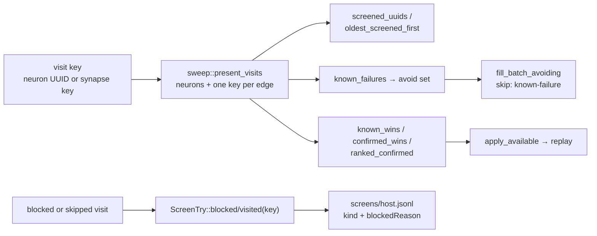

# 🪒 Give synapse visits screen-record and learnings-cache parity

## Summary

The sweep has produced synapse visits since #135, but every keyed reader in
`ockham/src/learnings.rs` assumed a record's key was a hidden-neuron UUID, so a
synapse-keyed record was silently dropped: its visit looked permanently
unchecked, a standing rejection of an edge cut never reached the avoid set, and
a confirmed edge win could never replay. This change makes a **visit key** —
hidden-neuron UUID or synapse key — the unit those readers work in:

- `sweep::present_visits` and `sweep::visit_present` are the one place a visit
  key is checked against a creature: neuron UUIDs plus one `synapse_key` per
  ordered endpoint pair. Typed edges are in the set too — the razor refuses to
  cut one, the sweep still visits it, and the blocked record that visit files is
  precisely the coverage that stops it being asked again.
- `screened_uuids`, `oldest_screened_first`, `known_failures`, `known_wins`,
  `confirmed_wins` and `ranked_confirmed` (through `latest_by_uuid`) read that
  set, so an edge the creature still carries survives the still-present filter
  and one it no longer carries is dropped, exactly as for a neuron.
- `merge_wins` stays merge-only — it filters on `kind_label(Merge)`, so a
  `synapse` verdict beside it in the same history never enters the merge index.
  `confirmed_groups` stays neuron-only: a group's membership is hidden neurons
  and a synapse verdict carries no group at all.
- Replay's presence guards (`promote::apply_available`, `promote::apply_bundle`)
  accept a synapse key, so a confirmed edge cut replays rather than being
  dropped before `propose` ever sees it.
- `Screened`, `ScreenTry` and `Learning` keep their existing shape — `uuid`
  carries the key, `kind` carries `"synapse"` — so a scored synapse candidate
  needs no format version bump. The doc comments that said "hidden neuron UUID"
  now say what the field actually holds.

The run loop still walks neuron visits only: the coverage denominator (#137) and
the accept path (#138) land with their own work, and `fresh_sweep` keeps
deferring the edge half until they do. Its log line and
`Sweep::retain_neuron_visits`' doc now name the two issues that are actually
outstanding rather than three.

Closes #136.

## Evidence

Backend/library change with no web interface, so there is no screenshot to
capture — the evidence is the test suite.

Red-then-green was observed for the readers this change is about: with the six
presence sets reverted to neurons only,
`learnings::tests::screened_uuids_keep_synapse_visits_the_creature_still_carries`,
`::oldest_screened_first_ranks_synapse_visits_beside_neurons`,
`::known_failures_suppress_a_rejected_synapse_cut` and
`::a_confirmed_synapse_win_is_replayable` all fail; they pass with it in place.
`promote::tests::apply_available_replays_a_confirmed_synapse_win` likewise fails
against the old neuron-only guard (`left: []`) and passes after it.

Gate: `cargo fmt --all -- --check`, `cargo clippy --workspace --all-targets
--all-features -D warnings -D clippy::filter_next -D clippy::collapsible_if`,
`cargo test --workspace --all-features` (615 unit tests plus the integration
suites), `cargo doc` with `RUSTDOCFLAGS=-D warnings`, `cargo deny check`,
`markdownlint-cli2` and `actionlint` all pass locally. `codespell` cannot be
installed in this container (no `pip`), so that one `./quality.sh` stage was not
run here; CI runs it on the PR.

<!-- vibe-quality-gate-skipped stage="codespell" reason="codespell is not installable in this container (no pip); every other ./quality.sh stage was run in the foreground and passed" -->

## Acceptance Criteria

<!-- vibe-spec-review inputs="diff+issue-body" -->

- **met** — A scored synapse candidate files a `Screened` record with
  `kind == "synapse"` and `uuid` equal to the synapse key — evidence:
  `ockham/src/learnings.rs::a_scored_synapse_candidate_files_a_synapse_screen_record`
  — reviewer: met — reason: the reviewer noted this needed no production change
  (`ScreenTry::scored` and `kind_label` were already key-agnostic), so the test
  is a pin rather than new behaviour; the issue asks for exactly that pin
- **met** — A blocked synapse visit files a skipped record carrying its
  `BlockedReason`, and `Screened::blocked_category()` returns it — evidence:
  `ockham/src/learnings.rs::a_blocked_synapse_visit_files_its_reason` and
  `ockham/src/run.rs::a_synapse_visit_files_the_same_screen_record_a_neuron_visit_does`,
  which drives `skip_try` — reviewer: met
- **met** — `known_failures` over a rejected synapse cut puts that key in the
  avoid set, and `fill_batch_avoiding` skips it with reason `known-failure` —
  evidence:
  `ockham/src/sweep.rs::a_known_failing_synapse_visit_is_skipped_not_re_proposed`
  — reviewer: met
- **met** — `screened_uuids` and `oldest_screened_first` retain synapse-keyed
  records for synapses on the creature and drop the rest — evidence:
  `ockham/src/learnings.rs::screened_uuids_keep_synapse_visits_the_creature_still_carries`
  and `::oldest_screened_first_ranks_synapse_visits_beside_neurons` —
  reviewer: met
- **met** — `merge_wins` still returns merge records only when synapse records
  are present in the same history — evidence:
  `ockham/src/learnings.rs::merge_wins_stay_merge_only_when_synapse_records_share_the_history`
  — reviewer: met
- **met** — A `"synapse"`-kind record deserialises cleanly and is ignored, not
  fatal, by a reader that only knows hidden-neuron UUIDs — evidence:
  `ockham/src/learnings.rs::a_synapse_record_loads_and_is_ignored_by_a_hidden_only_reader`,
  covering both wire forms, the store load and `coverage()` as the hidden-only
  reader — reviewer: met
- **met** — `cargo test`, `cargo clippy -- -D warnings` and `cargo fmt --check`
  pass — evidence: gate run after the final edit, 616 unit tests plus the
  integration suites — reviewer: met
- **met** — Body task: update the doc comments that said "hidden neuron UUID" —
  evidence: `Learning::uuid`, `Screened::uuid`, `ScreenTry::uuid`,
  `ConfirmedWin::uuid`, `Verdict::uuid` and `promote::BundleMember::uuid` —
  reviewer: partial — reason: the reviewer found `ConfirmedWin::uuid` and
  `Verdict::uuid` still stale; both, plus `BundleMember::uuid`, were updated in
  the follow-up commit
- **met** — Body task: a confirmed synapse win must be replayable and must not
  be mistaken for a neuron cut — evidence: `promote::apply_available` /
  `apply_bundle` accept a visit key
  (`::apply_available_replays_a_confirmed_synapse_win`), and `run::assumed_kind`
  files a key-derived kind
  (`::a_synapse_key_filed_without_its_candidate_keeps_the_synapse_kind`) —
  reviewer: missing — reason: the reviewer found the two kind-derivation sites
  (`run.rs` pool member and winning-bundle verdict) still hardcoded
  `CandidateKind::Ablation`, so a replayed synapse win would be filed back as a
  neuron cut; fixed in the follow-up commit with the test named above
- **unrequested** — `sweep::visit_present` and the replay presence guards in
  `promote::apply_available` / `apply_bundle` — reviewer: unrequested —
  reason: the issue scopes the file list to `learnings.rs` and the `run.rs`
  screen call sites, but its own bullet requires a confirmed synapse win to be
  replayable; without this the key is dropped silently before `propose` sees
  it. Kept, and the accept path itself is untouched — that is still #138
- **unrequested** — the two README.md prose updates and the reworded
  `retain_neuron_visits` doc / deferral log line — reviewer: unrequested —
  reason: a code change owes a docs change, and both surfaces stated that
  records were still outstanding, which this PR makes untrue

## Standards Review

<!-- vibe-standards-review inputs="diff+CODING-STANDARDS.md" -->

- **violation** — a comment must not overclaim what a test asserts — evidence:
  `ockham/src/learnings.rs:2469` — reason: fixed here; the doc comment now says
  the record is an ordinary line *at the versions already in the fleet* and
  names `coverage()` as the hidden-only reader, rather than claiming an older
  binary was run
- **violation** — DRY: the escaped key was computed twice under two names and
  `key` rebound three times — evidence: `ockham/src/learnings.rs:2470` —
  reason: fixed here; one `key`, one `escaped`
- **violation** — a comment must describe real intent — evidence:
  `ockham/src/sweep.rs:118` — reason: fixed here; `visit_present`'s doc
  described a tie-break with no observable effect there, and now states the
  lookup order it actually implements
- **violation** — doc comments wrap at 80 columns — evidence:
  `ockham/src/learnings.rs:264` — reason: fixed here
- **violation** — four of the new tests pass against the pre-#136 sources, so
  they pin nothing this diff changed — evidence:
  `ockham/src/learnings.rs:2420` — reason: stands. Three of the four are the
  characterisation pins the issue explicitly asks for (a scored synapse record,
  a blocked one, and the forward-compatibility record); that they already pass
  is the finding — the record path was key-agnostic and needed no change, and
  the tests stop that regressing
- **clean** — Australian English throughout the added lines; no hidden or
  ignored paths staged; no sleeps, wall-clock thresholds or `Instant` in the new
  tests; every test calls real functions and asserts on returned values;
  no swallowed errors — `apply_available`'s skip is its documented contract and
  `visit_present` / `parse_synapse_key` fail closed; `confirmed_groups` and
  `coverage::coverage` correctly stay neuron-only for #137; `latest_by_uuid`'s
  `HashSet<String>` change is `Borrow`-correct at every call site; clippy, fmt
  and markdownlint pass

## Test Plan

Added:

- `ockham/src/learnings.rs` — `screened_uuids_keep_synapse_visits_the_creature_still_carries`,
  `oldest_screened_first_ranks_synapse_visits_beside_neurons`,
  `known_failures_suppress_a_rejected_synapse_cut`,
  `a_rejected_synapse_cut_stops_suppressing_once_the_edge_is_gone`,
  `a_confirmed_synapse_win_is_replayable`,
  `merge_wins_stay_merge_only_when_synapse_records_share_the_history`,
  `a_scored_synapse_candidate_files_a_synapse_screen_record`,
  `a_blocked_synapse_visit_files_its_reason`,
  `a_synapse_record_loads_and_is_ignored_by_a_hidden_only_reader`.
- `ockham/src/sweep.rs` — `a_known_failing_synapse_visit_is_skipped_not_re_proposed`,
  `present_visits_covers_neurons_and_edges_and_nothing_else`.
- `ockham/src/run.rs` — `a_synapse_visit_files_the_same_screen_record_a_neuron_visit_does`,
  `a_synapse_key_filed_without_its_candidate_keeps_the_synapse_kind`.
- `ockham/src/promote.rs` — `apply_available_replays_a_confirmed_synapse_win`.

No existing test was modified or removed.
