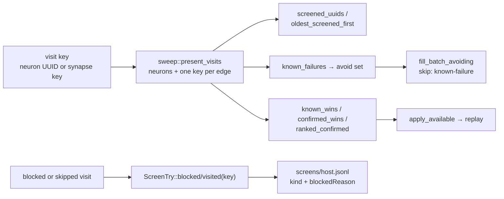

# 🪒 Give synapse visits screen-record and learnings-cache parity

## Summary

The sweep has produced synapse visits since #135, but every keyed reader in
`ockham/src/learnings.rs` assumed a record's key was a hidden-neuron UUID, so a
synapse-keyed record was silently dropped: its visit looked permanently
unchecked, a standing rejection of an edge cut never reached the avoid set, and
a confirmed edge win could never replay. This change makes a **visit key** —
hidden-neuron UUID or synapse key — the unit those readers work in:

- `sweep::present_visits` and `sweep::visit_present` are the one place a visit
  key is checked against a creature: neuron UUIDs plus one `synapse_key` per
  ordered endpoint pair. Typed edges are in the set too — the razor refuses to
  cut one, the sweep still visits it, and the blocked record that visit files is
  precisely the coverage that stops it being asked again.
- `screened_uuids`, `oldest_screened_first`, `known_failures`, `known_wins`,
  `confirmed_wins` and `ranked_confirmed` (through `latest_by_uuid`) read that
  set, so an edge the creature still carries survives the still-present filter
  and one it no longer carries is dropped, exactly as for a neuron.
- `merge_wins` stays merge-only — it filters on `kind_label(Merge)`, so a
  `synapse` verdict beside it in the same history never enters the merge index.
  `confirmed_groups` stays neuron-only: a group's membership is hidden neurons
  and a synapse verdict carries no group at all.
- Replay's presence guards (`promote::apply_available`, `promote::apply_bundle`)
  accept a synapse key, so a confirmed edge cut replays rather than being
  dropped before `propose` ever sees it.
- `Screened`, `ScreenTry` and `Learning` keep their existing shape — `uuid`
  carries the key, `kind` carries `"synapse"` — so a scored synapse candidate
  needs no format version bump. The doc comments that said "hidden neuron UUID"
  now say what the field actually holds.

The run loop still walks neuron visits only: the coverage denominator (#137) and
the accept path (#138) land with their own work, and `fresh_sweep` keeps
deferring the edge half until they do. Its log line and
`Sweep::retain_neuron_visits`' doc now name the two issues that are actually
outstanding rather than three.

Closes #136.

## Evidence

Backend/library change with no web interface, so there is no screenshot to
capture — the evidence is the test suite.

Red-then-green was observed for the readers this change is about: with the six
presence sets reverted to neurons only,
`learnings::tests::screened_uuids_keep_synapse_visits_the_creature_still_carries`,
`::oldest_screened_first_ranks_synapse_visits_beside_neurons`,
`::known_failures_suppress_a_rejected_synapse_cut` and
`::a_confirmed_synapse_win_is_replayable` all fail; they pass with it in place.
`promote::tests::apply_available_replays_a_confirmed_synapse_win` likewise fails
against the old neuron-only guard (`left: []`) and passes after it.

Gate: `cargo fmt --all -- --check`, `cargo clippy --workspace --all-targets
--all-features -D warnings -D clippy::filter_next -D clippy::collapsible_if`,
`cargo test --workspace --all-features` (615 unit tests plus the integration
suites), `cargo doc` with `RUSTDOCFLAGS=-D warnings`, `cargo deny check`,
`markdownlint-cli2` and `actionlint` all pass locally. `codespell` cannot be
installed in this container (no `pip`), so that one `./quality.sh` stage was not
run here; CI runs it on the PR.
