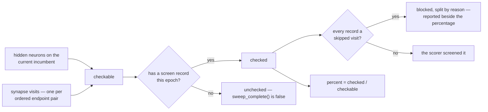

# Count synapse visits in epoch coverage (Issue #137)

## Summary

Coverage answered "has the razor been everywhere this epoch?" by counting hidden
neurons alone. Since #133–#136 the razor also cuts single **edges**, so an epoch
could report `sweep complete` with every synapse visit on the creature never
tried. This puts them in the denominator. Closes #137.

- **`coverage()` counts visits, not neurons.** The population is every hidden
  neuron **plus** one visit key per ordered endpoint pair
  (`sweep::synapse_key`), deduplicated exactly as the sweep pool builds it, so
  `checkable == hidden + synapses`. Typed edges are in it: the razor refuses to
  cut one, the sweep visits it, and the blocked record that visit files is what
  makes it *checked* — so a creature full of typed edges reaches a complete
  sweep instead of standing permanently short of one.
- **`Coverage` gains `synapses` / `synapsesChecked`**, both `#[serde(default)]`.
  `checkable` keeps its key and becomes the whole visit population, so
  `percent()` and `sweep_complete()` keep their arithmetic and no consumer
  changes.
- **`coverage.txt` is extended additively.** A `synapses:` line follows
  `sweep:`; the rest of the block is untouched. It carries **no percentage of
  its own** — the only percentage in the block stays `sweep:`, over the whole
  visit population, so two identically-suffixed percentages with different
  denominators can never sit one above the other.
- **`ScreenHistory::over` counts the same population**, so a synapse's history
  is visible to the cumulative line and to unchecked-first selection.
  `ScreenHistory::merge` needed no change — it indexes every record unfiltered.
- **The no-progress guard counts visits.** A run that reached only synapses is
  progress, and the warning names the visit remainder rather than the neuron one.
- **The blocked breakdown still partitions `blocked`** across a mix of blocked
  neuron and blocked synapse visits.
- The journal `coverage` record and `ockham report` carry the same two figures,
  so the three surfaces cannot disagree about the denominator.

**Transitional consequence, stated rather than left to be discovered:** the
sweep still defers every synapse visit (`Sweep::retain_neuron_visits`, lifted
by #138), so on a creature with edges the epoch stays open — `sweep complete for
this epoch` and `sweepComplete: true` do not appear, and the `unchecked:`
runs-remaining clause names an estimate the current binary cannot reach. That is
the intended reading: an epoch is not finished while thousands of edge visits
have never been tried. It is documented in `docs/grq-integration.md`, in the
README, and pinned by an assertion in
`run::tests::the_artefacts_report_the_completed_sweeps_and_the_pass_in_progress`
that will fail loudly when #138 changes it.

## Evidence

Backend/CLI change — no web interface to screenshot. Verified by running the
built binary end to end against a fake scorer: two hidden IDENTITY neurons wired
`input-0 → h → output-0` (4 edges), a corpus of four records, one batch of two
candidates.

**Run 1 — the two hidden neurons screened, the edges not yet reached.** Before
this change the same run printed `sweep: 2 of 2 hidden (100.0% of epoch)` and
`0 remaining — sweep complete for this epoch`:

```text
🪒 Ockham neuron screening coverage
sweep:     2 of 6 visits (33.3% of epoch)
synapses:  0 of 4 edges checked this epoch
epoch:     corpus f429df9d — coverage counts this corpus only
cut:       0 this run
unchecked: 4 remaining this epoch (~2 runs at 2/run)
progress:  2 newly checked this run
passes:    0 complete this epoch · 0 this run · pass 1 in progress
visits:    2 hidden neurons visited this run · 0 revisited
history:   2 of 6 ever checked across 1 corpus epoch
```

**Run 2 — the same creature after a fleet host filed a blocked visit for each
edge.** The sweep completes only once the edges are checked too, and the blocked
synapse visits are counted and broken down by reason:

```text
🪒 Ockham neuron screening coverage
sweep:     6 of 6 visits (100.0% of epoch)
synapses:  4 of 4 edges checked this epoch
epoch:     corpus f429df9d — coverage counts this corpus only
cut:       0 this run
unchecked: 0 remaining — sweep complete for this epoch
blocked:   4 checked with no cut proposed
reasons:   unsafe-topology 4 (100.0%)
progress:  0 newly checked this run
passes:    0 complete this epoch · 0 this run · pass 1 in progress
visits:    2 hidden neurons visited this run · 2 revisited
history:   6 of 6 ever checked across 1 corpus epoch
```

`coverage.json` from run 1, showing the additive keys beside the widened
`checkable`:

```json
{
  "hidden": 2,
  "tagged": 0,
  "checkable": 6,
  "checked": 2,
  "synapses": 4,
  "synapsesChecked": 0,
  "blocked": 0,
  "cut": 0,
  "newlyScreened": 2,
  "corpusIdentity": "f429df9df3216480"
}
```

Where the denominator now comes from:



Gate: `cargo test --workspace --all-features` (628 lib + 55 integration tests),
`cargo clippy --workspace --all-targets --all-features -- -D warnings`,
`cargo fmt --all --check`, `cargo deny check`, `markdownlint-cli2`, `actionlint`
and `RUSTDOCFLAGS="-D warnings" cargo doc` all pass. `codespell` is not
installable in this container (`pip`/`pipx` absent); CI runs it for real.

## Acceptance Criteria

<!-- vibe-spec-review inputs="diff+issue-body" -->

- **met** — `coverage()` over a creature with N hidden neurons and M ordinary
  synapses reports `checkable == N + M`, with the new synapse fields populated —
  evidence: `ockham/src/coverage.rs::coverage`,
  `coverage::tests::synapse_visits_join_the_hidden_neurons_in_the_denominator` —
  reviewer: met
- **met** — typed synapses are counted in the population and, once
  visited-and-blocked, counted as checked and blocked — evidence:
  `coverage::tests::a_typed_edge_is_counted_and_a_blocked_visit_checks_it` —
  reviewer: met
- **met** — `sweep_complete()` is false while any synapse visit is unchecked,
  and true once every hidden neuron and every ordinary synapse has a record —
  evidence:
  `coverage::tests::the_sweep_is_incomplete_while_a_single_synapse_visit_is_unchecked`
  — reviewer: met
- **met** — unit test: a pre-existing `coverage.json` without the synapse fields
  still deserialises, reading as zero — evidence:
  `coverage::tests::a_pre_137_coverage_json_reads_as_no_synapse_visits` —
  reviewer: met
- **met** — unit test: `blocked_by_reason` totals equal `blocked` with a mix of
  blocked neuron and blocked synapse visits — evidence:
  `coverage::tests::the_reason_counts_sum_to_blocked_across_neuron_and_synapse_visits`
  — reviewer: met
- **partial** — `coverage.txt` keeps its existing lines byte-for-byte for a
  creature with no synapse visits, and gains the synapse line otherwise —
  evidence:
  `coverage::tests::the_description_gains_a_synapse_line_and_leaves_the_rest_alone`
  — reviewer: partial — reason: the reviewer is right that the `sweep:` noun
  swaps `hidden` → `visits` whenever the creature has edges, so the byte-for-byte
  guarantee binds the no-synapse case (which is what a pre-#137 `coverage.json`
  renders as) rather than production; leaving a widened denominator labelled
  `hidden` would have been a wrong count, and nothing parses the prose — GRQ
  `cat`s `coverage.txt` into a commit description (`docs/grq-integration.md`)
- **met** — `cargo test`, `cargo clippy -- -D warnings` and `cargo fmt --check`
  pass — evidence: full gate run after the final edit, output above — reviewer:
  met
- **unrequested** — the `Event::Coverage` journal record and the `report`
  surface gained `synapses` / `synapsesChecked`, and `report` derives
  `checkable = hidden + synapses` — evidence: `ockham/src/journal.rs:176`,
  `ockham/src/report.rs:98` — reviewer: unrequested — reason: without them
  `ockham report` would print a `checkable` larger than `hidden` with nothing
  explaining it, and its `sweepComplete` would disagree with `coverage.json` —
  the issue's "keep `percent()` and `sweep_complete()` meaning" applied to the
  third surface that reads them
- **unrequested** — the coverage test fixture was split into `neurons_only(n)`
  (edge-free) and a wired `hidden_creature(n)` — evidence:
  `ockham/src/coverage.rs` test module — reviewer: unrequested — reason: the
  pre-existing tests about hidden-neuron arithmetic and the byte-for-byte
  rendering must measure the neuron half alone; the new tests use the wired form
- **unrequested** — two test helpers, `synapse_pairs()` and
  `file_blocked_synapse_screens()` — evidence: `ockham/src/run.rs` test module —
  reviewer: unrequested — reason: the end-to-end complete-epoch test needs edge
  records the sweep cannot yet file itself, and the tag test needs the widened
  denominator computed from `best.json`
- **unrequested** — `docs/blocked-reasons.md`, `docs/grq-integration.md` and the
  README were updated, and the sweep-deferral log line now says #138 rather than
  #137/#138 — evidence: `ockham/src/run.rs:2360`, `ockham/src/sweep.rs:381` —
  reviewer: unrequested — reason: the blocked population and the coverage
  denominator are documented surfaces that this change alters, and a message
  naming this issue as still-pending would be false once it lands
- **unrequested** — `ockham/Cargo.toml` version bumped 0.1.53 → 0.1.54 —
  evidence: `ockham/Cargo.toml:3` — reviewer: unrequested — reason:
  CONTRIBUTING.md principle 8 requires it for a binary-affecting change

## Standards Review

<!-- vibe-standards-review inputs="diff+CODING-STANDARDS.md" -->

No `CODING-STANDARDS.md` exists in this repository; the reviewer used
`CONTRIBUTING.md` ("Principles every change must keep") plus README conventions
and the standing project rules.

- **violation** — the crate version was not bumped for a binary-affecting change
  — evidence: `ockham/Cargo.toml:3` — reason: fixed here, 0.1.53 → 0.1.54, with
  `Cargo.lock` updated to match
- **violation** — no `docs/archive/pr-summaries/pr-summary-137.md` — evidence:
  `docs/archive/pr-summaries/` — reason: fixed here; this file
- **violation** — `docs/grq-integration.md` still read "starts a fresh epoch at
  `0 / hidden`, with every hidden neuron … eligible again" while the README's
  identical sentence had been updated — evidence:
  `docs/grq-integration.md:307` — reason: fixed here, `0 / visits` and "every
  hidden neuron and every synapse visit"
- **violation** — README said "Epoch coverage and accepting a pure synapse win
  land with their own work", stale once this lands — evidence: `README.md:330` —
  reason: fixed here; epoch coverage is described as landed, #138 as pending
- **violation** — README documented the deferral's trigger as "until the
  coverage denominator counts them", which this change makes wrong — evidence:
  `README.md:822` — reason: fixed here; the trigger is #138 (accept parity)
- **violation** — the `coverage.txt` contract row did not record that
  `sweep complete for this epoch` / `sweepComplete: true` become unreachable
  until #138, on a table headed "Changing any row breaks a live fleet worker" —
  evidence: `docs/grq-integration.md:503` — reason: fixed here, as an explicit
  "Transitional consequence, until Issue #138" clause
- **violation** — DRY: `visit_population()` and the inline population built
  inside `coverage()` were two independent definitions of the same set —
  evidence: `ockham/src/coverage.rs:868` — reason: fixed here; both now compose
  `hidden_uuids()` and `synapse_visits()`, so current-epoch and cumulative
  coverage cannot diverge silently
- **violation** — fail-loud: the `synapse_pairs` test helper used
  `unwrap_or_default()`, so a renamed JSON key would collapse every edge onto
  one empty pair instead of surfacing the fault — evidence:
  `ockham/src/run.rs:5010` — reason: fixed here, `expect("fromUUID")` /
  `expect("toUUID")`
- **violation** — `docs/blocked-reasons.md` heading still said "Blocked
  neurons" while its body counts synapse visits — evidence:
  `docs/blocked-reasons.md:1` — reason: fixed here, "Blocked visits"
- **violation** — "small focused files": `ockham/src/coverage.rs` is now 2653
  lines (1013 production, 1640 test) carrying `Coverage`, `ScreenProgress`,
  `ScreenHistory`, `Passes`, `History` and the file writer — evidence:
  `ockham/src/coverage.rs:1` — reason: stands. Splitting the module is a
  refactor of code this issue does not otherwise touch, and doing it inside a
  contract change to `coverage.json` would make the diff unreviewable; it is
  genuinely separate work
- **clean** — Australian English throughout the added lines (`serialises`,
  `journalled`, `neighbourhood`, `artefact`); every new test calls real
  functions and asserts on returned values, none greps source text; no `sleep`,
  `Instant::now` or wall-clock threshold in any added test; backwards
  compatibility carried by `#[serde(default)]` on both `Coverage` and
  `Event::Coverage` with an explicit pre-#137 round-trip test; no hidden or
  secret files staged; the deferral is logged rather than swallowed and
  `unchecked()` stays saturating; commit messages carry the 🪒 prefix and the
  run-id trailer; no changelog added, per principle 8

## Test Plan

New tests in `ockham/src/coverage.rs`:

- `synapse_visits_join_the_hidden_neurons_in_the_denominator`
- `a_screened_edge_raises_both_the_total_and_the_synapse_count`
- `a_typed_edge_is_counted_and_a_blocked_visit_checks_it`
- `the_sweep_is_incomplete_while_a_single_synapse_visit_is_unchecked`
- `the_reason_counts_sum_to_blocked_across_neuron_and_synapse_visits`
- `a_repeated_endpoint_pair_is_one_synapse_visit`
- `a_screen_record_for_a_departed_edge_raises_nothing`
- `the_description_gains_a_synapse_line_and_leaves_the_rest_alone`
- `the_summary_names_both_populations`
- `a_pre_137_coverage_json_reads_as_no_synapse_visits`
- `the_history_counts_synapse_visits_beside_hidden_neurons`
- `a_run_that_only_checked_synapses_is_progress_not_a_plateau`

Modified tests, and why the business-logic change required it:

- `learnings::tests::a_synapse_record_loads_and_is_ignored_by_a_hidden_only_reader`
  → `…_and_counts_as_coverage`. The forward-compatibility half is unchanged; the
  edge record it files names a pair `two_hidden()` still carries, so it is now
  counted rather than dropped — which is the change.
- Thirteen `run::tests` end-to-end assertions on `checkable`, `percent()`,
  `unchecked()` and the rendered block, updated to the widened denominator. Two
  of them keep their subject by asserting the neuron half explicitly
  (`checked == hidden`) rather than a 100% that the deferred synapse walk can no
  longer reach, and
  `the_artefacts_report_the_completed_sweeps_and_the_pass_in_progress` now pins
  `!sweep_complete()` with the reason, so #138 cannot flip it unnoticed.
- `a_finished_sweep_then_a_corpus_change_publishes_fresh_epoch_coverage` files
  the edge records a fleet host would file, so it still exercises a genuinely
  complete epoch.
- `tests/cli.rs::a_run_that_screens_nothing_warns_that_it_advanced_no_coverage`
  follows the guard's new wording (visits, not hidden neurons).
- The coverage test fixture was split: `neurons_only(n)` is edge-free and keeps
  every pre-existing hidden-neuron assertion byte-for-byte; `hidden_creature(n)`
  is the wired form the new tests use.

No test was removed or commented out.
