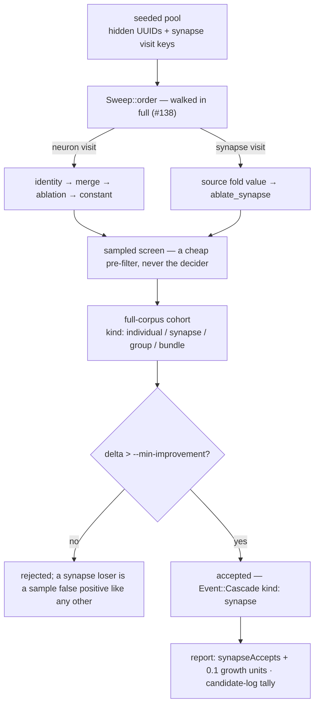

# Accept and report a pure synapse win end to end (Issue #138)

## Summary

Closes #138.

Issue #135 mixed synapse visits into the seeded sweep pool; #136 and #137 gave
them screen records, learnings-cache parity and epoch coverage. The one thing
left was the run itself, which dropped the edge half of the pool on every sweep
it built — a visit it could not *act on* was one it would make again every batch
forever.

This change removes that deferral and closes the loop. A candidate that removes
**one synapse and no hidden neuron** — 0.1 growth units — is now screened,
scored and accepted on the full-corpus scorer alone. Nothing in the accept path
asks for a hidden removal, a minimum growth-unit saving, or any threshold beyond
the `--min-improvement` the scorer comparison already applies; the sampled screen
stays a cheap pre-filter and the full-corpus scorer stays the sole acceptance
authority.

| file | change |
| --- | --- |
| `run.rs` | `fresh_sweep` keeps every synapse visit; the loop runs while the creature carries **any** visit rather than while it has hidden neurons, so a creature pruned down to edges is still searched |
| `promote.rs` | a synapse candidate is its own cohort kind (`synapse`), judged as an individual through the shared `is_solo` predicate; confirmed edge cuts bundle as a per-kind plan |
| `cascade.rs` | `estimate_cut` reads a synapse visit key, so the estimate-vs-actual audit compares against a prediction rather than zero — and mirrors the transform's refusals (any typed edge on the pair, an aggregate target, an unlisted source) |
| `report.rs` | `synapseAccepts`, `synapseCutsAccepted`, `synapseSynapsesRemoved`, `synapseHiddenRemoved`, `synapseGrowthUnitsRemoved`, read off the same `cascade` series the group figures use |
| `telemetry.rs` | a per-kind `KindTally` of proposals, accepts and logged rows, so an edge cut that can hold no feature-vector row is *reported* rather than swallowed into an "unknown" count |
| `incumbent.rs` | `has_visits()` — a hidden neuron **or** a synapse |
| `fixtures.rs` | `shortcut_edge_creature()`, the shared pure-synapse-win fixture, with its own invariant test |

### The accept path, end to end

## Evidence

Backend/CLI change with no web interface, so no screenshot applies. The
behaviour is pinned by an end-to-end test that drives the shipped binary over a
fixture engineered so the **only** available win is one edge, plus unit tests at
each surface.

`cargo test --test cli a_pure_synapse_win_is_accepted_and_reported_end_to_end`
asserts, against the real binary and a real journal:

- `best.json` has 2 hidden neurons and 3 synapses (opened with 2 and 4);
- the journal carries `{"record":"cascade","kind":"synapse", …}` with
  `estimated_hidden 0`, `estimated_synapses 1`, `estimated_growth_units 0.1` and
  the matching actuals;
- `coverage.json` records the synapse visit as checked;
- `report` shows `synapseAccepts: 1`, `synapseGrowthUnitsRemoved: 0.1`,
  `synapseHiddenRemoved: 0`, `cascadeEstimateRatio: 1.0` and a `growthUnitsSaved`
  of `0.1` that reconciles with the opening and final structure;
- the candidate log reports `synapse 1 proposed, 1 accepted, 0 logged`.

Full gate: `cargo test` (694 tests, all suites), `cargo clippy --workspace
--all-targets --all-features -- -D warnings`, `cargo fmt --check`, `cargo deny
check`, `RUSTDOCFLAGS="-D warnings" cargo doc`, `markdownlint-cli2` and
`cargo test --test readme_contract` all pass.

<!-- vibe-quality-gate-skipped stage="codespell" reason="codespell is not installed in this container and there is no pip/pipx to install it; every other stage of ./quality.sh was run individually and passes. CI runs the spell check for real." -->

`./quality.sh` stops at its `codespell` preflight because the tool is not
installed in this container and there is no `pip`/`pipx` to install it. Every
other stage was run individually and passes; the added prose was checked by hand
for Australian English and no American spelling appears in the diff.

## Acceptance Criteria

<!-- vibe-spec-review inputs="diff+issue-body" -->

- **met** — a candidate removing one synapse and no hidden neuron is accepted when the full-corpus scorer holds, asserted by the end-to-end CLI test — evidence: `ockham/tests/cli.rs::a_pure_synapse_win_is_accepted_and_reported_end_to_end` — reviewer: met
- **met** — no threshold gates a synapse accept beyond the existing scorer comparison — evidence: `ockham/src/promote.rs::a_pure_synapse_win_is_accepted_on_the_scorer_alone` (delta `1e-5` against `min_improvement` `1e-6`), and `ockham/src/promote.rs::a_synapse_candidate_the_full_corpus_refuses_is_a_sample_false_positive` for the other direction — reviewer: met — reason: the reviewer flagged one residual it judged pre-existing — the loop condition `while incumbent.hidden_neurons() > 0`, which stopped the run the moment its last hidden neuron went. That *is* a hidden-neuron gate on a synapse accept, so it was fixed here rather than left: `Incumbent::has_visits()` (`ockham/src/incumbent.rs:216`) and `ockham/src/run.rs:1103`
- **met** — `Event::Cascade` records `kind: "synapse"`, and `report` reports one synapse accept with 0.1 growth units removed — evidence: `ockham/src/promote.rs:518-529` → `ockham/src/run.rs::journal_cascade`; `ockham/src/report.rs::a_synapse_only_run_reports_its_accepts_and_reconciles_its_saving`, asserted end to end in the CLI test — reviewer: met
- **met** — `report`'s `growth_units_saved` reconciles with the opening/final structure on a synapse-only run — evidence: `ockham/src/report.rs::a_synapse_only_run_reports_its_accepts_and_reconciles_its_saving` and the `growthUnitsSaved ≈ 0.1` assertion in the CLI test — reviewer: met
- **met** — `promote.rs` bundles a batch of confirmed synapse wins as a per-kind plan — evidence: `ockham/src/promote.rs::confirmed_synapse_wins_are_bundled_as_a_per_kind_plan`, with `one_synapse_winner_emits_no_per_kind_plan` for the boundary — reviewer: met — reason: the reviewer noted the synapse plan is emitted on its own count while identity/ablation are emitted only when *both* have ≥2 members; that is deliberate and commented — a batch of confirmed edge cuts is worth scoring whether or not the neuron ladder also produced two winners
- **met** — `cargo test --test readme_contract` passes with the README updated — evidence: 10/10 pass; README gained the feature-list entry, the pipeline-diagram row, the "Accepting a pure synapse win" section with its per-surface table, the synapse `report` fields, and corrections to the four paragraphs that described the deferral as still standing — reviewer: met
- **met** — `docs/blocked-reasons.md` documents which refusals a synapse visit can report — evidence: the new "What a synapse visit can report" section listing `missing-activation`, `unsafe-topology`, `aggregate-squash` and `validation-failed`; the reviewer independently cross-checked `propose_synapse` and `AblationSkip::blocked_reason` and confirmed no other code is reachable — reviewer: met
- **met** — `cargo test`, `cargo clippy -- -D warnings` and `cargo fmt --check` pass — evidence: all three run clean after the final edit, plus `cargo deny`, `cargo doc` and `markdownlint-cli2` — reviewer: met
- **unrequested** — `report.synapse_hidden_removed`, a fifth field beside the four the issue listed — reviewer: unrequested — reason: kept. It is what distinguishes a *pure* edge cut (`0`) from one whose cleanup stranded neurons, which is the distinction the issue's own 0.1-growth-unit argument rests on; without it the two cases average together
- **unrequested** — the run-wide walk of synapse visits (`ockham/src/run.rs:2342`), which changes coverage and `newly_screened` counts across the suite and cost ~500 lines of run-test churn — reviewer: unrequested — reason: kept, because the issue is not implementable without it. The deferral in `fresh_sweep` existed explicitly "until #138"; no edge candidate can be proposed, screened or accepted while it stands, so the end-to-end test the issue mandates cannot pass
- **unrequested** — `Incumbent::has_visits()` and the loop condition it replaces — reviewer: unrequested — reason: kept. See the second criterion above: it is the last hidden-neuron requirement standing between a synapse win and acceptance
- **unrequested** — `is_solo` in `promote.rs`, which changes how the sample-false-positive list and the `individuals` series classify **every** kind rather than adding a synapse branch — reviewer: unrequested — reason: kept. One predicate is what stops the two lists disagreeing about a synapse candidate; two parallel `kind == "individual" || kind == "synapse"` tests were the alternative, and DRY says otherwise

## Standards Review

<!-- vibe-standards-review inputs="diff+CODING-STANDARDS.md" -->

There is no `CODING-STANDARDS.md` in this repository; the reviewer was given
`CONTRIBUTING.md` and the Vibe Coder engineering standards as the authority.

- **violation** — `ockham/Cargo.toml` version not bumped, against CONTRIBUTING principle 8 — evidence: `ockham/Cargo.toml:3` — reason: fixed here; bumped `0.1.54` → `0.1.55` via `scripts/auto-version.sh`, with `Cargo.lock` updated
- **violation** — commit messages omitted the documented `🪒` prefix and seven carried a duplicate subject — evidence: the branch history at review time — reason: fixed here; the branch is a single commit, `🪒 Accept and report a pure synapse win end to end (Issue #138)`
- **violation** — `synapse_between` returned the *first* edge on a pair and checked only that one for a typed role, while `ablate_synapse` requires **every** edge on the pair to be ordinary — evidence: `ockham/src/cascade.rs:183` — reason: fixed here; renamed to `synapses_between`, which returns the whole pair, and the estimate blocks when any edge on it is typed. Regression test `an_ordinary_edge_beside_a_typed_one_on_the_same_pair_is_predicted_as_refused` asserts the estimate and `ablate_synapse` now agree
- **violation** — "The edge transform refuses exactly what the cleanup refuses" was false: the estimator did not model the unlisted-source refusal, so an `input-N → hidden` edge — the most common refusal on a real creature — was predicted as a saving it can never take — evidence: `ockham/src/cascade.rs:242` — reason: fixed here; the estimate blocks on `Kind::External` sources, tested by `an_edge_out_of_an_input_is_predicted_as_refused`, which also asserts `ablate_synapse` agrees. The one refusal still not modelled — an unmeasured source activation — is a fact about the statistics, not the topology, and the comment now says so
- **violation** — a by-design condition raised as a warning on every batch: `unknown = tally.unlogged()` counted every synapse proposal, so the "training set silently shrank" warning fired whenever an edge visit was judged — evidence: `ockham/src/telemetry.rs:509` — reason: fixed here; `KindTally::unexpected_unlogged()` excludes the kind that holds no row by construction, so the warning is back to naming genuine faults. Tested by `a_neuron_candidate_with_no_row_is_still_an_anomaly`
- **violation** — pseudo-kinds `"unnamed"` and `"unproposed"` entered into the same map that renders `ablation` and `synapse`, putting two vocabularies in one column, and an accepted carried winner was recorded as an *accept of kind "unproposed"* — evidence: `ockham/src/telemetry.rs:437,454` — reason: fixed here; replaced by `KindTally::anomaly()`, counted and summarised separately as `N of no nameable kind`. Tested by `a_tally_of_anomalies_alone_is_not_empty`
- **violation** — stale doc after a signature change: `write`'s doc still documented a removed `unknown` parameter — evidence: `ockham/src/telemetry.rs:497` — reason: fixed here
- **violation** — stale comment contradicted by this change ("the sweep does not walk synapse visits yet") — evidence: `ockham/src/run.rs:4952` — reason: fixed here; it now explains why the test pre-files a complete epoch (two batches of two cannot reach twelve visits)
- **violation** — tautological assertion: `cov.unchecked() == cov.checkable - cov.checked` is the definition of `unchecked()` and can never fail — evidence: `ockham/src/run.rs:7711` — reason: fixed here; asserts the literal `4` visits neither run reached
- **violation** — test rigour weakened in six places without the loss being replaced — evidence: `ockham/src/run.rs:6934`, `:7260`, `:4108`, `:7173`, `:5906`, `:6283` and `ockham/tests/sweep_restart.rs:118` — reason: five of seven tightened here. `candidates + skipped > 0` became `candidates == 2 || remaining == 0` — a short batch is only ever the end of a pass, which is a *stronger* statement of what #77 removed — in both `run.rs` and `sweep_restart.rs`; `restarts.len()` is back to an exact `1`; the union-of-both-batches and `kind == "identity"` assertions are restored, narrowed to neuron visits; the deleted `skips.is_empty()` is back as "no neuron visit is skipped, only edges the razor refuses"; the deleted `screens_dir` check is replaced by an assertion that the one filed record is the refused edge. Two stand: `filed.len() > 4` (the exact count is genuinely non-deterministic — screen records are stamped in whole seconds, so once the run re-files one the staleness order is a real tie; it was observed returning 6 and 7 on consecutive runs) and the bundle test's `bundles.len() >= 2` (with edge cuts in the pool a bundle's width in *hidden neurons* no longer tracks its member count; plan count does, and a batch of two winners emits exactly one plan on its own, so a second plan still proves the carried pool joined)
- **violation** — DRY: the same fixture creature defined three times — evidence: `ockham/src/cascade.rs:534`, `ockham/src/promote.rs:936`, `ockham/tests/cli.rs:723` — reason: fixed here; hoisted to `fixtures::shortcut_edge_creature()` and used by all three, with a `fixtures.rs` test pinning the invariant the three depend on
- **violation** — `pub fn retain_neuron_visits` retained as public API with no production caller — evidence: `ockham/src/sweep.rs:393` — reason: fixed here; now `#[cfg(test)] pub(crate)`. `Sweep::synapse_visits_deferred` and the journal's `synapse_visits_deferred` field stay: the journal field is schema an older reader parses, and it is now documented as `0` on every run since #138
- **violation** — the scripted scorer derives structure counts by grepping the creature JSON, and a miscount degrades to a *passing* test rather than a loud one — evidence: `ockham/tests/cli.rs:687` — reason: fixed here; the patterns are anchored (`"fromUUID"`, `"type": *"hidden"`) and the script exits non-zero if either baseline count reads zero
- **clean** — Australian English throughout (no `behavior`/`color`/`-ize` forms; `neighbourhood`, `centre`, `artefact` used correctly)
- **clean** — a code change owes a docs change: README updated in every affected place, `docs/blocked-reasons.md` gained the synapse-visit reason table, `docs/grq-integration.md`'s "Transitional consequence, until Issue #138" clause corrected
- **clean** — test speed: `cargo test --lib` is ~3.5s for 644 tests; no `sleep`, polling loop or absolute duration threshold anywhere in the diff
- **clean** — no hardcoding to test inputs: the scripted scorer encodes a general rule against `baseline.json` rather than the fixture's numbers; `is_solo`, `KindTally` and the cascade edge path are all general
- **clean** — never-fail-silently on the accept path: `evaluate_full` routes `synapse` through the same `min_improvement` gate and the same `sample_false_positives` list; no new threshold or growth-unit minimum
- **clean** — security: no committed secrets, `.env`, keys or hidden files; the generated scorer script is written to a `tempdir` with `0o755` and quotes every interpolation
- **clean** — scope: no unrelated refactors, renames or reformatting
- **clean** — real-code tests: every new test calls real functions (`estimate_cut`, `evaluate_full`, `bundle_plans`, `summarise`, `establish_run`, `ablate_synapse`, the real binary) and asserts on results, files and exit codes; no source-text grepping in assertions
- **clean** — CONTRIBUTING principles 1–7: the source creature is never written to, acceptance stays full-corpus-only, `creature.validate()` still gates the transform, Ockham stays isolated

## Test Plan

Added:

- `ockham/tests/cli.rs::a_pure_synapse_win_is_accepted_and_reported_end_to_end` —
  the end-to-end reproduction, driving the shipped binary with a
  structure-reading fake scorer over `fixtures::shortcut_edge_creature()`.
- `ockham/src/promote.rs::a_pure_synapse_win_is_accepted_on_the_scorer_alone` —
  a `1e-5` delta against `min_improvement` `1e-6`, asserting the winner's kind,
  uuids and after-structure.
- `ockham/src/promote.rs::a_synapse_candidate_the_full_corpus_refuses_is_a_sample_false_positive`.
- `ockham/src/promote.rs::confirmed_synapse_wins_are_bundled_as_a_per_kind_plan`
  and `one_synapse_winner_emits_no_per_kind_plan`.
- `ockham/src/report.rs::a_synapse_only_run_reports_its_accepts_and_reconciles_its_saving`
  and `a_run_with_no_synapse_accept_reports_none`.
- `ockham/src/cascade.rs` — `a_synapse_visit_key_estimates_the_edge_it_names`,
  `a_synapse_cut_counts_the_structure_it_strands`,
  `a_typed_edge_is_predicted_as_refused`,
  `an_ordinary_edge_beside_a_typed_one_on_the_same_pair_is_predicted_as_refused`,
  `an_edge_out_of_an_input_is_predicted_as_refused`,
  `an_edge_the_creature_does_not_carry_estimates_nothing`.
- `ockham/src/telemetry.rs` —
  `the_tally_reports_synapse_proposals_and_accepts_that_carry_no_row`,
  `a_neuron_candidate_with_no_row_is_still_an_anomaly`,
  `a_tally_of_anomalies_alone_is_not_empty`,
  `an_empty_tally_reports_nothing_rather_than_an_empty_line`.
- `ockham/src/fixtures.rs::the_shortcut_fixture_offers_a_cut_that_removes_no_neuron`.

Modified — the sweep now walks a larger visit population, so tests that pinned
neuron-only counts were updated. **No test was removed or commented out**; each
was rewritten to state the same property over the wider population:

- `run.rs::the_run_walks_synapse_visits_beside_the_neuron_ones` and
  `the_journal_states_that_no_synapse_visit_was_deferred` replace the two tests
  that pinned the deferral. They were the gate this issue removes, and they now
  assert its inverse — that the walked sweep *is* the seeded pool, and that the
  journal states `0` deferred.
- Coverage, `newly_screened` and screen-record counts across ~30 `run.rs` tests,
  and `sweep_restart.rs`, updated for the wider population.
- `run.rs` stop-reason assertions: runs that used to fall out of the loop with
  `no-hidden` now reach a barren pass and stop with `no-candidates`, because a
  creature whose last hidden neuron has gone is still searched while it carries
  edges.
