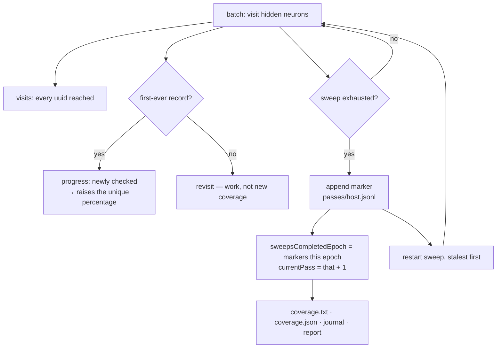

# Report cumulative sweep/pass counts (Issue #140)

## Summary

`100% ever visited` is not `finished`. Once a screening epoch reached full
unique coverage, every GRQ check-in read the same way — `sweep: 7445 of 7446
hidden (100.0% of epoch)`, `progress: 5 newly checked this run` — whether the
razor was on pass 2 or pass 20. The information existed (#77 restarts an
exhausted sweep, `report` already counted `sweepRestarts`) but never reached the
GRQ-facing `coverage.txt` / `coverage.json` contract. Closes #140.

What changed:

- **A completed pass is persisted where it outlives the run.** Every
  exhausted-sweep restart appends a `PassMarker` to `passes/<host>.jsonl` under
  the learnings root — a sibling of `screens/`, so a corrupt pass log breaks
  neither screen nor verdict loading. Markers are counted per screening epoch,
  so a corpus change opens at pass 1 and the earlier epochs stay readable.
- **The artefacts carry the counters.** `coverage.txt` gains a `passes:` line
  (never omitted) and a `visits:` line (omitted when the run reached nothing);
  `coverage.json` and the journal `coverage` record gain an additive `passes`
  object: `sweepRestartsRun`, `sweepsCompletedEpoch`, `currentPass`,
  `visitedRun`, `revisitedRun`.
- **`report` reads the same record**, so `ockham report` and the artefacts
  cannot disagree about which pass a run was on.
- **Existing figures keep their meaning exactly.** `checked` is still unique
  current hidden UUIDs visited at least once this epoch; a revisit is *not*
  renamed "newly checked". Repeated work is reported beside the percentage, in
  the pass and visit counters, and never inside it.
- **The epoch total is the fleet's, read back from the store** at the end of the
  run rather than counted forward from its start: markers other hosts filed
  while the run worked are counted, and a marker a store fault dropped is not
  published as though it had landed.

The limitation the issue asked to be explicit about is stated in the README and
in the field docs: for an epoch already running when the markers shipped,
`sweepsCompletedEpoch` is a **floor**. It cannot be reconstructed from the screen
records — a blocked visit files one record per epoch by design (#93), so
per-uuid record counts do not rise once per pass — so the marker is persisted
going forward instead and nothing is guessed at. Current-pass coverage is
likewise not derived, and the README says why.

## Evidence

Backend/CLI change: no web interface to screenshot. Verified by running the
built binary end to end against a fake scorer (three hidden neurons, a corpus of
two records, two consecutive runs sharing one learnings dir).

**Run 2 — 100% unique coverage, still working.** The old shape of this block
said `progress: 0 newly checked this run` and nothing else; the two new lines
are what say the razor is on pass 11:

```text
🪒 Ockham neuron screening coverage
sweep:     3 of 3 hidden (100.0% of epoch)
epoch:     corpus 6f709b1c — coverage counts this corpus only
cut:       0 this run
unchecked: 0 remaining — sweep complete for this epoch
progress:  0 newly checked this run
passes:    10 complete this epoch · 5 this run · pass 11 in progress
visits:    3 hidden neurons visited this run · 3 revisited
history:   3 of 3 ever checked across 1 corpus epoch
```

**`ockham report` agrees with `coverage.json`:**

```text
report.sweepRestarts = 5
report.passes       = {"sweepRestartsRun":5,"sweepsCompletedEpoch":10,"currentPass":11,"visitedRun":3,"revisitedRun":3}
coverage.json passes= {"sweepRestartsRun":5,"sweepsCompletedEpoch":10,"currentPass":11,"visitedRun":3,"revisitedRun":3}
```

**Markers on disk** (`learnings/passes/<host>.jsonl`, 10 lines after two runs):

```json
{"version":1,"corpusIdentity":"6f709b1c3180f8b0","host":"…","unixSecs":1788746821,"pass":1,"hidden":3}
```

Full gate: `cargo fmt --check`, `cargo clippy --workspace --all-targets
--all-features -D warnings`, `cargo test --workspace --all-features` (566 lib +
55 integration tests, 0 failures), `cargo deny check`, `cargo doc -D warnings`,
`markdownlint-cli2` and `actionlint` all pass.

<!-- vibe-quality-gate-note: ./quality.sh aborts in this container at its
codespell preflight — codespell is not installed and there is no pip/pipx to
install it. Every other stage of quality.sh was run individually, in the
foreground, and passed; CI runs the spell check on the PR. -->



## Acceptance Criteria

<!-- vibe-spec-review inputs="diff+issue-body" -->

- **met** — `coverage.json` exposes a sweep/pass counter sufficient to tell whether Ockham has moved beyond its first complete pass — evidence: `ockham/src/coverage.rs::Passes` + `CoverageReport.passes`; `ockham/src/coverage.rs::tests::the_passes_object_round_trips_and_is_absent_without_a_store` — reviewer: met
- **met** — `coverage.txt` includes a compact `passes:` line consumed by GRQ sampler commits — evidence: `ockham/src/coverage.rs::Passes::lines`; asserted against the real file in `ockham/src/run.rs::tests::the_artefacts_report_the_completed_sweeps_and_the_pass_in_progress` — reviewer: met
- **met** — a test exhausts a sweep, restarts it, screens into the next pass, and asserts at least one complete sweep plus a subsequent pass in progress — evidence: `ockham/src/run.rs::tests::the_artefacts_report_the_completed_sweeps_and_the_pass_in_progress` (3 `sweepRestart` records, `currentPass == 4`, text line asserted) — reviewer: met
- **met** — a run with 100% unique coverage but active re-screening no longer looks stuck — evidence: `ockham/src/coverage.rs::tests::a_fully_covered_epoch_still_reports_the_pass_it_is_working`, plus the run-2 block under Evidence — reviewer: met
- **met** — existing `checked`, `history`, `progress`, epoch identity, winners and bundle fields remain backward-compatible — evidence: `ockham/src/coverage.rs::tests::repeated_passes_never_move_the_unique_coverage_figures`; a pre-#140 `coverage.json` deserialises to `passes: None`; `ockham/src/report.rs::tests::a_pre_140_journal_reports_no_pass_counters` — reviewer: met
- **met** — `ockham report` and `coverage.txt/json` agree on sweep restart/pass counts — evidence: `ockham/src/report.rs` reads `passes` from the same `coverage` record; `run.rs::tests::the_artefacts_report_…` asserts `summary.passes == passes` and `summary.sweep_restarts == passes.sweep_restarts_run` — reviewer: met — reason: the reviewer noted that `summarise` over *several* journals sums `sweep_restarts` while `passes` is last-record-wins; that divergence is documented on the field and is inherent to summarising many runs, so it stands
- **met** — README/docs explain the distinction between unique epoch coverage and repeated passes — evidence: `README.md` "Unique coverage is not passes" (table, pass definition, reset rules, the floor limitation, flowchart); `docs/grq-integration.md` contract rows and the `passes/<host>.jsonl` layout entry — reviewer: met
- **met** — `./quality.sh` passes — evidence: every stage run individually — see the quality-gate note in Evidence — reviewer: met — reason: the reviewer could not run the gate itself and recorded it as environmentally blocked at the codespell preflight; each remaining stage was run here and passed
- **partial** — "current-pass coverage if it can be derived reliably" (a *preferred*, conditional item, not an acceptance criterion) — evidence: `README.md` "Current-pass coverage is deliberately not reported" — reviewer: partial — reason: it cannot be derived reliably across runs, because a revisit of a blocked neuron files no record; `visits:` reports what this run measurably reached instead
- **unrequested** — an end-of-run log line now appends `· pass N (M complete this epoch)` and the run logs the epoch's pass count at open — reviewer: unrequested — reason: the operator-facing log is where a plateau was missed before (#63, #77), so the figure the artefacts publish is also logged; two lines, no artefact impact

## Standards Review

<!-- vibe-standards-review inputs="diff+CONTRIBUTING.md+fleet-standards" -->

- **violation** — never fail silently: the epoch total was counted forward from
  the open (`epoch_passes_at_open + restarts`), so a failed marker append or an
  unreadable marker log published a fabricated figure the next run would not
  read back — evidence: `ockham/src/run.rs:2106` (as reviewed) — reason: fixed
  here; the total is now re-read from the store at the end of the run, and the
  fallback counts only markers this run actually wrote
  (`ockham/src/run.rs::tests::a_pass_marker_the_store_refused_is_not_counted_as_a_completed_pass`)
- **violation** — new public `load_passes` had no error-path test, while the
  module doc claims a corrupt pass log cannot break screen or verdict loading —
  evidence: `ockham/src/learnings.rs:641` — reason: fixed here;
  `a_corrupt_or_unknown_version_pass_marker_costs_nothing_else` asserts the
  corrupt read is loud, that verdicts and screens are unaffected, and that an
  unknown-version marker is skipped rather than counted
- **violation** — KISS: `ScreenProgress::visit` guarded `HashSet::insert` with a
  redundant `contains` — evidence: `ockham/src/coverage.rs:285` — reason: fixed
  here, one line
- **violation** — `report.passes` was never cleared, unlike the `corpus_identity`
  beside it, so a pre-#140 record read after a #140 one left a stale pass count
  next to newer coverage figures — evidence: `ockham/src/report.rs:465` —
  reason: fixed here; the field now follows the snapshot exactly, covered by
  `a_later_coverage_record_without_counters_clears_the_older_ones`
- **violation** — a 131-character line spliced mid-paragraph into a block
  wrapped at ~78 — evidence: `README.md:876` — reason: fixed here, rewrapped
- **violation** — the `coverage.txt` contract cell said both `history:` and
  `passes:` come "after `progress:`", which is ambiguous about order — evidence:
  `docs/grq-integration.md:161` — reason: fixed here; the cell now states the
  order `progress:` → `passes:` → `visits:` → `history:`
- **violation** — the README comparison table rendered the two new lines in a
  format the code does not emit — evidence: `README.md:1035` — reason: fixed
  here; both rows now match `Passes::lines` exactly
- **clean** — Australian English throughout the added lines; no
  `unwrap`/`expect` outside `#[cfg(test)]`; error strings name the file that
  failed; doc comments on every new public item (rustdoc runs with
  `-D warnings`); serde backward compatibility with real round-trip and
  pre-#140 deserialise assertions; docs owed by the code change updated in
  `README.md` and `docs/grq-integration.md`; no new injection surface, secrets
  or hidden files (`passes_host_path` mirrors `screens_host_path` and reuses the
  existing host sanitiser); tests call real functions against real temp-dir
  stores with no sleeps, polling or timing thresholds; no unrelated refactors —
  the only churn in existing code is the `passes: None` the new field forces on
  existing literals

## Test Plan

Added:

- `ockham/src/coverage.rs::tests::the_description_reports_the_completed_passes_and_the_one_in_progress`
- `ockham/src/coverage.rs::tests::a_fully_covered_epoch_still_reports_the_pass_it_is_working`
- `ockham/src/coverage.rs::tests::the_pass_in_progress_is_always_one_past_the_completed_count`
- `ockham/src/coverage.rs::tests::the_passes_object_round_trips_and_is_absent_without_a_store`
- `ockham/src/coverage.rs::tests::repeated_passes_never_move_the_unique_coverage_figures`
- `ockham/src/coverage.rs::tests::visits_count_every_uuid_reached_while_progress_counts_only_new_ones`
- `ockham/src/learnings.rs::tests::pass_markers_round_trip_through_the_store`
- `ockham/src/learnings.rs::tests::pass_markers_are_counted_per_screening_epoch`
- `ockham/src/learnings.rs::tests::pass_markers_are_kept_apart_from_screen_records_and_verdicts`
- `ockham/src/report.rs::tests::report_carries_the_pass_counters_from_the_coverage_record`
- `ockham/src/report.rs::tests::a_pre_140_journal_reports_no_pass_counters`
- `ockham/src/report.rs::tests::a_later_coverage_record_without_counters_clears_the_older_ones`
- `ockham/src/learnings.rs::tests::a_corrupt_or_unknown_version_pass_marker_costs_nothing_else`
- `ockham/src/run.rs::tests::the_artefacts_report_the_completed_sweeps_and_the_pass_in_progress`
- `ockham/src/run.rs::tests::the_epoch_pass_total_counts_every_host_that_swept_this_corpus`
- `ockham/src/run.rs::tests::a_pass_marker_the_store_refused_is_not_counted_as_a_completed_pass`

Modified: existing `CoverageReport` / `Event::Coverage` literals in
`coverage.rs` and `report.rs` tests gained the new field as `None`; no test was
removed, weakened or commented out.
