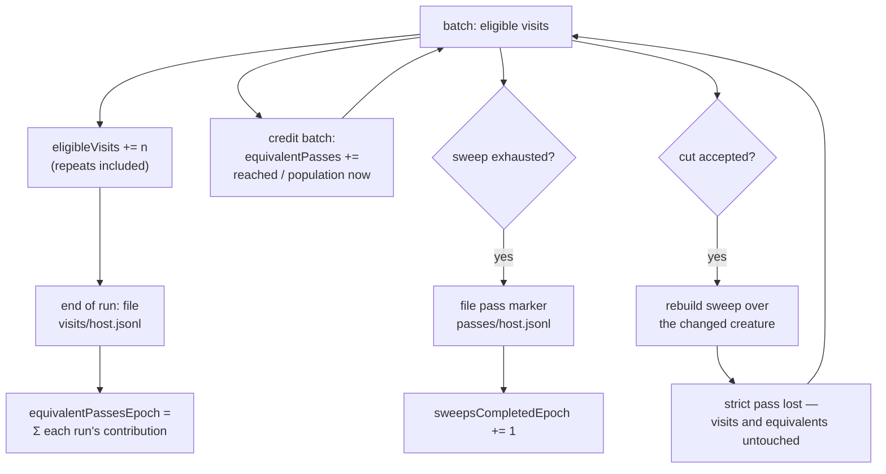

# Pass counters that survive an accepted cut

## Summary

A strict pass needs **one permutation** to survive from its first visit to its
last. An accepted cut rebuilds the sweep (#96), so a run that prunes well keeps
throwing part-finished permutations away — and `sweepsCompletedEpoch` sits at
zero through a run that revisited a whole creature. GRQ-sampler saw exactly
that: `passes: 0 complete this epoch` beside `7051 hidden neurons visited this
run · 7048 revisited` at 100% unique coverage.

The strict counters keep their names, their meaning and their place, and are now
labelled `(strict sweep completions)` so nobody reads them as *the* pass measure.
Beside them sit topology-tolerant figures that an accepted cut cannot erase:

- every **eligible visit** is counted as the sweep hands a uuid to a batch —
  repeats included — so rebuilding the sweep over a changed creature takes
  nothing back;
- each batch is **credited against the creature it was actually performed on**:
  `batchVisits / populationAtTheTime`, summed. This is an integral, not a
  quotient, and it is the point of the change — dividing a run's total by the
  creature it *finished* on inflates without bound as pruning shrinks the
  divisor (a run that visited 13 times and ended on a one-visit creature would
  claim 13 passes; it actually travelled 2.52);
- each run that visited anything files **one** ledger entry — visits, equivalent
  passes travelled, and the population it finished against — into
  `visits/<host>.jsonl`, a fourth sibling of `screens/`, `passes/` and the
  verdict directories, so the count outlives the run exactly as a pass marker
  does;
- `equivalentPassesEpoch` **sums** those per-run contributions rather than
  dividing an epoch total by one creature, so an epoch that pruned as it went is
  still measured honestly;
- `visitPopulation` is published as the *reference* size of one pass — the same
  figure the `sweep:` denominator uses — explicitly **not** the divisor, and the
  docs say so rather than leaving a consumer to discover it.

Closes #153.

## Evidence

Backend/CLI change with no web interface to screenshot. The observable is the
rendered artefact, captured from the regression test's own run.

**Before** (this branch's parent, same test scenario — four accepted cuts, 13
eligible visits, 100% unique coverage):

```text
progress:  11 newly checked this run
passes:    0 complete this epoch · 0 this run · pass 1 in progress
visits:    11 hidden neurons visited this run · 0 revisited
```

`0 complete` is the only pass measure on offer.

**After:**

```text
progress:  11 newly checked this run
passes:    0 complete this epoch · 0 this run · pass 1 in progress (strict sweep completions)
equiv:     2.52 creature-equivalent passes this epoch · 2.52 this run (13 eligible visits, 1 per pass)
visits:    11 hidden neurons visited this run · 0 revisited · 11 first visits
```

The strict figure is unchanged and now says what it measures; the `equiv:` line
answers the operator question. Note `2.52`, not `13.00`: this run pruned its
creature from 12 visits down to 1, and the accumulated figure refuses the
inflation that dividing by the final creature would have produced. That
distinction is asserted by
`equivalent_passes_are_credited_against_the_creature_of_the_day`.



Full gate, run in the foreground after the final edit:

```text
$ cargo fmt --all -- --check                      # clean
$ cargo clippy --workspace --all-targets --all-features -- -D warnings  # clean
$ cargo deny check                                # advisories ok, bans ok, licenses ok, sources ok
$ actionlint                                      # clean
$ markdownlint-cli2                               # 0 issues in 52 files
$ cargo test --workspace --all-features -- --test-threads=2
test result: ok. 659 passed; 0 failed   (lib)
test result: ok.  11 passed; 0 failed   (cli)
test result: ok.  21 passed; 0 failed   (readme_contract)
test result: ok.   8 passed; 0 failed   (incident_response)
test result: ok.  10 passed; 0 failed   (auto_version)
… 0 failed across every target
$ RUSTDOCFLAGS="-D warnings" cargo doc --workspace --no-deps --all-features  # clean
```

`./quality.sh` runs one further stage this container cannot: `codespell` is not
installed and no `pip`/`pipx` is available to install it, so the script exits at
its spell-check preflight before reaching the Rust stages. Every remaining stage
was run individually in the foreground and is listed above; CI runs codespell for
real on the PR.

## Reproduction

- **symptom** — a run that accepts cuts and revisits an already-covered creature
  reports `passes: 0 complete this epoch · 0 this run · pass 1 in progress` as
  its only pass or progress measure, because each accept rebuilds the sweep
  before its permutation can be exhausted
- **status** — `verified` — a red-capable variant of the regression test was run
  against the unfixed parent commit and observed failing with the **Before**
  artefact quoted above (four accepted cuts, 13 eligible visits, no `equiv:`
  line); the fix was then restored and the same test passes
- **regression test** —
  `ockham/src/run.rs::equivalent_pass_progress_survives_accepted_cuts_that_rebuild_the_sweep`

## Acceptance Criteria

<!-- vibe-spec-review inputs="diff+issue-body" -->

- **met** — a run at ~100% unique coverage that revisits and accepts cuts cannot
  report `0 complete` as its only pass/progress measure — evidence:
  `ockham/src/coverage.rs` `Passes::lines` renders `equiv:` beside `passes:`;
  `ockham/src/coverage.rs::zero_strict_passes_can_sit_beside_real_equivalent_progress`
  — reviewer: met — reason: the reviewer's caveat that the line is suppressed at
  `visit_population == 0` was a real defect (its W3) and is fixed — the line now
  reports the visit total and says there is no population to measure it against,
  covered by
  `an_empty_visit_population_reports_no_equivalent_passes_rather_than_inf`
- **met** — test: exhaust most of a sweep, accept a cut that rebuilds it,
  continue revisiting, assert progress survives the rebuild — evidence:
  `ockham/src/run.rs::equivalent_pass_progress_survives_accepted_cuts_that_rebuild_the_sweep`
  — reviewer: partial — reason: departure recorded. The reviewer was right about
  the test it saw — `eligible_visits_run > 0` would have passed even if the
  pre-accept visits had been discarded. The test now asserts a `batch` record
  exists *after* the first accepted `full` record, sums the visits journalled
  *before* that accept, and requires `eligible_visits_run` to exceed both that
  sum and the whole creature the run finished on, plus
  `equivalent_passes_run > 1.0`. Those assertions can only hold if work from
  before the rebuild survived it.
- **met** — `coverage.json`, `coverage.txt`, `ockham report` and the GRQ-facing
  commit text agree — evidence: both artefacts written from one `CoverageReport`
  in `ockham/src/coverage.rs::write_files`, the same `passes` value journalled in
  `ockham/src/run.rs`, and `summarise(...).passes == passes` asserted in the
  regression test — reviewer: met — reason: both caveats addressed. The
  `firstVisitsRun` disagreement (its W2) is gone — the field is no longer stored
  and is derived on read — and `docs/grq-integration.md`, which the reviewer
  correctly saw was absent from the diff it was given, is updated in this branch.
- **met** — strict permutation restarts remain under a clearly named metric —
  evidence: `sweep_restarts_run` / `sweeps_completed_epoch` / `current_pass`
  unchanged in `ockham/src/coverage.rs`; the rendered line names itself
  `(strict sweep completions)` — reviewer: met
- **met** — README explains strict sweep completion versus topology-tolerant
  equivalent passes — evidence: `README.md` §"Strict sweep completions versus
  creature-equivalent passes", with the metric table, the denominator stated
  exactly, and the "what resets what" list amended — reviewer: met
- **met** — `./quality.sh` passes — evidence: every stage run individually in the
  foreground; output quoted under **Evidence** — reviewer: met — reason: the
  reviewer verified fmt, clippy, tests and markdownlint itself and could not run
  `codespell`; neither could this run, for the environment reason recorded above.
  CI runs it.
- **unrequested** — `VisitLedger::population` is written but never read by
  production code — reviewer: unrequested — reason: kept deliberately as a
  diagnostic, exactly as `PassMarker::hidden` already is; it makes a ledger line
  interpretable on its own and lets an operator watch the creature shrink across
  an epoch. Its doc comment previously claimed it was what made the epoch total
  honest, which was untrue — that claim is removed.
- **unrequested** — a `visits: N eligible visit(s) recorded this epoch` log line
  at run open — reviewer: unrequested — reason: symmetry with the existing
  `passes:` open-time log line; one line, reporting only, no artefact affected.
- **unrequested** — the run-end coverage log line gains
  `· N creature-equivalent pass(es) this epoch` — reviewer: unrequested —
  reason: the operator-facing console line is where a fleet engineer reads the
  figure this issue exists to publish; it is the same value as the artefact.
- **unrequested** — `Passes` loses its `Eq` derive — reviewer: unrequested —
  reason: forced by the `f64` fields the issue asks for. `PartialEq` is retained,
  nothing in the workspace required `Eq`, and `Passes` is not used as a map key.
  Now called out in the docs rather than left silent.
- **unrequested** — `Passes::new` takes a `VisitTally` instead of gaining four
  more positional arguments — reviewer: unrequested — reason: a defaulted
  builder would have let a caller silently omit the tally and publish zeros as a
  measurement, which is the failure mode this issue is about. All call sites are
  in-crate.
- **unrequested** — a Mermaid flowchart in the README — reviewer: unrequested —
  reason: the repo's coding standards require a diagram where one aids
  understanding of data flow; this one shows what an accepted cut does and does
  not erase.

## Standards Review

<!-- vibe-standards-review inputs="diff+CODING-STANDARDS.md" -->

The repo carries no `CODING-STANDARDS.md`; the reviewer was given
`CONTRIBUTING.md` plus the project's documented coding standards verbatim.

- **violation** — `first_visits_run` documented as derived but stored with
  `#[serde(default)]`, so a pre-#153 artefact rendered `120 … · 118 revisited ·
  0 first visits` — 118 + 0 ≠ 120 — evidence: `ockham/src/coverage.rs` `Passes`
  — reason: fixed here. The field is gone; `Passes::first_visits_run()` derives
  it on every read, and
  `a_pre_153_coverage_json_reads_as_no_equivalent_passes` now asserts the
  rendered split adds up.
- **violation** — the epoch equivalent-pass figure divided the fleet's
  cumulative visits by the creature the run *finished* on, so pruning shrank the
  divisor and the quotient inflated without bound — evidence:
  `ockham/src/run.rs` end-of-run tally — reason: fixed here, and it was the most
  serious finding. `ScreenProgress::credit_batch` accumulates against the
  population in hand per batch, the ledger carries that figure, and
  `learnings::epoch_equivalent_passes` sums per-run contributions. Covered by
  `equivalent_passes_are_credited_against_the_creature_of_the_day` and
  `the_epoch_equivalent_total_is_immune_to_a_creature_that_shrank`.
- **violation** — the pre-#153 test exercised the mis-rendering above and
  asserted only the absence of `equiv:` — evidence: `ockham/src/coverage.rs`
  `a_pre_153_coverage_json_reads_as_no_equivalent_passes` — reason: fixed here;
  it now asserts the rendered `visits:` line and `first_visits_run()`.
- **violation** — the `Passes::lines` rustdoc example was unproducible by the
  code beneath it (`4.12` where `7051 / 7475` must render `0.94`) — evidence:
  `ockham/src/coverage.rs` `Passes::lines` — reason: fixed here; the example is
  now internally consistent and the bracketed clause reads `,` not `/`, because
  it is no longer a division.
- **violation** — `ockham/Cargo.toml` version not bumped for a
  binary-affecting change — evidence: `ockham/Cargo.toml` — reason: fixed here,
  `0.1.53` → `0.1.54`, with `Cargo.lock`. CI's `auto-version.sh` would have done
  it, but the change is unambiguously binary-affecting and should not rely on
  that.
- **violation** — `VisitLedger::population` unread, with a doc comment claiming
  it made the epoch total honest — evidence: `ockham/src/learnings.rs`
  `VisitLedger` — reason: the claim is removed; the field stays as a documented
  diagnostic on the `PassMarker::hidden` precedent, and the honesty it falsely
  claimed is now genuinely delivered by `equivalent_passes`.
- **violation** — silent fallback when the ledger cannot be read: the epoch
  figures degraded to this run's own with only a stderr warn — evidence:
  `ockham/src/run.rs` end-of-run tally — reason: stands, deliberately, and is
  now stated rather than implied. Failing the run would contradict the repo's
  standing rule that reporting must never cost pruning, and it mirrors the
  pass-marker path in the same function. The warning now names the fallback
  explicitly, and the README states it. The related half — a run figure
  published although the entry was refused — is correct and matches
  `sweepRestartsRun`; the README sentence that overstated it is scoped to the
  epoch figures.
- **violation** — no test for the three new run-level error branches —
  evidence: `ockham/src/run.rs` — reason: fixed here;
  `a_visit_ledger_the_store_refused_is_not_counted_in_the_epoch_total` drives a
  real run against an unwritable ledger path and asserts the run finishes, the
  run figures are published and the epoch figures stay at zero.
- **violation** — `docs/grq-integration.md`, the fleet contract file, absent
  from the reviewed diff — evidence: `docs/grq-integration.md` — reason: it was
  already updated in a later commit on this branch than the diff the reviewer
  was given, and is updated again here for the corrected semantics.
- **clean** — Australian English throughout the added lines; tests all call real
  code (`Passes::new`, `ScreenProgress::visit`/`credit_batch`,
  `LearningsStore::append_visits`/`load_visits`, `epoch_visits`,
  `epoch_equivalent_passes`, full `establish_run`) and assert on returned values,
  rendered text and on-disk artefacts; no source-text grepping; no existing test
  deleted or commented out; store-level edge and error paths covered
  (divide-by-zero, future format version, corrupt JSONL loudness with
  verdict/screen/pass isolation, orphan record, per-epoch scoping, non-finite
  entry); no sleeps, polling or timing thresholds; no hardcoding to test inputs;
  change scope confined to coverage/learnings/report/run plus the docs; no
  hidden, key, credential or `.env` paths staged.

## Test Plan

Added:

- `ockham/src/run.rs::equivalent_pass_progress_survives_accepted_cuts_that_rebuild_the_sweep`
  — the end-to-end regression. Asserts a `batch` record exists after the first
  accepted `full` record; that `eligible_visits_run` exceeds both the visits
  journalled before that accept and the whole creature the run finished on; that
  `equivalent_passes_run > 1.0` with `sweep_restarts_run == 0`; the published
  divisor; the `equiv:` and `(strict sweep completions)` text lines; that
  `ockham report` reads the same object out of the journal; that the ledger holds
  one entry per run carrying the run's own figures; and that a second run's epoch
  totals exceed its own run totals.
- `ockham/src/run.rs::equivalent_passes_are_credited_against_the_creature_of_the_day`
  — the accumulation is strictly below the naive
  `eligible_visits / finalCheckable` quotient on a run that pruned hard.
- `ockham/src/run.rs::a_visit_ledger_the_store_refused_is_not_counted_in_the_epoch_total`
  — an unwritable ledger path: the run finishes, its own figures are published,
  the epoch figures stay at zero.
- `ockham/src/coverage.rs::eligible_visits_count_repeats_the_distinct_set_cannot_see`
  — five passes over a two-visit creature is two distinct uuids and ten eligible
  visits.
- `ockham/src/coverage.rs::zero_strict_passes_can_sit_beside_real_equivalent_progress`
  — the rendered block with zero strict passes and real equivalent progress.
- `ockham/src/coverage.rs::an_empty_visit_population_reports_no_equivalent_passes_rather_than_inf`
  — visits recorded with no population: the line reports the total and says so,
  never `inf`/`NaN`.
- `ockham/src/coverage.rs::no_visits_and_no_population_renders_no_equivalent_line`
  — nothing to report, so nothing is rendered.
- `ockham/src/coverage.rs::a_pre_153_coverage_json_reads_as_no_equivalent_passes`
  — an older artefact still deserialises, the new keys read as zero, and the
  rendered first-visit split still adds up.
- `ockham/src/learnings.rs::visit_ledger_entries_round_trip_and_sum_across_the_fleet`
  — round-trip, and two hosts' entries summing to the epoch visit and equivalent
  totals.
- `ockham/src/learnings.rs::the_epoch_equivalent_total_is_immune_to_a_creature_that_shrank`
  — 150 visits over a 50-visit creature plus 60 over a 20-visit one is six
  passes, not 210/20.
- `ockham/src/learnings.rs::a_non_finite_ledger_entry_cannot_poison_the_epoch_total`
  — a `NaN`/`inf` entry cannot turn the whole sum into `NaN`.
- `ockham/src/learnings.rs::visit_ledger_entries_are_counted_per_screening_epoch`
  — a corpus change opens a new epoch at zero; history is not rewritten.
- `ockham/src/learnings.rs::a_corrupt_or_unknown_version_visit_ledger_costs_nothing_else`
  — a future-version entry is skipped, a truncated line is loud, and verdicts,
  screens and pass markers are all unaffected.
- `ockham/src/learnings.rs::a_visit_ledger_entry_with_no_corpus_is_counted_for_no_epoch`
  — an entry naming no corpus is kept and readable but counted for no epoch.

Modified (rendering and constructor changed, no assertion weakened):

- `ockham/src/run.rs::a_run_that_screened_nothing_reports_zero_progress` — now
  also asserts that a run which visited nothing files **no** ledger entry and
  reports zero eligible visits and zero equivalent passes.
- `ockham/src/coverage.rs::the_description_reports_the_completed_passes_and_the_one_in_progress`,
  `::a_fully_covered_epoch_still_reports_the_pass_it_is_working`,
  `::the_pass_in_progress_is_always_one_past_the_completed_count`,
  `::the_passes_object_round_trips_and_is_absent_without_a_store`,
  `::repeated_passes_never_move_the_unique_coverage_figures` — updated for the
  `(strict sweep completions)` suffix, the `equiv:` line, the `· N first visits`
  suffix and the `VisitTally` argument; the round-trip test additionally asserts
  the five new JSON keys.
- `ockham/src/report.rs::report_carries_the_pass_counters_from_the_coverage_record`
  and `::a_later_coverage_record_without_counters_clears_the_older_ones` —
  updated for the `VisitTally` argument; the former additionally asserts
  `eligibleVisitsEpoch` and `equivalentPassesEpoch` in `ockham report` JSON.
