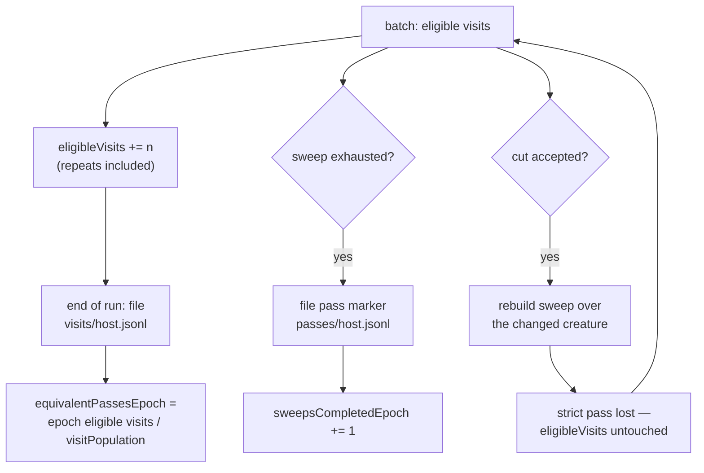

# Pass counters that survive an accepted cut

## Summary

A strict pass needs **one permutation** to survive from its first visit to its
last. An accepted cut rebuilds the sweep (#96), so a run that prunes well keeps
throwing part-finished permutations away — and `sweepsCompletedEpoch` sits at
zero through a run that revisited a whole creature. GRQ-sampler saw exactly
that: `passes: 0 complete this epoch` beside `7051 hidden neurons visited this
run · 7048 revisited` at 100% unique coverage.

The strict counters keep their names, their meaning and their place, and are now
labelled `(strict sweep completions)` so nobody reads them as *the* pass measure.
Beside them sit topology-tolerant figures that an accepted cut cannot erase:

- every **eligible visit** is counted as the sweep hands a uuid to a batch —
  repeats included — so rebuilding the sweep over a changed creature takes
  nothing back;
- each run files **one** ledger entry into `visits/<host>.jsonl`, a fourth
  sibling of `screens/`, `passes/` and the verdict directories, so the count
  outlives the run exactly as a pass marker does;
- `equivalentPassesEpoch` = `eligibleVisitsEpoch / visitPopulation`, where
  `visitPopulation` is the **same figure as the `sweep:` denominator** — every
  hidden neuron and every synapse visit the final incumbent carries — published
  on the object so the divisor is never left to be guessed at;
- `firstVisitsRun` splits the run's distinct visits from `revisitedRun`.

Pruning shrinks that denominator as the run works, so an equivalent pass is a
stable approximation rather than a proof that every visit was reached once. That
is the deliberate trade the issue asks for: a stable, honest approximation over a
precise-looking counter that resets whenever a win changes the incumbent.
Closes #153.

## Evidence

Backend/CLI change with no web interface to screenshot. The observable is the
rendered artefact, captured from the regression test's own run.

**Before** (this branch's parent, same test scenario — four accepted cuts, 11
eligible visits, 100% unique coverage):

```text
progress:  11 newly checked this run
passes:    0 complete this epoch · 0 this run · pass 1 in progress
visits:    11 hidden neurons visited this run · 0 revisited
```

`0 complete` is the only pass measure on offer.

**After:**

```text
progress:  11 newly checked this run
passes:    0 complete this epoch · 0 this run · pass 1 in progress (strict sweep completions)
equiv:     13.00 creature-equivalent passes this epoch · 13.00 this run (13 eligible visits / 1 per pass)
visits:    11 hidden neurons visited this run · 0 revisited · 11 first visits
```

The strict figure is unchanged and now says what it measures; the `equiv:` line
answers the operator question the issue actually asks.



Full gate, run in the foreground after the final edit:

```text
$ cargo fmt --all -- --check                      # clean
$ cargo clippy --workspace --all-targets --all-features -- -D warnings  # clean
$ cargo deny check                                # advisories ok, bans ok, licenses ok, sources ok
$ actionlint                                      # clean
$ markdownlint-cli2                               # 0 issues in 51 files
$ cargo test --workspace --all-features -- --test-threads=2
test result: ok. 654 passed; 0 failed   (lib)
test result: ok.  11 passed; 0 failed   (cli)
test result: ok.  21 passed; 0 failed   (readme_contract)
test result: ok.   8 passed; 0 failed   (incident_response)
test result: ok.  10 passed; 0 failed   (auto_version)
… 0 failed across every target
$ RUSTDOCFLAGS="-D warnings" cargo doc --workspace --no-deps --all-features  # clean
```

`./quality.sh` runs one further stage this container cannot: `codespell` is not
installed and no `pip`/`pipx` is available to install it, so the script exits at
its spell-check preflight before reaching the Rust stages. Every remaining stage
was run individually in the foreground and is listed above; CI runs codespell
for real on the PR.

## Reproduction

- **symptom** — a run that accepts cuts and revisits an already-covered creature
  reports `passes: 0 complete this epoch · 0 this run · pass 1 in progress` as
  its only pass or progress measure, because each accept rebuilds the sweep
  before its permutation can be exhausted
- **status** — `verified` — a red-capable variant of the regression test was run
  against the unfixed parent commit and observed failing with the artefact quoted
  under **Evidence** above (four accepted cuts, 11 visits, no `equiv:` line); the
  fix was then restored and the same test passes
- **regression test** —
  `ockham/src/run.rs::equivalent_pass_progress_survives_accepted_cuts_that_rebuild_the_sweep`

## Acceptance Criteria

<!-- vibe-spec-review inputs="diff+issue-body" -->

PLACEHOLDER

## Standards Review

<!-- vibe-standards-review inputs="diff+CODING-STANDARDS.md" -->

PLACEHOLDER

## Test Plan

Added:

- `ockham/src/run.rs::equivalent_pass_progress_survives_accepted_cuts_that_rebuild_the_sweep`
  — the end-to-end regression: a run whose every candidate wins accepts cuts and
  rebuilds the sweep, so the strict counters stay at zero; asserts the eligible
  visits, the equivalent passes, the published divisor, the `equiv:` and
  `(strict sweep completions)` text lines, that `ockham report` reads the same
  object out of the journal, that the ledger holds one entry per run, and that a
  second run's epoch total exceeds its own run total.
- `ockham/src/coverage.rs::eligible_visits_count_repeats_the_distinct_set_cannot_see`
  — five passes over a two-visit creature is two distinct uuids and ten eligible
  visits.
- `ockham/src/coverage.rs::zero_strict_passes_can_sit_beside_real_equivalent_progress`
  — the rendered block with zero strict passes and real equivalent progress.
- `ockham/src/coverage.rs::an_empty_visit_population_reports_no_equivalent_passes_rather_than_inf`
  — the divide-by-zero edge: `0.00`, never `inf`/`NaN`, and the line is omitted.
- `ockham/src/coverage.rs::a_pre_153_coverage_json_reads_as_no_equivalent_passes`
  — an older artefact still deserialises; the new keys read as zero.
- `ockham/src/learnings.rs::visit_ledger_entries_round_trip_and_sum_across_the_fleet`
  — round-trip, and two hosts' entries summing to the epoch total.
- `ockham/src/learnings.rs::visit_ledger_entries_are_counted_per_screening_epoch`
  — a corpus change opens a new epoch at zero visits; history is not rewritten.
- `ockham/src/learnings.rs::a_corrupt_or_unknown_version_visit_ledger_costs_nothing_else`
  — a future-version entry is skipped, a truncated line is loud, and verdicts,
  screens and pass markers are all unaffected.
- `ockham/src/learnings.rs::a_visit_ledger_entry_with_no_corpus_is_counted_for_no_epoch`
  — an entry naming no corpus is kept and readable but counted for no epoch.

Modified (rendering and constructor changed, no assertion weakened):

- `ockham/src/coverage.rs::the_description_reports_the_completed_passes_and_the_one_in_progress`,
  `::a_fully_covered_epoch_still_reports_the_pass_it_is_working`,
  `::the_pass_in_progress_is_always_one_past_the_completed_count`,
  `::the_passes_object_round_trips_and_is_absent_without_a_store`,
  `::repeated_passes_never_move_the_unique_coverage_figures` — updated for the
  new `(strict sweep completions)` suffix, the `equiv:` line, the `· N first
  visits` suffix and the `VisitTally` argument; the round-trip test additionally
  asserts the six new JSON keys.
- `ockham/src/run.rs::a_run_that_screened_nothing_reports_zero_progress` — now
  also asserts that a run which visited nothing files **no** ledger entry and
  reports zero eligible visits and zero equivalent passes.
- `ockham/src/report.rs::report_carries_the_pass_counters_from_the_coverage_record`
  and `::a_later_coverage_record_without_counters_clears_the_older_ones` — updated
  for the `VisitTally` argument; the former additionally asserts
  `eligibleVisitsEpoch` and `equivalentPassesEpoch` in `ockham report` JSON.
