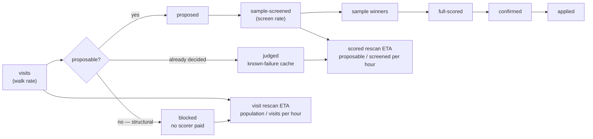

# Report neuron/synapse screening throughput and full-rescan ETA

## Summary

`visits: 7051 hidden neurons visited this run` says how fast the razor walks
UUIDs. It does not say how fast it finds scorer-verified removable structure,
and the two are not the same number: most of a forest-heavy creature is a visit
nothing can be proposed for. This change measures the screening pipeline as a
**funnel**, split by candidate kind, and turns it into rates over the run's
measured wall clock plus two rescan ETAs. Closes #162.

- New `ockham/src/throughput.rs`: `Funnel` counts ten stages — `visits`,
  `revisits`, `blocked`, `judged`, `proposed`, `sampleScreened`,
  `sampleWinners`, `fullScored`, `confirmed`, `applied` — each split into
  `neurons` / `synapses` / `total`, so `visited`, `proposed`, `screened` and
  `scored` can never be read as the same figure. Every visit is exactly one of
  `blocked`, `judged` or `proposed`, and the three sum to `visits`.
- `blocked` and `judged` are separate on purpose: a blocked visit is structure
  the razor cannot cut at all, while a judged one was built, scored and rejected
  on an earlier run and only the known-failure cache stops it being offered
  again. Folding the second into the first shrank the scored rescan ETA as the
  cache grew — backwards on exactly the mature creatures the ETA exists for.
- `Throughput::measured` derives the per-hour rates from the optimisation
  loop's own `Instant::elapsed()`, never `--timeout-seconds`, and both ETAs:
  `visitRescanHours` (walk every eligible visit once) and `scoredRescanHours`
  (construct and sample-score every currently proposable candidate once). Both
  are computed **per kind and summed**, each population at its own measured
  rate — a run that walked only neurons reports `unknown` rather than
  projecting the neuron rate onto the edge population. `none left` is the
  distinct answer for "measured, and nothing proposable remains".
- `run.rs` records each stage where it happens: blocked/judged and proposed off
  the sweep batch, sample-screened on entry to the screen, sample winners off
  the screen result, and scored/confirmed/applied off the full cohort. The
  funnel head is taken from the existing `ScreenProgress` visit counters rather
  than counted a second time, so it can never disagree with the `visits:` line.
- Exposed consistently on all three surfaces: an additive `throughput` object in
  `coverage.json`, three new lines in `coverage.txt`, and the same snapshot read
  back off the journal's `coverage` record by `ockham report`.

```text
funnel:    neurons 9100 visits · 8680 blocked · 0 judged · 420 proposed · 312 screened · 24 scored
funnel:    synapses 31400 visits · 29295 blocked · 0 judged · 2105 proposed · 1840 screened · 60 scored
rate:      neurons 312 screened/h · synapses 1840 screened/h · full rescan ~0.8h
eta:       visit rescan ~0.6h · scored rescan ~0.8h · 5013 neurons + 2000 edges eligible
```



The two ETAs **agree** whenever every proposed candidate was screened, and that
agreement is a finding rather than a defect — finding the proposable candidates
means walking the blocked visits too, so both pay for the blocked population.
They diverge as soon as proposals go unscreened (a coverage tail, screening off,
a cohort the budget stopped), which is the case the pair exists to separate.
README and the module docs state this explicitly.

## Evidence

Backend/CLI change with no web interface, so there is no screenshot to capture.
The evidence is the test suite and the gate.

- 716 tests pass (`cargo test --workspace --all-features -- --test-threads=2`),
  including the thirteen new `throughput` unit tests, the two new `coverage`
  rendering tests and the new end-to-end mixed-run test.
- `cargo fmt --check`, `cargo clippy --workspace --all-targets --all-features -D
  warnings -D clippy::filter_next -D clippy::collapsible_if`, `cargo deny
  check`, `actionlint`, `markdownlint-cli2` and `cargo doc` with
  `RUSTDOCFLAGS="-D warnings"` all pass.
- Real `coverage.txt` from the new end-to-end test's seeded run (4 hidden
  neurons, 8 edges, three accepted cuts):

```text
progress:  13 newly checked this run
passes:    0 strict complete this epoch · 0 strict this run · pass 1 in progress
rescan:    6.00 creature-equivalent this run · 24 visit attempts
visits:    neurons 8 (0 revisits) · synapses 16 (0 revisits)
winners:   16 screened · 8 confirmed · 3 applied · 1 carried
funnel:    neurons 8 visits · 0 blocked · 0 judged · 8 proposed · 8 screened · 8 scored
funnel:    synapses 16 visits · 8 blocked · 0 judged · 8 proposed · 8 screened · 8 scored
rate:      neurons … screened/h · synapses … screened/h · full rescan ~<0.1h
eta:       visit rescan ~<0.1h · scored rescan ~<0.1h · 1 neuron + 3 edges eligible
```

<!-- vibe-quality-gate-skipped stage="codespell" reason="codespell is not installed in this container and there is no pip/pipx to install it; every other ./quality.sh stage was run individually and passes. CI runs codespell on the PR." -->

`./quality.sh` stops at its codespell preflight because `codespell` is not
installed in this container and the image carries no `pip`/`pipx` to install it.
Every other stage of the gate was run individually and passes — bash syntax,
shellcheck, the neat-core version gate, markdownlint-cli2, actionlint, `cargo
deny check`, `cargo fmt --check`, clippy, the full test suite and `cargo doc`.
CI runs codespell on the PR.

## Acceptance Criteria

<!-- vibe-spec-review inputs="diff+issue-body" -->

- **met** — Rates use measured elapsed time, not the configured timeout —
  evidence: `ockham/src/run.rs:2194` passes `started.elapsed()` (loop clock at
  `ockham/src/run.rs:828`), test
  `ockham/src/throughput.rs::the_rate_is_over_the_whole_run_not_the_screening_share`
  — reviewer: met
- **met** — Neuron and synapse rates are reported separately — evidence:
  `Rate { neurons, synapses, total }` in `ockham/src/throughput.rs`, test
  `ockham/src/throughput.rs::rates_are_per_measured_hour_and_split_by_kind` —
  reviewer: met
- **met** — `visited`, `proposed`, `sample-screened` and `full-scored` cannot be
  conflated — evidence: ten distinct stages, test
  `ockham/src/throughput.rs::the_funnel_stages_cannot_be_conflated` — reviewer:
  partial — reason: the reviewer found `coverage.txt` carrying two
  differently-defined "blocked" figures. Fixed after the review — known-failure
  skips moved to their own `judged` stage
  (`ockham/src/throughput.rs::a_judged_visit_is_not_a_blocked_one`) and the
  README now states that `blocked:` counts distinct keys this epoch while
  `funnel: … blocked` counts this run's attempts.
- **met** — Blocked visits are counted and their effect on rescan ETA is
  explicit — evidence: per-kind `blocked`, both ETAs on the `eta:` line, tests
  `blocked_visits_separate_the_two_rescan_etas` and
  `a_fully_blocked_creature_reports_nothing_left_to_score` — reviewer: partial
  — reason: the reviewer found the blocked bucket polluted by known-failure
  skips and a fully-blocked creature reporting `unknown` instead of "nothing to
  score". Both fixed after the review — the `judged` split, and `none left` as a
  measured answer distinct from `unknown`.
- **partial** — A run that spends time in replay/full scoring still reports an
  honest whole-run screening rate — evidence: whole-loop denominator, replay
  cohorts excluded from the funnel (`funnel.observe_full` is called only at the
  search full-score site, `ockham/src/run.rs:2014`), test
  `the_rate_is_over_the_whole_run_not_the_screening_share` — reviewer: partial —
  reason: with screening disabled (`--screen-sample-rate 0`) there is no sampled
  stage at all, so such a run reports `0 screened/h` and `full rescan unknown`;
  `fullScoredPerHour` is the rate to read there, and the README says so. Left as
  documented behaviour rather than inventing a screen rate a control run never
  measured.
- **met** — `coverage.json`, `coverage.txt` and `ockham report` expose
  consistent values — evidence: one constructor owns the arithmetic, and
  `ockham/src/run.rs::a_mixed_run_reports_its_screening_funnel_rates_and_rescan_eta`
  compares all three — reviewer: met
- **met** — Tests cover a mixed neuron/synapse run with blocked, screened and
  full-scored candidates — evidence:
  `ockham/src/run.rs::a_mixed_run_reports_its_screening_funnel_rates_and_rescan_eta`
  — reviewer: met
- **met** — README documents the funnel and ETA semantics — evidence:
  `README.md` "Screening throughput and rescan ETA" (stage table, exclusions,
  ETA table, Mermaid funnel) and the GRQ contract bullets — reviewer: met
- **partial** — `./quality.sh` passes — evidence: every stage run individually
  and passing; see the Evidence section and the `vibe-quality-gate-skipped` note
  — reviewer: partial — reason: `codespell` is not installed in this container
  and there is no `pip`/`pipx`, so the script aborts at its spell-check
  preflight; CI runs that stage on the PR.
- **unrequested** — the `funnel:` (one per kind) and `eta:` lines in
  `coverage.txt`, where the issue asked for one compact `rate:` line — reviewer:
  unrequested — reason: kept, because the criterion "`visited`, `proposed`,
  `sample-screened` and `full-scored` cannot be conflated" applies to the
  surface GRQ actually pastes, and the "without making the subject longer"
  constraint is about the commit **subject**, not the description block.
- **unrequested** — the `proposableEstimate` key, which is not on the issue's
  exposure list — reviewer: unrequested — reason: kept, because it is the
  numerator of `scoredRescanHours`; without it that ETA cannot be audited
  against the rate beside it.
- **unrequested** — `pub use throughput::{Funnel, Rate, Throughput, VisitKind}`
  in `ockham/src/lib.rs` — reviewer: unrequested — reason: kept, matching the
  existing re-export of every module's public types (`telemetry`, `coverage`,
  `promote` and the rest) rather than making this one module the exception.

## Standards Review

<!-- vibe-standards-review inputs="diff+CODING-STANDARDS.md" -->

- **violation** — the crate version was not bumped, against CONTRIBUTING.md
  principle 8, while the change alters `coverage.txt`, adds `coverage.json` keys
  and adds a `report` field — evidence: `ockham/Cargo.toml:3` — reason: fixed
  here, `0.1.55` → `0.1.56` with the matching `Cargo.lock` entry.
- **violation** — `proposable_estimate` used `.unwrap_or(0.0)`, publishing a
  total that silently omitted a live-but-unvisited population while the adjacent
  ETA correctly reported `None` — evidence: `ockham/src/throughput.rs:274` —
  reason: fixed here, the field is `Option<f64>` and both are computed once from
  the same measurement; covered by
  `an_unvisited_population_leaves_both_etas_unknown`.
- **violation** — `funnel.applied` counted a bundle or group winner the scored
  stage never judged, so `applied` could exceed `fullScored` and contradicted
  the module's own stated contract — evidence: `ockham/src/throughput.rs:199` —
  reason: fixed here, only `individual` and `synapse` winners are counted;
  covered by
  `observe_full_counts_individuals_and_leaves_plans_to_the_winners_block`.
- **violation** — `Funnel::observe_full` and the `record_*` helpers had no unit
  tests, only end-to-end coverage, against the happy/error/edge-case rule —
  evidence: `ockham/src/throughput.rs:190` — reason: fixed here, the new test
  covers an individual, a synapse, a delta exactly at the threshold, a bundle
  winner and an empty cohort.
- **violation** — the README `throughput` key list omitted `hidden` and
  `synapses`, disagreeing with `docs/grq-integration.md` about the artefact
  schema — evidence: `README.md:1459` — reason: fixed here, both surfaces now
  list the same keys.
- **violation** — the rustdoc example line omitted the trailing `eligible` word the
  code renders, and its figures were mutually inconsistent — evidence:
  `ockham/src/throughput.rs:303` — reason: fixed here, the example is now the
  exact block the render test asserts.
- **violation** — DRY: `proposable()` was computed twice per call to `measured`,
  once for the estimate and again inside the ETA — evidence:
  `ockham/src/throughput.rs:274` and `:377` — reason: fixed here, measured once
  and passed into both.
- **violation** — the same value is labelled `full rescan` on the `rate:` line
  and `scored rescan` on the `eta:` line — evidence:
  `ockham/src/throughput.rs:326` / `:333` — reason: stands. `full rescan` is the
  issue's own wording for the compact line, and both the README bullet and the
  module docs now state explicitly that it is the same figure as `eta:`'s
  `scored rescan`.
- **violation** — the new module-tree entry was one column left of its
  neighbours — evidence: `README.md:2530` — reason: fixed here.
- **clean** — Australian English throughout the new prose and identifiers;
  tests call real functions and assert on returned values or written artefacts,
  with no source-text grepping; no unbounded polling or time-based loops;
  division-by-zero guarded in `Rate::per_hour` and both ETA helpers; the rate
  really is over the loop's measured `Instant`, not `--timeout-seconds`; every
  new serde field is additive and back-compatible, with a round-trip test; the
  counting sites in `run.rs` honour the documented exclusions (groups, replay);
  no new parsing, filesystem or process surface; no hidden paths staged.

## Test Plan

- `ockham/src/throughput.rs` — thirteen unit tests: kind classification of visit
  keys and cohort labels; per-hour rates over measured time split by kind; the
  stages proved un-conflatable; blocked visits separating the two ETAs; a judged
  visit counted apart from a blocked one and kept inside the proposable share; a
  fully-blocked creature reporting `none left` rather than `unknown`; an
  unmeasured kind leaving **both** ETAs and the estimate unknown; zero measured
  time reporting nothing; a whole-run rate over a run that spent its time in
  full scoring; `observe_full` over individuals, a synapse, a threshold-equal
  delta, a bundle winner and an empty cohort; sub-six-minute and singular
  rendering; JSON round-trip.
- `ockham/src/coverage.rs::the_throughput_block_renders_exactly_as_grq_will_paste_it`
  — the exact four-line block GRQ pastes, per kind.
- `ockham/src/coverage.rs::a_report_without_throughput_renders_no_rate_lines` —
  a pre-#162 artefact renders exactly as it did before.
- `ockham/src/run.rs::a_mixed_run_reports_its_screening_funnel_rates_and_rescan_eta`
  — end-to-end mixed neuron/synapse run with blocked, screened and full-scored
  candidates: asserts the funnel identity (`blocked + judged + proposed ==
  visits`), that the funnel head equals the `passes` visit counters, that the
  rates are the counts over the measured elapsed hours, and that
  `coverage.json`, `coverage.txt` and `summarise()` (`ockham report`) all carry
  the same values.
