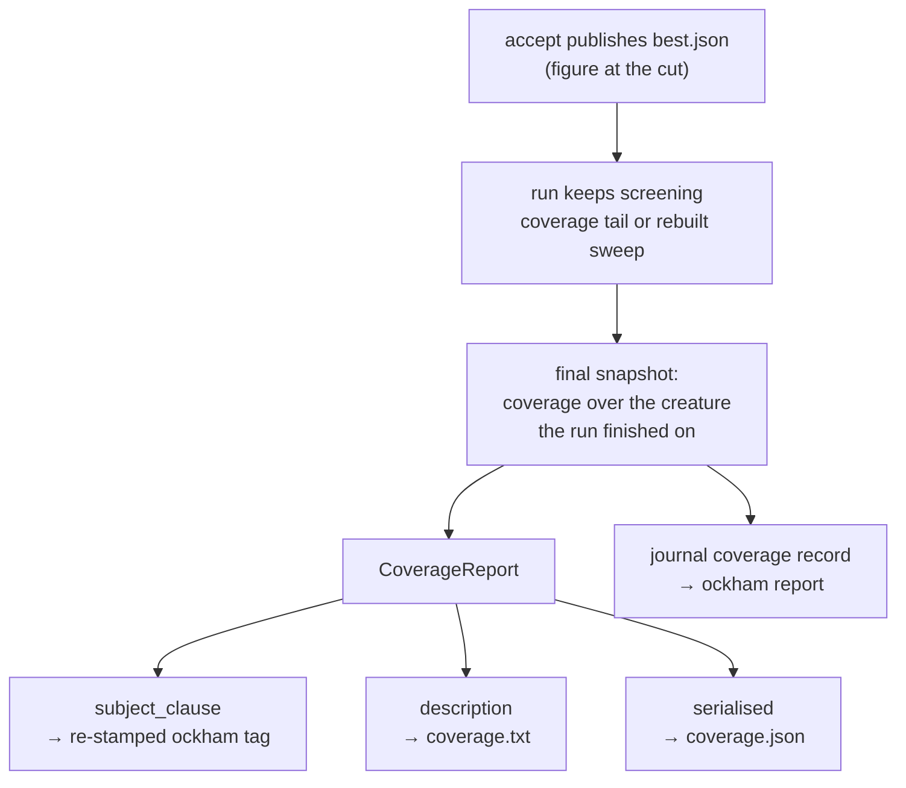

## Summary

The GRQ-sampler commit subject and the coverage block below it were two
different measurements. The `ockham` check-in tag is stamped the moment an
accept publishes `best.json`, and the run keeps screening afterwards — in the
coverage tail a replay accept opens (#91), or in the sweep a **search** accept
rebuilds over the changed creature. `coverage.txt` is written when the run
ends, so it counted everything screened after the cut while the subject still
carried the figure at the cut: `sweep 10338/55649 (18.6%)` in the subject
against `13481/55649 (24.2%)` in the body of one commit.

Every published figure now comes from one snapshot, measured after the final
accepted creature is selected:

- the check-in tag is re-stamped from that snapshot after **any** accept, not
  only after a coverage tail (`ockham/src/run.rs`). It is skipped only without
  `--learnings-dir`, where there is no coverage to carry;
- the subject clause is rendered by `Coverage::subject_clause`, so the subject
  and the description share one numerator, one denominator, one epoch identity
  and one percentage calculation — `tags.rs` no longer formats its own
  `sweep X/Y`;
- `CoverageReport` carries a `Snapshot` (`stage`, `creature` checksum),
  rendered as a `snapshot:` line in `coverage.txt` and an additive `snapshot`
  key in `coverage.json`, so the hidden count, the synapse count and the
  `sweep:` denominator they add up to are provably of one creature.

Distinct semantics are untouched: `sweep:` stays unique visit coverage of the
current epoch, `passes:` strict sweep completions, `rescan:`/`visits:` visit
attempts and creature-equivalent passes, `history:` cumulative across epochs.

Closes #171.

## Evidence

Backend/CLI only — there is no web interface to screenshot. The evidence is the
regression tests below plus the artefacts one run produces.

`ockham/src/run.rs::a_search_accept_reports_one_snapshot_in_the_subject_and_the_description`
runs a real `establish_run` over a creature whose one hidden neuron fans in from
six inputs, so the accept both shrinks the denominator and mints visit keys
nothing has screened. Against the unfixed code it produced:

```text
best.json ockham tag: 🪒 Ockham · search individual · … · sweep 0/6 (0.0% of epoch 2b2e10ae)
coverage.txt:         sweep:     6 of 6 visits (100.0% of epoch)
left: (0, 6, "0.0")  right: (6, 6, "100.0")
```

After the fix both surfaces read `6/6 (100.0%)` and the description carries
`snapshot:  final · creature <id> · 0 hidden + 6 synapses = 6 visits`.



Full gate: `cargo fmt --check`, `cargo clippy --workspace --all-targets
--all-features -D warnings`, `cargo test --workspace --all-features` (665 lib +
56 integration tests, all green), `cargo doc -D warnings`, codespell,
markdownlint-cli2 and `cargo deny check` all pass.

`scripts/check-neat-core-version.sh` — the **Project Validation** gate — is now
green too. It had been failing on every branch because `neat-core.expected-version`
recorded `0.13.0` while NEAT-AI-core `Develop` presents `0.14.1`. The bump is
handled here rather than deferred again: neat-core #640 (Issue #622, `0.14.0`)
bounds a creature's declared observation width before it is walked, refusing a
declared `input` above `MAX_NODE_COUNT` with `CreatureError::TooManyNodes`;
`0.14.1` (#641) is a `bump-deps.sh` fix with no library change. Ockham names none
of the affected items, so the baseline bump carries no Ockham source change —
verified by building, clippying and running the whole suite against a `Develop`
worktree at `255b06e` (`0.14.1`), all green.

## Reproduction

- **symptom** — one GRQ-sampler commit reported `sweep 10338/55649 (18.6%)` in
  its subject and `13481/55649 (24.2%)` in its body, with nothing to say which
  measurement either came from
- **status** — `verified` — the regression test was written first and observed
  failing against the unfixed code (`left: (0, 6, "0.0")` vs
  `right: (6, 6, "100.0")` — the same subject-behind-body shape as the reported
  commit), and passing after the fix
- **regression test** —
  `ockham/src/run.rs::run::tests::a_search_accept_reports_one_snapshot_in_the_subject_and_the_description`

## Acceptance Criteria

<!-- vibe-spec-review inputs="diff+issue-body" -->

- **met** — Trace where the subject and body coverage values are captured,
  including acceptance, replay/rebase, topology changes and final reporting —
  evidence: `ockham/src/run.rs` re-stamp block and the README section
  "One snapshot, four surfaces" — reviewer: met
- **met** — Generate all final coverage figures from one immutable, explicitly
  identified snapshot after the final accepted/rebased creature is selected —
  evidence: `ockham/src/run.rs` (`cov` measured once over the final incumbent;
  the `coverage_tail` guard dropped) and `coverage::Snapshot` — reviewer: met —
  reason: the reviewer noted `Snapshot` holds `stage`/`creature` rather than the
  figures, so one-measurement-ness rests on the single `Copy` `cov` handed to
  every surface; that is the intended design and the snapshot names what the
  figures were measured over
- **met** — Use the same numerator, denominator, epoch identity and percentage
  calculation across subject, body, text and JSON; preserve distinct semantics —
  evidence:
  `ockham/src/coverage.rs::the_subject_clause_and_the_description_report_one_set_of_figures`
  — reviewer: met
- **met** — Neuron and synapse counts and combined totals refer to the same
  creature/snapshot; cumulative epoch counts distinguished from current-run
  counts — evidence: `coverage::Snapshot::line` and
  `the_snapshot_line_names_the_creature_and_adds_the_populations_up` (asserts
  the whole block byte for byte) — reviewer: partial — reason: the reviewer read
  the second half as unaddressed because nothing in the rendered text said what
  the snapshot scopes; the README bullet now states that it scopes the
  current-epoch and per-run figures while `history:` stays cumulative on its own
  line
- **partial** — If GRQ constructs the commit subject separately, update the
  integration to consume the canonical report rather than recomputing coverage —
  evidence: `docs/grq-integration.md` §5 — reviewer: partial — reason: GRQ uses
  the `ockham` tag verbatim and relays `coverage.txt` verbatim, so it already
  consumes the canonical report and needs no change; the private GRQ-sampler
  repo is out of this repository's scope, so only the documented contract could
  be updated here
- **met** — Add regression tests for accepted cuts, topology rebuilds,
  replay/rebase selection, and a changing denominator; assert subject/body
  consistency and sensible percentages — evidence:
  `a_search_accept_reports_one_snapshot_in_the_subject_and_the_description`
  (accept + rebuild + denominator 8 → 6) and
  `a_replay_accept_reports_one_snapshot_in_the_subject_and_the_description` —
  reviewer: met — reason: the reviewer noted neither run-level test pins a
  non-100% percentage; the unit test above asserts `17.2%` from the same
  renderer, and the run-level tests assert subject/body equality whatever the
  figure
- **met** — Document the snapshot semantics and preserve backward compatibility
  of existing coverage JSON consumers — evidence: `README.md`,
  `docs/grq-integration.md` contract rows, and
  `a_pre_171_coverage_json_reads_and_renders_as_it_did` — reviewer: partial —
  reason: the reviewer found `docs/grq-integration.md` untouched and its #91
  paragraph now wrong; both contract rows and that paragraph were corrected in
  the follow-up commit
- **unrequested** — `short_id` extracted as a private helper and `short_epoch`
  reduced to delegating to it — reviewer: unrequested — reason: the snapshot
  line shortens a creature checksum, and one truncation rule keeps two
  identities printed side by side from being shortened on different terms
- **unrequested** — the re-stamp log line changed from a static string to one
  naming the snapshot — reviewer: unrequested — reason: reverted to a static
  string in the follow-up commit after the standards reviewer showed the
  formatted version claimed work the no-store branch does not do

## Standards Review

<!-- vibe-standards-review inputs="diff+CODING-STANDARDS.md" -->

- **violation** — `docs/grq-integration.md` coverage.txt contract row not
  updated for the new `snapshot:` line — evidence:
  `docs/grq-integration.md:504` — reason: fixed here; the row now documents the
  line and its position between `tagged:` and `progress:`
- **violation** — same row for `coverage.json` never mentions the new
  `snapshot` key — evidence: `docs/grq-integration.md:505` — reason: fixed
  here; the additive-key history now carries `snapshot` (`stage`, `creature`)
- **violation** — §5 still claimed the #91 double stamp made the subject agree
  with `coverage.txt` — evidence: `docs/grq-integration.md:400` — reason: fixed
  here; the paragraph now records what #171 found and that the re-stamp is
  unconditional on any accept
- **violation** — the README example rendered `5013 hidden + 2000 synapses =
  7013 visits` beside `sweep: 1204 of 5013 visits` — evidence: `README.md:1382`
  — reason: fixed here to `3013 hidden + 2000 synapses = 5013 visits`; the
  canonical example must satisfy the invariant it documents
- **violation** — the README diagram drew the journal record as rendered from
  `CoverageReport`, which carries the snapshot the journal record does not —
  evidence: `README.md:1539` — reason: fixed here; the edge now runs from the
  final snapshot, which is what the journal record is written from
- **violation** — `SnapshotStage::Accept` was never constructed, and its
  `label()` arm was unreachable — evidence: `ockham/src/coverage.rs:896` —
  reason: removed here; the published vocabulary is the one word every artefact
  carries
- **violation** — `short_epoch` reduced to a public alias of a public
  `short_id`, two public functions with identical behaviour — evidence:
  `ockham/src/coverage.rs:88` — reason: fixed here by making `short_id`
  private, so `short_epoch` stays the one public spelling
- **violation** — the rewritten `short_id` doc dropped the still-true mention of
  the journal `coverage` record carrying the full identity — evidence:
  `ockham/src/coverage.rs:73` — reason: restored here
- **violation** — the re-stamp log line asserted work the no-store branch does
  not do — evidence: `ockham/src/run.rs:2178` — reason: fixed here; the
  re-stamp is now guarded on the screen store, since without one the accept's
  tag is already the tag the run finishes on
- **violation** — `Coverage::subject_clause`'s documented no-epoch edge case
  had no test — evidence: `ockham/src/coverage.rs:232` — reason: covered here
  in `the_subject_clause_and_the_description_report_one_set_of_figures`
- **violation** — no test pinned the full block with the `snapshot:` line in its
  documented position — evidence: `ockham/src/coverage.rs:2028` — reason: fixed
  here; `the_snapshot_line_names_the_creature_and_adds_the_populations_up` now
  asserts the whole description byte for byte
- **violation** — dangling `and` left mid-sentence in the README bullet the diff
  edited — evidence: `README.md:1477` — reason: fixed here
- **violation** — `Snapshot`/`SnapshotStage` added to an already 3,100-line
  `coverage.rs` rather than carved out as #162 did with `throughput.rs` —
  evidence: `ockham/src/coverage.rs` — reason: stands; the snapshot exists to
  identify the `Coverage` it is rendered beside and is ~60 lines, so splitting
  the module is a refactor outside a reporting-consistency fix
- **clean** — backward compatibility (`#[serde(default,
  skip_serializing_if)]`, exercised by a real pre-#171 payload); test quality
  (real functions, real artefacts, no source-text greps, no sleeps or timing
  assertions); Australian English throughout; the snapshot identity genuinely
  matches the creature published in `best.json`; error propagation via
  `publish_best(...)?`; no hidden files or secrets staged; `short_id` truncates
  on a character boundary so a non-hex identity cannot panic

## Test Plan

Added:

- `ockham/src/run.rs::a_search_accept_reports_one_snapshot_in_the_subject_and_the_description`
  — the regression test: a real run whose search accept rebuilds the topology
  and changes the denominator; asserts the `ockham` tag, `coverage.txt` and
  `coverage.json` report identical numerator, denominator and percentage, that
  the description names the snapshot, and that the JSON's stage is `final`
- `ockham/src/run.rs::a_replay_accept_reports_one_snapshot_in_the_subject_and_the_description`
  — the replay/rebase path, where a coverage tail screens after the accept
- `ockham/src/coverage.rs::the_subject_clause_and_the_description_report_one_set_of_figures`
  — subject and body figures and epoch identity, plus the unnamed-epoch case
- `ockham/src/coverage.rs::the_snapshot_line_names_the_creature_and_adds_the_populations_up`
  — the whole description block byte for byte, with the snapshot line in its
  documented position
- `ockham/src/coverage.rs::a_pre_171_coverage_json_reads_and_renders_as_it_did`
  — a pre-#171 artefact still deserialises and renders byte-identically

Modified: five existing `CoverageReport` literals in `coverage.rs` tests gained
`snapshot: None`. No test was removed, disabled or weakened.
