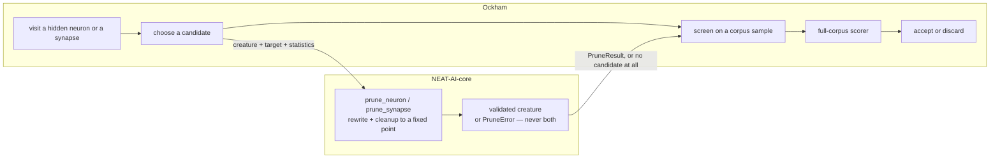

## Summary

Issue #172 is the design reference for a decision that was already taken:
canonical pruning rewrites belong in
[NEAT-AI-core](https://github.com/stSoftwareAU/NEAT-AI-core), and Ockham owns
candidate choice, screening and scoring. The engine was built under core
project #587 (#588–#592, all closed) and Ockham's consumption of it is
issue #182. Until now that boundary and its eight preserved principles lived
only in a GitHub issue: nothing in this repository stopped a new structural-rewrite
implementation landing in Ockham, and nothing checked that the core engine
still upholds the principles #182 will depend on.

This PR turns the design reference into checked-in documentation **and** an
executable contract. No Ockham runtime behaviour changes. Closes #172.

## Evidence

Backend/CLI-only change — there is no web interface to screenshot. The evidence
is the new test file, which asserts the principles against the sibling
`neat-core` rather than restating them in prose:

```text
$ cargo test --workspace --all-features -- --test-threads=2
test result: ok. 665 passed; 0 failed   (lib)
test result: ok. 9 passed; 0 failed     (tests/pruning_ownership.rs)
… all other integration suites green
```

The boundary the reference records:



### Quality gate

`./quality.sh` could not be run as a single script in this worktree: the
sibling `../../NEAT-AI-core` it compiles against is another session's worktree,
checked out at 0.12.0 — before the private-field accessor change Ockham handled
in #186 — so `ockham/src/stats.rs` does not compile against it. Every gate step
was instead run in the foreground against the up-to-date sibling clone at
**0.14.1**, the version `neat-core.expected-version` records and CI checks out,
via a Cargo path override (`--config paths=[…]`). No repository file was
changed to do this, and `Cargo.lock` was restored afterwards.

| Step | Result |
|---|---|
| bash syntax, shellcheck | pass |
| `scripts/check-neat-core-version.sh` | pass |
| codespell, markdownlint-cli2, actionlint | pass (0 issues in 54 md files) |
| `cargo deny check` | advisories/bans/licenses/sources ok |
| `cargo fmt --all -- --check` | pass |
| clippy `--workspace --all-targets --all-features -D warnings` | pass against neat-core 0.14.1 |
| `cargo test --workspace --all-features` | 665 lib + 65 integration tests pass |
| `cargo doc` with `RUSTDOCFLAGS=-D warnings` | pass |

## Reproduction

- **symptom** — the pruning-ownership boundary and its eight design principles
  existed only in issue #172, so neither a reviewer nor CI could catch Ockham
  growing a competing rewrite, or a core release quietly dropping a principle
  the #182 migration assumes.
- **status** — `partial` — reason: the four document-contract tests were
  observed failing against the unfixed tree (`docs/pruning-ownership.md: No
  such file or directory`, README and blocked-reasons links absent) and passing
  after; the issue describes a design/ownership gap rather than a runtime fault,
  so there was no misbehaviour at run time to reproduce.
- **regression test** — `ockham/tests/pruning_ownership.rs` — the document half
  (`design_reference_preserves_every_pruning_principle`,
  `design_reference_names_the_owning_repository_and_the_migration`,
  `readme_points_at_the_design_reference`,
  `blocked_reasons_links_validation_failed_to_the_design_reference`) plus the
  engine half asserting the principles against neat-core itself.

## Test Plan

Added `ockham/tests/pruning_ownership.rs` (9 tests):

- `core_owns_the_constant_support_invariants` — `MAX_SUPPORT_CONSTANTS == 3`
  and `SUPPORT_CONSTANT_BIAS == 1.0`: constants are support nodes, at most
  three, all bias 1.
- `core_refuses_to_delete_protected_neurons` — `prune_neuron` on `input-0` and
  `output-0` returns `PruneError::Protected` with `ProtectedKind::Observation`
  / `Output`.
- `pruning_a_hidden_neuron_returns_a_validated_fixed_point` — the neuron is
  gone, the cleanup reports its passes, and `validate_creature_topology`
  accepts the result.
- `pruning_a_synapse_out_of_an_observation_returns_a_validated_creature` — an
  edge out of an observation is a candidate even though the neuron is not; the
  declared observation width survives.
- `an_unsupported_request_returns_no_creature` — an unknown target yields a
  `PruneError`, never a partially rewritten creature to screen.
- Four document-contract tests, in the existing `readme_contract.rs` idiom,
  covering `docs/pruning-ownership.md`, the README link and layout entry, and
  the `docs/blocked-reasons.md` cross-link.

No existing test was modified or removed.
