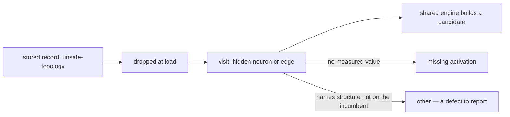

# Retire `unsafe-topology`: every hidden neuron is prunable (Issue #192)

## Summary

There is no unsafe topology. Since Issue #182 the shared NEAT-AI-core engine
rewrites typed roles, aggregate targets, `IF` structure and observation-incident
edges, so **every hidden neuron the incumbent carries, and every edge it lists,
is a pruning target**. `unsafe-topology` is retired: no current binary files it,
the one code path that could still report it for a present hidden neuron is
fixed, and the historical records that made a GRQ epoch read 100% checked are no
longer counted as coverage. Closes #192.

Three changes:

1. **The neuron ladder no longer reports a transform's own refusal as the
   visit's reason.** An unmeasured IDENTITY whose exact collapse refused — a
   typed edge out, a bypass that would self-connect — was reported as
   `unsafe-topology` even though the shared engine takes the neuron happily. The
   missing mean is what actually stopped the razor, so that is what is counted:
   the same "refusal nearest the razor" rule Issue #135 already set for a
   synapse visit. The collapse's own message stays in the record's detail.
   (`ockham/src/sweep.rs`)
2. **Every remaining producer reports `other`.** A request naming structure the
   incumbent does not carry (an unknown neuron, a protected one, an edge that is
   not there, an empty group) or a shape one particular transform does not model
   is a defect to report, not a topology category to build a path for — and
   `other` is the documented home for exactly that.
   (`prune.rs`, `collapse.rs`, `merge.rs`, `ablation.rs`, `substitute.rs`)
3. **A blocked record carrying a retired code is dropped at load.** It was filed
   by a razor that no longer exists, against a visit the engine now builds a
   candidate for; counting it leaves the epoch reading checked while the
   candidate goes untried. The file is untouched — nothing rewrites fleet
   history — and `BlockedReason::from_code` still reads the code, so journals,
   `coverage.json` and `blockedEpochs` rows deserialise unchanged.
   (`ockham/src/blocked.rs`, `ockham/src/learnings.rs`)



## Evidence

Backend/CLI only — no web interface to screenshot. The evidence is the live GRQ
creature, the benchmark, and the tests.

**The creature the issue was filed against.** `samples/GRQ-23-ockham.json` at
GRQ-sampler `f76e5a9` — 7576 hidden neurons, 48515 edges, the creature whose
check-in reported `unsafe-topology 44003 (99.9%)`. A stratified sample of it was
put through the current `prune::prune_hidden_neuron` / `prune::prune_edge`
boundary:

| Sampled | Prunable | Refused |
| --- | --- | --- |
| 421 hidden neurons (every 18th) | 421 | 0 |
| 401 edges (every 121st) | 401 | 0 |

Not one refusal of any kind, so the 44003 records were history, not the razor in
hand. The same creature's own check-ins agree: the runs before Issue #182 landed
reported `funnel: synapses 136940 visits · 135528 blocked`, and the runs after it
reported `funnel: neurons 3592 visits · 0 blocked · synapses 312 visits · 0
blocked` while still printing the stale 44003 total. That gap is what change 3
closes.

**`cargo run --release --example synapse_sweep_bench`** — 799 hidden neurons,
1606 synapses, a typed `IF` gate every eighth tree and a `MEAN` collector every
fifth:

```text
pool: 2386 visits (799 neuron, 1587 synapse) ordered in 0.3ms
synapse proposals: 1587 built and validated, 0 refused
refusals by reason:
```

The README recorded `458 refused — 270 aggregate-squash, 188 unsafe-topology`
for this benchmark; it is now 0, and the README table is updated to match.

**`./quality.sh`** passes in full: fmt, clippy `-D warnings`, cargo-deny,
codespell, markdownlint, actionlint, 675 unit + 55 integration tests, rustdoc.

## Reproduction

- **symptom** — a hidden neuron the incumbent carries reported as
  `unsafe-topology`, and 44003 such records still counted as coverage on a
  creature whose every visit is now cuttable
- **status** — `verified` — the regression test was observed failing against the
  unfixed code (`left: UnsafeTopology, right: UnsafeTopology` on the `assert_ne!`)
  and passing after the fix; the load-time drop test was likewise observed
  failing first (`left: ["h_retired", "h_live", "h_screened", "h_retired"]`)
- **regression test** —
  `ockham/src/sweep.rs::an_unmeasured_identity_with_a_typed_edge_is_not_unsafe_topology`
  and
  `ockham/src/learnings.rs::a_blocked_record_under_a_retired_reason_is_not_loaded`

## Test Plan

Added:

- `ockham/src/sweep.rs::an_unmeasured_identity_with_a_typed_edge_is_not_unsafe_topology`
  — an unmeasured IDENTITY with a `condition` edge out of it is blocked on the
  missing mean, not on its topology, and is an ordinary candidate once measured.
- `ockham/src/learnings.rs::a_blocked_record_under_a_retired_reason_is_not_loaded`
  — the retired-code block is dropped, the live-code block and the real screen
  beside it are kept.
- `ockham/tests/prunable_topology.rs` — five contract tests on one adversarial
  creature (a typed `IF` fed by an IDENTITY, a constant source, a `MEAN`
  collector, observation-incident edges): every hidden neuron is prunable, every
  listed edge is cuttable, every variant of every skip enum is constructed and
  none reports the retired code, core's own refusals come back under live codes,
  and the retired code still reads off a record.

Modified (business-logic change, no test removed or disabled) — these asserted
the reason code that this change retires, and now assert `other`:

- `prune.rs::a_protected_or_unknown_target_is_refused_with_no_creature`,
  `::an_unbuildable_member_blocks_the_whole_group`,
  `::unknown_endpoints_edges_and_source_values_are_refused`
- `sweep.rs::a_synapse_visit_that_proposes_nothing_is_skipped_with_its_reason`
- `ablation.rs::every_skip_names_the_structure_it_is_about` and the cascade
  typed-synapse test
- `merge.rs` typed-synapse and self-loop refusal tests
- `substitute.rs::an_unknown_or_non_hidden_neuron_is_a_reported_defect` (renamed
  from `..._is_an_unsafe_topology_skip`)
- `run.rs::skip_reasons_are_tallied_by_code_not_by_neuron`, and the run-test
  helper that stands in for a completed epoch now files a live reason code —
  a retired one would no longer load.

## Notes for the reviewer

- **`Cargo.lock`** carries an incidental `neat-core 0.14.4 → 0.14.6` bump: the
  sibling checkout this workspace builds against has moved on, and the lock file
  updates itself on the first build.
  `scripts/check-neat-core-version.sh` passes (patch-level drift allowed).
- **What operators will see next run.** On the GRQ epoch the `blocked:` total
  drops by the retired records and `unchecked:` rises by the same number. That is
  the point: those 44003 edges were never checked by a razor that could cut
  them, and the sweep prioritises unchecked visits, so they get tried.
- **Nothing was removed from the wire format.** `BlockedReason::UnsafeTopology`,
  its `unsafe-topology` code and the `unsafeTopology` key in `coverage.json` all
  stay, so every artefact and every mixed-version fleet host still reads.
