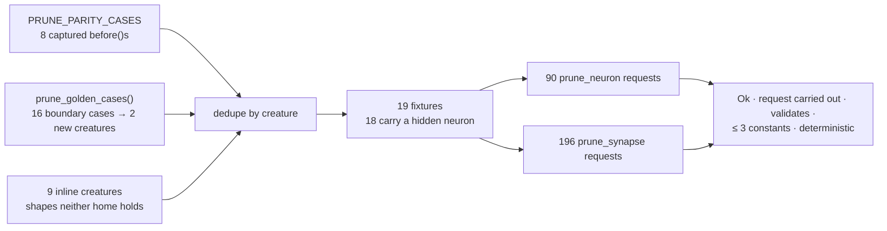

## Summary

The total-prunability contract now has a proof rather than a promise. Every
hidden neuron and every listed `(from, to, role)` triple of every prune fixture
prunes to `Ok`, comes back passing `creature_validate` and the topology gate,
carries no more than `MAX_SUPPORT_CONSTANTS` constants, and rewrites
deterministically — swept, not sampled, by the new
`neat-core/tests/prune_total.rs`. Closes #195.

The work lands in **stSoftwareAU/NEAT-AI-core**, which Ockham consumes through
the unpinned `path` dependency at `ockham/Cargo.toml`, so it reaches Ockham on
merge. No Ockham source change was needed: the core bump is additive (a test, a
README section and one rustdoc sentence — no public item added, removed,
renamed or narrowed), so `scripts/check-neat-core-version.sh` does not gate it
and `neat-core.expected-version` keeps its `0.15.4` baseline. This PR therefore
carries the record; the code is on the declared cross-repo branch.

**No `Err(Cleanup)` was surfaced.** The sweep is the evidence that no valid
fixture reaches `InexactMerge` or `NotStable`, so `prune_cleanup.rs` needed no
behavioural fix — which is the outcome the issue predicted and the reason the
property test, not a patch, is the deliverable.

### What the sweep covers

19 fixtures, deduplicated by creature across three homes — and the dedup earned
its place: it proved `CONSTANT_SOURCE_JSON` and the static-`IF` creature to be
byte-identical to golden entries, so those copies are gone rather than
redeclared.

Each request runs twice — with no statistics and with a mean-only `PruneStats`
— and again a third time to prove determinism. Edges out of `input-N` and into
output neurons are ordinary candidates, as the contract says.

## Evidence

Backend library work: no web interface, so no screenshot applies. The evidence
is test output and two mutation runs.

**Green:**

- `cargo test -p neat-core --test prune_total` — 9 passed, 0 failed.
- `cargo test -p neat-core` — 76 test binaries, all `ok`, 0 failed.
- `cargo clippy --workspace --all-targets --all-features -- -D warnings` —
  clean.
- `./quality.sh < /dev/null` in NEAT-AI-core — `✅ All quality checks passed!`
- `./quality.sh < /dev/null` in NEAT-AI-Ockham, built against the core branch —
  `All quality checks passed!`, including the `neat-core` version gate and the
  full suite (675 lib + 70 integration tests).

**Red-capable — the sweep bites.** Two mutations applied one at a time to
`neat-core/src/prune_cleanup.rs`, each reverted after:

| Mutation | Result |
|---|---|
| `fold_zero_inward_hidden` returns `Ok(false)` (fold disabled) | both sweeps and the fold guard fail — `parity/cascade_orphan_feeders neuron h-c (no stats): refused … Cleaned creature is invalid (NO_INWARD_CONNECTIONS): hidden neuron h-a has no inward connections` |
| surplus-constant merge skipped | the synapse sweep fails — `inline/surplus_constants synapse input-0 -> h-1 (Standard, no stats): 4 constants survived, above the 3 cap` |

The second mutation is what proves the constant cap is not a vacuous
inequality: `inline/surplus_constants` drives the observed maximum to exactly
`MAX_SUPPORT_CONSTANTS` (3), so a cap that stopped working is caught.

**Correction to the record:** the second core commit message says "18 fixtures,
96 neuron and 200 synapse requests". The measured figures after the
`inline/surplus_constants` fixture landed are **19 fixtures, 90 neuron and 196
synapse requests**; the numbers here are the accurate ones.

## Acceptance Criteria

<!-- vibe-spec-review inputs="diff+issue-body" -->

- **partial** — the property test asserts it enumerated ≥ 8 fixtures, ≥ 1 hidden neuron and ≥ 1 synapse per fixture — evidence: `neat-core/tests/prune_total.rs::the_sweep_covers_valid_creatures` — reviewer: partial — reason: the per-fixture hidden-neuron floor cannot hold literally, because `parity/constant_bias_fold` is a constant-only creature and `prune_neuron` protects constants, so it has nothing for the neuron sweep to ask. What is asserted instead is stronger than the aggregate the reviewer saw: the parity home must deliver **exactly** `PRUNE_PARITY_CASES.len()` fixtures (≥ 8), the golden home ≥ 1, the inline home exactly its own length, ≥ 8 canonical, ≥ 8 with a hidden neuron, ≥ 1 synapse for **every** fixture, and any fixture without a hidden neuron must carry a constant. An empty `PRUNE_PARITY_CASES` now fails, which it did not in the commit the reviewer read.
- **met** — every enumerated request returns `Ok`, the creature passes `creature_validate`, and carries ≤ 3 constants — evidence: `neat-core/tests/prune_total.rs::every_hidden_neuron_of_every_fixture_prunes` (90 requests), `::every_listed_synapse_of_every_fixture_prunes` (196 requests), both through `assert_prune_contract` — reviewer: met
- **met** — the three-deep chain test and the four validation-rule guards pass with the reason codes named above — evidence: `::three_deep_chain_collapses_in_one_synapse_prune`, `::isolated_hidden_neuron_fails_with_no_inward_connections` (`NO_INWARD_CONNECTIONS`), `::inward_only_hidden_neuron_fails_with_no_outward_connections` (`NO_OUTWARD_CONNECTIONS`), `::outward_free_constant_fails_with_no_outward_connections` (`NO_OUTWARD_CONNECTIONS`), `::inward_free_output_is_valid` — reviewer: met — reason: rule numbers 16/17/18 resolve to the rule table at `neat-core/src/creature_validate.rs:65-67`
- **met** — `cargo test -p neat-core`, `cargo clippy --workspace --all-targets --all-features -- -D warnings` and `./quality.sh < /dev/null` pass in NEAT-AI-core — evidence: the Green list above; the reviewer independently re-ran all three — reviewer: met
- **unrequested** — the README section, its Mermaid diagram and the cross-reference from the hidden-neuron section — reviewer: unrequested — reason: kept; the fleet rule is that a code change owes a docs change, and a contract callers are told to rely on is not discoverable from a test file alone
- **unrequested** — `validate_creature_topology` alongside `creature_validate` in `assert_valid` — reviewer: unrequested — reason: kept; it is the pair `prune_cleanup` itself gates on before returning, so asserting only half of it would accept a creature core would not
- **unrequested** — result-shape assertions beyond `Ok`: the removed neuron and its edges are absent, the requested edge is on `removed_synapses`, the creature moved, `removed_neuron.is_none()` for a synapse request, `cascade_neurons` / `folded_neurons` membership — reviewer: unrequested — reason: kept and extended after review; without them a "report it but do not remove it" implementation passes the sweep
- **unrequested** — the `Fixture::canonical` flag, the `Source` enum and the per-home counts — reviewer: unrequested — reason: kept; they are what stops the anti-vacuity guard being satisfiable by one home alone
- **unrequested** — `inline/surplus_constants` and the golden-record fixture home — reviewer: unrequested — reason: added *after* the review, to answer its own findings that the constant cap held vacuously and that 13 creatures were copied verbatim
- **unrequested** — one rustdoc sentence on `CleanupError::InexactMerge` — reviewer: unrequested — reason: added after review; the Standards reviewer found the new contract contradicting that variant's existing documentation, and reconciling both was owed in the same change
- **unrequested** — the absolute request floors `MIN_NEURON_REQUESTS` / `MIN_SYNAPSE_REQUESTS` the reviewer saw — reviewer: unrequested — reason: **removed**; per-home counts replaced them, which also removes the reviewer's objection that they doubled as a fixture-table version pin

## Standards Review

<!-- vibe-standards-review inputs="diff+AGENTS.md+RELEASING.md+CONTRIBUTING.md" -->

Provenance note: neither repository carries a `CODING-STANDARDS.md`. The
reviewer was given the diff plus the documented standards that do exist —
NEAT-AI-core's `AGENTS.md` and `RELEASING.md`, Ockham's `CONTRIBUTING.md`, and
the fleet-wide rules (Australian English, tests exercise real code, fail loud,
no hidden files, KISS/DRY, docs owed, Mermaid).

- **violation** — DRY: 13 creatures redeclared verbatim from `prune_neuron.rs` / `prune_synapse.rs`, making `AGGREGATE_TARGET_JSON` a third copy — evidence: `neat-core/tests/prune_total.rs:79-305` (first commit) — reason: largely fixed. Fixtures now come from `PRUNE_PARITY_CASES` and `prune_golden_cases()`, two shared homes, with the inline list cut from 13 to 9; dedup by creature proved `CONSTANT_SOURCE_JSON` and the static-`IF` creature identical to golden entries and dropped them. The residual 9 are shapes no shared home holds — moving them into `tests/common/mod.rs` would mean rewriting the fixture blocks of two adjacent test files, which this issue's Change Scope forbids, and a copy in `common/` without migrating those files would not reduce the count.
- **violation** — the anti-vacuity test could not fail for the reason it claimed: the three `>= 8` thresholds were satisfiable by the inline table alone, so `PRUNE_PARITY_CASES` could go empty and still pass — evidence: `neat-core/tests/prune_total.rs:476-497` (first commit) — reason: fixed. `the_sweep_covers_valid_creatures` now counts each home separately and pins the parity home with `assert_eq!(parity, PRUNE_PARITY_CASES.len())`.
- **violation** — neither sweep asserted the candidate actually left; a "report it but do not remove it" implementation would pass — evidence: `neat-core/tests/prune_total.rs:542-548,589-593` (first commit) — reason: fixed. The neuron sweep asserts the neuron and every edge naming it are absent; the synapse sweep asserts the requested edge is on `removed_synapses` and the creature moved. "That triple is absent" is deliberately *not* asserted: an emptied `IF` branch may legitimately be restored as a zero-weight support edge in the same role.
- **violation** — the `MAX_SUPPORT_CONSTANTS` bound was a loose inequality no fixture pushed against — evidence: same commit, observed maximum 1 constant — reason: fixed. `inline/surplus_constants` carries four support constants, driving the observed maximum to exactly 3, and disabling the merge now fails the sweep.
- **violation** — the new contract was filed under `### Synapse pruning` though it governs hidden-neuron pruning equally, and the neuron section gained no cross-reference — evidence: `README.md:1028` (first commit) — reason: fixed; promoted to `### Total prunability … (Ockham #195)` stating that it governs both entry points, with a pointer from the hidden-neuron section.
- **violation** — the new text called `Err(Cleanup)` a defect, contradicting the flowcharts above it and `CleanupError::InexactMerge`'s rustdoc, which present it as a legitimate refusal — evidence: `README.md:1033-1035` vs `README.md:963-973` and `neat-core/src/prune_cleanup.rs:293-303` — reason: fixed. The README now says the refusal is reachable — for a creature built by hand — and a defect only on a *valid* creature, and `InexactMerge`'s rustdoc says the same, naming the sweep that proves it.
- **violation** — "every fixture the prune tests carry" was inaccurate: seven `prune_cleanup.rs` fixtures were excluded with no rationale — evidence: `README.md:1038`, `neat-core/tests/prune_total.rs:24-25` (first commit) — reason: fixed; both now name the three homes exactly and say why `prune_cleanup.rs`'s fixtures are out of scope (they address `cleanup_creature`, not the two prune entry points).
- **violation** — "the **four** wiring rules (16, 17, 18)" miscounted, and "corner case 12" was an unexplained reference — evidence: `neat-core/tests/prune_total.rs:36-37,626` (first commit) — reason: fixed; now "the four wiring guards over rules 16-18", and the bare "corner case 12" is gone. The reviewer's related claim that rules 16/17/18 are numbered nowhere in the repository is a reviewer error — the table is at `neat-core/src/creature_validate.rs:65-67` — and the doc comment now points at it.
- **violation** — "Only the **valid** ones are swept" contradicted by two invalid fixtures in the table, with the contradiction acknowledged 260 lines later — evidence: `neat-core/tests/prune_total.rs:73` vs `:333-339` (first commit) — reason: fixed; `zero_inward` and `dead_neuron` are marked non-canonical at their own definitions, the header explains that the promise is about the creature that comes back, and the panic text no longer asserts the input was valid.
- **violation** — DRY: `NO_INWARD_CONNECTIONS` / `NO_OUTWARD_CONNECTIONS` are already covered by the `creature_validate` tests — evidence: `neat-core/tests/prune_total.rs:756-813` vs `neat-core/tests/creature_validate_json_boundary.rs:133,297` — reason: **stands**. Issue #195 asks for these four guards in this file specifically, as the wiring facts the prune contract rests on; they assert only the public reason codes, so they cannot drift from the implementation, and losing them would leave the contract's premise unpinned here.
- **violation** — Mermaid not used where the surrounding docs are diagrammed — evidence: `README.md:1046-1053` (first commit) — reason: fixed; the section now opens with a flowchart of the contract.
- **clean** — Australian English throughout (no American spellings in either file); tests call `prune_neuron` / `prune_synapse` / `creature_validate` / `validate_creature_topology` with real `CreatureExport` data and grade returned values, with no source-text greps and no "X calls Y" assertions; in-memory and fast, with no sleeps, polling or wall-clock thresholds; every failure path panics with the fixture, the request and the reason, so nothing fails silently; the fold oracle derives `LOGISTIC(0.4) · 2.0` from the documented formula with a stated `f32`-precision tolerance; behaviour-named tests, no private-field assertions; ownership fence respected; additive under `RELEASING.md`, so the CI `version-increment` job owns the patch bump; no hidden paths, key material or credentials staged.

## Test Plan

New — `neat-core/tests/prune_total.rs`, 9 tests:

- `the_sweep_covers_valid_creatures` — the anti-vacuity guard: per-home fixture
  counts, ≥ 8 canonical, ≥ 8 with a hidden neuron, ≥ 1 synapse per fixture, and
  a constant in any fixture without a hidden neuron.
- `every_hidden_neuron_of_every_fixture_prunes` — 90 requests: `Ok`, neuron and
  its edges gone, valid, ≤ 3 constants, deterministic.
- `every_listed_synapse_of_every_fixture_prunes` — 196 requests: `Ok`, the edge
  on `removed_synapses`, creature moved, valid, ≤ 3 constants, deterministic.
- `three_deep_chain_collapses_in_one_synapse_prune` — the whole chain goes in
  one call, and all three neurons are reported on the cascade.
- `zero_inward_hidden_folds_to_bias_one_support_constant` — constant type,
  bias `SUPPORT_CONSTANT_BIAS`, no squash, fold reported, and the value lands in
  the reading weight (derived from `LOGISTIC(0.4) · 2.0`).
- `isolated_hidden_neuron_fails_with_no_inward_connections` — rule 17.
- `inward_only_hidden_neuron_fails_with_no_outward_connections` — rule 18.
- `outward_free_constant_fails_with_no_outward_connections` — rule 16.
- `inward_free_output_is_valid` — the guard that makes cutting the last edge
  into an output an ordinary candidate.

Modified — `neat-core/src/prune_cleanup.rs`: one rustdoc paragraph on
`CleanupError::InexactMerge`. No behavioural change; no existing test was
removed, disabled or altered, and nothing is `#[ignore]`d.
