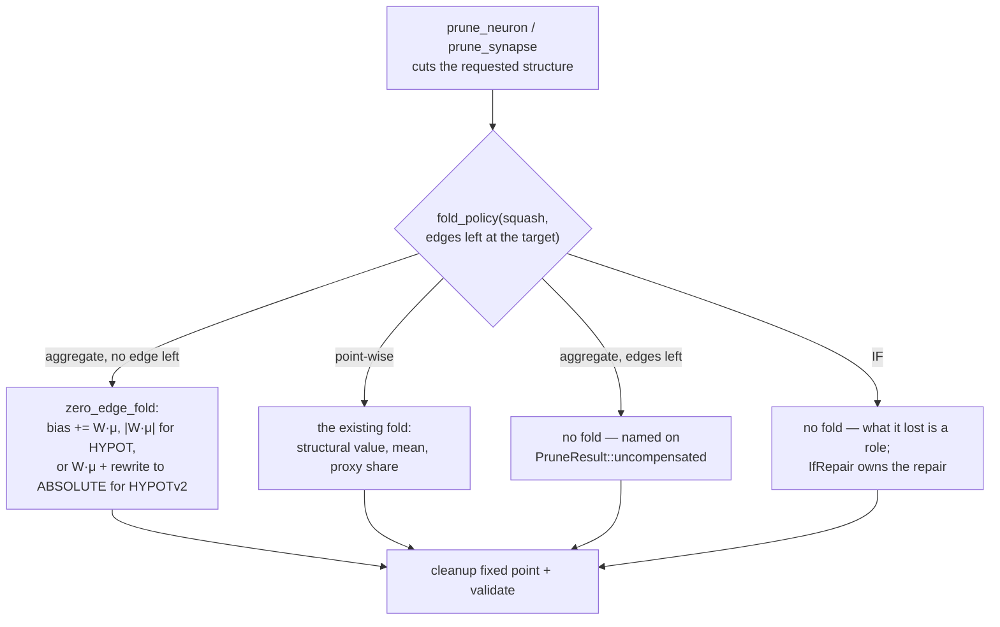

# Fold the removed term into the bias of any target left with no inward edge

## Summary

The pruning engine is NEAT-AI-core's, so the behaviour change lands there and
Ockham acknowledges it. Closes #196.

**In NEAT-AI-core** (branch `issue-196-zero-edge-bias-fold`, PR declared with
the cross-repo marker): `prune_neuron` and `prune_synapse` refused a bias fold
to **every** aggregate target and named it on `PruneResult::uncompensated`.
That is right only while the target still has terms to aggregate. Once the cut
leaves a target with **no inward edge**, the forward pass evaluates it from its
bias alone (`prune_cleanup::zero_inward_activation`) — a point-wise reading
again — so the fold is the closest creature there is.
`prune_neuron::fold_policy(target_squash, remaining_inward_edges)` is the single
rule both entry points now ask, so a neuron removal and a synapse removal can
never disagree about what a target is owed.

| Squash | one inward term | no inward term | the fold |
|---|---|---|---|
| point-wise | `squash(bias + W·a)` | `squash(bias)` | `bias += W·μ`, whatever it is left with |
| `MINIMUM` / `MAXIMUM` / `MEAN` | `W·a + bias` | `bias` | `bias += W·μ` |
| `HYPOT` | `\|W·a\| + bias` | `bias` | `bias += \|W·μ\|` |
| `HYPOTv2` | `\|bias + W·a\|` | `0`, bias never read | `bias += W·μ`, **squash rewritten to `ABSOLUTE`** |

A bare aggregate with **no** statistics is still reported, now with
`UncompensatedReason::NoStatistics` rather than `AggregateTarget` — what is
missing is the number, not the permission. That reaches core's JSON and WASM
surface as `"NO_STATISTICS"`, and is in core's `RELEASING.md` migration note.

`IF` is excluded whatever it is left with: what it lost is a role, and
`IfRepair` owns that repair. `HYPOTv2` is the one place a target's squash
changes — its bias lives inside a per-synapse square that no longer exists, so
a bias fold alone would change nothing.

core's `[workspace.package].version` moves `0.15.7 → 0.16.0`: no public item
changed, but documented pruning behaviour callers rely on did, which is a
major-equivalent bump pre-1.0 per `RELEASING.md`.

**In Ockham** (this PR): `neat-core.expected-version` moves `0.15.4 → 0.16.0`
with an acknowledgement paragraph in the file's existing style, and `Cargo.lock`
follows the path dependency. **No Ockham source change was required** — Ockham
only *reports* what a `PruneResult` carries
(`ockham/src/prune.rs::PruneDetail::absorb`), so what it sees is a
better-compensated candidate: fewer `aggregate-target` entries, and a
`TransformClass::Exact` where the source's value was fixed.



## Evidence

Backend/library change with no web interface to screenshot, so the evidence is
the test suites and the two quality gates.

- **NEAT-AI-core** — `./quality.sh` green (`cargo fmt --check`, clippy
  `--workspace --all-targets --all-features -- -D warnings`, `cargo test
  --workspace --all-features`, rustdoc with `-D warnings`, cargo-deny,
  markdownlint, the bats shell-harness suite). The prune suites go from 36 to 45
  tests (`prune_synapse`) and 40 to 45 (`prune_neuron`).
- **Ockham** — `./quality.sh` green against the sibling core at `0.16.0`,
  including `scripts/check-neat-core-version.sh`:

  ```text
  OK   neat-core 0.16.0 matches handled baseline 0.16.0 (patch-level drift allowed)
  ```

  675 lib + 70 integration tests pass with **no** Ockham source edit — which is
  the evidence for the acknowledgement paragraph's claim.
- `docs/blocked-reasons.md` is corrected in the same change: its
  `aggregate-squash` row still said an aggregate destination is always named
  uncompensated, which is no longer true of one left with no inward edge.
- The core suites grow from 36 to 46 tests (`prune_synapse`) and 40 to 46
  (`prune_neuron`). The aggregate cases were written first and observed failing
  against the unfixed engine (`MINIMUM fold: expected -0.95, got 0.25`; `HYPOT
  fold: expected 1.45, got 0.25`) before passing after it.

## Acceptance Criteria

<!-- vibe-spec-review inputs="diff+issue-body" -->

- **met** — Corner cases (1)–(5), (11) and the two hidden-aggregate cases pass with the stated tolerances — evidence: `neat-core/tests/prune_synapse.rs::an_output_left_with_no_inward_edge_takes_the_mean_fold`, `::an_output_left_with_no_inward_edge_folds_a_constant_source_exactly`, `::an_output_left_with_no_inward_edge_folds_an_observation_source`, `::a_summing_aggregate_output_left_with_no_inward_edge_takes_the_fold`, `::a_hypot_output_left_with_no_inward_edge_folds_the_absolute_term`, `::a_hypot_v2_output_left_with_no_inward_edge_becomes_an_absolute`, `::a_hidden_aggregate_left_with_no_inward_edge_becomes_a_support_constant`, and `neat-core/tests/prune_neuron.rs::the_sole_source_of_two_outputs_folds_into_both_biases`, `::only_the_output_that_loses_its_last_edge_goes_constant`, `::a_removed_aggregate_folds_its_mean_into_each_target_like_any_other_source` — reviewer: met
- **met** — The 12-IDENTITY golden test passes at every one of the 12 steps — evidence: `neat-core/tests/prune_neuron.rs::twelve_identity_neurons_prune_one_by_one_without_moving_the_mean_output` — reviewer: met — reason: the reviewer added that the golden test only reaches point-wise `IDENTITY` targets and so would have passed before this change. That is by design — the issue specifies 12 `IDENTITY` hidden neurons feeding `IDENTITY` outputs, and its job is to guard the mean-preservation property across a long sequence, not to reach the new aggregate branch; `an_aggregate_target_left_with_no_inward_edge_takes_the_fold` covers that branch from the same entry point.
- **met** — `cargo test -p neat-core`, clippy `-D warnings` and `./quality.sh < /dev/null` pass in NEAT-AI-core; `scripts/check-neat-core-version.sh` passes in Ockham after the baseline bump — evidence: both gates run to `All quality checks passed!` after the final edit; the version gate prints `OK   neat-core 0.16.0 matches handled baseline 0.16.0` — reviewer: met
- **met** — one crate-visible `fold_policy(target_squash, remaining_inward_edges)` helper called by both `prune_neuron` and `prune_synapse` — evidence: `neat-core/src/prune_neuron.rs::fold_policy`, called from `prune_neuron.rs` and `prune_synapse.rs` with `inward_edge_count(&cut, …)` taken on the already-cut creature — reviewer: met
- **met** — `IF` is excluded, `IfRepair` owning the repair — evidence: `neat-core/tests/prune_neuron.rs::an_if_left_with_no_inward_edge_is_still_never_given_a_bias_fold` — reviewer: missing — reason: the reviewer read the diff before this test existed and reported the exclusion as implemented but untested; it built the same scenario by hand to confirm the behaviour, and that scenario is now the committed test.
- **met** — HYPOT folds `|w·b|` for a constant source and `|w|·|μ|` for a sampled mean — evidence: `neat-core/tests/prune_synapse.rs::a_hypot_output_left_with_no_inward_edge_folds_the_absolute_term` and `::a_bare_aggregate_folds_a_structurally_fixed_source_exactly` — reviewer: met
- **met** — HYPOT V2 with no edge is rewritten to `ABSOLUTE` with `bias += w×μ`, recorded in the module docs — evidence: `neat-core/src/prune_neuron.rs::zero_edge_rewrite`, `neat-core/tests/prune_synapse.rs::a_hypot_v2_output_left_with_no_inward_edge_becomes_an_absolute` — reviewer: met
- **met** — a hidden aggregate takes the fold before `cleanup_creature*`, so `fold_zero_inward_hidden` then folds `bias + w×μ` into its outward weights — evidence: `neat-core/tests/prune_synapse.rs::a_hidden_aggregate_left_with_no_inward_edge_becomes_a_support_constant` — reviewer: met
- **met** — `an_aggregate_target_is_never_given_a_bias_fold` amended to cover only the ≥ 1-remaining-edge case — evidence: renamed to `an_aggregate_target_with_an_edge_left_is_never_given_a_bias_fold`, with an added assertion pinning the fixture's one remaining inward edge — reviewer: met
- **met** — docs: the "Where a bias fold means nothing" section of `prune_neuron.rs`, the cost table in `prune_synapse.rs`, and the pruning section of NEAT-AI-core `README.md` — evidence: all three updated, plus a new README subsection carrying the per-squash table — reviewer: met — reason: the reviewer noted `prune_synapse.rs`'s cost section is a bullet list rather than a table; it is the section the issue points at and it was updated.
- **met** — minor version bump plus the Ockham baseline with an acknowledgement paragraph in its existing style — evidence: core `Cargo.toml` `0.15.7 → 0.16.0` with a `RELEASING.md` breaking-change entry; `neat-core.expected-version` `0.15.4 → 0.16.0` — reviewer: met
- **partial** — write the tests first (TDD) — evidence: the red run is quoted in the Evidence section above and in the core PR summary — reviewer: partial — reason: the reviewer could see only the finished tree, where the first commit is squashed, so the red-then-green ordering is not recoverable from the diff; it was performed and its output is recorded, but the commit history does not evidence it.
- **unrequested** — `docs/archive/pr-summaries/pr-summary-ockham-196.md`, a new file in the core repo — reviewer: unrequested — reason: the core repo's own convention is one archived summary per change; kept, with its duplicate of the fold table removed so the table has one home.
- **unrequested** — `wasm-bench/Cargo.lock` moves `neat-core 0.15.0 → 0.16.0` — reviewer: unrequested — reason: mechanical consequence of the workspace version bump; it was two minors stale, and the core summary now says so rather than letting the bump hide it.
- **unrequested** — `BiasFold::exact`'s doc comment reworded — reviewer: unrequested — reason: the old wording ("the neuron's activation") is false for a `HYPOT` fold, which folds `|W·x|`; `Compensation::exact` was aligned to match rather than left inconsistent.
- **unrequested** — `docs/blocked-reasons.md`'s `aggregate-squash` row updated in this repo — reviewer: unrequested — reason: it asserted that an aggregate destination is always named uncompensated, which this change makes false; "a code change owes a docs change".

## Standards Review

<!-- vibe-standards-review inputs="diff+CODING-STANDARDS.md" -->

- **violation** — a fold that could not land was reported as applied: `apply_zero_edge_fold` returned `()` and silently did nothing when the target named no neuron, while both callers pushed a `BiasFold` regardless — evidence: `neat-core/src/prune_neuron.rs` (former `apply_zero_edge_fold`) — reason: fixed here. `add_to_bias` now refuses with `PruneError::Cleanup(UnknownEndpoint)`, and the two pre-existing inline bias loops were moved onto it, so the fail-silently shape is gone from the module rather than just from the new code.
- **violation** — documented behaviour the code does not implement: the module docs and README claimed a supplied proxy "goes unused rather than refused" for *any* bare target, but a point-wise one still refuses with `MissingProxyEdge` — evidence: `neat-core/src/prune_neuron.rs` module docs, `README.md` pruning section — reason: fixed here; the claim is now scoped to the aggregate branch and says the proxy is still validated either way. Both reviewers found this independently.
- **violation** — DRY: the rule's decision was factored into `fold_policy` but its ~22-line action was written twice, so the two entry points could still drift — evidence: `neat-core/src/prune_neuron.rs`, `neat-core/src/prune_synapse.rs` — reason: fixed here. `fold_bare_aggregate` is the single home of the action and delegates the arithmetic to `compensate` instead of restating `W·x`, the `exact` flag and `W²σ²`.
- **violation** — the residual suppressed for `HYPOTv2` on a justification that does not apply to it: its fold is linear in the sum, so `W²σ²` is the right shape — evidence: `neat-core/src/prune_neuron.rs::fold_bare_aggregate` — reason: fixed here; only `HYPOT`, which folds a magnitude, claims no residual, and `a_bare_aggregate_reports_the_residual_its_form_can_justify` now pins all three forms.
- **violation** — an undocumented reason-code change reaching the JSON and WASM surface: a bare aggregate with no statistics now reports `NoStatistics` where it reported `AggregateTarget` — evidence: `neat-core/src/prune_neuron.rs::fold_bare_aggregate` → `prune_json.rs`'s `"NO_STATISTICS"` — reason: fixed here; it is now in the `RELEASING.md` migration note and in the README, and `a_bare_aggregate_with_no_statistic_is_still_reported_uncompensated` covers it.
- **violation** — test coverage: the new error path and the most-emphasised edge case were untested, and `residual_variance` was never asserted — evidence: `neat-core/tests/prune_synapse.rs`, `neat-core/tests/prune_neuron.rs` — reason: fixed here by `a_bare_aggregate_with_no_statistic_is_still_reported_uncompensated`, `an_if_left_with_no_inward_edge_is_still_never_given_a_bias_fold` and `a_bare_aggregate_reports_the_residual_its_form_can_justify`; two cases that asserted only biases now assert probe outputs too.
- **violation** — a stale consuming-repo doc: `docs/blocked-reasons.md`'s `aggregate-squash` row still said such a target is always named uncompensated — evidence: `docs/blocked-reasons.md:42` — reason: fixed here in the same change.
- **violation** — `W` is summed over the readable key, which `HYPOT` does not read that way, so `|W·μ|` is wrong for a target fed by two rows from one source — evidence: `neat-core/src/prune_neuron.rs::fold_bare_aggregate` — reason: stands, and is now documented on the helper. Only a hand-built non-canonical creature can reach it: a second row for a pair is a `TypedDuplicateSynapse` the shared validator rejects, and the pre-existing `outward_keys` / `matched_weight` summing this inherits is out of scope for this issue.
- **violation** — DRY: `assert_output_on_every_probe` is added verbatim to both core test files — evidence: `neat-core/tests/prune_neuron.rs`, `neat-core/tests/prune_synapse.rs` — reason: stands. The two suites are separate test binaries and already keep file-local copies of `creature`, `neuron`, `probe_inputs`, `outputs`, `assert_valid`, `assert_close` and `mean_only`; hoisting one of eight into `tests/common` would leave the convention half-applied, which is a separate cleanup.
- **violation** — the per-squash fold table appears in more than one document — evidence: `neat-core/src/prune_neuron.rs` module docs, `README.md`, `RELEASING.md` — reason: partly fixed. The duplicate in the core PR summary was removed and replaced by a pointer; the module-doc and README copies are the repo's established mirroring, and the `RELEASING.md` copy is the breaking-change log entry `RELEASING.md` itself mandates.
- **clean** — Australian English throughout the added lines; no hidden path staged in either repo; no secrets or credential-shaped files; every test parses a fixture, calls the real `prune_neuron`/`prune_synapse`, compiles the result and asserts on activations rather than grepping source; expected values derived in the test from the documented forward-pass forms; the `HYPOTv2 → ABSOLUTE` range assumption asserted rather than assumed; no `sleep`, polling loop or wall-clock threshold in any test; no existing test deleted or commented out — the one touched is renamed, narrowed and recorded; `inward_edge_count` correctly taken on the cut creature in both entry points.

## Test Plan

Added in NEAT-AI-core (`neat-core/tests/prune_synapse.rs`):

- `an_output_left_with_no_inward_edge_takes_the_mean_fold` — corner case 1
- `an_output_left_with_no_inward_edge_folds_a_constant_source_exactly` — 2
- `an_output_left_with_no_inward_edge_folds_an_observation_source` — 3
- `a_summing_aggregate_output_left_with_no_inward_edge_takes_the_fold` — 11, `MINIMUM` / `MAXIMUM` / `MEAN`
- `a_hypot_output_left_with_no_inward_edge_folds_the_absolute_term` — 11
- `a_hypot_v2_output_left_with_no_inward_edge_becomes_an_absolute` — 11, and the `apply_limit_range` parity assertion
- `a_hidden_aggregate_left_with_no_inward_edge_becomes_a_support_constant`
- `a_bare_aggregate_with_no_statistic_is_still_reported_uncompensated` — the error path
- `a_bare_aggregate_folds_a_structurally_fixed_source_exactly`
- `a_bare_aggregate_reports_the_residual_its_form_can_justify`

Added in NEAT-AI-core (`neat-core/tests/prune_neuron.rs`):

- `the_sole_source_of_two_outputs_folds_into_both_biases` — corner case 4
- `only_the_output_that_loses_its_last_edge_goes_constant` — 5
- `an_aggregate_target_left_with_no_inward_edge_takes_the_fold`
- `an_if_left_with_no_inward_edge_is_still_never_given_a_bias_fold`
- `a_removed_aggregate_folds_its_mean_into_each_target_like_any_other_source`
- `twelve_identity_neurons_prune_one_by_one_without_moving_the_mean_output` — the golden acceptance test

Modified: `an_aggregate_target_is_never_given_a_bias_fold` renamed to
`an_aggregate_target_with_an_edge_left_is_never_given_a_bias_fold` and given an
assertion pinning the one inward edge its fixture leaves, so it now covers only
the ≥ 1-remaining-edge case the issue narrows it to. No test was deleted or
disabled.

In Ockham: no test change. The existing 675 lib + 70 integration tests are the
gate on the baseline bump — they pass against `0.16.0` with no source edit,
which is the claim the acknowledgement paragraph makes.
