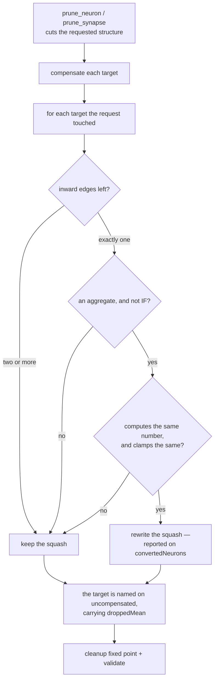

## Summary

An aggregate target that still has inward edges after a cut is now answered for
in two ways, both reported. Left with exactly **one** edge it is rewritten to the
point-wise squash that computes the same number; left with **two or more** it
keeps its squash, loses the term, and the result carries the dropped term's
magnitude so the scorer judges. No magnitude ever refuses a prune. Closes #197.

**The work lands in NEAT-AI-core**, as the issue directs — the rewrite belongs
beside `prune_neuron` / `prune_synapse`, which own it. The branch is pushed and
declared with the cross-repo PR marker in this PR body; Ockham takes no source
change in this sub-issue, because it only *reports* what a `PruneResult` carries
and absorbs the new fields in its own sub-issue. This Ockham PR is the archived
record of that core change.

What landed in `stSoftwareAU/NEAT-AI-core`
(branch `ockham-197-single-edge-aggregate-conversion`):

- **`neat-core/src/prune_rewrite.rs`** — `convert_single_edge_aggregates`, called
  from both entry points after the cut and before `cleanup_creature*`, over the
  targets the **request itself touched** and nothing else. Every rule is read off
  the matching arm of `CompiledNetwork::activate`: `MINIMUM`/`MAXIMUM`/`MEAN` to
  `IDENTITY`, `HYPOTv2` (and `HYPOT` at bias `0`) to `ABSOLUTE`, bias unchanged.
  `HYPOT` at a non-zero bias is **kept** — it adds its bias to the root where
  `ABSOLUTE` folds it inside, so the two agree only at `0`, and the `HYPOT` is
  already exact as it stands. `IF` is never converted: `IfRepair` owns what a
  lost role means (validation rule 12). A rule is only taken when the replacement
  clamps identically under `apply_limit_range`.
- **`PruneResult::converted_neurons`** / `convertedNeurons` on the wire, omitted
  when empty, naming every conversion.
- **`UncompensatedTarget::dropped_mean`** / `droppedMean`, skipped when `None`:
  `weight_sum · μ` where the caller supplied statistics, `weight_sum · a` where
  the creature itself fixes the source's activation — the same precedence the
  compensation takes — and `None` where neither proves a number. Reported, never
  enforced; unusable statistics still refuse outright.
- The golden record regenerated, with two new cases carrying the new keys over
  the wasm comparator.
- Docs: both module tables, the `prune_json.rs` response example, a new core
  `README.md` section, and a breaking-change-log entry.

## Evidence

A library change with no visual surface, so the evidence is the test suites and
the quality gates rather than a screenshot.

In `stSoftwareAU/NEAT-AI-core`, branch
`ockham-197-single-edge-aggregate-conversion`:

- `cargo test -p neat-core` — 75 test binaries, all green (289 lib, 47
  `prune_synapse`, 45 `prune_neuron`, 14 `prune_json`).
- `cargo clippy --workspace --all-targets --all-features -- -D warnings` — clean.
- `./quality.sh < /dev/null` — "All quality checks passed!" (shellcheck, bats,
  `cargo fmt --check`, clippy, `cargo test`, rustdoc under `-D warnings`,
  cargo-deny, markdownlint, the Deno suites).
- `neat-core/tests/prune_parity.rs` — passes **unchanged**: no parity fixture
  carries a non-`IF` aggregate, so the TypeScript captures are untouched.
- `deno test --allow-read tests/wasm_prune_parity_test.ts` — 15 passed.
- Golden record regenerated with
  `UPDATE_PRUNE_GOLDEN=1 cargo test -p neat-core --test prune_json`; the new
  `single_edge_aggregate_converted` and
  `aggregate_keeps_its_squash_with_two_edges` cases are what carry
  `convertedNeurons` and `droppedMean` over the comparator.
- `scripts/check-downstream-consumers.sh --workspace ..` compiles Ockham against
  the candidate core. The other five registered consumers were cloned and swept:
  none names `PruneResult`, `UncompensatedTarget`, `uncompensated`,
  `prune_neuron` or `prune_synapse`, so none can be broken by a struct gaining a
  field.

In this repository, with the candidate core as the sibling checkout:

- `./quality.sh < /dev/null` — "All quality checks passed!", including
  `scripts/check-neat-core-version.sh` ("neat-core 0.16.0 matches handled
  baseline 0.16.0") and the full suite, 675 lib + 70 integration tests.

## Acceptance Criteria

<!-- vibe-spec-review inputs="diff+issue-body" -->

- **met** — Tests (7), (8), (9), (10) and the no-refusal-bound test pass; the HYPOT-with-bias case is pinned as kept — evidence: `neat-core/tests/prune_synapse.rs::a_hypot_with_a_non_zero_bias_keeps_its_squash` and `neat-core/tests/prune_neuron.rs::a_hypot_adding_a_non_zero_bias_survives_a_neuron_removal_unrewritten`, with `assert_different_function` against the `ABSOLUTE` twin making the pin load-bearing — reviewer: met
- **met** — `PruneResult::converted_neurons` / wire `convertedNeurons` name every conversion; `droppedMean` crosses the wire and the regenerated golden record carries it — evidence: `neat-core/tests/prune_json.rs::a_conversion_and_a_dropped_magnitude_both_cross_the_wire`; `neat-core/tests/golden/prune_wasm_parity.json` case `single_edge_aggregate_converted` — reviewer: met
- **met** — `neat-core/tests/prune_parity.rs` passes unchanged; `deno test --allow-read tests/wasm_prune_parity_test.ts` passes — evidence: `prune_parity.rs` is absent from the diff and no non-`IF` aggregate exists in `neat-core/src/prune_fixtures.rs`; the reviewer ran the Deno suite itself, 15 passed — reviewer: met
- **met** — `cargo test -p neat-core`, clippy `-D warnings` and `./quality.sh < /dev/null` pass in NEAT-AI-core — evidence: the reviewer ran all three independently; re-run here after the reviewer fixes — reviewer: met
- **met** — new module `prune_rewrite.rs` with `convert_single_edge_aggregates(creature, touched_targets)`, examining only the targets the request touched — evidence: `neat-core/src/prune_rewrite.rs` — reviewer: met — reason: the reviewer noted the one signature deviation, a `Result` wrapper, and confirmed its documented "cannot fire for these callers" claim is true; it is there so an unknown squash or an absent target fails loud instead of silently skipping
- **partial** — rules each proven against the `network.rs` forward-pass arms — evidence: `neat-core/src/prune_rewrite.rs::replacement` and the derivations in `neat-core/tests/prune_synapse.rs::expected_single_edge_output` — reviewer: partial — reason: the reviewer measured two places where the aggregate arm and its replacement genuinely differ — a term that overflows to ±inf leaves `MINIMUM`/`MAXIMUM` on their empty-input sentinel, and a term whose square leaves the `f32` normal range makes `HYPOT`/`HYPOTv2` disagree with the magnitude they are meant to be (a `1e-22` term answers `9.904085e-23`). The rules are the ones the issue mandates, so the divergence is not fixable by changing them; it is now named in `prune_rewrite`'s "Where the equality stops" section and in the core README rather than claimed away
- **partial** — tests each asserting `Ok`, `creature_validate`, and activations on ≥ 3 probe records within 1e-6 relative — evidence: `probe_inputs` is 5 records, `CONVERSION_TOL = 1e-6`, `assert_valid` runs `creature_validate` plus the topology gate — reviewer: partial — reason: the reviewer found four dropped-magnitude tests asserting neither; `creature_validate` and an activation check were added to them in the follow-up commit, and `no_dropped_magnitude_refuses_a_neuron_removal` — which the standards reviewer separately found vacuous, running a creature with no aggregate target at all — now asserts the reported magnitude
- **partial** — write the tests first (TDD) — evidence: the tests were written against an unimplemented `prune_rewrite` and the run failed to compile on `converted_neurons`, `dropped_mean` and `SquashConversion` before any of the three existed — reviewer: partial — reason: the reviewer could see only the squashed branch history, where source and tests share one commit, so the red run is not recoverable from the diff; it is recorded here instead
- **met** — docs: both module tables, the `prune_json.rs` response example, the core `README.md` pruning section — evidence: `neat-core/src/prune_neuron.rs`, `prune_synapse.rs`, `prune_json.rs` module headers and `README.md` "An aggregate that keeps its edges" — reviewer: met
- **met** — regenerate and commit the golden record — evidence: `neat-core/tests/golden/prune_wasm_parity.json`, additive hunk only — reviewer: met
- **unrequested** — `docs/archive/pr-summaries/pr-summary-ockham-197.md` in the core repo — reviewer: unrequested — reason: the issue's docs bullet names four places and not a PR summary; it is kept because it is this repository family's convention (220 siblings) and the route by which a cross-repo change is reviewable at all
- **unrequested** — `wasm-bench/Cargo.lock` refreshed from `0.15.0` to the new version — reviewer: unrequested — reason: `cargo` rewrote it as a side effect of the bump the issue **does** ask for; the alternative is committing a lock the build would immediately contradict
- **unrequested** — `dropped_mean(...)` also called at the two `NoStatistics` sites — reviewer: unrequested — reason: it is provably `None` there, and calling the one helper at all four sites is what makes "`None` for `NoStatistics`" true by construction rather than by a second code path that could drift
- **unrequested** — `assert_same_function` re-parameterised into `assert_same_function_within(name, tol, …)` in both test files — reviewer: unrequested — reason: the new tests need a tighter `1e-6` than the existing `1e-5`; every existing caller keeps its own tolerance, so no existing assertion was loosened
- **unrequested** — three Mermaid diagrams beyond the tables the docs bullet names — reviewer: unrequested — reason: the repository's own documentation standard asks for a diagram where it aids understanding; they are additive to the tables, not instead of them
- **unrequested** — the minor bump `0.15.9 → 0.16.0` where the issue says patch — reviewer: unrequested — reason: the standards reviewer showed the issue's estimate is wrong against RELEASING.md twice over (public fields on structs that are not `#[non_exhaustive]`, and documented runtime behaviour moving); the repo's policy wins, so the bump is signalled and carries a breaking-change-log entry

## Standards Review

<!-- vibe-standards-review inputs="diff+AGENTS.md" -->

Neither repository carries a `CODING-STANDARDS.md`; `NEAT-AI-core/AGENTS.md` and
`RELEASING.md` are the documented standards, and they are what the reviewer was
given, alongside the fleet-wide rules.

- **violation** — RELEASING.md versioning policy: public fields added to structs that are not `#[non_exhaustive]`, and documented runtime behaviour moved, so this is a minor not a patch — evidence: `Cargo.toml:14` — reason: fixed here — bumped to `0.16.0`, signalled with a `BREAKING CHANGE:` footer, and recorded in RELEASING.md's breaking-change log with both shapes and the migration
- **violation** — fleet standard "no silent failure": a touched target absent from `creature.neurons` was swallowed with a bare `continue`, in the function whose `# Errors` doc propagates the unknown-squash case for exactly that reason — evidence: `neat-core/src/prune_rewrite.rs:118` — reason: fixed here — it now returns `CleanupError::UnknownEndpoint`, so both unreachable cases are loud
- **violation** — AGENTS.md oracle rule 1, an oracle must not share the code path under test: the clamp test graded `apply_limit_range` against itself, and the guard it protects reads the same `apply_get_range` table — evidence: `neat-core/tests/prune_synapse.rs:1793` — reason: fixed here — `the_replacement_clamps_to_the_bounds_the_rules_rely_on` asserts the documented bound literals instead
- **violation** — AGENTS.md oracle rule 3, a claim the fixture cannot arm: `no_dropped_magnitude_refuses_a_neuron_removal` ran a creature with no aggregate target, so `dropped_mean` was never produced and the test could not fail for the behaviour it names — evidence: `neat-core/tests/prune_neuron.rs:1446` — reason: fixed here — it now asserts the reported magnitude on an aggregate, and validates both creatures
- **violation** — AGENTS.md oracle rule 3: `every_aggregate_has_a_considered_answer` claimed "a new one cannot slip through" against a hand-written list and a `_ =>` catch-all — evidence: `neat-core/src/prune_rewrite.rs:194` — reason: fixed here — `every_aggregate_the_crate_carries_is_named_in_the_table` sweeps every discriminant `SquashType::from` accepts and requires each aggregate to be named, so a seventh aggregate fails there
- **violation** — AGENTS.md "Oracles and mutation evidence": no mutation sweep, where the sibling summaries for these modules carry one — evidence: `docs/archive/pr-summaries/pr-summary-ockham-197.md:62` — reason: stands, and is recorded as not run rather than implied. AGENTS.md makes the sweep the gate for a refactor collapsing N copies, which this is not, and the run budget did not cover a sweep on top of the reviewer fixes. Three load-bearing refusals are pinned in its place (the `HYPOT`-with-bias keep, the dropped term, the statistic refusals), each already shown to turn the suite red
- **violation** — AGENTS.md TDD: source and tests landed in one commit with no red-then-green history — evidence: commit `70f47bb` — reason: stands as a history shape. The tests were written and run red first (they failed to compile against the unimplemented module); the branch does not preserve that as a separate commit
- **violation** — fleet standard DRY: `aggregate_json` / `single_edge_aggregate_json`, `squash_of`, `assert_same_function_within` and `CONVERSION_TOL` are duplicated between the two test files — evidence: `neat-core/tests/prune_synapse.rs:1283` vs `neat-core/tests/prune_neuron.rs:1252` — reason: stands. The right fix is the reviewer's — one `neat-core/tests/prune_rewrite.rs` owning the conversion tests for both entry points, which would also answer the file-size finding — and it is a move the remaining run budget could not make safely. Noted for the follow-up that absorbs these fields into Ockham
- **violation** — fleet standard DRY: `AGGREGATE_WIRE_JSON` and the golden module's `SINGLE_EDGE_AGGREGATE` are the same creature written twice — evidence: `neat-core/tests/prune_json.rs:518` vs `neat-core/src/prune_json.rs:932` — reason: stands. The golden fixture is a private const of a `cfg(not(wasm))` module, so sharing it means widening crate surface purely for a test; the duplication is visible and both copies are asserted against
- **violation** — fleet standard "prefer smaller focused files": 589 lines added to an already 1,255-line `prune_synapse.rs` test file — evidence: `neat-core/tests/prune_synapse.rs:1270` — reason: stands, same cause and same fix as the DRY finding above
- **clean** — Australian English throughout the added code, comments, README and summaries; "a code change owes a docs change" met across both module headers, the JSON-ABI doc block, the core README and RELEASING.md; the central conversion oracle satisfies rule 1 (`cut_by_hand` / `removal_by_hand` build the aggregate-form twin by a plain `retain` and run it down a different `activate` arm, with `expected_single_edge_output` deriving the value in `f64`); no vacuous `is_finite()` or magic-length oracles — `0.5 · 0.6`, `0.75 · 1.0` and `w · LOGISTIC(0.4)` are each derived; tests drive the real public entry points and assert on returned structures, wire JSON and activations rather than grepping source; the new module is scoped to request-touched targets with no ownership-fence breach and no `unsafe`; `skip_serializing_if` keeps the wire backwards-compatible; the golden record and both `Cargo.lock`s are regenerated consistently

## Test Plan

All in `stSoftwareAU/NEAT-AI-core`, branch
`ockham-197-single-edge-aggregate-conversion`. No Ockham test changes — Ockham
takes no source change in this sub-issue.

`neat-core/tests/prune_synapse.rs`

- `a_minimum_maximum_or_mean_left_with_one_edge_becomes_identity`
- `a_hypot_at_zero_bias_and_a_hypot_v2_become_absolute`
- `a_hypot_with_a_non_zero_bias_keeps_its_squash`
- `an_if_left_with_one_edge_is_never_converted`
- `a_converted_target_folds_its_last_edge_exactly`
- `an_aggregate_left_with_two_edges_keeps_its_squash_and_reports_the_dropped_term`
- `the_dropped_term_magnitude_is_reported_only_where_a_number_proves_it`
- `no_dropped_magnitude_refuses_a_prune`
- `unusable_statistics_still_refuse_an_aggregate_prune`
- `the_replacement_clamps_every_converted_activation_the_same_way`
- `the_replacement_clamps_to_the_bounds_the_rules_rely_on`

`neat-core/tests/prune_neuron.rs`

- `an_aggregate_the_removal_leaves_with_one_edge_becomes_point_wise`
- `a_hypot_adding_a_non_zero_bias_survives_a_neuron_removal_unrewritten`
- `the_dropped_term_magnitude_crosses_with_the_uncompensated_target`
- `an_aggregate_left_reducing_two_terms_keeps_its_squash`
- `no_dropped_magnitude_refuses_a_neuron_removal`

`neat-core/tests/prune_json.rs`

- `a_conversion_and_a_dropped_magnitude_both_cross_the_wire`
- `a_report_with_no_conversion_and_no_magnitude_omits_both_keys`
- `the_golden_record_is_what_the_native_abi_answers_today` (regenerated record)

`neat-core/src/prune_rewrite.rs` unit tests

- `the_rule_table_answers_what_it_claims_to`
- `every_aggregate_the_crate_carries_is_named_in_the_table`
- `a_point_wise_squash_is_never_replaced`
- `a_replacement_whose_clamp_moved_is_refused`
