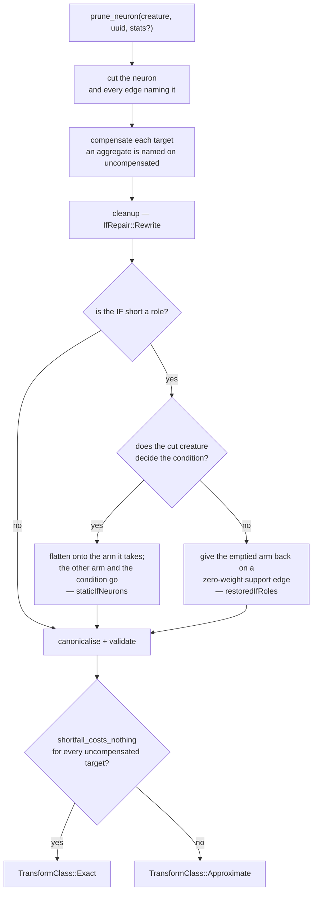

# `prune_neuron` rewrites an `IF` left short a role exactly

## Summary

The neuron pruning path asked cleanup for the TypeScript-parity
`IfRepair::Downgrade` — the one **inexact** rewrite the module has — so an `IF`
a removal left short of a role came back as the `IDENTITY` sum of everything
still reaching it, and could no longer branch at all. It now asks for
`IfRepair::Rewrite`, the exact repair `prune_synapse` has used since Issue #591:
the `IF` is flattened onto the arm a statically decided condition always takes,
or given back the emptied arm on a zero-weight support edge. Closes #198.

**The work lands in NEAT-AI-core**, as the issue directs — the pruning engine is
core's, and `prune_neuron` / `prune_cleanup` own the repair. The branch is pushed
and declared with the cross-repo PR marker in this PR body. This Ockham PR is the
archived record of that core change, plus the two consequences Ockham owns: the
`neat-core.expected-version` entry and the doc comment on
`PruneDetail::downgraded_if_neurons`, a journal field that can no longer fill.

What landed in `stSoftwareAU/NEAT-AI-core`
(branch `ockham-198-prune-neuron-if-rewrite`, base `Develop`):

- **`neat-core/src/prune_neuron.rs`** — `cleanup_creature_with(&cut,
  CleanupOptions { if_repair: IfRepair::Rewrite })`. `cleanup_creature`'s default
  policy is untouched, so the `prune_fixtures` captures keep a caller that
  reproduces them (`neat-core/tests/prune_cleanup.rs`).
- **`shortfall_costs_nothing`** — the one route by which an aggregate shortfall
  still reaches `TransformClass::Exact`. A target named on `uncompensated` got no
  fold, which normally ends any exactness claim; an `IF` whose condition **the
  creature itself decided the same way before and after the cut** is the
  exception, because a condition term only picks an arm and a term out of the arm
  the pick discards is read on no record at all. Both entry points ask it, so a
  neuron removal and the synapse removal that takes the same term away can never
  disagree about what it cost.
- **`prune_cleanup::static_condition_branch`** — the branch decision (`> 0`
  chooses the positive arm, an untyped edge belongs to it) lifted out of
  `Engine::rewrite_if_neurons` into one `pub(crate)` home, so the rewrite and the
  proof above read the rule from the same place rather than restating it.
- The golden record regenerated: `if_repair_coalesces_roles` now crosses the wire
  as a `staticIfNeurons` flatten. `downgradedIfNeurons` is unreachable through
  the JSON ABI, so its coverage assertion is inverted — every golden case must
  now carry it **empty**, which is what would catch an entry point going back to
  the downgrade.
- Docs: `prune_neuron` / `prune_cleanup` / `prune_synapse` / `prune_fixtures`
  module headers, the core `README.md` cleanup, neuron and synapse sections, the
  parity matrix's grading table, and a `RELEASING.md` breaking-change-log entry
  with the `0.15.9 → 0.16.0` minor bump.



## Evidence

A library change with no visual surface, so the evidence is the test suites and
the quality gates rather than a screenshot. No web interface exists to
screenshot; what was tested instead is below.

In `stSoftwareAU/NEAT-AI-core`, branch `ockham-198-prune-neuron-if-rewrite`:

- `cargo test -p neat-core` — every binary green (285 lib, 44 `prune_neuron`,
  39 `prune_synapse`, 12 `prune_json`, 19 `prune_parity`, 48 `prune_cleanup`).
- `cargo clippy --workspace --all-targets --all-features -- -D warnings` — clean.
- `./quality.sh < /dev/null` — "All quality checks passed!", including the
  Mermaid gate, `deno test --allow-read tests/wasm_prune_parity_test.ts`
  (15 passed), the bats shell-harness suite, doctests, rustdoc and the release
  build.
- `neat-core/tests/prune_parity.rs` — passes **unchanged, and unmodified in this
  diff**. It grades the captured `(before, after)` pairs against each other; it
  never drives `IF_REPAIR_COALESCES_ROLES` through `prune_neuron`, so the
  re-grading the issue allowed for was not needed. The capture's byte-for-byte
  caller is `prune_cleanup.rs`, which is untouched.
- Golden record regenerated with
  `UPDATE_PRUNE_GOLDEN=1 cargo test -p neat-core --test prune_json`.

In this repository, with the candidate core as the sibling checkout:

- `./quality.sh < /dev/null` — "All quality checks passed!", including
  `scripts/check-neat-core-version.sh` ("OK neat-core 0.16.0 matches handled
  baseline 0.16.0") and the full Ockham suite. No Ockham source change was
  needed: it only *reports* what a `PruneResult` carries.

### TDD — the red runs, observed

Both behaviour changes were written test-first and watched fail against the
unfixed code:

- the five new `prune_neuron` tests, against the `cleanup_creature` call:

  ```text
  a_static_condition_feeder_that_leaves_the_branch_where_it_was_prunes_exactly
    left: Approximate  right: Exact
  an_output_carrying_the_if_squash_is_rewritten_in_place_by_both_paths
    left: []  right: [StaticIfRewrite { uuid: "output-0", branch: Negative }]
  emptying_a_branch_the_condition_never_reaches_prunes_exactly
    unreachable_branch: output 0 moved on [-1.5]: 0.61485106 vs 1.114851
  test result: FAILED. 39 passed; 5 failed
  ```

  Quoted verbatim from that run, so the output-`IF` test appears under the name
  it carried then; the Spec reviewer had it renamed to
  `..._by_a_neuron_prune`, because it drives only `prune_neuron`.

- `a_condition_edge_that_never_moved_the_branch_is_cut_exactly`, re-run against
  the restored `uncompensated.is_empty()` clause to confirm the predicate is what
  carries it:

  ```text
  assertion `left == right` failed: a condition term that never moved the branch costs nothing
    left: Approximate  right: Exact
  ```

## Acceptance Criteria

<!-- vibe-spec-review inputs="diff+issue-body" -->

- **partial** — `prune_neuron` on a feeder of an `IF` condition returns `Exact`
  when the removed neuron was structurally constant, `Approximate` otherwise,
  and never lists a downgraded `IF` — evidence:
  `neat-core/src/prune_neuron.rs::shortfall_costs_nothing`;
  `neat-core/tests/prune_neuron.rs::a_static_condition_feeder_that_leaves_the_branch_where_it_was_prunes_exactly`
  and `::a_static_condition_feeder_that_flips_the_branch_is_only_approximate` —
  reviewer: partial — reason: the "never lists a downgraded IF" and "`Approximate`
  otherwise" halves are met; the `Exact` half is delivered **narrower than
  written**, and deliberately. The reviewer verified the criterion as stated is
  unsound: removing a structurally constant condition feeder that flips the
  branch produces different outputs on the probe records
  (`assert_different_function` fails the same-function oracle), so labelling it
  `Exact` would contradict the module's own "same number on every record"
  contract. What ships is the provable rule — `Exact` where the creature decided
  the condition **and the arm the forward pass reads did not move**. The
  departure is now stated in the core summary's "Where the request and the code
  differ" section, which the reviewer's first pass found missing
- **met** — corner case (6) passes for both entry points — evidence:
  `neat-core/tests/prune_neuron.rs::an_output_carrying_the_if_squash_is_rewritten_in_place_by_a_neuron_prune`
  and `neat-core/tests/prune_synapse.rs::an_output_carrying_the_if_squash_is_rewritten_in_place`,
  over the shared `tests/common/prune_if.rs::OUTPUT_IF_JSON`; each asserts the
  declared width unmoved, output-neuron count unchanged, `downgraded_if_neurons`
  empty, `creature_validate` plus the topology gate, and same-function against a
  zero-weight twin at 1e-6 — reviewer: met — reason: the reviewer also found the
  neuron-side name claimed "by both paths" while calling only `prune_neuron`; it
  is renamed and cross-references the synapse half
- **met** — `neat-core/tests/prune_parity.rs` passes (re-graded if needed, with
  the change explained in the PR summary) — evidence: the file is absent from the
  diff and passes 19/19; the reviewer confirmed independently that it never calls
  `prune_neuron` — every test iterates `PRUNE_PARITY_CASES` and grades the
  captured pairs against each other — so the issue's conditional never fired —
  reviewer: met — reason: the reviewer noted the re-grading that *did* happen is
  in `prune_neuron.rs`, and that it drops the byte-parity claim against the
  capture rather than re-establishing it numerically. That is the only sound
  option (the rewrite's `-3.0` arm and the downgrade's `-1.0` coalesced row are
  different functions) and `docs/research/pruning-parity-matrix.md` states the
  zero-weight twin as the reference
- **met** — `cargo test -p neat-core`, clippy `-D warnings` and
  `./quality.sh < /dev/null` pass in NEAT-AI-core — evidence: the reviewer ran
  all three independently and green; re-run here after every reviewer fix —
  reviewer: met
- **unrequested** — `prune_synapse`'s exactness rule changed too — reviewer:
  unrequested — reason: the issue names only `prune_neuron`, but leaving the
  synapse path on `uncompensated.is_empty()` would make the two entry points
  disagree about what the *same* lost term cost — the invariant the module family
  states as "a neuron removal and a synapse removal can never disagree". One
  shared `transform_class` is the whole difference; every rewrite they produce
  was already identical
- **unrequested** — `Exact` also reached where the removal empties an arm the
  condition never reaches — reviewer: unrequested — reason: it falls out of the
  same proof rather than being coded for, and it is true — an unreachable arm is
  read on no record. `emptying_a_branch_the_condition_never_reaches_prunes_exactly`
  grades it against the original creature, not a twin
- **unrequested** — a minor bump (`0.15.9 → 0.16.0`) where the issue said patch —
  reviewer: unrequested — reason: `RELEASING.md` counts "changing documented
  runtime behaviour in a way callers may rely on" as breaking, which this is; the
  repo's policy wins over the issue's estimate, and the bump carries the `!`
  conventional marker and a breaking-change-log entry
- **unrequested** — one Ockham source file edited where the issue said "no Ockham
  source change" — reviewer: unrequested — reason: it is a doc comment only
  (`ockham/src/prune.rs::PruneDetail::downgraded_if_neurons`), recording that a
  journal field can no longer fill. Leaving it stale would breach "a code change
  owes a docs change"
- **unrequested** — the golden-record coverage assertion for `downgradedIfNeurons`
  inverted — reviewer: unrequested — reason: consequential, not chosen — no
  request the ABI accepts can fill that list any more, so the old "some case
  carries it non-empty" assertion was unsatisfiable. The reviewer showed the
  replacement was satisfied by absence; it is now paired with
  `a_downgraded_if_list_still_crosses_under_its_wire_name`, which pins the key
  positively
- **unrequested** — `prune_cleanup::static_condition_branch` extracted — reviewer:
  unrequested — reason: the proof and the rewrite must read the `> 0` branch rule
  from one place or they can disagree; it is a move, not a second copy
- **unrequested** — docs beyond `README.md`: the four pruning module headers,
  `prune_fixtures`'s grading note and `docs/research/pruning-parity-matrix.md` —
  reviewer: unrequested — reason: each of those surfaces asserted the old
  behaviour in so many words; leaving them would have left the repo documenting a
  rewrite it no longer performs

## Standards Review

<!-- vibe-standards-review inputs="diff+CODING-STANDARDS.md" -->

Neither repository carries a `CODING-STANDARDS.md`; `NEAT-AI-core/AGENTS.md`,
`RELEASING.md` and `NEAT-AI-Ockham/AGENTS.md` are the documented standards, and
they are what the reviewer was given alongside the fleet-wide rules.

- **violation** — `RELEASING.md` claimed "The key stays on the wire" for
  `downgradedIfNeurons`, which the same PR disproves: the field is
  `skip_serializing_if = "Vec::is_empty"` and can no longer be filled, so it is
  never emitted — evidence: `RELEASING.md:233` — reason: fixed here — the release
  note now says the key is no longer emitted and a consumer must treat its
  absence as normal
- **violation** — "a code change owes a docs change" applied to four surfaces and
  missed the fifth: the wire struct's own field doc still described the downgrade
  path as reachable — evidence: `neat-core/src/prune_json.rs:398` — reason: fixed
  here
- **violation** — "absence of failure is not success": the replacement
  `downgradedIfNeurons` assertion is satisfied by the key being absent, so a
  rename or a deletion of the field would leave the suite green — evidence:
  `neat-core/tests/prune_json.rs:505` — reason: fixed here — paired with
  `a_downgraded_if_list_still_crosses_under_its_wire_name`, which serialises a
  filled response and pins the wire name and the round trip
- **violation** — AGENTS.md oracle rule 3, a vacuous assertion:
  `assert!(probes.len() >= 3)` over a function that always returns exactly five
  rows cannot fail — evidence: `neat-core/tests/prune_neuron.rs:368` — reason:
  fixed here — removed, and the seed list is a named `PROBE_SEEDS` const whose
  doc states the count instead
- **violation** — DRY: `IF_STATIC_CONDITION_JSON` and `OUTPUT_IF_JSON` were
  byte-identical in both test files, and the claim they prove is that both entry
  points treat the *same* creature identically — evidence:
  `neat-core/tests/prune_neuron.rs:255` vs `neat-core/tests/prune_synapse.rs:131`
  — reason: fixed here — both moved to `neat-core/tests/common/prune_if.rs`,
  included by path so neither target compiles a helper it does not use
- **violation** — DRY: the exactness conjunction was written out at both entry
  points, so a fourth conjunct added at one would silently diverge them — the
  precise thing the accompanying comments claimed could no longer happen —
  evidence: `neat-core/src/prune_neuron.rs:646` and
  `neat-core/src/prune_synapse.rs:269` — reason: fixed here — one
  `transform_class`, asked by both
- **violation** — DRY: `assert_different_function` is a verbatim copy of the one
  in `prune_synapse.rs` rather than a shared helper — evidence:
  `neat-core/tests/prune_neuron.rs:386` — reason: stands. Lifting it means moving
  `probe_inputs`, `outputs`, `assert_same_function`, `assert_valid`, `creature`,
  `neuron`, `has_neuron` and `weight` with it — every one of which was already
  duplicated between these two files before this diff — which is a refactor of
  two 1,400-line test files and a change of its own. The fixtures were shared
  because a divergent *creature* silently invalidates the cross-entry-point
  claim; a divergent tolerance helper fails loudly instead
- **violation** — `RELEASING.md` forbids two breaking changes colliding on one
  major-equivalent slot, and `0.16.0` is claimed by the unmerged sibling branches
  for Ockham #196 and #197 as well — evidence:
  `neat-core.expected-version:101` — reason: stands, and is recorded rather than
  papered over. This branch is cut from `origin/Develop` at `0.15.9` and takes the
  next slot honestly; #196 and #197 are open branches with no merge order yet, and
  guessing `0.17.0` here would be wrong if either never lands. Whichever merges
  first keeps `0.16.0` and the others rebase — which is what core's
  `version-increment` job does on every PR
- **violation** — `RELEASING.md`'s three-phase flow covers documented-behaviour
  changes, and only one of the six registered downstream consumers was verified —
  evidence: `neat-core.expected-version:114` — reason: stands, and the gap is real
  rather than closed by the CI gate: `downstream-consumers` **compiles** each
  consumer, and no compile can see a behaviour change. What is true is that the
  phase-1 alternative pre-exists (`cleanup_creature_with` / `IfRepair::Rewrite`
  shipped in 0.11.0), no public item was narrowed or removed, and only a caller of
  `prune_neuron` / `prune_synapse` can be affected. Ockham is the consumer that
  requested the change and its full suite is green against this core; the other
  five were not cloned in this run, so they are reported unchecked rather than
  implied clean
- **clean** — Australian English throughout both diffs, no `-ize`/`-ization`/
  `color`/`behavior` introduced; every new test compiles a creature through
  `compile_creature` and activates it, with no source greps, sleeps or absolute
  timing thresholds; the `Exact` oracles are graded against zero-weight twins
  built independently of the prune path over five probe records, with
  `assert_different_function` and `assert_ne!(result.creature, case.after())`
  guarding against vacuous passes; the TypeScript parity capture keeps a byte-for-
  byte caller in `prune_cleanup.rs`; `static_condition_branch` is a move rather
  than a copy, with its `f32`-storage-order rationale carried across; no public
  item narrowed or removed; version mechanics correct (`!` marker, minor bump,
  both `Cargo.lock`s in step, breaking-change-log entry); no hidden paths staged;
  `shortfall_costs_nothing` traced by hand against all four reachable shapes with
  no incorrect `true`

## Test Plan

All in `stSoftwareAU/NEAT-AI-core`, branch
`ockham-198-prune-neuron-if-rewrite`. No Ockham test changes — Ockham takes no
behaviour change, only the doc comment and the version record.

`neat-core/tests/prune_neuron.rs`

- `an_if_left_short_of_a_role_is_rewritten_by_the_prune` (rewritten from
  `an_if_left_short_of_a_role_is_downgraded_by_the_prune`, as the issue directs —
  the behaviour it asserted is exactly what this change replaces, and the
  TypeScript capture it compared against keeps its byte-for-byte caller in
  `prune_cleanup.rs`)
- `a_static_condition_feeder_that_leaves_the_branch_where_it_was_prunes_exactly`
- `a_static_condition_feeder_that_flips_the_branch_is_only_approximate`
- `emptying_a_branch_the_condition_never_reaches_prunes_exactly`
- `an_output_carrying_the_if_squash_is_rewritten_in_place_by_a_neuron_prune`
  (corner case 6, neuron half)

`neat-core/tests/prune_synapse.rs`

- `a_condition_edge_that_never_moved_the_branch_is_cut_exactly`
- `a_condition_edge_that_flips_the_branch_is_only_approximate`
- `an_output_carrying_the_if_squash_is_rewritten_in_place` (corner case 6,
  synapse half)

`neat-core/tests/prune_json.rs`

- `a_downgraded_if_list_still_crosses_under_its_wire_name`
- `the_golden_record_is_what_the_native_abi_answers_today` (record regenerated)
- `the_golden_record_covers_the_shapes_the_wasm_bundle_is_graded_on`
  (`downgradedIfNeurons` assertion inverted)

`neat-core/tests/common/prune_if.rs` — the two `IF` creatures both entry points
are graded on, in one place so the cross-entry-point claim cannot be quietly
invalidated by a drifting copy.
