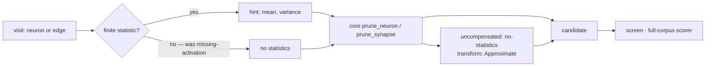

# An unmeasured visit prunes uncompensated through core (Issue #199)

## Summary

An absent activation statistic used to stop the razor. If the sampled scan
never reached a hidden neuron, or an edge's source resolved to no fold value,
Ockham filed `missing-activation` and the visit was recorded as
checked-and-blocked — a visit nothing would ever try again that epoch.

The compensation was never Ockham's to withhold. NEAT-AI-core's `prune_neuron`
and `prune_synapse` both accept `stats: None`: they run every rewrite provable
from the structure alone and name whatever target is left carrying the removal
on `PruneResult::uncompensated` with `UncompensatedReason::NoStatistics`. So
Ockham now hands core `None` and screens what comes back.

- `ockham/src/prune.rs` — `hint()` returns `Option<PruneStats>`;
  `prune_hidden_neuron` and `prune_edge` take `Option<f64>`, and
  `GroupMember.mean` is one.
- `ockham/src/sweep.rs` — `propose_synapse` no longer blocks on a source that
  resolves to nothing; `propose` no longer blocks a neuron without stats (the
  identity-collapse and merge rungs still run first, and only the
  constant-substitution rung is skipped, because it needs a mean to write into
  the constant it creates); `propose_group` no longer blocks a member without
  one.
- `reason_for(PruneError::NonFiniteStatistic | NegativeVariance | …)` still maps
  to `MissingActivation`. A statistic that is **present but unusable** is a
  defect to surface loudly, not an absence to work around — and both ladders
  filter a non-finite mean to nothing before the request is made, so a sweep
  visit does not reach it.

Closes #199.

## Evidence

Backend/CLI change with no web interface to screenshot. The evidence is the
test suite and the gate.

Commands run in this worktree, all green after the final edit:

- `cargo test --workspace --all-features -- --test-threads=2` — 681 lib tests
  plus every integration suite, 0 failed.
- `cargo clippy --workspace --all-targets --all-features -- -D warnings
  -D clippy::filter_next -D clippy::collapsible_if` — clean.
- `./quality.sh < /dev/null` — `All quality checks passed!`, including
  `scripts/check-neat-core-version.sh`
  (`OK neat-core 0.15.9 is behind handled baseline 0.16.0`), codespell,
  markdownlint, cargo-deny, `cargo fmt --check` and rustdoc with `-D warnings`.

`neat-core.expected-version` is **not** bumped: the sibling clone is 0.15.9
against a 0.16.0 baseline, so the issue's conditional bullet did not fire and
the gate passes as-is.

The TDD red was observed before any implementation existed: the two new sweep
tests failed against the unchanged code with
`Blocked { reason: MissingActivation, detail: "no source value for input-0 …" }`
and `… "no activation stats for h_t"`, then passed once `hint()` returned an
`Option`.

## Acceptance Criteria

<!-- vibe-spec-review inputs="diff+issue-body" -->

- **met** — No Ockham code path files `missing-activation` for an absent
  statistic; only a core statistic refusal maps to it — evidence:
  `ockham/src/prune.rs::hint` returning `Option<PruneStats>`,
  `ockham/src/sweep.rs::propose`/`propose_synapse`/`propose_group`, and the
  tests `prune.rs::an_unmeasured_neuron_prunes_uncompensated_through_core`,
  `prune.rs::an_unmeasured_edge_and_group_member_prune_uncompensated_through_core`,
  `sweep.rs::a_synapse_visit_that_proposes_nothing_is_skipped_with_its_reason`
  — reviewer: met — reason: the reviewer flagged one caveat, that a **non-finite**
  (not absent) mean still reached core on the neuron and group ladders while the
  edge resolver filtered it; that asymmetry is fixed in `58e3e1d` and covered by
  `sweep.rs::a_non_finite_measured_mean_is_treated_as_no_statistic_at_all`.
- **met** — The new sweep tests show an unmeasured neuron and an unmeasured edge
  each become a screened candidate labelled `no-statistics` / `Approximate` —
  evidence:
  `sweep.rs::an_unmeasured_edge_is_a_screened_candidate_named_no_statistics`,
  `sweep.rs::an_unmeasured_hidden_neuron_is_a_screened_candidate_named_no_statistics`
  — reviewer: met
- **met** — `cargo test --workspace --all-features`, `cargo clippy --workspace
  --all-targets --all-features -- -D warnings` and `./quality.sh < /dev/null`
  pass — evidence: the three commands in the Evidence section above, which the
  reviewer also ran independently — reviewer: met
- **unrequested** — `ockham/Cargo.toml` 0.1.66 → 0.1.67 and the matching
  `Cargo.lock` line — reviewer: unrequested — reason: `CONTRIBUTING.md`
  principle 8 requires a version bump for binary-affecting changes; unattended
  machines key their rebuild off it, so omitting it would ship nothing.
- **unrequested** — a new ~37-line "The unmeasured visit (Issue #199)" section
  with a Mermaid flowchart in `docs/blocked-reasons.md` — reviewer: unrequested
  — reason: the issue asked for the `missing-activation` row and the
  synapse-visit table; the row alone could not carry why a code that used to be
  92% of the blocked population is now a defect report, and that document's own
  convention is a section per retired path.
- **unrequested** — doc-surface edits beyond the two files the issue named:
  `BlockedReason::MissingActivation`'s rustdoc and `describe()` string,
  `stats::source_value`'s rustdoc, and two README sample outputs that showed
  `missing-activation` as ordinary run output — reviewer: unrequested — reason:
  both reviewers filed these as stale surfaces of the same claim;
  `describe()` is rendered into reports, so leaving it would have shipped a
  description of a rule that no longer exists.
- **unrequested** — `with_merge_detail` became `with_skipped_rungs`, and the
  `CollapseSkip` from a refused exact collapse is carried into the blocked
  detail again — reviewer: unrequested — reason: the first commit discarded it,
  which both reviewers called a swallowed error; restoring it keeps the record
  saying which rungs were refused.
- **unrequested** — the test `a_creature_whose_edges_all_refuse_still_advances_visit_by_visit`
  is renamed to `…_are_all_unmeasured_…` — reviewer: unrequested — reason: the
  issue asked for that test to be updated and its old name asserts a refusal
  that no longer happens. The Spec reviewer also read it as having dropped an
  assertion that skips carry reasons; `git diff` shows only the name and two
  comments changed — the original never asserted reasons — so that part of the
  finding does not stand.

## Standards Review

<!-- vibe-standards-review inputs="diff+CODING-STANDARDS.md" -->

`CODING-STANDARDS.md` does not exist in this repository; the reviewer was given
`CONTRIBUTING.md` and the project engineering standards in its place.

- **violation** — a non-finite measured mean hard-blocked a neuron visit while
  the edge ladder's resolver filtered the same value to `None` — evidence:
  `ockham/src/sweep.rs:803` — reason: fixed here; both `propose` and
  `propose_group` now filter `is_finite`, covered by
  `sweep.rs::a_non_finite_measured_mean_is_treated_as_no_statistic_at_all`.
- **violation** — the `CollapseSkip` from a refused exact collapse was
  discarded, so a blocked record no longer said why that rung was refused
  ("never fail silently") — evidence: `ockham/src/sweep.rs:785` — reason: fixed
  here by `with_skipped_rungs`.
- **violation** — `BlockedReason::MissingActivation`'s rustdoc and its
  user-facing `describe()` string still stated the retired meaning ("no finite
  sampled activation statistic to substitute"); `describe()` is rendered into
  reports — evidence: `ockham/src/blocked.rs:37`, `ockham/src/blocked.rs:105` —
  reason: fixed here.
- **violation** — `stats::source_value`'s rustdoc still said every `None` means
  the caller proposes no cut, while the identical README paragraph was updated —
  evidence: `ockham/src/stats.rs:749` — reason: fixed here.
- **violation** — the `aggregate-squash` row and the retired-`unsafe-topology`
  prose still cited now-dead paths — evidence: `docs/blocked-reasons.md:18`,
  `docs/blocked-reasons.md:19`, `ockham/src/blocked.rs:45` — reason: fixed here.
- **violation** — the `missing-activation` row overstated the remaining meaning
  as exclusively a core refusal, when `merge.rs`, `substitute.rs` and
  `ablation.rs` still map their own non-finite refusals to it — evidence:
  `docs/blocked-reasons.md:20` — reason: fixed here; the row now names Ockham's
  own rewrites beside core's.
- **violation** — the documented `coverage.txt` and batch-skip samples showed
  `missing-activation` as ordinary run output — evidence: `README.md:902`,
  `README.md:1393` — reason: fixed here; both samples now show
  `aggregate-squash`, which a run can still file.
- **violation** — `propose_group`'s changed behaviour had no test at the sweep
  layer — evidence: `ockham/src/sweep.rs:866` — reason: fixed here by
  `sweep.rs::an_unmeasured_group_member_no_longer_blocks_the_group`.
- **violation** — `BlockedReason::is_retired()` still returns true only for
  `UnsafeTopology`, so historical `missing-activation` blocked records are still
  loaded as coverage and those visits stay counted as checked — evidence:
  `ockham/src/blocked.rs:122`, `ockham/src/learnings.rs:624` — reason: **stands,
  deliberately.** `missing-activation` is not retired: this change keeps it live
  for a statistic that is present but unusable, so the #192 precedent (a code no
  binary can file) does not apply. Re-presenting historical records is a
  fleet-history decision about the #194 milestone's population, not part of
  "stop filing the code", and it is not in this issue's scope.
- **clean** — Australian English throughout with no `-ize`/`color`/`behavior`
  forms introduced and codespell clean; `cargo fmt --check`, clippy with
  `-D warnings`, and rustdoc with `-D warnings` all pass; `CONTRIBUTING.md`
  principle 8 honoured with the version bump and no changelog; no hidden files
  staged and no secrets, new input-handling or injection surface; tests call
  real functions on real fixtures and assert on results rather than grepping
  source text, covering the happy path, the `None` path for neuron/edge/group
  and the error path (`Some(NaN)` / `Some(INFINITY)`), and re-asserting
  incumbent immutability and `validate_creature` on every candidate; `hint()` is
  a single clean point of `Option` mapping with every call site widened and no
  stragglers.
- **note (pre-existing, not introduced here)** —
  `run.rs::a_run_down_to_its_last_batch_screens_it_rather_than_replaying` is an
  absolute wall-clock test (2s budget, 100 ms/creature), which the standards
  forbid, and the reviewer saw it fail once and pass on four subsequent runs. It
  is untouched by this diff and is a separate defect to raise; making
  previously-blocked visits buildable does add scorer time to the budget it
  measures.

## Test Plan

Added:

- `ockham/src/sweep.rs::an_unmeasured_edge_is_a_screened_candidate_named_no_statistics`
  — an edge whose source has no statistic becomes a `Synapse` candidate whose
  `PruneDetail.uncompensated` names the target with reason `no-statistics` and
  whose `transform_class` is `Approximate`.
- `ockham/src/sweep.rs::an_unmeasured_hidden_neuron_is_a_screened_candidate_named_no_statistics`
  — the same for a `TANH` hidden neuron, where no collapse rung intercepts, no
  merge partner exists and the constant-substitution rung has no mean to write.
- `ockham/src/sweep.rs::a_non_finite_measured_mean_is_treated_as_no_statistic_at_all`
  — a `NaN` measured mean gives a neuron visit and an edge visit the same
  verdict.
- `ockham/src/sweep.rs::an_unmeasured_group_member_no_longer_blocks_the_group`
  — a two-member group with one unmeasured member is cut, not blocked.
- `ockham/src/prune.rs::an_unmeasured_neuron_prunes_uncompensated_through_core`
  — the request layer: `None` in, `no-statistics` and `Approximate` out, no bias
  fold, source unmoved.
- `ockham/src/prune.rs::an_unmeasured_edge_and_group_member_prune_uncompensated_through_core`
  — the same for `prune_edge` and `prune_hidden_group`.

Updated:

- `ockham/src/sweep.rs::a_synapse_visit_that_proposes_nothing_is_skipped_with_its_reason`
  — the unmeasured-source half is now a candidate, so what remains is core's own
  refusal for an edge the incumbent does not carry (`other`).
- `ockham/src/sweep.rs::an_unmeasured_identity_with_a_typed_edge_is_not_unsafe_topology`
  — now asserts the visit proposes an `Ablation` candidate that removes the
  neuron, rather than blocking on the absent statistic.
- `ockham/src/sweep.rs::a_creature_whose_edges_are_all_unmeasured_still_advances_visit_by_visit`
  — renamed from `…_all_refuse_…`; the property under test is the walk itself,
  which still holds now that those visits produce candidates.
- `ockham/src/prune.rs::a_protected_or_unknown_target_is_refused_with_no_creature`,
  `…::an_unbuildable_member_blocks_the_whole_group`,
  `…::unknown_endpoints_edges_and_source_values_are_refused` — the non-finite
  cases stay, now as `Some(f64::NAN)` / `Some(f64::INFINITY)`, because a
  statistic that is present but unusable is still a refusal.

No test was commented out or removed.
