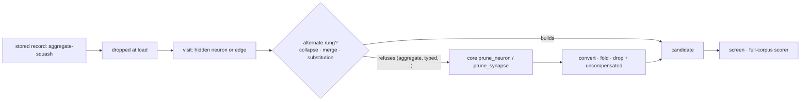

# Retire the `aggregate-squash` blocked reason (Issue #200)

## Summary

There is no aggregate a cut has to refuse. NEAT-AI-core **converts** an
aggregate target a cut leaves holding one inward edge to `IDENTITY`/`ABSOLUTE`
(#197), **folds** one left holding none into its bias (#196), and otherwise
drops the term, names the target on `PruneResult::uncompensated` and labels the
candidate `Approximate` — so every visit `aggregate-squash` was filed against is
a candidate the scorer judges. The code is retired the way #192 retired
`unsafe-topology`: the three Ockham mappings that could produce it are gone,
blocked records carrying it are dropped at load so those visits are tried again,
and the docs say so. Closes #200.

Three changes:

1. **The three aggregate refusals report `other`.** `ablation.rs`
   (`AggregateNeuron` / `AggregateTarget` / `UnknownSquash`), `collapse.rs`
   (`AggregateTarget`) and `merge.rs` (`AggregateTarget`) keep their refusals
   and their messages — the skip text still names the aggregate and rides in the
   record's `detail` — but the *code* is `other`. The collapse and the merge are
   alternate rungs whose refusal falls through to the core prune, so a refusal
   is a finding about that transform, never a category.
2. **`BlockedReason::AggregateSquash.is_retired()` is true.** The variant, its
   `aggregate-squash` wire code, `from_code` and the `aggregateSquash` key in
   `coverage.json` all stay, so mixed-version fleet hosts and every stored
   artefact still read.
3. **A blocked record carrying it is dropped at load.** `load_screens` already
   drops retired blocked records; extending the retired set puts those visits
   back in front of the sweep. That is what the GRQ re-measure needs — a blocked
   record left in the store keeps its visit out of the sweep.



## Evidence

Backend/CLI only — there is no web interface to screenshot, so the evidence is
the grep the issue asks for, a live benchmark and the tests.

**The acceptance grep.** No mapping remains:

```console
$ grep -rn "=> BlockedReason::AggregateSquash" ockham/src/
$ echo $?
1
```

The references that remain are the wire path only — the variant itself,
`code()` / `from_code()`, the `BlockedBreakdown` slot and accessor, and test
fixtures. Nothing maps a refusal onto it.

**`cargo run --release --example synapse_sweep_bench`** — 799 hidden neurons,
1606 synapses, a typed `IF` gate every eighth tree and an aggregate collector
every fifth, i.e. the shape this code was filed against:

```text
pool: 2386 visits (799 neuron, 1587 synapse) ordered in 0.4ms
synapse proposals: 1587 built and validated, 0 refused
  removed per proposal built: 1.46 synapse(s), 0.32 neuron(s) cascaded
refusals by reason:
```

Every visit built a validated proposal; the refusal tally is empty, so there is
no live population under any code, let alone this one.

**`./quality.sh < /dev/null`** passes in full after the final edit: shellcheck,
the neat-core version gate, codespell, markdownlint, actionlint, cargo-deny,
`cargo fmt --check`, clippy `-D warnings`, 683 unit + the integration suites,
and rustdoc.

**`neat-core.expected-version`** needed no bump: the sibling clone is at
`0.16.0` and the recorded baseline is already `0.16.0`, so
`scripts/check-neat-core-version.sh` passes unchanged.

## Acceptance Criteria

<!-- vibe-spec-review inputs="diff+issue-body" -->

- **met** — `BlockedReason::AggregateSquash.is_retired()` is true and a blocked record carrying it is dropped at load (test) — evidence: `ockham/src/blocked.rs::is_retired` and `ockham/src/learnings.rs::a_blocked_aggregate_squash_record_is_dropped_so_the_visit_is_tried_again` — reviewer: met
- **met** — No `=> BlockedReason::AggregateSquash` mapping remains in `ockham/src` (grep in the PR summary) — evidence: the grep in the Evidence section above, exit 1; `ockham/src/ablation.rs`, `ockham/src/collapse.rs`, `ockham/src/merge.rs` — reviewer: met
- **met** — `docs/blocked-reasons.md`, `docs/pruning-ownership.md` and `README.md` name the retirement; `ockham/tests/pruning_ownership.rs` passes with the new principle — evidence: `docs/blocked-reasons.md` (retired row + `### aggregate-squash (#200)` section), `docs/pruning-ownership.md` (principle + enforcement row), `README.md`, `ockham/tests/pruning_ownership.rs::design_reference_preserves_every_pruning_principle` — reviewer: met
- **met** — `cargo test --workspace --all-features`, clippy `-D warnings` and `./quality.sh < /dev/null` pass — evidence: full gate run after the final edit, "All quality checks passed!" — reviewer: met
- **met** — Map the `AggregateTarget` / `AggregateNeuron` / `UnknownSquash` skips to `BlockedReason::Other`, keeping the skip's message in the detail — evidence: `ockham/src/ablation.rs`, `ockham/src/collapse.rs`, `ockham/src/merge.rs`; message preservation via `ockham/src/sweep.rs` `Blocked::new(reason, e.to_string())` — reviewer: met
- **met** — Update the `coverage.rs`, `report.rs`, `run.rs` and `learnings.rs` tests that build `AggregateSquash` breakdowns — evidence: those four files now file live codes — reviewer: met — reason: the reviewer noted the criterion's wording ("exercise a retired code rather than a live one") reads backwards and recorded that the diff "did the sensible thing — swapped to live codes"; the retired code is exercised by the dedicated retirement tests instead
- **met** — Extend `pruning_ownership.rs::design_reference_preserves_every_pruning_principle` with the new principle string — evidence: `ockham/tests/pruning_ownership.rs` `PRESERVED_PRINCIPLES`, matching `docs/pruning-ownership.md` verbatim — reviewer: met
- **met** — Bump `neat-core.expected-version` if the sibling is at a higher minor — evidence: sibling `0.16.0`, baseline `0.16.0`, `scripts/check-neat-core-version.sh` exits 0 — reviewer: met — reason: the reviewer recorded this as "met (no-op, correctly)"; no bump was owed
- **partial** — Write the tests first (TDD) — evidence: `ockham/src/blocked.rs::the_retired_codes_are_the_ones_no_binary_can_file` and the `learnings.rs` drop test were both observed failing before the mapping change — reviewer: missing — reason: the reviewer saw only a squashed diff and recorded the ordering as "unverifiable"; the red run is in this run's transcript, not in the artefact
- **unrequested** — `README.md` sample `reasons:` line and the pruning-estimate "prioritisation signal only" paragraph — reviewer: unrequested — reason: both stated `aggregate-squash` as a live category; leaving them would have contradicted the retirement the same file announces
- **unrequested** — `docs/blocked-reasons.md` edits beyond the named row and section (the `other` row, the synapse-visit section, the dominant-category section) — reviewer: unrequested — reason: each of those passages asserted `aggregate-squash` blocks a visit, so the named edits alone would have left the document self-contradictory
- **unrequested** — `ockham/src/blocked.rs::the_retired_codes_are_the_ones_no_binary_can_file` — reviewer: unrequested — reason: pins the retired set at the unit level where `is_retired` lives; the integration test covers the same contract from the other side
- **unrequested** — `ockham/tests/prunable_topology.rs` test renames and generalisation — reviewer: unrequested — reason: mechanically forced, as the reviewer notes — the old test asserted the retired set equals `vec![UnsafeTopology]`
- **unrequested** — doc-comment worked examples in `blocked.rs`, `report.rs`, `run.rs` — reviewer: unrequested — reason: they rendered a retired code as ordinary output
- **unrequested** — `ockham/Cargo.toml` 0.1.67 → 0.1.68 — reviewer: unrequested — reason: required by CONTRIBUTING principle 8 and the auto-version CI gate; the change is binary-affecting

## Standards Review

<!-- vibe-standards-review inputs="diff+CODING-STANDARDS.md" -->

The repository has no `CODING-STANDARDS.md`; the reviewer was given the diff,
`CONTRIBUTING.md` and the project-wide engineering standards.

- **violation** — `ockham/Cargo.toml` version left at 0.1.67 despite a binary-affecting change (CONTRIBUTING principle 8, auto-version CI gate) — evidence: `ockham/Cargo.toml:3` — reason: fixed here, bumped to 0.1.68
- **violation** — "Ockham's **three** aggregate refusals" then enumerates five, repeated in three places — evidence: `docs/blocked-reasons.md:18`, `docs/blocked-reasons.md:124`, `ockham/src/blocked.rs:42` — reason: fixed here; all three now say "across three transforms" and stop claiming a count of the variants
- **violation** — the doc said constant substitution is "tried **before** the core prune", the opposite of the code — evidence: `docs/blocked-reasons.md` against `ockham/src/sweep.rs` (`prune_hidden_neuron` runs first; the substitution wins only when the prune is not `fully_compensated()`) — reason: fixed here, the paragraph now describes the real ordering
- **violation** — the ablation was described as a live ladder rung whose refusal falls through to the core prune, but `AblationSkip::blocked_reason()` has no production call site since `ablate_mean` moved to core in #182 — evidence: `ockham/src/ablation.rs` comment and `docs/blocked-reasons.md` — reason: fixed here; both now say no sweep path reads that enum's code and explain why the mapping is still kept correct
- **violation** — the new preserved principle was asserted only by grepping the design document, with no executable assertion in the half of the file that tests core — evidence: `ockham/tests/pruning_ownership.rs` `PRESERVED_PRINCIPLES` — reason: fixed here; added `an_aggregate_target_prunes_to_a_valid_creature_rather_than_refusing`, which prunes two hidden neurons feeding a `MEAN` and asserts a validated creature plus `Approximate` labelling for anything left uncompensated
- **violation** — `CollapseSkip::AggregateTarget` was re-mapped with no unit test in `collapse.rs`, unlike its ablation and merge siblings — evidence: `ockham/src/collapse.rs` — reason: fixed here; added `an_aggregate_target_is_a_finding_about_the_collapse_not_a_category`
- **violation** — worked examples swapped the retired code for `validation-failed 380 (92.2%)`, depicting a 92% rewrite-engine-defect rate as ordinary output — evidence: `README.md`, `ockham/src/report.rs:301`, `ockham/src/blocked.rs:253`, `ockham/src/run.rs:2533` — reason: fixed here; the worked examples now use `other`, which is where the aggregate refusals actually land
- **violation** — an updated test filed a *synapse* visit under `BlockedReason::NoOutputPath`, which the same diff documents as "a neuron path … never reported for an edge" — evidence: `ockham/src/coverage.rs` — reason: fixed here, the edge now files `missing-activation`
- **violation** — retired-code records are dropped at load with no log line, and #200 widens that drop to what the docs call the dominant category — evidence: `ockham/src/learnings.rs:624` — reason: **stands**. The reviewer flagged this at low confidence against "never fail silently". The drop is a deliberate, documented coverage policy rather than a swallowed fault — nothing failed — and the path is the pre-existing #192 one this issue explicitly says already works. Adding telemetry to it is a separate change; widening this PR into `load_screens` would exceed the issue's scope.
- **clean** — full gate green with no new warnings; Australian English throughout the added lines (codespell clean); new tests call real functions on real data (`LearningsStore::append_screen`/`load_screens` over a `tempfile::tempdir`, then `coverage::coverage` on a built creature) with no sleeps, no timing thresholds and no source-text grepping; the retirement contract is pinned from both the unit and integration side, with every variant of all four skip enums constructed; deserialisation compatibility retained (variant, `code()`/`from_code()` round-trip, `aggregateSquash` JSON key); docs swept together with the code; no hidden files, credentials or keys staged, no new input or injection surfaces, and `Blocked.detail` carries only UUIDs and squash names already present in the creature.

## Test Plan

Added:

- `ockham/src/blocked.rs::the_retired_codes_are_the_ones_no_binary_can_file` —
  the retired set is exactly `aggregate-squash` and `unsafe-topology`, and a
  live code is not in it. Observed failing first
  (`left: ["unsafe-topology"]`).
- `ockham/src/learnings.rs::a_blocked_aggregate_squash_record_is_dropped_so_the_visit_is_tried_again`
  — a blocked neuron record and a blocked synapse record under the retired code
  are both dropped, the live-code record beside them is kept, and the visits
  then read neither blocked nor checked, i.e. eligible again. Observed failing
  first (all three records loaded).
- `ockham/src/collapse.rs::an_aggregate_target_is_a_finding_about_the_collapse_not_a_category`
  — an IDENTITY feeding a `MEAN` is refused by the exact collapse under `other`,
  never a retired code, with the aggregate still named in the message.
- `ockham/tests/pruning_ownership.rs::an_aggregate_target_prunes_to_a_valid_creature_rather_than_refusing`
  — the executable half of the new preserved principle, asserted against core.

Modified (business-logic change; no test removed or disabled) — these asserted
the reason code this change retires:

- `ockham/src/ablation.rs::every_skip_names_the_structure_it_is_about` and
  `ockham/src/merge.rs::a_typed_outgoing_edge_or_aggregate_target_fails_closed`
  now expect `other`, with the aggregate wording unchanged in the message.
- `ockham/tests/prunable_topology.rs` —
  `no_transform_refusal_reports_a_retired_code` (renamed) still constructs every
  variant of every skip enum, and
  `the_retired_codes_are_still_read_off_a_record` (renamed) now pins two retired
  codes instead of one.
- `ockham/tests/pruning_ownership.rs::design_reference_preserves_every_pruning_principle`
  gains `"every hidden neuron and synapse prunes to a valid, closest creature"`.
- `coverage.rs`, `report.rs`, `run.rs` and `learnings.rs` fixtures that filed
  `aggregate-squash` now file a live code — a retired one would no longer load,
  and a test that needs a live population must use one.

## Notes for the reviewer

- **Nothing left the wire format.** `BlockedReason::AggregateSquash`, its
  `aggregate-squash` code and the `aggregateSquash` key in `coverage.json` all
  stay, so every artefact and every mixed-version fleet host still reads. The
  `blocked.rs` breakdown tests still count and render the retired code on
  purpose: a stored artefact can carry it, and the partition invariant has to
  hold when it does.
- **What operators will see next run.** On a creature with stored
  `aggregate-squash` blocks, `blocked:` falls by the dropped records and
  `unchecked:` rises by the same number. That is the point of the change — the
  sweep prioritises unchecked visits, so those visits get tried against an
  engine that can now cut them.
- **`Cargo.lock`** carries the `neat_ai_ockham` version bump only; the
  `neat-core` entry is unchanged at 0.16.0.
