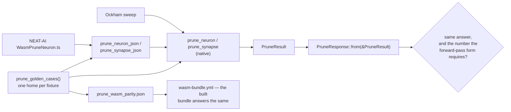

# Every pruning corner case crosses the JSON / WASM boundary unchanged

## Summary

Corner cases 1–12 of the pruning guarantee were graded natively by NEAT-AI-core
and nowhere else. Ockham's native calls and NEAT-AI's `WasmPruneNeuron.ts` both
reach the rewrites through `prune_neuron_json` / `prune_synapse_json`, so a
shape that crossed that boundary wrongly would have reached a host with nothing
failing. Each of the twelve now has a named golden case and a named test that
drives it through the JSON entry point **and** the native call and asserts the
two answer the same `PruneResponse`, with `ok: true` and a creature
`creature_validate` accepts. Closes #201.

**The work lands in NEAT-AI-core**, as the issue directs — the pruning engine
and its wire form are core's. The branch is pushed and declared with the
cross-repo PR marker in this PR body. This Ockham PR is the archived record of
that core change plus the one consequence Ockham owns: the
`neat-core.expected-version` entry, its `Cargo.lock` and a patch version bump.
**No Ockham source change was required** — Ockham only *reports* what a
`PruneResult` carries (`ockham/src/prune.rs::PruneDetail::absorb`).

What landed in `stSoftwareAU/NEAT-AI-core`
(branch `ockham-201-prune-json-corner-cases`, base `Develop`):

- **`neat-core/tests/prune_json.rs`** — twelve named `corner_case_*` tests, each
  driving one golden case through the JSON entry point and the native call.
- **`prune_json::prune_golden_cases`** — ten new named cases and their fixtures;
  record regenerated with
  `UPDATE_PRUNE_GOLDEN=1 cargo test -p neat-core --test prune_json`.
- **`impl From<&PruneResult> for PruneResponse` is public** (was the private
  `PruneResponse::from_result`), which is what lets a test compare the two
  answers whole.
- **A defect the exercise found and fixed:** a zero-edge `HYPOTv2 → ABSOLUTE`
  rewrite happened **silently** — `fold_bare_aggregate` rewrote the target's
  squash and pushed no `SquashConversion`, so the wire reported one of the two
  rewrites this crate performs and not the other. Both entry points now collect
  it into `PruneResult::converted_neurons`.
- **Coverage gates** — a record that stops carrying `convertedNeurons`, a
  `droppedMean`, either arm of the conversion table or any of the twelve cases
  by name now fails, in `prune_json.rs` and `tests/wasm_prune_parity_test.ts`
  alike.
- **The Ockham #196 branch is merged in.** `issue-196-zero-edge-bias-fold` was
  pushed but its PR was never opened — the worker could not authorise the
  cross-repo target and escalated on Ockham #196 — so the zero-edge fold was
  never on core's `Develop`. Corner case (11) *is* that rule, so this branch
  merges it rather than reimplementing it. Core's version therefore moves
  `0.17.0 → 0.18.0` (a documented-behaviour break pre-1.0), and `RELEASING.md`'s
  #198 entry is retitled to `0.17.0`, the version it actually shipped as.

## Evidence

A library change with no visual surface, so the evidence is the suites and the
gates rather than a screenshot. No web interface exists to screenshot; what was
tested instead is below.

In `stSoftwareAU/NEAT-AI-core`, branch `ockham-201-prune-json-corner-cases`:

- `./quality.sh < /dev/null` — `✅ All quality checks passed!`, exit 0,
  including clippy `-D warnings`, `cargo test --workspace`, doctests, rustdoc,
  the Mermaid gate, `deno test --allow-read tests/wasm_prune_parity_test.ts`
  (16 passed) and the 590-case bats shell harness.
- `cargo test -p neat-core --test prune_json` — 27 passed, twelve of them the
  new corner cases; `prune_neuron` 55, `prune_synapse` 60, lib 289.

In this repository, with that core as the sibling checkout:

- `./quality.sh < /dev/null` — `All quality checks passed!`, exit 0, including
  `scripts/check-neat-core-version.sh` (`OK neat-core 0.18.0 matches handled
  baseline 0.18.0`) and the full Ockham suite, with no Ockham source edit.

### Mutation evidence — the new tests can fail

Run with `cargo test -p neat-core --no-fail-fast` (plain `cargo test` stops at
the first failing binary and under-reports), each mutation reverted afterwards:

| Mutation | Tests that went red |
|---|---|
| `folds_a_magnitude` → `false`, so a `HYPOT` folds the signed term | `a_hypot_output_left_with_no_inward_edge_folds_the_absolute_term`, `a_bare_aggregate_reports_the_residual_its_form_can_justify`, `corner_case_11_…`, `the_golden_record_is_what_the_native_abi_answers_today` |
| `zero_edge_rewrite(HYPOTv2)` → `None` | `a_hypot_v2_output_left_with_no_inward_edge_becomes_an_absolute`, `an_aggregate_target_left_with_no_inward_edge_takes_the_fold`, `corner_case_11_…`, `the_golden_record_…` |
| the zero-edge rewrite performed but **not reported** (the defect fixed here) | the same four |
| `From<&PruneResult>` drops `converted_neurons` | `corner_case_8_…`, `corner_case_9_…`, `corner_case_11_…`, `a_conversion_and_a_dropped_magnitude_both_cross_the_wire`, `the_golden_record_…` |
| `add_to_bias` made a no-op (both collapsed sites) | 13/55 `prune_neuron`, 14/60 `prune_synapse`, 7/27 `prune_json` |
| the record stripped of `convertedNeurons` and every `droppedMean` | `the_golden_record_covers_the_shapes_the_wasm_bundle_is_graded_on` |

## Acceptance Criteria

<!-- vibe-spec-review inputs="diff+issue-body" -->

- **met** — Every corner case answers identically native and over JSON (one
  assertion per case, named) — evidence:
  `neat-core/tests/prune_json.rs::corner_case_1_…` through
  `::corner_case_12_one_cut_collapses_a_three_deep_hidden_chain`, each calling
  `crosses_unchanged`, which asserts `ok`, equality with
  `PruneResponse::from(&native)` and `creature_validate` — reviewer: partial —
  reason: the reviewer found corner case 2 graded on `constant_edge_folds_exactly`,
  whose target keeps another inward edge, so the **bare** target the case is
  about never crossed the wire. Fixed here: new
  `last_edge_from_a_constant_folds_exactly` case and fixture, and the test now
  asserts the target was left with nothing to sum and the constant cascaded
  away. The reviewer's second point — that the equality shares the rewrite with
  the code under test — stands as stated and is now said plainly rather than
  over-claimed; see "What the wire/native comparison does and does not prove"
  in the core summary
- **met** — The golden record carries the new named cases;
  `deno test --allow-read tests/wasm_prune_parity_test.ts` passes; the
  `wasm-bundle.yml` parity check passes on the built bundle — evidence:
  `neat-core/tests/golden/prune_wasm_parity.json` (28 cases), the twelve names
  required by `prune_json.rs` and `wasm_prune_parity_test.ts`; deno suite 16
  passed — reviewer: met — reason: the reviewer could not run the bundle job
  itself (it needs a wasm-pack build); the new cases use only the two entry
  points the bundle already exports, and the comparator is unchanged
- **met** — `cargo test -p neat-core`, clippy `-D warnings` and
  `./quality.sh < /dev/null` pass in NEAT-AI-core — evidence: the reviewer ran
  all three independently and green; re-run here after every fix — reviewer: met
- **met** — `prune_golden_cases` gains named cases for each new shape, and the
  record is regenerated and committed — evidence:
  `neat-core/src/prune_json.rs::prune_golden_cases` (ten new cases),
  `neat-core/tests/golden/prune_wasm_parity.json` — reviewer: met
- **met** — a record missing `convertedNeurons` or `droppedMean` fails, in both
  the Rust and the Deno gate — evidence:
  `neat-core/tests/prune_json.rs::the_golden_record_covers_the_shapes_the_wasm_bundle_is_graded_on`
  and `tests/wasm_prune_parity_test.ts`; proved by stripping both keys from the
  committed record and watching the gate go red — reviewer: met — reason: the
  reviewer noted the `droppedMean` probe correctly reaches *inside* an
  `uncompensated` entry rather than resting on a non-empty list
- **unrequested** — the Ockham #196 zero-edge bias fold ships on this branch —
  reviewer: unrequested — reason: the issue names #196 a dependency, not a
  deliverable, and expects it to be on `Develop` already. It is not: its core PR
  was never opened (the worker could not authorise the cross-repo target and
  escalated on Ockham #196), so corner case (11) — "zero-edge folds under every
  squash including the HYPOT V2 rewrite" — could not be driven across the wire
  at all. Merging the pushed branch is the DRY option; reimplementing the rule
  would have been a second copy of it
- **unrequested** — a minor bump (`0.17.0 → 0.18.0`) where the issue said patch,
  and the Ockham baseline moving `0.16.0 → 0.18.0` — reviewer: unrequested —
  reason: consequential, not chosen — carrying #196 means carrying its
  documented-behaviour break, and `RELEASING.md` counts that as
  major-equivalent pre-1.0. The #201 work itself is test-only plus one additive
  public item
- **unrequested** — the zero-edge `HYPOTv2 → ABSOLUTE` rewrite is now reported
  on `converted_neurons` — reviewer: unrequested — reason: a defect this
  exercise found: the rewrite happened silently while the structurally identical
  single-edge conversion was reported, against `prune_rewrite`'s own stated
  promise. Driving every shape across the wire is what this issue is for, so
  fixing what it exposes belongs here rather than in a follow-up that would ship
  the record with the silent rewrite baked in
- **unrequested** — `RELEASING.md`'s #198 entry retitled to `0.17.0` and the two
  entries reordered — reviewer: unrequested — reason: forced by the #196 entry:
  core's completeness gate refuses a gap in the minor sequence, and `0.17.0` had
  no entry because #198's heading was written before its slot moved
- **unrequested** — five creature fixtures moved to one home
  (`neat-core/tests/common/golden_fixture.rs`) — reviewer: unrequested — reason:
  the Standards reviewer found the golden module and the native suites carrying
  byte-identical copies, which is exactly the drift `tests/common/prune_if.rs`
  exists to prevent; the cross-surface claim is only worth anything while both
  halves are graded on the same creature
- **unrequested** — coverage beyond the two keys the issue names (all twelve
  case names, both conversion arms) — reviewer: unrequested — reason: the issue
  asks the record to grade "the new shapes"; a name-by-name list is what makes a
  dropped shape fail rather than merely shrink the record

## Standards Review

<!-- vibe-standards-review inputs="diff+CODING-STANDARDS.md" -->

Neither repository carries a `CODING-STANDARDS.md`; `NEAT-AI-core/AGENTS.md`,
`RELEASING.md` and `NEAT-AI-Ockham/CONTRIBUTING.md` are the documented
standards, and they are what the reviewer was given alongside the fleet-wide
rules.

- **violation** — AGENTS.md oracle rule 1: `crosses_unchanged`'s equality shares
  the code path under test, and the prose claimed it "catches a payload the
  boundary silently dropped" — evidence:
  `neat-core/tests/prune_json.rs:821`, `README.md`,
  `neat-core/src/prune_json.rs` — reason: the *test* already carried the caveat;
  the claims around it did not. Fixed here — the module docs, `README.md` and
  this summary now say the equality pins the round trip and the derived-value
  assertions are what can catch a rewrite fault. The pattern itself is what the
  issue asked for, and the independent oracle is the per-case derived value
- **violation** — DRY: five creature fixtures added as byte-identical copies of
  the ones in the native suites — evidence:
  `neat-core/src/prune_json.rs:1131` vs `neat-core/tests/prune_synapse.rs:2001`
  and three more — reason: fixed here — the golden case is the one home and
  `tests/common/golden_fixture.rs` reads the creature out of it; `OUTPUT_IF_JSON`
  moved out of `tests/common/prune_if.rs` for the same reason
- **violation** — the recorded mutation evidence was wrong ("only those two
  died") — evidence:
  `docs/archive/pr-summaries/pr-summary-ockham-201.md:94` — reason: fixed here —
  plain `cargo test` stops at the first failing binary, which under-reported the
  kill set. Every mutation was re-run with `--no-fail-fast` and the table above
  is the measured result
- **violation** — AGENTS.md oracle rule 2: `add_to_bias` collapses two identical
  bias-writing loops and no per-site kill was recorded — evidence:
  `neat-core/src/prune_neuron.rs:1098` — reason: fixed here — a no-op
  `add_to_bias` reds 13 `prune_neuron` and 14 `prune_synapse` tests, recorded in
  the table above
- **violation** — `pr-summary-ockham-196.md` described a version it does not
  ship as, and left a dangling "follows the empty form:" lead-in where its table
  was removed — evidence:
  `docs/archive/pr-summaries/pr-summary-ockham-196.md:67` and `:18` — reason:
  fixed here — it now says the PR it was written for was never opened and names
  the version its rule actually ships as
- **violation** — the breaking-change log stopped descending after the retitle —
  evidence: `RELEASING.md:257` — reason: fixed here — the two entries are
  reordered
- **violation** — a stale claim the merge introduced: "`HYPOTv2` is the one place
  a target's squash is rewritten", which #197's single-edge conversion already
  disproved — evidence: `neat-core/src/prune_neuron.rs:127`, `README.md:953` —
  reason: fixed here — both now say it is the one squash a *zero-edge* fold
  rewrites, and that both rewrites are reported
- **violation** — `RELEASING.md`'s three-phase flow, and "a change that breaks a
  registered downstream does not merge": the #196 behaviour change rides in this
  PR rather than landing as its own, and its consumer acknowledgement lands in
  parallel — evidence: `RELEASING.md:210`,
  `NEAT-AI-Ockham/neat-core.expected-version` — reason: stands, and is recorded
  rather than papered over. The flow governs **public API** changes (add the
  alternative → migrate consumers → remove the old surface); nothing here is
  removed, renamed or narrowed, so there is no old surface to delete and no
  phase-1 alternative to add. What the rule protects — the registered consumer
  compiling and passing — is discharged: the one consumer that reads
  `PruneResult` is this repository, its full suite is green against the
  candidate core with no source edit, and the two PRs are raised together. The
  alternative was to leave #196's rule stranded on an unreferenced branch, which
  is what left corner case (11) untestable in the first place
- **clean** — Australian English throughout both diffs; no hidden or
  credential-shaped path staged; every new test parses a fixture, calls the real
  entry point and asserts on returned creatures, biases, squashes and report
  lists — no source greps, no sleeps, no wall-clock thresholds, and the only
  tolerances are numeric; every expected value is derived from the documented
  forward-pass form rather than read back from the answer; no test deleted or
  weakened (the one rename, `an_aggregate_target_with_an_edge_left_is_never_given_a_bias_fold`,
  *gained* a precondition assertion); the golden record is regenerated rather
  than hand-edited; `add_to_bias` / `set_squash` / `neuron_mut` turn a silent
  no-op into `PruneError::Cleanup`, and `fixture()` / `request_stats` /
  `golden_creature` panic loudly rather than grading half a creature; version
  mechanics correct across `Cargo.toml`, both `Cargo.lock`s,
  `wasm-bench/Cargo.lock` and Ockham's baseline; CONTRIBUTING rule 8 honoured
  (`ockham/Cargo.toml` `0.1.68 → 0.1.69`, no changelog)

## Test Plan

All in `stSoftwareAU/NEAT-AI-core`, branch
`ockham-201-prune-json-corner-cases`. No Ockham test changes — Ockham takes no
behaviour change, only the version record.

`neat-core/tests/prune_json.rs`

- `corner_case_1_the_last_edge_into_an_output_folds_the_callers_mean`
- `corner_case_2_the_last_edge_from_a_constant_folds_exactly`
- `corner_case_3_the_last_edge_from_an_observation_folds_the_callers_mean`
- `corner_case_4_the_sole_source_of_two_outputs_folds_into_both`
- `corner_case_5_only_the_output_that_loses_its_last_edge_goes_bare`
- `corner_case_6_an_output_carrying_if_is_rewritten_in_place`
- `corner_case_7_a_prune_with_no_statistic_reports_what_went_uncompensated`
- `corner_case_8_an_aggregate_left_with_one_edge_becomes_identity`
- `corner_case_9_a_hypot_v2_left_with_one_edge_becomes_absolute`
- `corner_case_10_an_aggregate_left_with_two_edges_reports_the_dropped_term`
- `corner_case_11_every_aggregate_left_with_no_inward_edge_takes_the_fold`
- `corner_case_12_one_cut_collapses_a_three_deep_hidden_chain`
- `the_golden_record_covers_the_shapes_the_wasm_bundle_is_graded_on` — extended

`neat-core/tests/prune_neuron.rs` / `prune_synapse.rs`

- `a_hypot_v2_output_left_with_no_inward_edge_becomes_an_absolute` and
  `an_aggregate_target_left_with_no_inward_edge_takes_the_fold` — each gained
  the assertion that the zero-edge rewrite is reported
- `a_summing_aggregate_output_left_with_no_inward_edge_takes_the_fold` — gained
  the negative half: a form that reads its bias reports no rewrite
- five fixtures now read through `tests/common/golden_fixture.rs`

`tests/wasm_prune_parity_test.ts`

- `the golden record reaches both entry points and both answer shapes` —
  extended with `convertedNeurons`, `droppedMean` and both conversion arms
- `the golden record carries every corner case the pruning guarantee is stated
  in` — new
