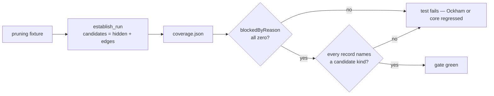

## Summary

The parent milestone's guarantee — every hidden neuron and every synapse of a
fixture is a candidate the razor proposes — is now an executable gate. One
fixture-driven test per fixture family in `ockham/src/run.rs` sweeps the fixture
through `establish_run` with a batch wide enough for every neuron and every edge
it carries, then asserts `cov.blocked == 0` and
`cov.blocked_by_reason == BlockedBreakdown::default()`: zero `validation-failed`,
zero `missing-activation`, zero `aggregate-squash`, zero `other`. A non-zero
count fails the build. Closes #202.

The zero is a **positive** confirmation, not an absence. Every screen record the
sweep filed must carry `blocked_reason: None` **and** name one of the six
`CandidateKind` labels, and `checked == checkable` is asserted beside the zero —
so a sweep that visited nothing cannot pass the gate by filing nothing.

`fixtures::if_hypot_creature` is new, because none of the existing fixtures walks
the aggregate paths: an `IF` output whose three inward edges hold the
`condition`, `positive` and `negative` roles, over a `HYPOT` hidden neuron with
two inward edges. A cut therefore reaches core's `IF` rewrite (#198) and its
one-edge aggregate conversion (#197), and the test asserts the run visited at
least one aggregate neuron and at least one edge into an aggregate.

One run is handed a cached measurement carrying **no** neuron and **no** input
statistics at all — the Issue #199 unmeasured case held to the same standard.
With nothing measured, every visit must still go to core uncompensated and come
back an approximate candidate rather than filing `missing-activation`.

### What the gate covers



| Fixture family | Test |
|---|---|
| the `aggregate_blocked_paths` `MEAN` creature (#93) | `the_aggregate_blocked_paths_fixture_blocks_nothing` |
| `fixtures::wide_creature(2, 3, "MEAN")` | `the_wide_fixture_with_an_aggregate_squash_blocks_nothing` |
| `fixtures::wide_creature(2, 3, "TANH")` | `the_wide_fixture_point_wise_blocks_nothing` |
| `fixtures::hidden_identity_creature` | `the_hidden_identity_fixture_blocks_nothing` |
| `fixtures::shortcut_edge_creature` | `the_shortcut_edge_fixture_blocks_nothing` |
| `fixtures::identity_creature` | `the_identity_fixture_blocks_nothing` |
| `fixtures::if_hypot_creature` (new) | `the_if_hypot_fixture_visits_the_aggregate_paths_and_blocks_nothing` |
| `fixtures::if_hypot_creature`, unmeasured | `an_unmeasured_sweep_of_the_if_hypot_fixture_blocks_nothing` |

### `neat-core.expected-version`

Not bumped, and no bump is owed. The sibling `NEAT-AI-core` at `Develop` reads
`0.17.0`, which is **below** the recorded baseline of `0.18.0`, so
`scripts/check-neat-core-version.sh` reports
`OK neat-core 0.17.0 is behind handled baseline 0.18.0 (no breaking bump)`. The
issue's conditional ("if the sibling is already at a higher minor") does not
fire.

## Evidence

Backend/CLI only — there is no web interface to screenshot. The evidence is the
test run, and in particular that the gate **bites**: it was verified against two
deliberately injected regressions, each reverted immediately after the run.

**Probe 1 — an aggregate target refuses outright** (the pre-#200 razor), injected
into `sweep::propose_synapse`. Four of the eight gate tests went red, and the
three carrying no aggregate stayed green:

```text
test the_aggregate_blocked_paths_fixture_blocks_nothing ... FAILED
  ... every live reason must count zero, got BlockedBreakdown { ..., other: 2, ... }
test an_unmeasured_sweep_of_the_if_hypot_fixture_blocks_nothing ... FAILED
  ... got BlockedBreakdown { ..., other: 5, ... }
test the_if_hypot_fixture_visits_the_aggregate_paths_and_blocks_nothing ... FAILED
  ... got BlockedBreakdown { ..., other: 5, ... }
test the_wide_fixture_with_an_aggregate_squash_blocks_nothing ... FAILED
  ... got BlockedBreakdown { ..., other: 6, ... }
test the_hidden_identity_fixture_blocks_nothing ... ok
test the_identity_fixture_blocks_nothing ... ok
test the_shortcut_edge_fixture_blocks_nothing ... ok
test the_wide_fixture_point_wise_blocks_nothing ... ok
```

**Probe 2 — an unmeasured source refuses** (the pre-#199 razor), same call site.
Exactly one test went red, the unmeasured run, which is what justifies its
existence:

```text
test an_unmeasured_sweep_of_the_if_hypot_fixture_blocks_nothing ... FAILED
  ... got BlockedBreakdown { ..., missing_activation: 7, ... }
test the_aggregate_blocked_paths_fixture_blocks_nothing ... ok
test the_if_hypot_fixture_visits_the_aggregate_paths_and_blocks_nothing ... ok
... (every other fixture test ok)
```

With both probes reverted, the whole suite is green:

```text
test result: ok. 694 passed; 0 failed; 0 ignored; 0 measured; 0 filtered out
```

**Probe 3 — a drifted statistics cache key**, injected into
`seed_unmeasured_stats` after both reviewers flagged that the unmeasured run was
unpinned. The new `assert_swept_unmeasured` catches it:

```text
test an_unmeasured_sweep_of_the_if_hypot_fixture_blocks_nothing ... FAILED
  ... the run must read the seeded cache, not measure beside it
```

`./quality.sh < /dev/null` ends `All quality checks passed!` — cargo-deny,
`cargo fmt --check`, clippy with `-D warnings`, the full test suite, rustdoc with
`-D warnings`, codespell, markdownlint and actionlint.

## Acceptance Criteria

<!-- vibe-spec-review inputs="diff+issue-body" -->

- **met** — Every fixture test asserts `cov.blocked_by_reason.total() == 0` and passes, including the unmeasured run — evidence: `ockham/src/run.rs::assert_nothing_blocked`, called by all eight fixture tests including `run::tests::an_unmeasured_sweep_of_the_if_hypot_fixture_blocks_nothing` — reviewer: met
- **met** — The IF/HYPOT fixture visits ≥ 1 aggregate neuron and ≥ 1 edge into an aggregate (asserted counts) — evidence: `ockham/src/run.rs::the_if_hypot_fixture_visits_the_aggregate_paths_and_blocks_nothing` — reviewer: met — reason: the reviewer independently instrumented the sweep and recorded `if_hypot_creature` reaching 10/10 visits with `h_hyp` and every `→ h_hyp` / `→ output-0` edge among them
- **met** — `cargo test --workspace --all-features`, clippy `-D warnings` and `./quality.sh < /dev/null` pass — evidence: 703 lib tests pass, clippy clean, gate ends `All quality checks passed!` — reviewer: met
- **unrequested** — `docs/blocked-reasons.md` gains a 45-line "The fixture gate" section with a Mermaid diagram — reviewer: unrequested — reason: kept; the repo documents each pruning issue in this file (#196, #197, #199, #200 all have a section) and a gate nobody can find is a gate nobody maintains
- **unrequested** — `CandidateKind::ALL`, a new public const in `ockham/src/sweep.rs` — reviewer: unrequested — reason: kept; the issue's "assert … a candidate kind" needs the set of kinds, and both reviewers' objection was that it had no completeness guard, not that it existed — `every_candidate_kind_is_named_in_all_with_its_label` now closes that
- **unrequested** — `fixtures::tests::the_if_hypot_fixture_validates_and_carries_both_aggregates` — reviewer: unrequested — reason: kept; the fixture is only an aggregate fixture while it validates and keeps both aggregates, and the existing `the_shortcut_fixture_offers_a_cut_that_removes_no_neuron` pins its own fixture the same way. The duplicated `is_aggregate` filter the reviewer called out is gone — both sites now call `fixtures::aggregate_uuids`
- **unrequested** — `aggregate_blocked_creature()` extracted out of the existing `aggregate_blocked_paths` test helper — reviewer: unrequested — reason: kept; the issue names that creature as a fixture family to sweep, and sweeping it needs the creature without the on-disk corpus the old helper bundled with it. Both reviewers read it as traceable rather than creep

## Standards Review

<!-- vibe-standards-review inputs="diff+CODING-STANDARDS.md" -->

There is no `CODING-STANDARDS.md` in this repository; the reviewer was given
`CONTRIBUTING.md`, the surrounding code's conventions and the fleet-wide
standards (Australian English, KISS/DRY, no silent failures, tests that call
real functions, fast unit tests with no wall-clock assertions, no hidden files).

- **violation** — the unmeasured half of the gate could not fail for the right reason: an empty statistics cache was written and nothing proved the run consumed it, so absence of a blocked count was being read as proof of the Issue #199 path — evidence: `ockham/src/run.rs:8475` (pre-fix `seed_unmeasured_stats`) — reason: **fixed here** in `ef85574` — `assert_swept_unmeasured` requires exactly one cache file in the workspace, still carrying no neurons and no inputs; verified by drifting the key deliberately, which fails
- **violation** — the post-store `assert!` in `seed_unmeasured_stats` was tautological (`ActivationStats::empty()` is trivially empty) and guarded nothing — evidence: `ockham/src/run.rs:8489` (pre-fix) — reason: **fixed here** — removed, replaced by the real check above
- **violation** — DRY: the squash → `is_aggregate()` filter was written twice, once in the fixture pin and once in the run gate — evidence: `ockham/src/fixtures.rs:277` and `ockham/src/run.rs:8580` (pre-fix) — reason: **fixed here** — `fixtures::aggregate_uuids` is the one home; both sites call it
- **violation** — `CandidateKind::ALL` is a new public const with no exhaustiveness guard, so a seventh variant would silently narrow the gate — evidence: `ockham/src/sweep.rs:176` — reason: **fixed here** — `every_candidate_kind_is_named_in_all_with_its_label` matches exhaustively, so a new variant cannot be added without being named, and the length assertion then forces it into `ALL`
- **violation** — the docs claimed a cut "reaches core's `IF` rewrite (#198) and its one-edge aggregate conversion (#197)", which nothing in the gate asserts — evidence: `docs/blocked-reasons.md` (the fixture-gate section) — reason: **fixed here** — the section now says the visits put those paths in reach and that the gate asserts the outcome, not which rewrite fired
- **violation** — DRY: the six near-identical 10-line fixture tests could be one table-driven test — evidence: `ockham/src/run.rs:8642-8710` — reason: **stands.** The issue asks for "one fixture-driven test per fixture family", and a per-family test name is what tells an operator *which* fixture regressed from the CI log alone. The shared body is already factored into `sweep_fixture` / `assert_nothing_blocked`, so what repeats is the fixture expression and nothing else
- **violation** — `ockham/tests/pruning_ownership.rs:155` gates its `uncompensated` assertion on `if !result.uncompensated.is_empty()`, so a core that silently dropped the term would pass — evidence: `ockham/tests/pruning_ownership.rs:155` — reason: **stands, and is not in this diff.** That test came in with Issue #201 (`dbc3e83`); the reviewer's diff range resolved against a stale local milestone ref and pulled in three already-merged sibling commits. Out of scope for #202 under Change Scope
- **violation** — `sweep::with_skipped_rungs` has no test asserting either composed detail string, and the assertion that covered it was removed — evidence: `ockham/src/sweep.rs:734` — reason: **stands, and is not in this diff.** Introduced by Issue #199 (`64c3c29`), same stale-range cause
- **violation** — DRY: the non-finite mean filter is duplicated at `ockham/src/sweep.rs:842` and `:922`, each commenting on the other — evidence: `ockham/src/sweep.rs:842` — reason: **stands, and is not in this diff.** Also Issue #199 (`64c3c29`)
- **violation** — `docs/blocked-reasons.md:34-36` says an edge can still report `missing-activation` and `validation-failed`, which contradicts its own table row and line 53 (`other` is reported for an edge as a defect) — evidence: `docs/blocked-reasons.md:34` — reason: **stands, and is not in this diff.** Those lines are Issue #199's wording; correcting them is a docs fix for that issue, not a change #202 asked for
- **clean** — CONTRIBUTING principles hold: the incumbent is never mutated, acceptance is still scorer-only, `creature.validate()` still gates every candidate, the 🪒 commit prefix is present
- **clean** — `neat-core.expected-version` correctly left alone: the sibling is at `0.17.0`, below the recorded `0.18.0` baseline, and `scripts/check-neat-core-version.sh` reports OK
- **clean** — Australian English throughout the added lines; codespell and markdownlint clean
- **clean** — the gate drives `establish_run` end to end and reads the real `coverage.json` and screen store: no source-text grepping
- **clean** — fast, with no wall-clock assertions: the eight fixture tests finish in under 0.1s combined, and no sleeps were added
- **clean** — no hidden files staged; `Cargo.lock` churn from building against the sibling at `0.17.0` was deliberately reverted rather than committed

## Test Plan

Added, all in this diff:

| Test | What it pins |
|---|---|
| `run::tests::the_if_hypot_fixture_visits_the_aggregate_paths_and_blocks_nothing` | nothing blocked, and ≥ 1 aggregate neuron plus ≥ 1 edge into an aggregate visited |
| `run::tests::an_unmeasured_sweep_of_the_if_hypot_fixture_blocks_nothing` | the same fixture with no statistics at all, plus `assert_swept_unmeasured` proving the run really read the empty measurement |
| `run::tests::the_aggregate_blocked_paths_fixture_blocks_nothing` | the `MEAN` aggregate creature of Issue #93 |
| `run::tests::the_wide_fixture_with_an_aggregate_squash_blocks_nothing` | `wide_creature(2, 3, "MEAN")` |
| `run::tests::the_wide_fixture_point_wise_blocks_nothing` | `wide_creature(2, 3, "TANH")` |
| `run::tests::the_hidden_identity_fixture_blocks_nothing` | `hidden_identity_creature` |
| `run::tests::the_shortcut_edge_fixture_blocks_nothing` | `shortcut_edge_creature` |
| `run::tests::the_identity_fixture_blocks_nothing` | `identity_creature` |
| `fixtures::tests::the_if_hypot_fixture_validates_and_carries_both_aggregates` | the new fixture validates, keeps both aggregates, two inward `HYPOT` edges and all three `IF` roles |
| `sweep::tests::every_candidate_kind_is_named_in_all_with_its_label` | `CandidateKind::ALL` carries every variant with its `kind_label` |

No test was removed, commented out or weakened. `aggregate_blocked_paths` was
split into `aggregate_blocked_creature()` plus the on-disk write, leaving its two
existing callers unchanged.

Full suite: `cargo test --workspace --all-features -- --test-threads=2` — 694
lib tests plus 71 integration tests, all passing, and `./quality.sh < /dev/null`
green.

One caveat recorded rather than hidden: on a heavily loaded run of the full
suite, the pre-existing `a_run_down_to_its_last_batch_screens_it_rather_than_replaying`
failed once and passed on re-run. Its own doc comment names it "the one test here
that depends on the wall clock, unavoidably" — it spends a 2s budget through a
scorer with a 100ms per-creature delay. Nothing in this diff touches that path
(the only production change is the `CandidateKind::ALL` const), and the gate ran
green before and after. Left alone under Change Scope; it is a flake belonging to
Issue #77's reserve test, not to #202.
