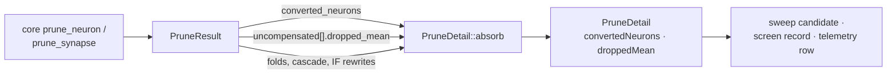

## Summary

Core already reported two things Ockham threw away.
`PruneResult::converted_neurons` names every aggregate a cut stopped
aggregating and core rewrote to the point-wise squash that computes the same
number — `MINIMUM`/`MAXIMUM`/`MEAN` to `IDENTITY`, `HYPOTv2` and zero-bias
`HYPOT` to `ABSOLUTE` — and `UncompensatedTarget::dropped_mean` carries the
magnitude of the term a target lost. `PruneDetail::absorb` copied neither, so a run's journal said an aggregate
target was uncompensated without saying whether it had stopped aggregating or
how much it had dropped. Closes #203.

`PruneDetail` now carries both, in the form telemetry writes them:

| Field | JSON | What it says |
|---|---|---|
| `PruneDetail::converted_neurons` | `convertedNeurons` | one `SquashConversionRecord { uuid, from, to }` per aggregate core rewrote |
| `UncompensatedRecord::dropped_mean` | `droppedMean` | `weight_sum × μ` of the lost term, or absent where nothing proves a magnitude |

Neither is Ockham re-deriving anything — both are copied straight off core's
own report, which is the whole rule of `docs/pruning-ownership.md`.

**`fully_compensated()` is deliberately unchanged.** A conversion is not a
compensation: a target the cut left holding one term still lost what the removed
structure fed it, so core names it on `uncompensated` *and* `converted_neurons`,
and the candidate stays uncompensated. That is what keeps the Issue #103
constant-substitution alternate candidate running for the visit, and the
single-edge test asserts it rather than leaving it to be assumed.



### Baseline

`neat-core.expected-version` stays at **0.18.0** and gains the acknowledgement
paragraph. Both core items were already acknowledged in the file when they
shipped — `converted_neurons` in the 0.16.0 line (#197), the zero-edge
`HYPOTv2 → ABSOLUTE` naming in the 0.18.0 entry (#201) — so an earlier Ockham PR
has already moved the baseline past the core release that carries them. The
sibling clone is at 0.17.0, below the recorded baseline, and no public item core
exposes changed, so there is nothing further to bump. The paragraph records what
Ockham now *reports*, which is what changed here.

## Evidence

Backend-only change with no web interface to screenshot. The evidence is the
test suite and the version gate:

```text
$ cargo test --package neat_ai_ockham --lib -- prune::
test result: ok. 33 passed; 0 failed

$ ./scripts/check-neat-core-version.sh
OK   neat-core 0.17.0 is behind handled baseline 0.18.0 (no breaking bump)

$ ./quality.sh < /dev/null
All quality checks passed!
```

`./quality.sh` runs `cargo test --workspace --all-features -- --test-threads=2`
and `cargo clippy --workspace --all-targets --all-features -- -D warnings`, both
green, plus fmt, cargo-deny, codespell, markdownlint, shellcheck, actionlint and
rustdoc `-D warnings`.

The five new tests were written first and observed failing to compile against
the unfixed code (`no field converted_neurons on type PruneDetail`, `no field
dropped_mean on type UncompensatedRecord`) before the fields existed.

### One pre-existing failure, not from this change

`cargo test --workspace --all-features` at **default** parallelism fails
`run::tests::a_run_down_to_its_last_batch_screens_it_rather_than_replaying`
(`ockham/src/run.rs:8098`). It passes in isolation and under `quality.sh`'s
`--test-threads=2`, and `ockham/src/run.rs` is not in this diff. It is an
absolute wall-clock budget test — a 2 s `timeout` raced against a scripted
100 ms-per-creature scorer — which the coding standards forbid in a unit test.
Filed as **#214** with the root cause and what a fix looks like; not folded into
this change, which is telemetry only.

## Acceptance Criteria

<!-- vibe-spec-review inputs="diff+issue-body" -->

- **met** — `PruneDetail` JSON carries `convertedNeurons` and `droppedMean` when core reports them (tests) — evidence: `ockham/src/prune.rs::the_conversion_and_dropped_magnitude_serialise_on_the_detail`, plus `::a_single_edge_aggregate_target_is_reported_converted` and `::a_two_edge_aggregate_target_carries_the_magnitude_it_dropped` — reviewer: met
- **met** — `scripts/check-neat-core-version.sh` passes against the sibling core at the bumped version — evidence: `OK neat-core 0.17.0 is behind handled baseline 0.18.0`, and the reviewer independently confirmed the sibling at `282bc18`/0.17.0 carries both core items — reviewer: met
- **met** — `cargo test --workspace --all-features`, clippy `-D warnings` and `./quality.sh < /dev/null` pass — evidence: full gate run after the final edit, "All quality checks passed!" — reviewer: met — reason: the reviewer recorded the same caveat handled above, the pre-existing `run.rs` timing test at default parallelism, now filed as #214
- **unrequested** — the incumbent-immutability assertion at the end of `a_single_edge_aggregate_target_is_reported_converted` — reviewer: unrequested — reason: the reviewer graded it "trivial… matches CONTRIBUTING principle 1"; kept, because principle 1 ("the supplied creature is never written to") is asserted by every neighbouring prune test and dropping it here would make this the one path that does not check it
- **unrequested** — `ockham/Cargo.toml` / `Cargo.lock` version bump 0.1.70 → 0.1.71 — reviewer: unrequested — reason: both reviewers named its absence as a departure from `CONTRIBUTING.md` principle 8, which requires a bump for binary-affecting changes; this adds a public type and two JSON keys, so it was bumped through the repo's own `scripts/auto-version.sh`

## Standards Review

<!-- vibe-standards-review inputs="diff+CODING-STANDARDS.md" -->

- **violation** — the `PruneDetail` struct rustdoc listed what the detail records but was not extended for the new conversion list, while the identical sentence in `docs/pruning-ownership.md` was — evidence: `ockham/src/prune.rs:138` — reason: fixed here; the rustdoc now names the converted aggregates and the dropped magnitude
- **violation** — a new README sentence was spliced mid-paragraph at 131 characters, against the file's ~80-column wrap — evidence: `README.md:922` — reason: fixed here; every added line is now ≤ 80 characters
- **violation** — the new tests covered `prune_hidden_neuron` only, so the `converted_neurons` accumulation across repeated `absorb` calls — reachable only through `prune_hidden_group` — was never exercised — evidence: `ockham/src/prune.rs:257` — reason: fixed here by `every_request_path_reports_what_core_converted_and_dropped`, which drives `prune_edge` and a two-member group cut and asserts both conversions are kept
- **violation** — `dropped_mean` documents two producing branches and only the supplied-statistic one was tested; the structurally-fixed source branch had no coverage — evidence: `ockham/src/prune.rs:106` — reason: fixed here by `a_structurally_fixed_source_proves_the_magnitude_without_a_statistic`, which cuts a constant-sourced edge with no measurement and still gets the magnitude
- **violation** — the README claim that a `no-statistics` row carries no magnitude was asserted in prose but pinned by no test — evidence: `README.md:302` — reason: fixed here; the three existing `no-statistics` tests now assert `dropped_mean == None`
- **violation** — the crate version was not bumped for a binary-affecting change — evidence: `ockham/Cargo.toml:3`, against `CONTRIBUTING.md:65` — reason: fixed here, 0.1.70 → 0.1.71 via `scripts/auto-version.sh`
- **violation** — the acknowledgement paragraph claimed both core items had been acknowledged in the file when they shipped, but `dropped_mean` appears nowhere in it before this entry — evidence: `neat-core.expected-version:152` — reason: fixed here; the paragraph now says plainly that this is the field's first mention because Ockham did not read it until now, and separately why the baseline still does not move
- **violation** — `converted_neurons` was documented as the single-edge rewrites only, contradicting this same commit's 0.18.0 baseline note that core also names the zero-edge `HYPOTv2 → ABSOLUTE` rewrite — evidence: `ockham/src/prune.rs:191`, `docs/pruning-ownership.md:96` — reason: fixed here; both now describe the field as the recorded baseline carries it
- **violation** — the README paragraph opened "Every `uncompensated` row … carries `droppedMean`" and walked itself back two sentences later — evidence: `README.md:300` — reason: fixed here; the opener now says "wherever a number proves one"
- **violation** — `docs/archive/pr-summaries/pr-summary-203.md` was untracked while every prior PR commits its summary — evidence: `docs/archive/pr-summaries/` — reason: fixed here; the file is committed with this change
- **clean** — Australian English throughout (`serialise`, `behaviour`, `labelled`); tests call real functions and assert on returned values and real serialised output, with no source-text grepping, sleeps or wall-clock assertions; incumbent immutability and `validate_creature` asserted on every new candidate path; serde attributes match the existing `residual_variance` and `Vec::is_empty` conventions; no secrets, dotfiles or `.gitignore` changes; no new parsing or injection surface — both fields are copied verbatim from core's report, honouring the `docs/pruning-ownership.md` boundary; `fully_compensated()` confirmed unchanged and consistent with core

## Test Plan

Added to `ockham/src/prune.rs` (five tests, four fixtures):

- `a_single_edge_aggregate_target_is_reported_converted` — a `MINIMUM` target
  fed by two edges; cutting the hidden source leaves it one term, and the test
  asserts `converted_neurons == [SquashConversionRecord { "h_min", "MINIMUM",
  "IDENTITY" }]`, that `fully_compensated()` is still `false`, that the
  candidate validates, and that the source creature did not move.
- `a_two_edge_aggregate_target_carries_the_magnitude_it_dropped` — the same
  target fed by one edge more; the cut leaves two terms, so nothing is
  converted and the `uncompensated` row carries
  `dropped_mean == Some(2.0 × 0.5)`. The same request with **no** measured mean
  asserts `dropped_mean == None`: no magnitude is invented where nothing proves
  one.
- `every_request_path_reports_what_core_converted_and_dropped` — the other two
  request paths. `prune_edge` reports the single-edge conversion and the
  magnitude; a two-member group cut over a creature with two `MINIMUM` targets
  asserts **both** conversions and **both** magnitudes survive, which is the
  only way the `extend` accumulation across repeated `absorb` calls is reached.
- `a_structurally_fixed_source_proves_the_magnitude_without_a_statistic` — a
  constant-sourced edge into a `MINIMUM` target, cut with no measurement at
  all. The creature itself fixes the source at `0.5`, so core still reports
  `dropped_mean == Some(2.0 × 0.5)` — the second of the field's two producing
  branches.
- `the_conversion_and_dropped_magnitude_serialise_on_the_detail` — the
  `PruneDetail` JSON carries `convertedNeurons` and `droppedMean` and
  round-trips back equal; the unmeasured two-edge detail writes neither field,
  so an empty list and an absent magnitude stay off the wire.

Fixtures: `single_edge_minimum_target()`, `two_edge_minimum_target()`,
`two_minimum_targets()` and `constant_into_minimum_target()`.

Extended, not replaced: the three pre-existing `no-statistics` tests
(`an_unmeasured_neuron_prunes_uncompensated_through_core` and
`an_unmeasured_edge_and_group_member_prune_uncompensated_through_core`) now also
assert `dropped_mean == None`, pinning the claim that `no-statistics` is exactly
the case nothing proves a magnitude for. No existing test was modified
otherwise, commented out or removed; the whole `prune` suite is 33 tests green.
