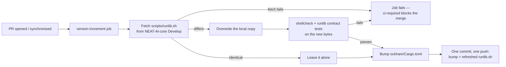

## Summary

`scripts/runlib.sh` is now a **byte-identical copy** of NEAT-AI-core's
`scripts/runlib.sh` on `Develop` (blob `3f4f259`, NEAT-AI-core#680), and the
`version-increment` job — the one job that already commits and pushes to the PR
branch — refreshes that copy from core before the bump, so a stale copy rides
the single commit the job already pushes. No second push, no race with the bump.
Closes #209.

The previous local script was an Ockham-specific stand-in written for #219 while
the family-sync issue was outstanding. Replacing it with the canonical file
means behaviour changes are made once, in core, and travel outward.

## Evidence

Backend/CLI change — there is no web interface to screenshot. What was tested
instead:

**Byte-identity, verified against core rather than asserted:**

```console
$ gh api repos/stSoftwareAU/NEAT-AI-core/contents/scripts/runlib.sh?ref=Develop --jq .sha
3f4f259021b6b257ac53f9443f98c7fbfded8041
$ git hash-object scripts/runlib.sh
3f4f259021b6b257ac53f9443f98c7fbfded8041
```

**The install contract, run for real against the built crate:**

```console
$ ./scripts/runlib.sh                     # first run
  Compiling neat_ai_ockham v0.1.73 …
  [neat_ai_ockham] removed …/target (freed 111353856 bytes)
  $CARGO_HOME/bin/neat_ai_ockham          # stdout
$ cat $CARGO_HOME/bin/.neat_ai_ockham.version
0.1.73
$ ls -d target                            # gone
  ls: cannot access 'target': No such file or directory
$ PATH=/tmp/nocargo:$PATH ./scripts/runlib.sh   # second run, cargo shimmed to exit 77
  [neat_ai_ockham] already installed v0.1.73
  $CARGO_HOME/bin/neat_ai_ockham
  rc=0                                    # the shim was never invoked
$ $CARGO_HOME/bin/neat_ai_ockham --version
neat_ai_ockham 0.1.73
```

**The CI refresh step, executed rather than read.**
`scripts/test-runlib-refresh.sh` lifts the step's own `run:` body out of
`ci.yml` and runs it against a `gh` shim — no network, no token — over a
throwaway fixture: 14/14 pass, covering an unfetchable file, a body that is not
a script, a differing copy, an identical copy, and valid bash that breaks the
install contract.



### One pre-existing gate fails, unrelated to this change

`./scripts/check-neat-core-version.sh` fails on **every** PR in this repository
right now — NEAT-AI-core released `v0.19.0`/`v0.19.1` on 2026-09-13, after this
repo's last green CI run, while `neat-core.expected-version` records `0.18.0`:

```text
FAIL: breaking neat-core bump: 0.19.1 exceeds handled baseline 0.18.0 (pre-1.0 minor increased)
```

Nothing in this branch touches `neat-core.expected-version` or the sibling
checkout, and the gate's own message asks for "a single deliberate PR", so it is
**not** folded in here. Filed as #221. Every other gate stage passes: shellcheck,
both runlib test suites, codespell, markdownlint, actionlint, `cargo deny`,
`cargo fmt --check`, clippy with `-D warnings`, **777 tests**, and
`cargo doc` with `RUSTDOCFLAGS="-D warnings"`.

## Acceptance Criteria

<!-- vibe-spec-review inputs="diff+issue-body" -->

- **met** — Byte-identical copy; a stale copy on a PR is refreshed in the same commit as the bump — evidence: `git hash-object scripts/runlib.sh` == core's blob `3f4f259`; `.github/workflows/ci.yml` refresh step precedes the bump, `git add` widened to include `scripts/runlib.sh`; `ockham/tests/runlib_sync.rs::version_increment_refreshes_runlib_from_core_before_the_bump` and `::the_refreshed_runlib_rides_the_commit_the_job_pushes` — reviewer: met
- **met** — `./scripts/runlib.sh` installs `~/.cargo/bin/neat_ai_ockham` and `.neat_ai_ockham.version`, removes `target/`; a second run prints `[neat_ai_ockham] already installed v<x>` and runs no cargo command — evidence: the real two-run transcript above, plus `scripts/test-runlib.sh` which logs every shim invocation and asserts the log is empty on the up-to-date path (9/9) — reviewer: met
- **met** — Tests and quality checks pass — evidence: `scripts/test-runlib.sh` 9/9, `scripts/test-runlib-refresh.sh` 14/14, `cargo test --workspace --all-features` 777 passed / 0 failed, clippy and `cargo doc` clean — reviewer: met — reason: the reviewer did not run the full `./quality.sh`; it was run here and every stage passes except the pre-existing `check-neat-core-version.sh` gate documented above and filed as #221
- **unrequested** — `ockham/Cargo.toml` drops its explicit `[lib]` and `[[bin]]` tables — reviewer: unrequested — reason: both restated cargo's defaults exactly (verified: `cargo metadata` target set byte-identical before and after), but an explicit `[[bin]]` makes `runlib.sh`'s no-cargo fast path decline, so criterion 2's "runs no cargo command" was literally unmet with them present; the canonical script may not be edited downstream, so the redundant tables went instead
- **unrequested** — `scripts/test-runlib-refresh.sh` (new) and its wiring into `quality.sh` / `shell-checks` — reviewer: unrequested — reason: the issue's own Failure Detection claims CI lints the copied script; the standards reviewer showed that is false for a *refreshed* copy, so the step's failure paths are now executed rather than assumed
- **unrequested** — the refresh step runs `shellcheck` and the runlib contract test on the fetched bytes before committing them — reviewer: unrequested — reason: a push made with the default `GITHUB_TOKEN` starts no new workflow run, so `shell-checks` in the same run only ever sees the pre-refresh checkout; without this a refreshed script could merge ungated
- **unrequested** — `ockham/tests/runlib_sync.rs` (new) — reviewer: unrequested — reason: matches the repo's established workflow-as-contract convention (`workflow_pins.rs`, `workflow_preamble.rs`); verified load-bearing by removing the step and the `git add` entry and watching each test go red
- **unrequested** — the commit step gained a path for "runlib refreshed but version already ahead" — reviewer: unrequested — reason: previously the job exited 0 with no bump, which would have silently discarded a refresh on any PR that had already bumped
- **unrequested** — `README.md` Mermaid flowchart and the `### Canonical runlib.sh` heading — reviewer: unrequested — reason: the heading is the target of `scripts/runlib.sh`'s own `See README.md → "Canonical runlib.sh"` cross-reference, which had no destination; the diagram matches the ~19 already in this README
- **unrequested** — extra cases in `scripts/test-runlib.sh` (stale stamp, missing binary) — reviewer: unrequested — reason: error and edge coverage for the rewritten contract, per the repo's test-coverage expectations
- **unrequested** — `quality.sh` / `ci.yml` step messages retargeted from Issue #219 to #209, and `sbom.yml`'s comment no longer names the removed `[[bin]]` table — reviewer: unrequested — reason: documentation owed by the code change

## Standards Review

<!-- vibe-standards-review inputs="diff+CODING-STANDARDS.md" -->

No `CODING-STANDARDS.md` exists in this repo; the reviewer used `CONTRIBUTING.md`,
`SECURITY.md`, the pinning policy stated in `.github/workflows/actionlint.yml`,
and the surrounding code's conventions.

- **violation** — a refreshed script was committed but gated by nothing: a push made with the default `GITHUB_TOKEN` starts no new workflow run, so `shell-checks` only ever saw the pre-refresh checkout — evidence: `.github/workflows/ci.yml:234` — reason: fixed here; the refresh step now runs `shellcheck --severity=warning` and `./scripts/test-runlib.sh` on the new bytes before they can ride its commit, and `scripts/test-runlib-refresh.sh` proves a contract-breaking refresh fails the step
- **violation** — the contract test asserted `refresh.contains("exit 1")`, a bare substring match that cannot detect the regression its own message describes — evidence: `ockham/tests/runlib_sync.rs:96` — reason: fixed here; that assertion is deleted and the behaviour is now executed by `scripts/test-runlib-refresh.sh`
- **violation** — `sbom.yml` still documented the `[[bin]] name = "neat_ai_ockham"` table this branch removed — evidence: `.github/workflows/sbom.yml:5` — reason: fixed here
- **violation** — `scripts/runlib.sh`'s header points at a README heading that did not exist — evidence: `scripts/runlib.sh:7` — reason: fixed here by adding `### Canonical runlib.sh`; the script itself may not be edited downstream, so the README was the side to fix
- **violation** — the local gate message and its CI counterpart drifted apart — evidence: `.github/workflows/ci.yml:309` vs `quality.sh:35` — reason: fixed here; both now read "the canonical scripts/runlib.sh contract"
- **violation** — the fetched file was validated against core's exact shebang, so a legitimate change to core's first line would hard-fail every Ockham PR — evidence: `.github/workflows/ci.yml:199` — reason: fixed here; the test is now "a script bash can parse" (`^#!` plus `bash -n`)
- **violation** — executable code is pulled from a mutable ref (`Develop`) while the repo pins every `uses:` to a 40-char SHA — evidence: `.github/workflows/ci.yml:186` — reason: stands. The issue specifies core's `Develop` and the copy contract is branch-based by design; the mitigation applied here is to gate the bytes on arrival rather than to pin them, since a pinned SHA would defeat the refresh the issue asks for
- **violation** — `version-increment` is skipped on fork PRs and `ci-required` scores `skipped` as success, so a fork's copy is never refreshed — evidence: `.github/workflows/ci.yml:162` — reason: stands. Pre-existing job-level carve-out (it cannot push to a fork's branch) and out of scope for #209; now documented in README rather than left implicit
- **violation** — the build manifest was reshaped to suit a consumer's parser — evidence: `ockham/Cargo.toml:13` — reason: stands, and is deliberate. Criterion 2 requires no cargo command on the second run; the canonical script must not be edited downstream; the deleted tables restated cargo's defaults exactly and the target set is verified unchanged
- **violation** — `_runlib_remove_target` swallows a failing `cd` with no diagnostic — evidence: `scripts/runlib.sh:384` — reason: stands, upstream-owned. The copy contract forbids editing this file here; the swallow fails toward the safe direction (the directory is kept) and belongs in a NEAT-AI-core issue
- **clean** — Australian English throughout the added lines (`artefact`, `honours`, `behaviour`, `synchronised`, `licence`); codespell clean. No new `uses:` references; all existing pins are 40-char SHAs with version comments. No `${{ github.* }}` interpolated into any `run:` — the new step routes everything through `env:`. `set -euo pipefail` heads both new `run:` blocks. `persist-credentials: false` on all six checkouts; job `permissions: contents: write` is the minimum for the push and `GH_TOKEN` is scoped to the one step that needs it; actionlint passes. Cross-platform bash in the canonical script (bash 3.2-safe empty-array expansion, `du -sk`, `cd … && pwd -P`, guarded Darwin fixups); shellcheck and `bash -n` clean on all five scripts. The shell tests execute real code and assert on exit codes, stdout, stderr and recorded cargo invocations. No hidden paths or secrets staged.

## Test Plan

- **Rewritten** `scripts/test-runlib.sh` (9 assertions) — the canonical contract, hermetic, under a cargo shim that records every invocation: up to date (exit 0, bin path on stdout, `[neat_ai_ockham] already installed v0.1.73` on stderr, **empty** cargo-call log), missing stamp rebuilds, stale stamp rebuilds, missing binary beside a matching stamp rebuilds. It replaces the #219 stand-in's test, whose contract the canonical script deliberately changes (`CARGO_HOME` honoured, version read from the manifest, no cargo call on the skip path).
- **Added** `scripts/test-runlib-refresh.sh` (14 assertions) — executes the CI refresh step's own `run:` body against a `gh` shim: unfetchable → non-zero and the local copy untouched; not-a-script body → non-zero and untouched; differs → overwritten byte for byte and still executable; identical → left alone; valid bash that breaks the install contract → non-zero.
- **Added** `ockham/tests/runlib_sync.rs` (2 tests) — the refresh runs before the bump, and `git add` stages `scripts/runlib.sh` alongside the manifest and lock file. Both verified red: removing the refresh step fails the first, dropping `scripts/runlib.sh` from `git add` fails the second.
- Both shell suites are wired into `quality.sh` and the `shell-checks` CI job.
- Full suite: `cargo test --workspace --all-features` — 777 passed, 0 failed.
