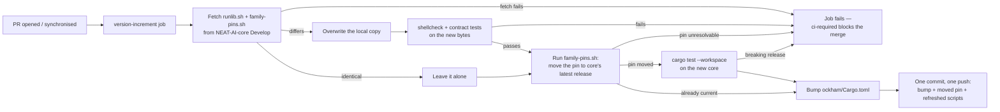

# Pin neat-core to a release tag, refreshed in the version-increment job

## Summary

`ockham/Cargo.toml` consumed `neat-core` through the sibling path dependency
`../../NEAT-AI-core/neat-core`, so every Cargo job had to check core out beside
the workspace and the crate silently tracked core's `Develop` head. It is now a
git dependency on a NEAT-AI-core release tag, and the pin moves in exactly one
place — this repository's own PR.

- `ockham/Cargo.toml`:
  `neat-core = { git = "https://github.com/stSoftwareAU/NEAT-AI-core", tag = "v0.22.4" }`,
  `Cargo.lock` regenerated.
- `scripts/family-pins.sh` copied byte-for-byte from NEAT-AI-core `Develop`
  (NEAT-AI-core#681). The `version-increment` job refreshes that copy with the
  same fetch-and-overwrite `runlib.sh` gets, then runs it before
  `scripts/auto-version.sh`, so a moved tag, its `Cargo.lock` and the bump land
  in the job's single commit.
- A moved pin is **built and tested inside the move step**. It has to be: the
  job's push is made with a token that starts no new workflow run, so `quality`
  only ever saw the pre-move checkout. Without this gate a breaking core release
  would land on the branch with `ci-required` already green and nothing having
  compiled it.
- The sibling checkout is retired from `.github/actions/setup-rust-workspace`
  (toolchain kept) and every caller. `scripts/check-neat-core-version.sh`,
  `neat-core.expected-version` and the `validation` required-files entry are
  removed — the issue's explicit "or remove it" branch. A hand-maintained
  baseline cannot coexist with a pin CI moves automatically: the gate would only
  fire on the PR *after* the breaking pin merged. The build is the detector now.
- `deny.toml` allows the one NEAT-AI-core git source; `unknown-git = "deny"`
  stands for everything else.

Closes #210.

## Evidence

Backend/CI change with no web interface, so the evidence is command output.

**AC1 — builds with no `NEAT-AI-core` beside the repo.** There is no sibling in
this worktree (`ls ../NEAT-AI-core` → *No such file or directory*):

```text
   Compiling neat-core v0.22.4 (https://github.com/stSoftwareAU/NEAT-AI-core?tag=v0.22.4#4f999a09)
   Compiling neat_ai_ockham v0.1.76 (…/NEAT-AI-Ockham/ockham)
    Finished `dev` profile [unoptimized + debuginfo] target(s) in 7.11s
```

**AC2 — tag, lock and bump in one commit.** The job's own `run:` bodies were
extracted from `.github/workflows/ci.yml` and executed over a scratch clone
whose pin was rolled back one release:

```text
--- before: pin tag = "v0.22.3", crate 0.1.76, base crate 0.1.76
[family-pins] neat-core v0.22.3 → v0.22.4 (ockham/Cargo.toml)
[family-pins] 1 pin(s) moved; Cargo.lock updated
auto-version.sh: bumped neat_ai_ockham 0.1.76 -> 0.1.77
[… 24b9795] 🪒 auto-increment crate version to 0.1.77
--- after:  pin tag = "v0.22.4", crate 0.1.77
 Cargo.lock        | 6 +++---
 ockham/Cargo.toml | 4 ++--
```

One commit, carrying the moved tag, the moved lock entry
(`git+…?tag=v0.22.4#4f999a09…`) and the patch bump. `family-pins.sh` is
idempotent: a second run exits 0 having changed nothing.

**The copy is byte-identical** to `NEAT-AI-core@Develop:scripts/family-pins.sh`
(`cmp -s` against the raw fetch).



## Acceptance Criteria

<!-- vibe-spec-review inputs="diff+issue-body" -->

- **met** — The workspace builds with no `NEAT-AI-core` checkout beside the repo — evidence: `ockham/Cargo.toml:24`, `Cargo.lock:231-233`, `cargo build --workspace` above with no sibling present; the reviewer independently confirmed `v0.22.4` is core's newest `v*` tag and that every checkout/symlink is gone from the composite action, `cargo-upgrade.yml`, `sbom.yml` and `security.yml` — reviewer: met
- **met** — A PR whose pin is behind core's latest release gets the tag, `Cargo.lock` and the patch bump in one CI commit — evidence: the scratch-clone run above; `ockham/tests/family_pins_sync.rs::the_pin_moves_before_the_bump_so_both_land_in_one_commit` and `::the_moved_pin_and_the_refreshed_script_ride_the_commit_the_job_pushes` — reviewer: met — reason: the reviewer attached a caveat (see the two `missing` entries below), both of which are fixed in this diff
- **met** — Tests and quality checks pass — evidence: `./quality.sh < /dev/null` ends `All quality checks passed!` after the final edit; `scripts/test-family-pins.sh` 15/15, `scripts/test-family-pins-refresh.sh` 23/23, `scripts/test-runlib.sh` 9/9, `scripts/test-runlib-refresh.sh` 14/14, full `cargo test --workspace --all-features` green — reviewer: met
- **missing** — the moved pin was compiled before `ci-required` could go green — reviewer: missing — reason: the reviewer found `quality`/`validation` check out the *pre-move* tree and the job's push starts no new run, so a breaking core release could merge with nothing having built it; fixed here — the move step now runs `cargo test --workspace --all-features` on the new core, covered by `family_pins_sync.rs::a_moved_pin_is_compiled_before_it_is_committed` and the `a breaking core release fails the step` case in `scripts/test-family-pins-refresh.sh`
- **missing** — "a moved pin always lands with a bump" as written — reviewer: missing — reason: `auto-version.sh` leaves an already-bumped branch alone, so on a later `synchronize` the pin rides a commit with no version change (still ahead of base, which is all the unattended machines need); the step comment, `README.md` and the test message now say what the code does instead of overclaiming
- **met** — README / docs updated — evidence: `README.md` "Canonical family-pins.sh", `CONTRIBUTING.md`, `docs/blocked-reasons.md`, `docs/pruning-ownership.md`, `docs/incident-response.md`, `SECURITY.md`, `.gitignore` — reviewer: partial — reason: the reviewer listed five live surfaces still describing the sibling checkout (`security.yml`, `docs/pruning-ownership.md`, `ockham/tests/real_scorer.rs`, `.gitignore`, a reflow orphan in `blocked-reasons.md`); all five are swept in this diff
- **unrequested** — `ockham/tests/neat_core_pin.rs`, `ockham/tests/family_pins_sync.rs`, `scripts/test-family-pins.sh` and `scripts/test-family-pins-refresh.sh` — reviewer: unrequested — reason: the issue asked for no harness, but the pin's correctness lives entirely in a manifest line and YAML step order, which nothing else asserts; each mirrors an existing `runlib` equivalent, and `test-family-pins.sh` is what gates core's freshly fetched bytes before they rewrite the real manifest
- **unrequested** — `.github/workflows/ci.yml` adds `scripts/family-pins.sh` to the `validation` required-files list — reviewer: unrequested — reason: the file it replaces (`neat-core.expected-version`) was on that list, and a missing pin mover would otherwise fail late and obscurely
- **unrequested** — the commit-message/detection logic in the commit step is rewritten — reviewer: unrequested — reason: unavoidable, not optional: `ockham/Cargo.toml` is now dirty for two different reasons, so the old `git diff --quiet` test would label a pin move "auto-increment crate version to X"
- **unrequested** — compatible registry bumps rode in with the lock regeneration (`clap` 4.6.6→4.6.7, `cfg-if` 1.0.4→1.0.5, `clap_lex` 1.1.0→1.1.1, `unicode-ident` 1.0.24→1.0.25) — reviewer: unrequested — reason: the issue asked for `Cargo.lock` to be regenerated and these are what `cargo generate-lockfile` resolved; `cargo deny check` passes
- **unrequested** — `deny.toml` `allow-git` admits the NEAT-AI-core URL for any ref, not only release tags — reviewer: unrequested — reason: cargo-deny's `allow-git` has no ref granularity, so this is the narrowest expressible rule; `ockham/tests/neat_core_pin.rs::the_pin_names_a_release_tag` is what actually forbids a `branch`/`rev` pin

## Standards Review

<!-- vibe-standards-review inputs="diff+CODING-STANDARDS.md" -->

- **violation** — the freshly fetched `family-pins.sh` was gated on `--help` alone, then run over the real manifest — evidence: `.github/workflows/ci.yml:253` (pre-fix) — reason: fixed here; `scripts/test-family-pins.sh` is a real contract test (pin discovery, commented-out and non-family declarations, the fail-loud multi-line refusal, usage errors) and the refresh step runs it on the new bytes, matching what `test-runlib.sh` does for `runlib.sh`
- **violation** — GNU-only `sed -i` breaks the macOS bash 3.2 / BSD requirement, and `quality.sh` runs the file — evidence: `scripts/test-family-pins-refresh.sh:180` (pre-fix) — reason: fixed here; the fixture shim writes a staged file and `mv -f`s it
- **violation** — stale sibling-path wording left in four live surfaces, one of them a security claim that this diff itself made false — evidence: `SECURITY.md:68`, `docs/incident-response.md:63`, `docs/pruning-ownership.md:60`, `.github/workflows/security.yml:37-40`, `.gitignore:19-23`, `ockham/tests/real_scorer.rs:6` — reason: all fixed here; `security.yml` claimed the composite set `persist-credentials: false`, which stopped being true when its checkout was deleted
- **violation** — a commit subject could assert a refresh that did not occur — evidence: `.github/workflows/ci.yml:325` (pre-fix) — reason: fixed here; the subject is now derived from what actually changed rather than from a signal that may not have reached the step
- **violation** — the README repository tree listed two of seven `scripts/` entries with no elision marker, unlike every sibling node — evidence: `README.md:2718` (pre-fix) — reason: fixed here; the node is exhaustive
- **violation** — `scripts/family-pins.sh:245` exits 1 for `--manifest` with no argument while its own header documents 2 for a usage error — evidence: `scripts/family-pins.sh:245` — reason: **stands**. That file has one home on NEAT-AI-core `Develop` and is never edited downstream; an edit here would break the byte-identical contract and be overwritten by the next PR's refresh step anyway. It is core's to fix, and it is a message/exit-code mismatch on an argument-parsing path, not a correctness fault in the pin move
- **clean** — Australian English throughout the added lines (`behaviour`, `artefacts`, `neighbourhood`; no American spellings found)
- **clean** — fail-loud: `quality.sh`'s old `if [ -f ../NEAT-AI-core/Cargo.toml ] … else echo "skipping"` silent-skip branch is **removed**, not replaced; `family-pins.sh`'s resolver avoids `$(…)` so an errexit abort cannot be read as an empty answer, re-reads the manifest after rewriting to prove the tag landed, and fails loud on an unresolvable remote, a multi-line pin or a failed `cargo update`
- **clean** — cross-platform bash: no associative arrays, `${moved_deps[@]+"${moved_deps[@]}"}` guarded, POSIX `[[:space:]]`, no `timeout`; `shellcheck --severity=warning -s bash` clean on both new scripts
- **clean** — Actions hardening: every new multi-line `run:` opens with `set -euo pipefail`; no `${{ github.* }}` interpolated into a `run:` body (`CORE_REF`/`CORE_REPO`/`GH_TOKEN` go through `env:`, quoted); the only new `uses:` are local composite paths; `version-increment` keeps least-privilege `contents: write` with `persist-credentials: false` and a per-step token
- **clean** — commit safety: `git add` is an explicit four-path allowlist, no hidden path, no `-A`, no key material
- **clean** — injection surface: the URL reaching `git ls-remote`/`cargo update` is constrained by `FAMILY_URL_RE` to `https://github.com/stSoftwareAU/NEAT-AI-*`, so a manifest cannot smuggle `--upload-pack=` or another host
- **clean** — tests exercise real code: the shell tests lift the actual `run:` bodies out of `ci.yml` and execute them against `gh`/`cargo` shims over throwaway fixtures, asserting exit codes and checksums; the Rust files are the repo's established workflow-as-contract pattern and assert orderings a real reordering would break
- **clean** — dead-code removal is complete: no live reference to `check-neat-core-version.sh` or `neat-core.expected-version` remains (only `docs/archive/pr-summaries/*`, correctly untouched as historical records)

## Test Plan

Added:

- `scripts/test-family-pins.sh` — 15 hermetic assertions on core's canonical
  `family-pins.sh`: `--help`, usage errors exit 2, a manifest with no family pin
  / a commented-out pin / a non-family git pin all exit 0 byte-identical, and a
  multi-line pin fails loud naming the file and line. Run by the CI refresh step
  on the newly fetched bytes, by `shell-checks`, and by `quality.sh`.
- `scripts/test-family-pins-refresh.sh` — 23 assertions executing the real
  `run:` bodies of the two new CI steps against `gh` and `cargo` shims: an
  unfetchable or non-script body fails and leaves the local copy alone, a
  differing copy is installed and stays executable, an identical one is left
  alone, a contract-breaking copy fails the step, a moved pin is compiled and
  recorded, a core release that does not compile fails the step with the
  compiler error surfaced, and an already-current pin runs no build.
- `ockham/tests/neat_core_pin.rs` — 3 tests: `neat-core` is a git dependency and
  not a path one, the declaration is on one line (`family-pins.sh` refuses a
  split pin), and the pin names a released `v<major>.<minor>.<patch>` tag rather
  than a branch, rev or pre-release. Verified red against the old path form
  (2 of 3 fail) and green after the change.
- `ockham/tests/family_pins_sync.rs` — 4 tests: the copy is refreshed before it
  is run, the run precedes the bump, a moved pin is compiled before it is
  committed, and the manifest, lock and script are all in the `git add` list.

Modified (comments only, no assertions changed):
`ockham/tests/workflow_preamble.rs`, `ockham/tests/real_scorer.rs`.

Removed: `scripts/check-neat-core-version.sh` and `neat-core.expected-version` —
a gate, not a test, and redundant under a pin CI moves automatically (documented
in the Summary above).

`./quality.sh < /dev/null` passes end to end after the final edit.
