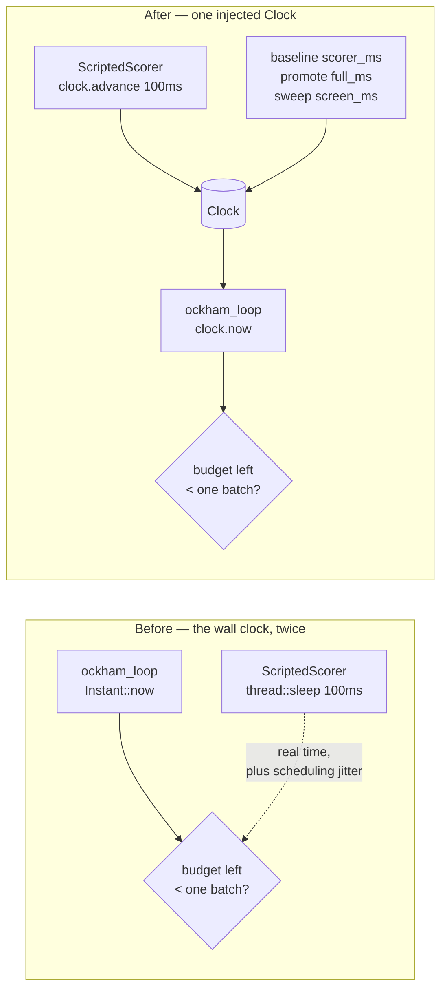

# 🪒 The run's budget clock is injected, so the last-batch reserve test stops racing the wall clock

## Summary

`run::tests::a_run_down_to_its_last_batch_screens_it_rather_than_replaying`
asserted a **budget decision** against a real 2 s deadline spent in 100 ms
scorer sleeps. On a loaded host the scripted delays plus the surrounding work
reached the deadline first, nothing was screened and the assertion failed —
invisible to `./quality.sh`, which pins `--test-threads=2`. Raising the budget
only moves the failure to a busier machine, so the threshold itself is removed.

Every duration the run's budget arithmetic reads now comes from **one injected
`Clock`** (`ockham/src/clock.rs`):

- the optimisation loop's deadline and its elapsed-time reporting (`run.rs`);
- the baseline `scorer_ms` the screening reserve of #77 is pre-sized from
  (`baseline.rs`);
- the cohort `full_ms` the cohort sizing of #58 is estimated from
  (`promote.rs`);
- the batch `screen_ms` a screening batch is priced from (`sweep.rs`,
  `screening.rs`).

The boundary is deliberate: local work the run only *reports* on — the
exact-cleanup pre-pass timing in `run.rs::exact_cleanup_pre_pass` — stays on
the real clock, because no budget decision reads it and a manual clock would
report real CPU work as free.

`establish_run` keeps its signature and runs on `SystemClock`, the real
monotonic clock, so production behaviour is unchanged;
`establish_run_with_clock` is the same run with its time source injected. The
scripted scorer gained an optional `ManualClock` handle: with one set it
**advances** that clock by its per-creature delay instead of sleeping, so a
test spends a scripted budget with no wall clock at all and reaches the same
decision on a loaded CI runner, a shared laptop and ARM alike.

Closes #214.

## Evidence

Backend/CLI change — no web interface to screenshot. The evidence is the
reproduction below, the test suite and the quality gate.



Production runs bind `C` to `SystemClock`; the test binds it to `ManualClock`,
which moves only when the scorer spends it.

Quality gate, full run after the final edit:

```text
$ ./quality.sh < /dev/null
…
test result: ok. 703 passed; 0 failed …
All quality checks passed!
```

The suite at **default parallelism** — the mode the issue reported failing —
is green too: `cargo test --workspace --all-features` → 703 lib + 71
integration tests passed.

## Reproduction

- **symptom** — `a_run_down_to_its_last_batch_screens_it_rather_than_replaying`
  fails under a parallel full-suite run and passes in isolation:
  `the reserve must buy this run a screening batch: 0` (`ockham/src/run.rs:8098`
  before the change)
- **status** — `verified` — 12 concurrent copies of the unfixed test on a
  9-core box loaded with 48 busy loops failed **8 of 12** with exactly that
  message; the same command against the fixed test passes **12 of 12**, each
  run in ~0.2 s instead of ~3.3 s
- **regression test** —
  `ockham/src/run.rs::tests::a_run_down_to_its_last_batch_screens_it_rather_than_replaying`

The red command (both runs used it verbatim):

```bash
BIN=target/debug/deps/neat_ai_ockham-<hash>
for i in $(seq 1 48); do timeout 90 bash -c 'while :; do :; done' & done
for i in $(seq 1 12); do
  timeout 80 "$BIN" --exact \
    run::tests::a_run_down_to_its_last_batch_screens_it_rather_than_replaying \
    > /tmp/rep-$i.log 2>&1 &
done
wait; grep -h "test result" /tmp/rep-*.log | sort | uniq -c
```

Before: `8 × FAILED`, `4 × ok`. After: `12 × ok`.

The rewritten test still guards the decision rather than the clock: with
`reserve_stands` forced to return `false` — the pre-#77 behaviour the test
exists to prevent regressing to — it fails again
(`the reserve must buy this run a screening batch: 0`), and the mutation was
reverted immediately after.

## Scope

One adjacent test is migrated with it:
`run::tests::a_starved_run_stops_before_launching_a_cohort_it_cannot_finish`
asserted the *same kind* of decision (`stop_reason == "budget"`, no cohort
launched) the same broken way — 100 ms scripted sleeps against a real 2 s
deadline — so a slow enough host reached the deadline first and the run
stopped on `timeout` instead. It now drives the injected clock too. Those were
the only two uses of `ScriptedScorer::delay_per_creature`, so no unit test in
the crate spends real time sleeping any more.

## Test Plan

- **Rewritten**
  `ockham/src/run.rs::tests::a_run_down_to_its_last_batch_screens_it_rather_than_replaying`
  — drives an injected `ManualClock`, asserts the replay stage really spent
  ≥ 1.5 s **of that clock**, that the reserve bought a screening batch, that
  every screened uuid was counted as checked, and that the batch is journalled
  after the replay cohorts. No `thread::sleep`, no wall-clock threshold.
- **Added** `ockham/src/clock.rs::tests` — four unit tests over the new seam:
  the system clock never runs backwards and saturates a future reading at zero;
  a manual clock stands still until advanced; every clone shares one reading;
  an absurd advance saturates rather than wrapping, asserted on the reading a
  deadline is actually compared against (`now()` / `since()`), not just on the
  counter — a wrapped reading would hand an expired budget a fresh deadline.
  A reading beyond what `Instant` can represent panics with a named message
  rather than folding back quietly.
- **Migrated**
  `ockham/src/run.rs::tests::a_starved_run_stops_before_launching_a_cohort_it_cannot_finish`
  — same decision asserted, same scripted costs, now spent on the injected
  clock rather than slept (see **Scope**).
- **Unchanged and still green**: the existing `reserve_stands` unit test and
  the rest of the suite — 703 lib + 71 integration tests at default
  parallelism and at `--test-threads=2`.
