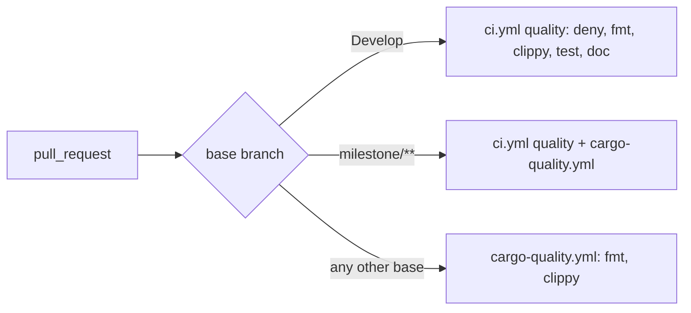

## Summary

`cargo-quality.yml` triggered on PRs into `["**"]`, which includes `Develop` —
where `ci.yml`'s `quality` job already runs the same `cargo fmt` / `cargo clippy`.
It now uses `branches-ignore: [Develop]`, so a PR into `Develop` runs
fmt + clippy once. Closes #243.

`milestone/**` is deliberately **not** ignored. The issue suggested ignoring it
too, but that trips the fleet's changed-workflow check
`BP-MILESTONE-FILTER-cargo-quality` ("CI quality workflow skips milestone PRs"),
which blocked the previous attempt. That check only accepts a waiver marker with
a human-verified `author=`; a fleet-authored waiver is rejected by design. So
milestone PRs still run both workflows. Over the last 100 PRs, 50 targeted
`Develop`, so this removes about half of the duplicate runs the issue measured.
Ignoring `milestone/**` as well needs a human-authored
`# best-practice-ignore: BP-MILESTONE-FILTER-cargo-quality — author=<login> …`
marker. This run did not add one.

- `.github/workflows/cargo-quality.yml` — trigger narrowed; header comment corrected.
- `ockham/tests/workflow_overlap.rs` — new workflow-as-contract test: the
  `branches-ignore` list must equal `ci.yml`'s non-milestone `branches`. That way
  `Develop` can't be gated twice again, and no base is left ungated.
- `docs/blocked-reasons.md` — the core-regression fixture tests run in the `CI`
  workflow (they never ran in `cargo-quality`, which only does fmt + clippy).
- `.markdownlint-cli2.yaml`, `.markdownlintignore` — ignore the worker's
  git-excluded `graft/` code-graph index. Without this, markdownlint lints its
  generated Markdown and `./quality.sh` fails locally.

## Evidence

CI-only change, no UI. `Develop` PRs stay gated by `ci.yml`'s `quality` job.
The worker's `scanMilestoneBranchFilters` returns no finding for the new
`cargo-quality.yml`.

## Test Plan

- `cargo test --test workflow_overlap`:
  - `cargo_quality_skips_exactly_the_branches_ci_already_gates` failed against the
    old `branches: ["**"]` trigger and against `[Develop, "milestone/**"]`, and
    passes with `[Develop]`.
  - `the_filter_parser_reads_both_list_forms` covers the inline and block YAML
    list forms.
- `./quality.sh < /dev/null` passes.
