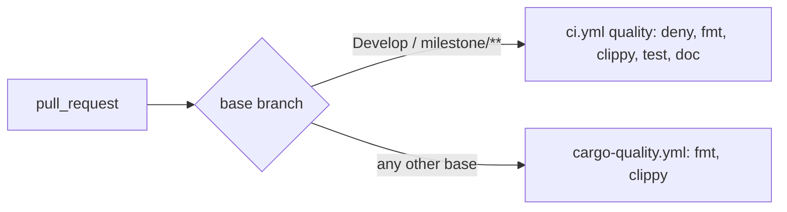

## Summary

`cargo-quality.yml` triggered on PRs into `["**"]`, which includes `Develop` and
`milestone/**` — exactly the bases where `ci.yml`'s `quality` job already runs the
same `cargo fmt` / `cargo clippy`. It now uses
`branches-ignore: [Develop, "milestone/**"]`, so it covers only the
feature-branch / stacked-PR bases its header describes and every PR runs
fmt + clippy once. Closes #243.

- `.github/workflows/cargo-quality.yml` — trigger narrowed; header comment corrected.
- `ockham/tests/workflow_overlap.rs` — new workflow-as-contract test: the
  `branches-ignore` list must equal `ci.yml`'s `branches` list, so the two can
  neither overlap again nor leave a base ungated.
- `docs/blocked-reasons.md` — the core-regression fixture tests run in the `CI`
  workflow (they never ran in `cargo-quality`, which only does fmt + clippy).

## Evidence

CI-only change, no UI. `milestone/**` PRs stay gated by `ci.yml`'s `quality` job.

## Test Plan

- `cargo test --test workflow_overlap` — `cargo_quality_skips_exactly_the_branches_ci_already_gates`
  failed against the old `branches: ["**"]` trigger and passes after the fix;
  `the_filter_parser_reads_both_list_forms` covers the inline and block YAML list forms.
- `./quality.sh < /dev/null` — all checks passed. (The worker's untracked, git-excluded
  `graft/` index was moved aside for the run: markdownlint otherwise lints its generated
  Markdown, which is not part of this repo.)
