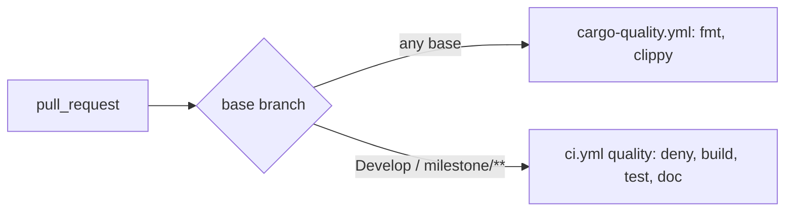

## Summary

`cargo fmt` / `cargo clippy` ran twice on PRs into `Develop` and `milestone/**`:
once in `cargo-quality.yml`, then again in `ci.yml`'s `quality` job. Closes #243.

They now run in one place. `cargo-quality.yml` is the only fmt + clippy gate and
runs on every PR base (`branches: ["**"]`). `ci.yml`'s `quality` job no longer
runs fmt or clippy, and no longer installs the `rustfmt`/`clippy` components.

An earlier revision narrowed `cargo-quality.yml` to `branches-ignore: [Develop]`.
That was wrong. The `Develop` ruleset (22325798) lists `Cargo Format and Clippy`
as a required status check, so a PR into `Develop` waits on a check that never
reports, and every PR stays `BLOCKED`. With this approach `Cargo Format and
Clippy` and `Quality Checks` both still report on every PR into `Develop`, so the
ruleset stays as it is. It also removes the duplicate on milestone PRs, and
`BP-MILESTONE-FILTER` is still satisfied.

- [x] `.github/workflows/cargo-quality.yml`: runs on `**`; header comment updated.
- [x] `.github/workflows/ci.yml`: `quality` job no longer runs fmt/clippy.
- [x] `ockham/tests/workflow_overlap.rs`: workflow-as-contract tests:
  - `every_required_check_reports_on_develop_prs`: each context in the `Develop`
    ruleset's required checks (mirrored in `REQUIRED_CONTEXTS`) must have a job
    whose workflow's `pull_request` trigger covers `Develop` with no path filter.
  - `cargo_quality_runs_on_every_base_ci_gates`: `cargo-quality.yml` covers every
    `ci.yml` base plus feature bases.
  - `ci_quality_job_does_not_repeat_fmt_or_clippy`.
- [x] `docs/blocked-reasons.md`: the core-regression fixture tests run in the `CI`
  workflow (never in `cargo-quality`, which only does fmt + clippy).

```mermaid
flowchart LR
    PR[pull_request] --> B{base branch}
    B -->|any base| CQ[cargo-quality.yml: fmt, clippy]
    B -->|Develop / milestone/**| CI[ci.yml quality: deny, build, test, doc]
```

## Test Plan

- `cargo test --test workflow_overlap`: `every_required_check_reports_on_develop_prs`
  and `cargo_quality_runs_on_every_base_ci_gates` fail against the earlier
  `branches-ignore: [Develop]` trigger and pass now.
- `actionlint` is clean on both workflows.
