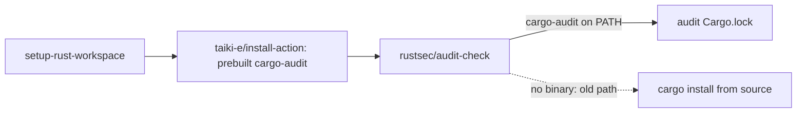

## Summary

`security.yml` (the reusable security workflow `ci.yml` calls on every PR into
`Develop` / `milestone/**`) had no cargo-audit on `PATH`, so
`rustsec/audit-check` fell back to `cargo install cargo-audit` and compiled it
from source on every run. It now installs the prebuilt binary with
`taiki-e/install-action` first, the same way `cargo-audit.yml` has since
Issue #208. `audit-check`'s `findOrInstall` finds that binary and skips the
compile. Closes #244.

- `.github/workflows/security.yml`: adds the new install step, pinned to the
  same SHA (`v2.81.10`) and `tool: cargo-audit` spec as `cargo-audit.yml`, so
  both audit gates run the same cargo-audit and see the same advisories. The
  `RUSTUP_TOOLCHAIN: stable` comment is reworded: that setting now only
  protects the fallback path.
- `ockham/tests/security_audit_install.rs`: new workflow-as-contract test.

## Evidence

This is a CI-only change with no UI.

## Test Plan

- [x] `cargo test --test security_audit_install`:
  - `security_installs_prebuilt_cargo_audit_before_audit_check` failed before the
    workflow change and passes after it.
  - `both_audit_gates_install_the_same_cargo_audit` failed before the change
    and passes after it. It holds the action pin and the `tool:` spec equal
    across the two workflows.
  - `the_install_parser_reads_the_tool_of_its_own_step_only` covers the parser's
    edge cases: a `tool:` in a later step, a different tool, and empty input.
- [x] `cargo test --test workflow_preamble --test workflow_pins`: still green.
  The new step installs no toolchain, so the composite-caller rule holds.
- [x] `./quality.sh < /dev/null`. I moved the worker's untracked, git-excluded
  `graft/` index aside for the run, because otherwise markdownlint lints its
  generated Markdown.

🤖 Generated with [Claude Code](https://claude.com/claude-code)
