# 🪒 Cite the pruning literature the razor already implements

## Summary

Added a **"Where this sits in the literature"** section to `README.md` mapping
each mechanism Ockham already ships to its published prior art, connected the
growth gate to minimum description length, and stated the compounding hypothesis
beside its known failure mode. Documentation only — no behaviour change.
Closes #30.

What the section covers:

| Ockham mechanism | Prior art now cited |
|---|---|
| Mean-activation ablation | Optimal Brain Damage (LeCun, Denker & Solla 1989), Optimal Brain Surgeon (Hassibi & Stork 1993), Molchanov et al. 2017/2019 |
| Downstream bias compensation | Bias correction (Nagel et al. 2019), ThiNet (Luo et al. 2017) |
| Exact `IDENTITY` collapse / redundant folding | Data-free parameter pruning (Srinivas & Babu 2015) |
| Iterative prune-and-retest | Lottery ticket (Frankle & Carbin 2019), Dense-Sparse-Dense (Han et al. 2017) |
| `growth_units` / `costOfGrowth` gate | MDL (Rissanen 1978), Hinton & van Camp 1993 |
| 5% sampled screen → full-corpus confirmation | Racing (Maron & Moore 1994), F-Race (Birattari et al. 2002), successive halving (Jamieson & Talwalkar 2016) |
| Accepting even tiny local wins | Adaptive overfitting: Dwork et al. 2015 *The reusable holdout*, Blum & Hardt 2015 *The Ladder* |

Three points a reviewer should check specifically:

- **Ockham's saliency order is named.** Mean-activation ablation is stated as the
  *zeroth-order* member of the OBD/OBS family — no loss derivative — and the
  section says what first- or second-order saliency would cost (another corpus
  pass and a gradient the external scorer does not expose).
- **`costOfGrowth` is tied to MDL.** `growth_units` (`hidden + synapses / 10`) is
  the model-description term and the scorer's corpus error is the
  data-given-model term, so the accept rule is an MDL trade-off. The knob is
  named in both spellings that actually exist — `costOfGrowth` in NEAT-AI,
  `growthCost` in `NEAT-AI-scorer/rust_scorer/src/scoring.rs:392` — rather than
  asserting one name for both.
- **The caveat is honest about current behaviour.** The section records that
  Ockham accepts wins down to `--min-improvement` `1e-6` and therefore carries
  the largest exposure to adaptive overfitting, that a Ladder-style noise-floor
  gate is the known remedy, and that Ockham **does not implement that gate
  today**. No implementation claim is made that the code does not back.

House terminology is untouched: 🪒, "every neuron must earn its keep", "The
Ockham rule" and the stepping-stone rule all remain, and a new test now pins
them.

## Evidence

Documentation-only change with no web interface, so no screenshot applies. The
evidence is the README-as-contract suite, which parses the committed README and
asserts on its content rather than grepping source:

```text
$ cargo test --test readme_contract
test charter_sections_survive ... ok
test contributing_documents_the_razor_commit_prefix ... ok
test house_terminology_survives_the_literature_section ... ok
test literature_section_cites_the_pruning_prior_art ... ok
test literature_section_connects_the_growth_gate_to_mdl ... ok
test literature_section_states_the_compounding_hypothesis_and_its_failure_mode ... ok
test long_flags_extracts_flags_and_ignores_prose_dashes ... ok
test readme_documents_every_cli_flag ... ok
test readme_mentions_no_unknown_flags ... ok
test repository_layout_lists_every_source_file ... ok

test result: ok. 10 passed; 0 failed
```

All three new citation tests were written first and failed against the unchanged
README (`README lost the "## Where this sits in the literature" section (#30)`)
before the section was added.

The section itself carries a Mermaid map of pipeline stage → prior art:

```mermaid
flowchart LR
    O[activation statistics] -->|"OBD / OBS / Molchanov saliency"| A[mean-activation ablation]
    A -->|"Nagel bias correction, ThiNet"| B[downstream compensation]
    B -->|"Srinivas & Babu"| C["exact IDENTITY collapse"]
    C -->|"racing, F-Race, successive halving"| S[5% sampled screen]
    S -->|"Rissanen MDL, Hinton & van Camp"| F[full-corpus accept]
    F -->|"Frankle & Carbin, Dense-Sparse-Dense"| O
    F -.->|"Dwork, Blum & Hardt — the caveat"| X[adaptive overfitting]
```



## Test Plan

Added to `ockham/tests/readme_contract.rs`:

- `literature_section_cites_the_pruning_prior_art` — slices the literature
  section out of the committed README and asserts every author/method named in
  the issue appears in it (25 citation needles across seven mechanisms).
- `literature_section_connects_the_growth_gate_to_mdl` — asserts the section
  names `minimum description length`, `Rissanen`, `growth_units` and
  `costOfGrowth` together, so the MDL connection cannot be dropped while the
  citation stays.
- `literature_section_states_the_compounding_hypothesis_and_its_failure_mode` —
  asserts the hypothesis wording appears alongside *The reusable holdout*,
  *The Ladder* and the `noise floor` remedy.
- `house_terminology_survives_the_literature_section` — pins 🪒, "Every neuron
  must earn its keep", "## The Ockham rule" and the stepping-stone rule.

No existing test was modified or removed; the pre-existing flag-coverage tests
still pass, which confirms the new prose introduces no undocumented flag
(`--min-improvement` is a real flag already in the options table).

Full gate: `./quality.sh < /dev/null`. Every check passes — shellcheck, the
neat-core version gate, markdownlint-cli2 (0 issues), `cargo deny check`,
`cargo fmt --check`, `cargo clippy -D warnings`, the full workspace test suite
and `cargo doc -D warnings` — except the codespell preflight, which cannot run
in this container: `codespell` is absent and there is no `pip`, `pipx` or
`ensurepip` to install it. CI runs that check for real.
